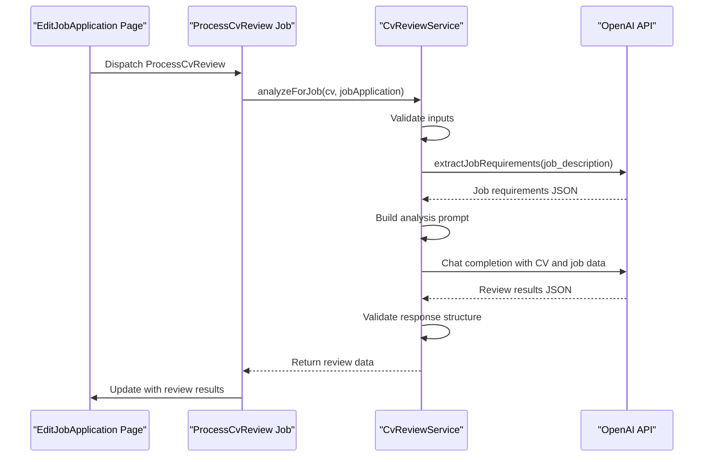
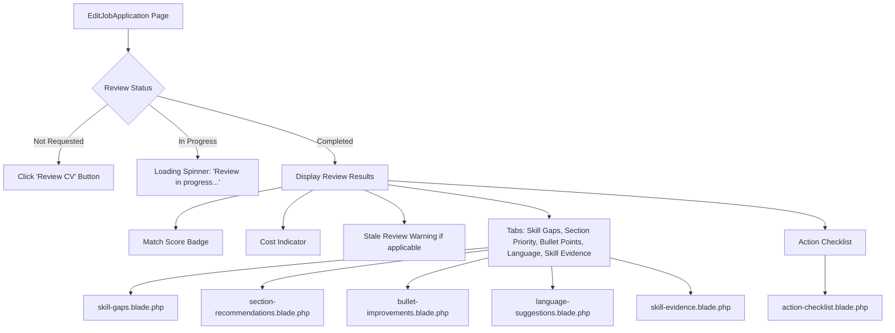

# AI-Powered CV Review

<cite>
**Referenced Files in This Document**   
- [CvReviewService.php](file://app/Services/CvReviewService.php)
- [ProcessCvReview.php](file://app/Jobs/ProcessCvReview.php)
- [OpenAiApiException.php](file://app/Exceptions/OpenAiApiException.php)
- [JobApplication.php](file://app/Models/JobApplication.php)
- [ai-review-results.blade.php](file://resources/views/filament/forms/ai-review-results.blade.php)
- [skill-gaps.blade.php](file://resources/views/filament/infolists/skill-gaps.blade.php)
- [section-recommendations.blade.php](file://resources/views/filament/infolists/section-recommendations.blade.php)
- [bullet-improvements.blade.php](file://resources/views/filament/infolists/bullet-improvements.blade.php)
- [language-suggestions.blade.php](file://resources/views/filament/infolists/language-suggestions.blade.php)
- [skill-evidence.blade.php](file://resources/views/filament/infolists/skill-evidence.blade.php)
- [action-checklist.blade.php](file://resources/views/filament/infolists/action-checklist.blade.php)
- [add_ai_review_fields_to_job_applications.php](file://database/migrations/2025_10_04_152747_add_ai_review_fields_to_job_applications.php)
</cite>

## Table of Contents
1. [Introduction](#introduction)
2. [Core Analysis Engine: CvReviewService](#core-analysis-engine-cvreviewservice)
3. [Asynchronous Processing with ProcessCvReview](#asynchronous-processing-with-processcvreview)
4. [Error Handling and Validation](#error-handling-and-validation)
5. [User Interface and Review Presentation](#user-interface-and-review-presentation)
6. [Data Structure and Storage](#data-structure-and-storage)
7. [Rate Limiting, Cost, and Caching](#rate-limiting-cost-and-caching)
8. [Example Review Outputs and User Actions](#example-review-outputs-and-user-actions)

## Introduction
The AI-powered CV review system provides job seekers with intelligent, data-driven feedback on how well their CV matches a specific job description. By leveraging OpenAI's API, the system analyzes the CV content against the job requirements to generate a comprehensive review that includes a match score, skill gap analysis, and actionable recommendations for improvement. The review process is triggered from the EditJobApplication page and executed asynchronously to ensure a responsive user experience. Results are presented through an intuitive interface that organizes feedback into categories such as skill gaps, section recommendations, and language improvements, enabling users to systematically enhance their CV for better job application outcomes.

## Core Analysis Engine: CvReviewService
The CvReviewService is the central component responsible for analyzing a CV against a job description using OpenAI's API. The service orchestrates the entire review process through its primary method, `analyzeForJob()`, which takes a CV and JobApplication as inputs and returns a structured analysis. The process begins with validation to ensure both the job description exists and the CV contains sufficient content (at least one experience or skill). The service then extracts key requirements from the job description by calling OpenAI to identify skills, competencies, keywords, experience level, and role focus. Using this extracted information, the service constructs a detailed prompt that guides OpenAI in generating a comprehensive review. The analysis includes calculating a match score based on four weighted factors: skills (40%), experience relevance (30%), keyword coverage (20%), and evidence quality (10%). The final output is validated to ensure it contains all required fields before being returned to the calling process.

**Diagram sources**
- [CvReviewService.php](file://app/Services/CvReviewService.php#L15-L225)
- [ProcessCvReview.php](file://app/Jobs/ProcessCvReview.php#L25-L61)

**Section sources**
- [CvReviewService.php](file://app/Services/CvReviewService.php#L15-L225)

## Asynchronous Processing with ProcessCvReview
The CV review process is handled asynchronously through the ProcessCvReview job to maintain application responsiveness and handle potential API delays. When a user requests a CV review from the EditJobApplication page, the system dispatches the ProcessCvReview job, which updates the `ai_review_requested_at` timestamp to indicate the review has been initiated. The job then calls the CvReviewService's `analyzeForJob()` method to perform the actual analysis. Upon successful completion, the job updates the JobApplication record with the full review data in the `ai_review_data` field, sets the `ai_review_completed_at` timestamp, and calculates the API cost in cents using the `estimateCostCents()` method. The job is configured with three retry attempts and a 120-second timeout to handle transient API failures. If the job fails after all retries, the exception is logged, and the review remains in a pending state, allowing the user to retry the analysis.

**Section sources**
- [ProcessCvReview.php](file://app/Jobs/ProcessCvReview.php#L1-L61)
- [CvReviewService.php](file://app/Services/CvReviewService.php#L15-L225)

## Error Handling and Validation
The AI review system implements comprehensive error handling to ensure reliability and provide meaningful feedback to users. The CvReviewService validates inputs at the beginning of the `analyzeForJob()` method, throwing specific exceptions when requirements are not met: `MissingJobDescriptionException` when the job description is empty or too short, and `IncompleteCvException` when the CV lacks sufficient content. During API communication, the service uses Laravel's Http client with retry logic (3 attempts with 100ms delay) and a 60-second timeout to handle transient network issues. If the OpenAI API call fails, an `OpenAiApiException` is thrown. The service also validates the structure of the API response to ensure it contains all required fields (`schema_version`, `match_score`, `skill_gaps`, etc.) and that the match score is within the valid range of 0-100, throwing an `InvalidResponseException` if validation fails. These exceptions are caught by the ProcessCvReview job, logged for debugging, and prevent incomplete or invalid data from being stored in the database.

**Section sources**
- [CvReviewService.php](file://app/Services/CvReviewService.php#L15-L225)
- [OpenAiApiException.php](file://app/Exceptions/OpenAiApiException.php#L1-L11)
- [MissingJobDescriptionException.php](file://app/Exceptions/MissingJobDescriptionException.php)
- [IncompleteCvException.php](file://app/Exceptions/IncompleteCvException.php)
- [InvalidResponseException.php](file://app/Exceptions/InvalidResponseException.php)

## User Interface and Review Presentation
The review results are presented to users through the EditJobApplication page using the ai-review-results.blade.php template, which provides a comprehensive and interactive interface for viewing the AI-generated feedback. When a review is in progress, the interface displays a loading spinner with the message "Review in progress..." to indicate that processing is underway. Once completed, the results are organized into a tabbed interface that categorizes feedback into five main sections: Skill Gaps, Section Priority, Bullet Points, Language, and Skill Evidence. Each tab displays the number of recommendations in that category, allowing users to quickly assess the scope of feedback. The interface prominently displays the overall match score as a large badge, color-coded green (70+%), yellow (50-69%), or red (<50%) to indicate alignment quality. A cost indicator shows the monetary cost of the API call in dollars. If the CV has been modified since the review was generated, a warning banner appears indicating the review is stale and should be regenerated for up-to-date recommendations.

**Diagram sources**
- [ai-review-results.blade.php](file://resources/views/filament/forms/ai-review-results.blade.php#L1-L117)
- [JobApplication.php](file://app/Models/JobApplication.php#L85-L95)

**Section sources**
- [ai-review-results.blade.php](file://resources/views/filament/forms/ai-review-results.blade.php#L1-L117)
- [JobApplication.php](file://app/Models/JobApplication.php#L85-L95)

## Data Structure and Storage
The AI review results are stored in the database as a JSON object within the `ai_review_data` column of the job_applications table. This column, along with supporting fields, was added through the 2025_10_04_152747_add_ai_review_fields_to_job_applications.php migration. The `ai_review_data` field contains the complete structured output from the CvReviewService, including the match score, skill gaps, section recommendations, bullet improvements, language suggestions, skill evidence, and action checklist. Additional fields track the review lifecycle: `ai_review_requested_at` records when the user initiated the review, `ai_review_completed_at` stores the completion timestamp, and `ai_review_cost_cents` captures the API cost in cents. The JobApplication model casts `ai_review_data` as an array for convenient access in PHP code and provides helper methods like `getReviewData()` to retrieve the review data and `isReviewStale()` to determine if the CV has been modified since the review was generated. Database indexes on `ai_review_completed_at` and the combination of `send_status` and `ai_review_completed_at` optimize queries for filtering applications by review status.

**Section sources**
- [JobApplication.php](file://app/Models/JobApplication.php#L15-L122)
- [add_ai_review_fields_to_job_applications.php](file://database/migrations/2025_10_04_152747_add_ai_review_fields_to_job_applications.php#L1-L47)

## Rate Limiting, Cost, and Caching
The AI review system incorporates several strategies to manage API usage, costs, and performance. The CvReviewService includes methods to estimate both token usage and API costs before making the actual OpenAI call. The `estimateTokenCount()` method calculates an approximate token count based on the word count of the CV and job description, while `estimateCostCents()` uses this estimate to project the monetary cost based on OpenAI's pricing model (input at $0.40/1K tokens, output at $3.00/1K tokens). This allows the system to inform users of the expected cost before processing. The service implements rate limiting through Laravel's Http client with a 60-second timeout and automatic retries (3 attempts with 100ms delay between retries) to handle temporary API congestion. For caching, the system relies on the fact that reviews are stored in the database and can be reused until the CV is modified. The `isReviewStale()` method determines when a review should be regenerated by comparing the CV's last update time with the review completion time. This approach avoids unnecessary API calls for unchanged CVs while ensuring users receive up-to-date recommendations when content is modified.

**Section sources**
- [CvReviewService.php](file://app/Services/CvReviewService.php#L15-L225)
- [JobApplication.php](file://app/Models/JobApplication.php#L85-L95)

## Example Review Outputs and User Actions
A typical AI review output includes a match score between 0-100, with accompanying recommendations organized into specific categories. For example, a review might show a 65% match score with high-priority skill gaps in "cloud architecture" and "containerization," suggesting the user add relevant experience. The section recommendations tab might suggest moving the "Professional Experience" section above "Education" for a senior role, with a rationale explaining that employers prioritize work history for experienced candidates. The bullet improvements section would highlight specific achievement statements, recommending changes like replacing "Worked on projects" with "Led cross-functional projects using Agile methodology" to demonstrate leadership. The language suggestions tab would identify generic terms like "team player" and recommend job-specific alternatives like "collaborated with product and engineering teams to deliver features." Users can act on these recommendations by editing their CV directly in the application, focusing first on high-priority items that will have the greatest impact on their match score. After making changes, users can regenerate the review to see how their modifications improved alignment with the job description.

**Section sources**
- [ai-review-results.blade.php](file://resources/views/filament/forms/ai-review-results.blade.php#L1-L117)
- [skill-gaps.blade.php](file://resources/views/filament/infolists/skill-gaps.blade.php#L1-L30)
- [section-recommendations.blade.php](file://resources/views/filament/infolists/section-recommendations.blade.php#L1-L29)
- [bullet-improvements.blade.php](file://resources/views/filament/infolists/bullet-improvements.blade.php#L1-L43)
- [language-suggestions.blade.php](file://resources/views/filament/infolists/language-suggestions.blade.php#L1-L62)
- [skill-evidence.blade.php](file://resources/views/filament/infolists/skill-evidence.blade.php)
- [action-checklist.blade.php](file://resources/views/filament/infolists/action-checklist.blade.php)