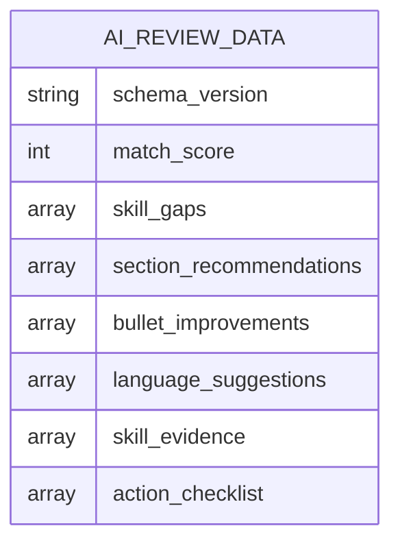
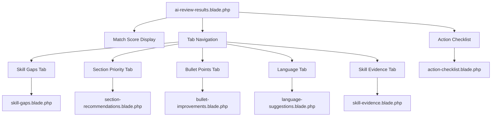
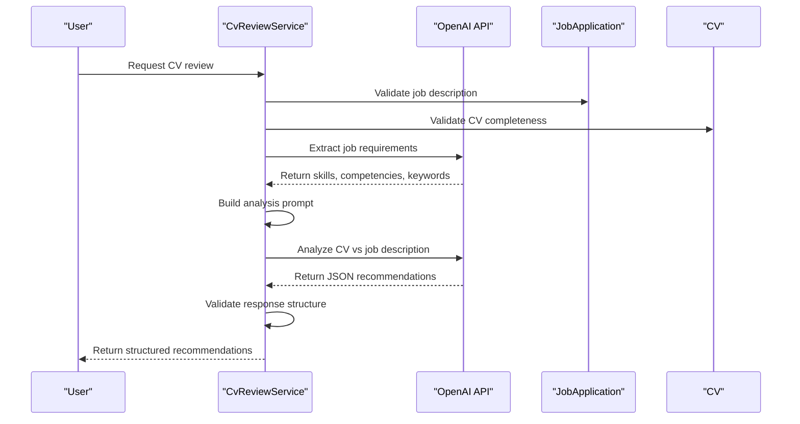

# Actionable Recommendations

<cite>
**Referenced Files in This Document**   
- [CvReviewService.php](file://app/Services/CvReviewService.php)
- [ai-review-results.blade.php](file://resources/views/filament/forms/ai-review-results.blade.php)
- [action-checklist.blade.php](file://resources/views/filament/infolists/action-checklist.blade.php)
- [bullet-improvements.blade.php](file://resources/views/filament/infolists/bullet-improvements.blade.php)
- [language-suggestions.blade.php](file://resources/views/filament/infolists/language-suggestions.blade.php)
- [section-recommendations.blade.php](file://resources/views/filament/infolists/section-recommendations.blade.php)
- [skill-evidence.blade.php](file://resources/views/filament/infolists/skill-evidence.blade.php)
- [skill-gaps.blade.php](file://resources/views/filament/infolists/skill-gaps.blade.php)
- [ai-cv-review-features.md](file://specs/ai-cv-review-features.md)
</cite>

## Table of Contents
1. [Introduction](#introduction)
2. [Recommendation Types Overview](#recommendation-types-overview)
3. [Data Structure and JSON Schema](#data-structure-and-json-schema)
4. [UI Rendering and Template System](#ui-rendering-and-template-system)
5. [CvReviewService Implementation](#cvreviewservice-implementation)
6. [User Implementation Guide](#user-implementation-guide)
7. [Best Practices and Tracking](#best-practices-and-tracking)
8. [Conclusion](#conclusion)

## Introduction
The AI review system in the CV Builder application generates actionable recommendations to help users optimize their CVs for specific job applications. These recommendations are generated by the CvReviewService, which analyzes the user's CV against the job description using OpenAI's API. The system produces six types of targeted suggestions: Strategic Gaps Analysis, Section Reordering, Highlight Prioritization, Language Alignment, and Skill Evidence Assessment. These recommendations are structured in a standardized JSON format within the ai_review_data field of the JobApplication model and rendered through the ai-review-results.blade.php template on the EditJobApplication page. This document explains how these recommendations are generated, structured, and presented to users, along with guidance on implementing them effectively.

## Recommendation Types Overview

The AI review system generates six distinct types of recommendations, each designed to address specific aspects of CV optimization for a target job. These recommendations are based on a comprehensive analysis of the CV content in relation to the job description requirements.

### Strategic Gaps Analysis
Strategic Gaps Analysis identifies critical skills, competencies, and keywords that are present in the job description but missing or underrepresented in the CV. This analysis helps users understand the most significant gaps in their qualifications as presented in their CV. The system extracts key requirements from the job description, including technical skills, soft skills, industry-specific competencies, and important keywords. It then compares these requirements against the skills, experiences, and content in the CV to identify discrepancies. High-priority gaps are those that represent core requirements for the position, while medium and low-priority gaps may represent desirable but not essential qualifications.

**Section sources**
- [CvReviewService.php](file://app/Services/CvReviewService.php#L150-L155)
- [skill-gaps.blade.php](file://resources/views/filament/infolists/skill-gaps.blade.php)

### Section Reordering Recommendations
Section Reordering Recommendations suggest optimal organization of CV sections based on the job's focus areas. The AI analyzes the job description to determine which types of experiences or qualifications are most emphasized (e.g., technical skills, leadership experience, specific industry expertise). It then evaluates the current order of sections in the CV and recommends changes to highlight the most relevant content. For example, if a job emphasizes project experience, the system might recommend moving the Projects section higher in the document. Each recommendation includes the current priority position, the suggested priority position, and a rationale explaining why the reordering would improve alignment with the job requirements.

**Section sources**
- [CvReviewService.php](file://app/Services/CvReviewService.php#L156-L159)
- [section-recommendations.blade.php](file://resources/views/filament/infolists/section-recommendations.blade.php)

### Highlight Prioritization
Highlight Prioritization focuses on individual bullet points within experience and project entries, assessing their relevance and impact for the target job. The system evaluates each bullet point and categorizes it as "emphasize," "keep," or "de-emphasize" based on how well it demonstrates relevant skills and achievements. For bullets that should be emphasized, the system may suggest rewording to strengthen the impact using more powerful action verbs and quantifiable results. For bullets that are less relevant, it may recommend de-emphasizing or removing them to improve the overall focus of the CV. This granular analysis helps users refine their content at the most detailed level.

**Section sources**
- [CvReviewService.php](file://app/Services/CvReviewService.php#L160-L163)
- [bullet-improvements.blade.php](file://resources/views/filament/infolists/bullet-improvements.blade.php)

### Language Alignment
Language Alignment recommendations focus on improving the terminology and phrasing used in the CV to better match the language of the job description. This includes replacing generic terms with job-specific terminology, incorporating industry buzzwords and jargon, and aligning the tone and style with what is typical in the target industry. The system identifies instances where the CV uses vague or generic language and suggests more precise, impactful alternatives that mirror the language used in the job posting. This helps the CV pass through applicant tracking systems (ATS) more effectively and creates a stronger impression of cultural and professional fit with the employer.

**Section sources**
- [CvReviewService.php](file://app/Services/CvReviewService.php#L164-L167)
- [language-suggestions.blade.php](file://resources/views/filament/infolists/language-suggestions.blade.php)

### Skill Evidence Assessment
Skill Evidence Assessment evaluates how effectively the CV demonstrates each skill, particularly those mentioned in the job description. The system identifies skills that are listed but poorly evidenced with concrete examples, achievements, or quantifiable results. For each skill with weak evidence, the recommendation provides specific suggestions for strengthening the demonstration, such as adding relevant project experiences, quantifying achievements, or including specific technologies used. This ensures that skills are not just mentioned but properly substantiated with evidence that validates the user's proficiency level.

**Section sources**
- [CvReviewService.php](file://app/Services/CvReviewService.php#L168-L171)
- [skill-evidence.blade.php](file://resources/views/filament/infolists/skill-evidence.blade.php)

## Data Structure and JSON Schema

The recommendations generated by the CvReviewService are structured in a standardized JSON format that is stored in the ai_review_data field of the JobApplication model. This structured data format enables consistent rendering across the application and facilitates future enhancements to the recommendation system.

**Diagram sources**
- [CvReviewService.php](file://app/Services/CvReviewService.php#L100-L105)
- [ai-cv-review-features.md](file://specs/ai-cv-review-features.md#L7-L46)

### Core Data Structure
The ai_review_data JSON object contains several key fields that structure the recommendations. The schema_version field indicates the version of the recommendation format, allowing for backward compatibility when the structure evolves. The match_score field provides a quantitative assessment of how well the CV aligns with the job requirements, expressed as a percentage from 0 to 100. This score is calculated using a weighted formula that considers skills match (40%), experience relevance (30%), keyword coverage (20%), and evidence quality (10%).

**Section sources**
- [CvReviewService.php](file://app/Services/CvReviewService.php#L50-L58)

### Recommendation Arrays
The recommendations are organized into six primary arrays, each corresponding to a specific type of suggestion. The skill_gaps array contains objects that identify missing or underrepresented skills, with properties for the skill name, priority level, and explanation. The section_recommendations array includes suggestions for reordering sections, with current and suggested priority positions. The bullet_improvements array provides specific feedback on individual bullet points, including the original text, suggested improvement, and rationale. The language_suggestions array focuses on terminology improvements, while the skill_evidence array addresses how skills are demonstrated. Finally, the action_checklist array compiles the most critical recommendations into a prioritized to-do list.

**Section sources**
- [CvReviewService.php](file://app/Services/CvReviewService.php#L100-L105)

## UI Rendering and Template System

The recommendations are rendered through a sophisticated template system that transforms the JSON data into an intuitive, user-friendly interface on the EditJobApplication page. The primary template, ai-review-results.blade.php, orchestrates the display of all recommendation types using a tabbed interface.

**Diagram sources**
- [ai-review-results.blade.php](file://resources/views/filament/forms/ai-review-results.blade.php)
- [action-checklist.blade.php](file://resources/views/filament/infolists/action-checklist.blade.php)
- [bullet-improvements.blade.php](file://resources/views/filament/infolists/bullet-improvements.blade.php)
- [language-suggestions.blade.php](file://resources/views/filament/infolists/language-suggestions.blade.php)
- [section-recommendations.blade.php](file://resources/views/filament/infolists/section-recommendations.blade.php)
- [skill-evidence.blade.php](file://resources/views/filament/infolists/skill-evidence.blade.php)
- [skill-gaps.blade.php](file://resources/views/filament/infolists/skill-gaps.blade.php)

### Tabbed Interface Design
The tabbed interface organizes the recommendations into logical categories, allowing users to focus on one aspect of optimization at a time. Each tab displays the number of recommendations for that category, providing a quick overview of where the most work is needed. The tabs are ordered by importance, with Skill Gaps appearing first as they represent the most fundamental alignment issues. The interface uses color coding to indicate priority levels, with high-priority items highlighted in red/danger colors, medium-priority in yellow/warning, and low-priority in neutral gray.

**Section sources**
- [ai-review-results.blade.php](file://resources/views/filament/forms/ai-review-results.blade.php#L30-L65)

### UI Components
The system employs several specialized UI components to present recommendations effectively. The action checklist displays high-priority tasks in a numbered list format, making it easy for users to work through the most critical improvements. Bullet point improvements are shown with side-by-side comparisons of the original and suggested text, clearly highlighting the changes. Language suggestions include context location information to help users find the relevant text in their CV. Skill gap visualizations use simple icons and clear categorization to make the information easily digestible. These components work together to create an intuitive experience that guides users through the optimization process.

**Section sources**
- [action-checklist.blade.php](file://resources/views/filament/infolists/action-checklist.blade.php)
- [bullet-improvements.blade.php](file://resources/views/filament/infolists/bullet-improvements.blade.php)
- [language-suggestions.blade.php](file://resources/views/filament/infolists/language-suggestions.blade.php)

## CvReviewService Implementation

The CvReviewService is the core engine responsible for generating the actionable recommendations. It orchestrates the analysis process by extracting job requirements, comparing them against the CV content, and generating specific, implementable suggestions.

**Diagram sources**
- [CvReviewService.php](file://app/Services/CvReviewService.php)
- [ai-cv-review-features.md](file://specs/ai-cv-review-features.md#L7-L46)

### Analysis Workflow
The analyzeForJob method serves as the entry point for the review process. It first validates that both the job description and CV contain sufficient content for analysis, throwing specific exceptions if requirements are not met. The service then extracts key requirements from the job description by calling OpenAI with a specialized prompt that requests structured data on skills, competencies, keywords, experience level, and role focus. This extracted data is combined with the CV's structured content (skills, experiences, education, highlights) to build a comprehensive analysis prompt.

**Section sources**
- [CvReviewService.php](file://app/Services/CvReviewService.php#L15-L45)

### OpenAI Integration
The system uses targeted OpenAI prompts to generate specific, actionable recommendations rather than generic advice. The buildAnalysisPrompt method constructs a detailed system prompt that instructs the AI to return JSON with specific fields and format requirements. The prompt emphasizes the need for concrete suggestions, particularly for language improvements, requiring the AI to provide the exact original text and specific replacement text. This structured approach ensures consistency in the output format and enables reliable parsing and rendering in the application. The service also includes validation logic to ensure the response conforms to the expected schema before returning it to the caller.

**Section sources**
- [CvReviewService.php](file://app/Services/CvReviewService.php#L80-L95)

## User Implementation Guide

Implementing the AI recommendations effectively requires a systematic approach that prioritizes the most impactful changes while maintaining the integrity of the user's professional narrative.

### Prioritizing Recommendations
Users should begin with high-priority items in the action checklist, as these represent the most critical improvements for job alignment. Strategic gaps in essential skills should be addressed first, followed by section reordering to highlight relevant experiences. When modifying bullet points, users should focus on incorporating quantifiable achievements and strong action verbs that demonstrate impact. For language alignment, the focus should be on replacing generic terms with specific, job-relevant terminology that matches the language used in the job description.

**Section sources**
- [action-checklist.blade.php](file://resources/views/filament/infolists/action-checklist.blade.php)
- [bullet-improvements.blade.php](file://resources/views/filament/infolists/bullet-improvements.blade.php)

### Making Specific Changes
When implementing bullet point improvements, users should carefully consider the suggested rewording while ensuring it accurately represents their experience. The improvements often transform passive descriptions into active achievements, such as changing "Responsible for project management" to "Led cross-functional teams to deliver $500K projects on time and under budget." For skill evidence, users should add specific examples that demonstrate proficiency, including relevant technologies, methodologies, and quantifiable outcomes. When reordering sections, users should maintain a logical flow while ensuring the most relevant content appears early in the document.

**Section sources**
- [bullet-improvements.blade.php](file://resources/views/filament/infolists/bullet-improvements.blade.php)
- [skill-evidence.blade.php](file://resources/views/filament/infolists/skill-evidence.blade.php)

## Best Practices and Tracking

To maximize the effectiveness of the AI review system, users should adopt best practices for implementing recommendations and tracking their progress over time.

### Iterative Improvement Process
The CV optimization process should be iterative, with users making a batch of changes and then requesting a new review to assess the impact. This allows for continuous refinement and ensures that improvements in one area don't negatively affect others. After implementing recommendations, users should regenerate the AI review to verify that strategic gaps have been addressed and the match score has improved. This feedback loop helps users understand which types of changes have the greatest impact on their job alignment.

**Section sources**
- [ai-review-results.blade.php](file://resources/views/filament/forms/ai-review-results.blade.php#L15-L25)

### Monitoring Progress
Users can track their improvement over time by comparing match scores and recommendation counts across multiple reviews. A decreasing number of high-priority items and an increasing match score indicate effective optimization. The system's stale review warning helps users recognize when their CV has changed significantly since the last review, prompting them to regenerate recommendations for the most current guidance. By maintaining this cycle of review, implement, and re-review, users can systematically enhance their CV's effectiveness for specific job applications.

**Section sources**
- [ai-review-results.blade.php](file://resources/views/filament/forms/ai-review-results.blade.php#L15-L25)

## Conclusion
The actionable recommendations system in the CV Builder application provides users with specific, implementable guidance for optimizing their CVs for target job applications. By leveraging AI analysis through the CvReviewService, the system identifies strategic gaps, suggests section reordering, prioritizes highlights, aligns language, and assesses skill evidence. These recommendations are structured in a standardized JSON format and rendered through an intuitive tabbed interface that makes it easy for users to understand and implement the suggestions. The combination of targeted OpenAI prompts and specialized UI components creates a powerful tool for CV optimization, enabling users to systematically improve their job application materials and track their progress over time.