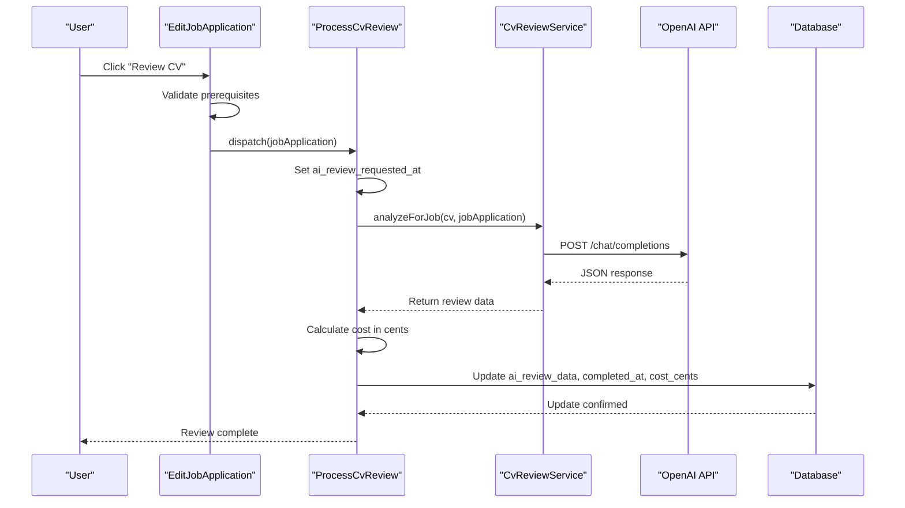
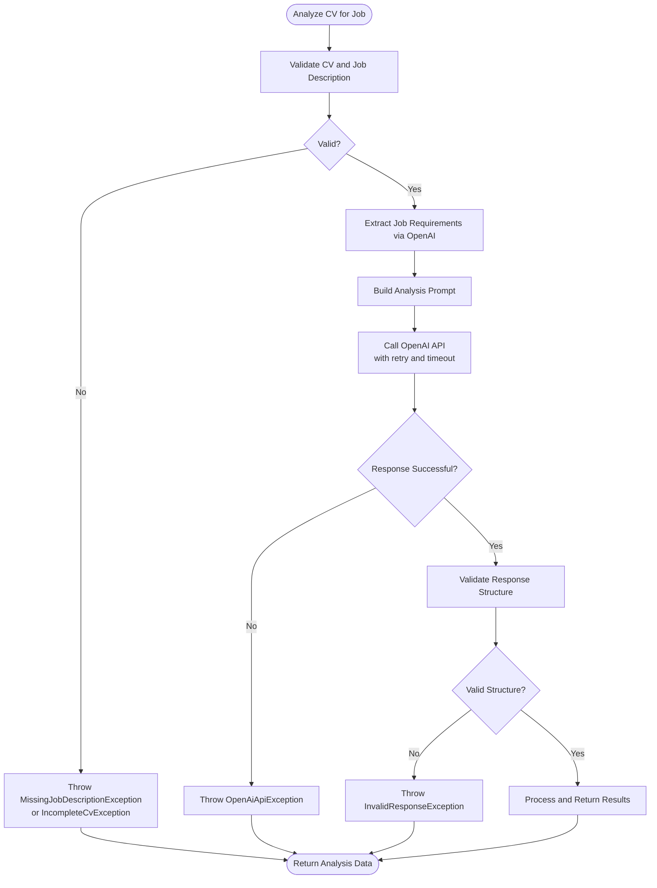
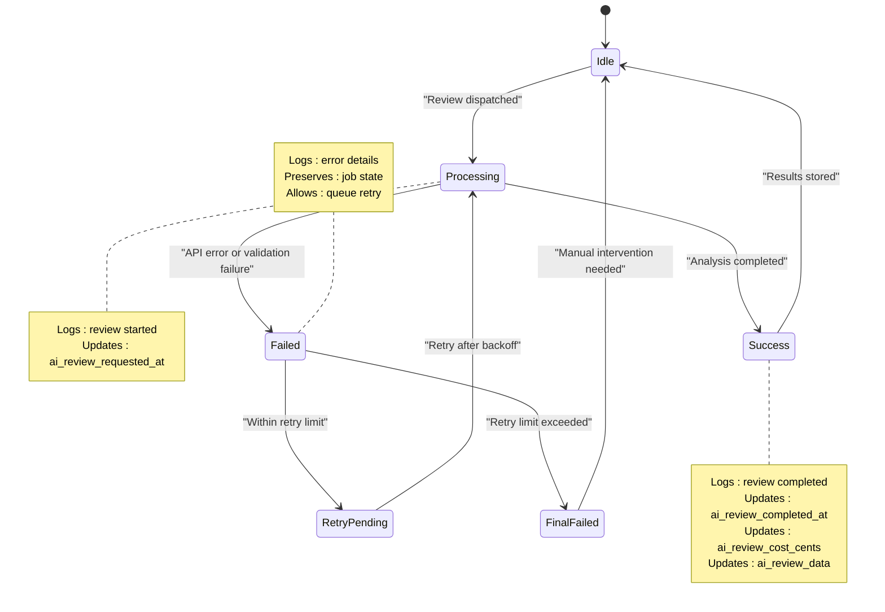

# Review Process

<cite>
**Referenced Files in This Document**   
- [ProcessCvReview.php](file://app/Jobs/ProcessCvReview.php)
- [CvReviewService.php](file://app/Services/CvReviewService.php)
- [JobApplication.php](file://app/Models/JobApplication.php)
- [EditJobApplication.php](file://app/Filament/Resources/JobApplications/Pages/EditJobApplication.php)
- [OpenAiApiException.php](file://app/Exceptions/OpenAiApiException.php)
- [add_ai_review_fields_to_job_applications.php](file://database/migrations/2025_10_04_152747_add_ai_review_fields_to_job_applications.php)
- [JobApplicationReviewTest.php](file://tests/Feature/Filament/JobApplicationReviewTest.php)
- [ProcessCvReviewJobTest.php](file://tests/Feature/ProcessCvReviewJobTest.php)
- [CvReviewServiceTest.php](file://tests/Feature/CvReviewServiceTest.php)
</cite>

## Table of Contents
1. [Introduction](#introduction)
2. [Workflow Overview](#workflow-overview)
3. [Job Dispatch and Orchestration](#job-dispatch-and-orchestration)
4. [CV Review Service Implementation](#cv-review-service-implementation)
5. [OpenAI Integration and Error Handling](#openai-integration-and-error-handling)
6. [Data Flow and Storage](#data-flow-and-storage)
7. [Rate Limiting and Cost Management](#rate-limiting-and-cost-management)
8. [Failure Recovery and Monitoring](#failure-recovery-and-monitoring)
9. [User Interface Integration](#user-interface-integration)
10. [Testing and Validation](#testing-and-validation)

## Introduction
The AI-powered CV review process is a core feature of the CV Builder application that enables users to analyze their CVs against specific job descriptions using artificial intelligence. This document details the end-to-end workflow of the review process, from user initiation through to results presentation. The system leverages OpenAI's API to provide comprehensive analysis of CV-job alignment, including match scoring, skill gap identification, and actionable improvement suggestions. The process is designed to be asynchronous, reliable, and cost-effective, with proper error handling and user feedback mechanisms.

## Workflow Overview
The CV review process follows a structured workflow that begins with user initiation and concludes with actionable insights. The process is triggered when a user clicks the "Review CV" action in the EditJobApplication interface, which initiates the entire review lifecycle. The system first validates prerequisites including a non-empty job description of sufficient length (minimum 50 characters) and a CV with at least one experience or skill section. Upon validation, the system records the review request timestamp and dispatches the ProcessCvReview job to the queue for asynchronous processing. The job orchestrates the review by coordinating between the CV Review Service and OpenAI API, handling the complete analysis lifecycle from data preparation to results storage. Upon completion, the system updates the job application with comprehensive review data, cost information, and completion timestamp, making the results available to the user interface.

**Section sources**
- [EditJobApplication.php](file://app/Filament/Resources/JobApplications/Pages/EditJobApplication.php#L19-L44)
- [ProcessCvReview.php](file://app/Jobs/ProcessCvReview.php#L30-L60)

## Job Dispatch and Orchestration
The ProcessCvReview job serves as the orchestrator of the CV review lifecycle, implementing a robust queuing pattern for asynchronous processing. The job is dispatched from the EditJobApplication interface when the user requests a CV review, passing the JobApplication instance as a dependency. The job is configured with three retry attempts and a 120-second timeout to handle transient failures gracefully. Upon execution, the job injects the CvReviewService dependency and initiates the analysis workflow. The job handles the complete orchestration of the review process, including setting the review completion timestamp, calculating API costs, updating the job application with results, and logging outcomes. In case of failure, the job logs error details and rethrows the exception to allow the queue system to handle retries according to the configured retry policy.



**Diagram sources**
- [ProcessCvReview.php](file://app/Jobs/ProcessCvReview.php#L30-L60)
- [CvReviewService.php](file://app/Services/CvReviewService.php#L15-L35)

**Section sources**
- [ProcessCvReview.php](file://app/Jobs/ProcessCvReview.php#L15-L60)

## CV Review Service Implementation
The CvReviewService class implements the core analysis engine for the CV review process, providing a comprehensive set of methods for job-specific CV analysis. The primary entry point is the analyzeForJob() method, which coordinates the complete analysis workflow. The service begins by validating input requirements, throwing MissingJobDescriptionException when the job description is empty or too short, and IncompleteCvException when the CV lacks sufficient content for meaningful analysis. After validation, the service extracts job requirements from the job description using a dedicated method that calls OpenAI to identify skills, competencies, keywords, experience level, and role focus. The service then constructs a detailed analysis prompt that combines the CV data and job requirements, instructing OpenAI to return structured JSON with specific fields including match score, skill gaps, section recommendations, bullet improvements, language suggestions, skill evidence, and an action checklist.

**Section sources**
- [CvReviewService.php](file://app/Services/CvReviewService.php#L15-L35)

## OpenAI Integration and Error Handling
The integration with OpenAI API is implemented with comprehensive error handling and resilience features to ensure reliable operation. The CvReviewService uses Laravel's HTTP client with configured timeout (60 seconds) and automatic retry (3 attempts with 100ms backoff) to handle transient network issues and API rate limiting. The service makes POST requests to the OpenAI chat completions endpoint with specific parameters including the configured model, system and user messages, temperature setting of 0.3 for consistent output, and JSON response format specification. When the API call fails or returns an unsuccessful response, the service throws an OpenAiApiException with descriptive messaging. The service also implements response validation through the validateReviewData() method, which checks for required fields and proper match score range, throwing InvalidResponseException if validation fails. This multi-layered error handling approach ensures that only valid, properly structured responses are processed and stored.



**Diagram sources**
- [CvReviewService.php](file://app/Services/CvReviewService.php#L36-L67)
- [OpenAiApiException.php](file://app/Exceptions/OpenAiApiException.php#L1-L9)

**Section sources**
- [CvReviewService.php](file://app/Services/CvReviewService.php#L36-L67)
- [OpenAiApiException.php](file://app/Exceptions/OpenAiApiException.php#L1-L9)

## Data Flow and Storage
The data flow in the CV review process follows a well-defined path from input collection through analysis to structured storage in the JobApplication model. The process begins with two primary inputs: the CV data (skills, experiences, education, highlights) and the job description text. These inputs are processed by the CvReviewService, which extracts requirements from the job description and combines them with the CV data to create a comprehensive analysis prompt. The prompt is sent to OpenAI, which returns a JSON response containing structured review data including match score, skill gaps, section recommendations, bullet improvements, language suggestions, skill evidence, and an action checklist. This response is enriched with analysis metadata including generation timestamp, model used, tokens used, and prompt version. The complete review data is stored in the ai_review_data JSON field of the JobApplication model, while the match score, completion timestamp, and cost in cents are stored in dedicated fields for efficient querying and display.

```mermaid
erDiagram
JOB_APPLICATIONS {
timestamp ai_review_requested_at
timestamp ai_review_completed_at
integer ai_review_cost_cents
json ai_review_data
}
CV_DATA {
array skills
array experiences
array education
array highlights
}
JOB_DESCRIPTION {
text content
}
ANALYSIS_PROMPT {
text system_prompt
text user_prompt
}
OPENAI_RESPONSE {
integer match_score
array skill_gaps
array section_recommendations
array bullet_improvements
array language_suggestions
array skill_evidence
array action_checklist
object analysis_metadata
}
CV_DATA -->|Extract and format| ANALYSIS_PROMPT
JOB_DESCRIPTION -->|Extract requirements| ANALYSIS_PROMPT
ANALYSIS_PROMPT -->|POST| OPENAI_RESPONSE
OPENAI_RESPONSE -->|Store| JOB_APPLICATIONS
```

**Diagram sources**
- [JobApplication.php](file://app/Models/JobApplication.php#L20-L25)
- [add_ai_review_fields_to_job_applications.php](file://database/migrations/2025_10_04_152747_add_ai_review_fields_to_job_applications.php#L10-L25)
- [CvReviewService.php](file://app/Services/CvReviewService.php#L15-L35)

**Section sources**
- [JobApplication.php](file://app/Models/JobApplication.php#L20-L25)
- [CvReviewService.php](file://app/Services/CvReviewService.php#L15-L35)

## Rate Limiting and Cost Management
The system implements comprehensive rate limiting and cost management features to ensure sustainable operation and transparent user experience. The ProcessCvReview job is configured with a 120-second timeout and three retry attempts to prevent resource exhaustion from long-running or failing requests. The CvReviewService estimates API costs in cents before and after processing, using the estimateCostCents() method which calculates costs based on input and output token usage at current OpenAI pricing tiers. The estimated cost is displayed to the user in a confirmation modal before the review is initiated, providing transparency about the financial impact. The actual cost is calculated from the tokens_used field in the OpenAI response and stored in the ai_review_cost_cents field of the JobApplication model. A console command, CheckReviewBudget, runs periodically to monitor monthly AI review costs against a configurable budget threshold, logging warnings and potentially sending notifications when usage approaches the budget limit.

**Section sources**
- [CvReviewService.php](file://app/Services/CvReviewService.php#L180-L200)
- [ProcessCvReview.php](file://app/Jobs/ProcessCvReview.php#L15-L20)
- [CheckReviewBudget.php](file://app/Console/Commands/CheckReviewBudget.php#L15-L40)

## Failure Recovery and Monitoring
The CV review process includes robust failure recovery and monitoring mechanisms to ensure reliability and provide visibility into system operation. The ProcessCvReview job implements a try-catch block that logs detailed error information including the job application ID and error message when a review fails, while rethrowing the exception to allow the queue system to handle retries. The system uses Laravel's built-in queue retry mechanism with exponential backoff to handle transient failures such as network issues or temporary API unavailability. Comprehensive logging is implemented at key points in the process, including review initiation, completion, and failure, with structured log data that includes the job application ID, match score, and cost for successful reviews. The JobApplication model includes the isReviewStale() method that detects when a CV has been modified after a review was generated, prompting users to regenerate the review for up-to-date recommendations. This stale review detection helps maintain data integrity and ensures users are aware when their review results may no longer reflect their current CV content.



**Diagram sources**
- [ProcessCvReview.php](file://app/Jobs/ProcessCvReview.php#L45-L60)
- [JobApplication.php](file://app/Models/JobApplication.php#L52-L60)

**Section sources**
- [ProcessCvReview.php](file://app/Jobs/ProcessCvReview.php#L45-L60)
- [JobApplication.php](file://app/Models/JobApplication.php#L52-L60)

## User Interface Integration
The CV review process is seamlessly integrated into the user interface through the EditJobApplication page, providing a user-friendly experience with appropriate feedback at each stage. The "Review CV" action is conditionally visible based on prerequisites including draft status, presence of a job description, and absence of a completed review. When the user initiates a review, a confirmation modal displays the estimated cost in dollars, calculated from the estimated token count and current pricing. During processing, the interface displays a progress indicator with a spinning animation and "Review in progress..." message. Upon completion, the interface displays the match score as a color-coded badge (green for 70+, yellow for 50-69, red for below 50) and the cost in dollars. If the CV is modified after a review, a prominent "Review Out of Date" warning is displayed, encouraging the user to regenerate the review. The system also supports regenerating reviews with a dedicated "Regenerate Review" action that warns the user about additional costs.

**Section sources**
- [EditJobApplication.php](file://app/Filament/Resources/JobApplications/Pages/EditJobApplication.php#L19-L82)
- [ai-review-results.blade.php](file://resources/views/filament/forms/ai-review-results.blade.php#L1-L14)
- [stale-review-alert.blade.php](file://resources/views/filament/infolists/stale-review-alert.blade.php#L1-L17)

## Testing and Validation
The CV review process is thoroughly tested with a comprehensive suite of unit, feature, and performance tests to ensure reliability and correctness. Contract tests validate that the CvReviewService::analyzeForJob() method returns a valid structure with required fields including match_score, skill_gaps, and action_checklist, with the match_score constrained to the 0-100 range. Integration tests verify that the ReviewCvAction in the EditJobApplication interface correctly dispatches the ProcessCvReview job with the appropriate job application instance. Job-level tests confirm that the ProcessCvReview job properly updates the job application with completion timestamp, review data, and cost information. The system includes performance testing to ensure reviews complete within 10 seconds for standard CVs, with tests mocking the OpenAI API response to measure execution time. Unit tests validate the isReviewStale() method's ability to detect when a CV has been modified after a review, and the getReviewData() method's proper handling of null and populated review data.

**Section sources**
- [ProcessCvReviewJobTest.php](file://tests/Feature/ProcessCvReviewJobTest.php#L1-L61)
- [JobApplicationReviewTest.php](file://tests/Feature/Filament/JobApplicationReviewTest.php#L1-L45)
- [CvReviewServiceTest.php](file://tests/Feature/CvReviewServiceTest.php#L1-L36)
- [JobApplicationReviewMethodsTest.php](file://tests/Unit/JobApplicationReviewMethodsTest.php#L1-L49)
- [CvReviewPerformanceTest.php](file://tests/Feature/CvReviewPerformanceTest.php#L1-L38)