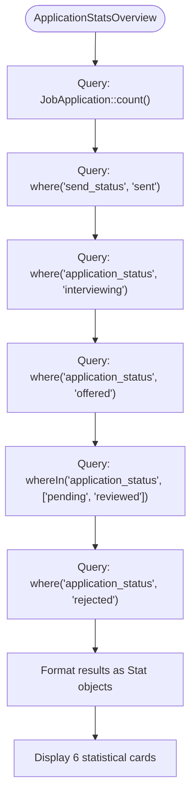
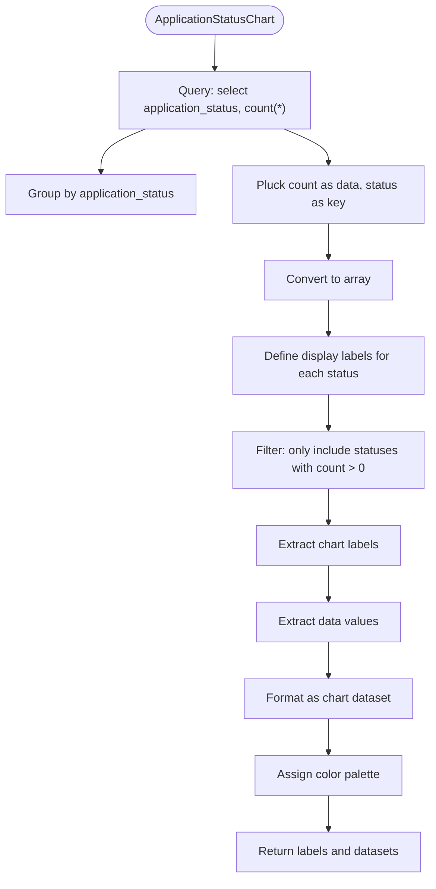
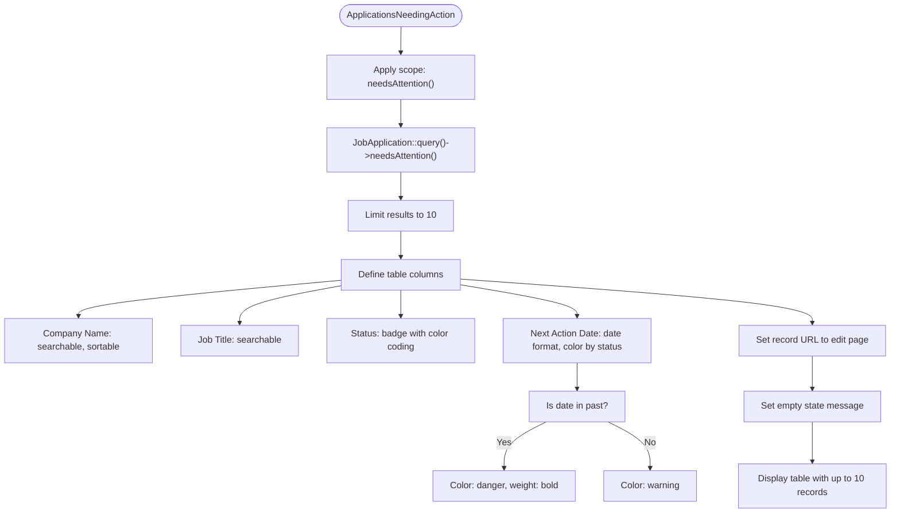
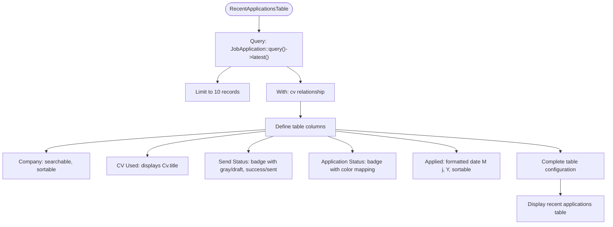
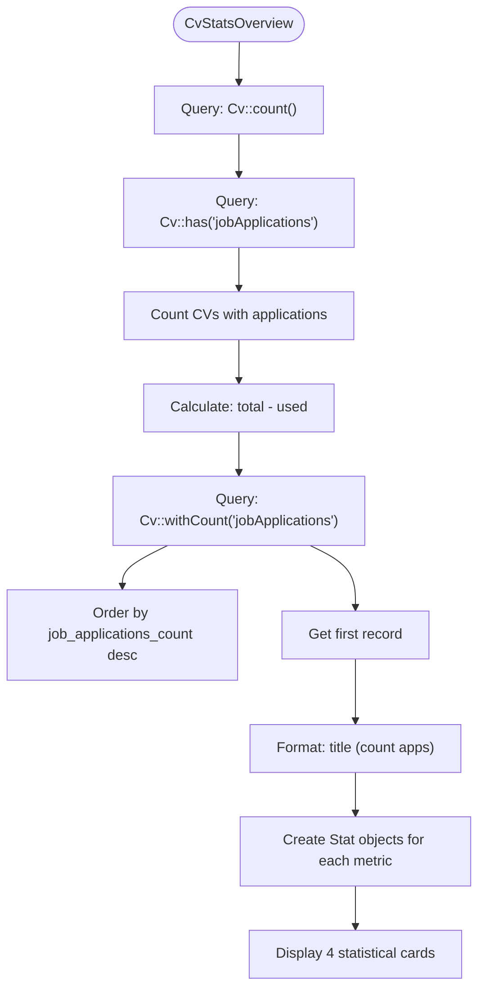
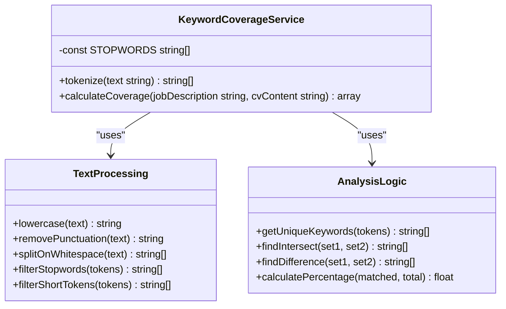
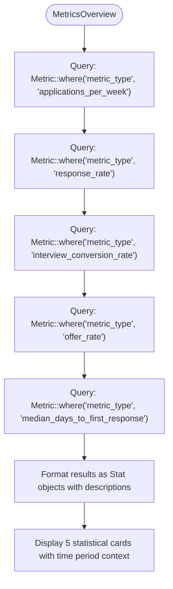
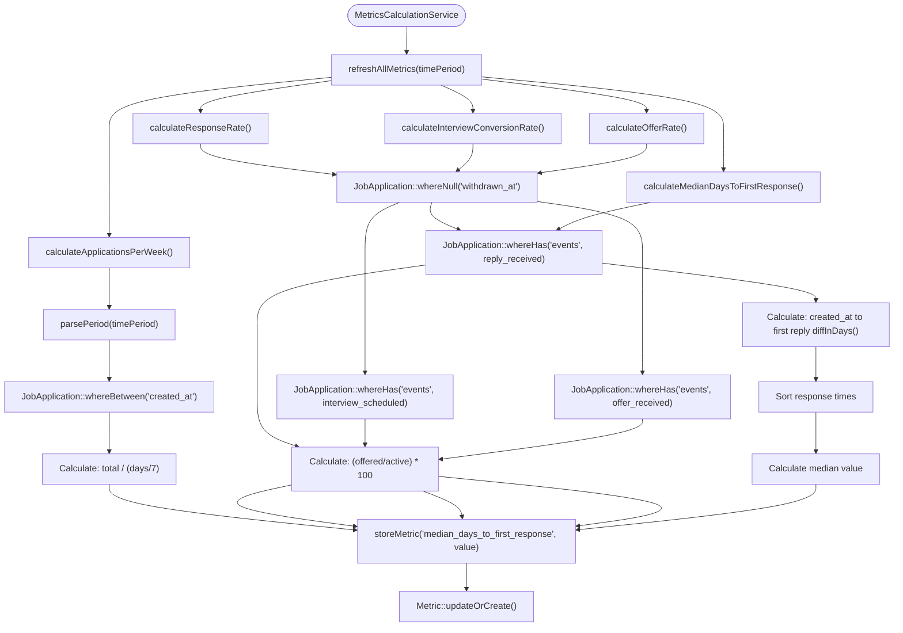

# Analytics & Reporting

<cite>
**Referenced Files in This Document**   
- [ApplicationStatsOverview.php](file://app/Filament/Widgets/ApplicationStatsOverview.php) - *Updated in recent commit*
- [ApplicationStatusChart.php](file://app/Filament/Widgets/ApplicationStatusChart.php) - *Updated in recent commit*
- [ApplicationsNeedingAction.php](file://app/Filament/Widgets/ApplicationsNeedingAction.php) - *Updated in recent commit*
- [RecentApplicationsTable.php](file://app/Filament/Widgets/RecentApplicationsTable.php) - *Updated in recent commit*
- [CvStatsOverview.php](file://app/Filament/Widgets/CvStatsOverview.php) - *Updated in recent commit*
- [KeywordCoverageService.php](file://app/Services/KeywordCoverageService.php) - *Updated in recent commit*
- [JobApplication.php](file://app/Models/JobApplication.php) - *Updated in recent commit*
- [Cv.php](file://app/Models/Cv.php) - *Updated in recent commit*
- [KeywordCoverageServiceTest.php](file://tests/Unit/KeywordCoverageServiceTest.php) - *Updated in recent commit*
- [MetricsOverview.php](file://app/Filament/Widgets/MetricsOverview.php) - *Added in recent commit*
- [MetricsCalculationService.php](file://app/Services/MetricsCalculationService.php) - *Added in recent commit*
- [Metric.php](file://app/Models/Metric.php) - *Added in recent commit*
- [create_metrics_table.php](file://database/migrations/2025_10_04_100003_create_metrics_table.php) - *Added in recent commit*
- [MetricsCalculationTest.php](file://tests/Feature/MetricsCalculationTest.php) - *Added in recent commit*
- [console.php](file://routes/console.php) - *Modified in recent commit*
</cite>

## Update Summary
**Changes Made**   
- Added new section: **Advanced Metrics Dashboard** to document the new MetricsOverview widget and related components
- Added new section: **Metrics Calculation Service** to explain the backend service that powers the analytics
- Updated **Table of Contents** to include new sections
- Enhanced **Performance Considerations** with details about the metrics calculation process
- Added references to new files in document-level sources
- Updated existing sections to acknowledge the new metrics system

## Table of Contents
1. [Dashboard Widgets Overview](#dashboard-widgets-overview)
2. [Key Metrics Widget](#key-metrics-widget)
3. [Status Distribution Chart](#status-distribution-chart)
4. [Follow-Up Applications Widget](#follow-up-applications-widget)
5. [Recent Applications Table](#recent-applications-table)
6. [CV Usage Statistics](#cv-usage-statistics)
7. [Keyword Coverage Analysis](#keyword-coverage-analysis)
8. [Advanced Metrics Dashboard](#advanced-metrics-dashboard)
9. [Metrics Calculation Service](#metrics-calculation-service)
10. [Customization Options](#customization-options)
11. [Performance Considerations](#performance-considerations)

## Dashboard Widgets Overview

The analytics dashboard provides a comprehensive overview of job application metrics through a series of specialized widgets. These components are designed to deliver actionable insights at a glance, helping users track their job search progress and identify areas requiring attention. The dashboard leverages Laravel's Eloquent ORM to efficiently query application data and present it in an intuitive format.

The widget system is built on Filament's component architecture, allowing for consistent styling and behavior across different data visualizations. Each widget serves a specific analytical purpose, from summarizing key metrics to highlighting time-sensitive follow-ups. The dashboard automatically updates with the latest data on each page load, ensuring users always have access to current information.

**Section sources**
- [ApplicationStatsOverview.php](file://app/Filament/Widgets/ApplicationStatsOverview.php#L8-L51)
- [ApplicationStatusChart.php](file://app/Filament/Widgets/ApplicationStatusChart.php#L8-L65)
- [ApplicationsNeedingAction.php](file://app/Filament/Widgets/ApplicationsNeedingAction.php#L10-L48)

## Key Metrics Widget

The ApplicationStatsOverview widget presents a high-level summary of job application metrics through a series of statistical cards. This component displays six key performance indicators: total applications, sent applications, interviewing count, offers received, pending responses, and rejections. Each metric is presented with a descriptive label, an appropriate icon, and a color-coded indicator that reflects the status significance.

The widget queries the JobApplication model to calculate counts for each status category, providing a comprehensive snapshot of the user's job search activity. The "Total Applications" metric represents the complete volume of applications created, while "Sent Applications" specifically tracks those that have been successfully submitted. The "Interviewing" and "Offers" metrics highlight progression through the hiring pipeline, while "Pending Response" and "Rejected" provide insight into application outcomes.

**Diagram sources**
- [ApplicationStatsOverview.php](file://app/Filament/Widgets/ApplicationStatsOverview.php#L8-L51)

**Section sources**
- [ApplicationStatsOverview.php](file://app/Filament/Widgets/ApplicationStatsOverview.php#L8-L51)
- [JobApplication.php](file://app/Models/JobApplication.php#L30-L66)

## Status Distribution Chart

The ApplicationStatusChart widget visualizes the distribution of job applications across different application statuses using a doughnut chart. This component provides a clear visual representation of where applications stand in the hiring process, making it easy to identify patterns and imbalances in the application pipeline.

The chart displays seven possible application statuses: pending, reviewed, interviewing, offered, rejected, accepted, and withdrawn. Each status is represented with a distinct color for easy identification. The widget queries the database to count applications by status, then filters out any statuses with zero applications to create a clean, focused visualization. The data is returned in a format compatible with charting libraries, including both the numerical data and corresponding labels.

**Diagram sources**
- [ApplicationStatusChart.php](file://app/Filament/Widgets/ApplicationStatusChart.php#L8-L65)

**Section sources**
- [ApplicationStatusChart.php](file://app/Filament/Widgets/ApplicationStatusChart.php#L8-L65)
- [JobApplication.php](file://app/Models/JobApplication.php#L30-L66)

## Follow-Up Applications Widget

The ApplicationsNeedingAction widget identifies job applications that require immediate attention or follow-up actions. This table-based component serves as a prioritized to-do list, helping users manage their job search activities efficiently. The widget displays applications that are either overdue for follow-up, still in draft status, or in active stages without a scheduled next action.

The component uses a custom Eloquent scope called "needsAttention" to filter applications based on multiple criteria. Applications are considered needing attention if their next action date has passed, if they remain in draft status, or if they are in pending or interviewing status without a scheduled next action. The table includes key information such as company name, job title, current status, and next action date, with overdue dates highlighted in red for immediate visibility.

**Diagram sources**
- [ApplicationsNeedingAction.php](file://app/Filament/Widgets/ApplicationsNeedingAction.php#L10-L48)
- [JobApplication.php](file://app/Models/JobApplication.php#L60-L66)

**Section sources**
- [ApplicationsNeedingAction.php](file://app/Filament/Widgets/ApplicationsNeedingAction.php#L10-L48)
- [JobApplication.php](file://app/Models/JobApplication.php#L60-L66)

## Recent Applications Table

The RecentApplicationsTable widget displays the most recently created job applications in a comprehensive table format. This component provides quick access to recent application details, allowing users to easily review and manage their latest submissions. The table shows the ten most recent applications, ordered by creation date in descending order.

The widget includes several key columns: company name, CV used, send status, application status, and application date. The "CV Used" column displays the title of the CV version submitted with each application, helping users track which CV variations they've used for different roles. Status fields are displayed as color-coded badges for quick visual assessment. The table supports sorting by company name and application date, as well as searching within the company name field.

**Diagram sources**
- [RecentApplicationsTable.php](file://app/Filament/Widgets/RecentApplicationsTable.php#L9-L59)
- [JobApplication.php](file://app/Models/JobApplication.php#L40-L45)

**Section sources**
- [RecentApplicationsTable.php](file://app/Filament/Widgets/RecentApplicationsTable.php#L9-L59)
- [JobApplication.php](file://app/Models/JobApplication.php#L40-L45)

## CV Usage Statistics

The CvStatsOverview widget provides insights into CV usage patterns across job applications. This component helps users understand how effectively they're leveraging their CV portfolio by tracking which CVs are being used and how frequently. The widget displays four key metrics: total CVs created, CVs currently in use, unused CVs, and the most frequently used CV.

The component queries the Cv model to calculate these statistics, leveraging Eloquent relationships to determine usage. The "CVs in Use" metric counts CVs that have at least one associated job application, while "Unused CVs" represents the difference between total and used CVs. The "Most Used CV" metric identifies the CV with the highest number of associated applications, providing insight into which CV version is most effective.

**Diagram sources**
- [CvStatsOverview.php](file://app/Filament/Widgets/CvStatsOverview.php#L8-L46)
- [Cv.php](file://app/Models/Cv.php#L70-L75)

**Section sources**
- [CvStatsOverview.php](file://app/Filament/Widgets/CvStatsOverview.php#L8-L46)
- [Cv.php](file://app/Models/Cv.php#L70-L75)

## Keyword Coverage Analysis

The KeywordCoverageService provides advanced text analysis capabilities to help users optimize their CVs for specific job descriptions. This service analyzes the alignment between a job description and CV content by identifying missing keywords, calculating coverage percentage, and highlighting areas for improvement. The analysis helps users tailor their CVs to match job requirements more effectively.

The service employs natural language processing techniques to tokenize text by converting to lowercase, removing punctuation, splitting on whitespace, and filtering out common stopwords and short tokens. It then compares the keyword sets from the job description and CV content to determine which important terms from the job description are missing in the CV. The service returns a comprehensive analysis including coverage percentage, list of missing keywords, and match statistics.

**Diagram sources**
- [KeywordCoverageService.php](file://app/Services/KeywordCoverageService.php#L4-L56)
- [KeywordCoverageServiceTest.php](file://tests/Unit/KeywordCoverageServiceTest.php#L10-L21)

**Section sources**
- [KeywordCoverageService.php](file://app/Services/KeywordCoverageService.php#L4-L56)
- [KeywordCoverageServiceTest.php](file://tests/Unit/KeywordCoverageServiceTest.php#L10-L21)

## Advanced Metrics Dashboard

The MetricsOverview widget provides advanced analytics for job application performance through a series of calculated metrics. This component displays five key performance indicators that track the effectiveness of the job search process: applications per week, response rate, interview conversion rate, offer rate, and median days to first response. Each metric is presented with a descriptive label, an appropriate icon, and a color-coded indicator.

The widget queries the Metric model to retrieve the latest calculated values for each metric type. The "Applications per Week" metric shows the average number of applications submitted weekly over the last 30 days. The "Response Rate" indicates the percentage of applications that received a reply. The "Interview Conversion" rate shows the percentage of applications that progressed to the interview stage. The "Offer Rate" tracks the percentage of applications that resulted in job offers. The "Median Days to Response" metric shows the median number of days between application submission and receiving the first reply.

**Diagram sources**
- [MetricsOverview.php](file://app/Filament/Widgets/MetricsOverview.php#L8-L70)
- [Metric.php](file://app/Models/Metric.php#L10-L25)

**Section sources**
- [MetricsOverview.php](file://app/Filament/Widgets/MetricsOverview.php#L8-L70)
- [Metric.php](file://app/Models/Metric.php#L10-L25)

## Metrics Calculation Service

The MetricsCalculationService is responsible for calculating and storing key performance metrics for job applications. This service processes application data to generate insights about the job search effectiveness, including response rates, interview conversion rates, and other important metrics. The service is designed to be run periodically to keep the analytics data up to date.

The service calculates five main metrics: applications per week, response rate, interview conversion rate, offer rate, and median days to first response. Each calculation method follows a consistent pattern: parse the time period, query relevant application data, perform the calculation, and store the result. The calculations exclude withdrawn applications to provide accurate performance metrics. The response rate is calculated as the percentage of active applications that received a reply. The interview conversion rate measures the percentage of applications that progressed to the interview stage. The offer rate tracks the percentage of applications that resulted in job offers. The median days to first response calculates the median number of days between application submission and receiving the first reply.

The service uses the storeMetric method to persist calculated values in the database, using updateOrCreate to ensure only one record exists per metric type and time period. The calculations are based on a configurable time period (default 30 days) and are designed to handle edge cases like zero applications or empty datasets.

**Diagram sources**
- [MetricsCalculationService.php](file://app/Services/MetricsCalculationService.php#L7-L169)
- [MetricsCalculationTest.php](file://tests/Feature/MetricsCalculationTest.php#L10-L204)

**Section sources**
- [MetricsCalculationService.php](file://app/Services/MetricsCalculationService.php#L7-L169)
- [MetricsCalculationTest.php](file://tests/Feature/MetricsCalculationTest.php#L10-L204)
- [create_metrics_table.php](file://database/migrations/2025_10_04_100003_create_metrics_table.php#L1-L42)

## Customization Options

The analytics dashboard components offer several customization options to adapt to user preferences and requirements. Widget layout can be adjusted through column span settings, allowing components to occupy full width or share space horizontally. The ApplicationsNeedingAction and RecentApplicationsTable widgets are configured to span the full width of the dashboard for optimal readability of tabular data.

Sorting order of widgets is controlled by the $sort property, enabling users to prioritize certain metrics over others. The ApplicationStatusChart is set to appear second in the layout, while ApplicationsNeedingAction and RecentApplicationsTable are positioned to highlight time-sensitive information. Developers can modify these values to rearrange the dashboard flow according to specific analytical priorities.

Table-based widgets support column-level customization including searchability, sorting, and formatting options. The RecentApplicationsTable enables searching on company name and sorting on company name and application date. Status columns use badge formatting with color coding to provide visual cues about application states. These customization options enhance usability by allowing users to quickly find and interpret critical information.

**Section sources**
- [ApplicationsNeedingAction.php](file://app/Filament/Widgets/ApplicationsNeedingAction.php#L11-L12)
- [RecentApplicationsTable.php](file://app/Filament/Widgets/RecentApplicationsTable.php#L10-L11)
- [ApplicationStatusChart.php](file://app/Filament/Widgets/ApplicationStatusChart.php#L10-L11)

## Performance Considerations

The analytics components are designed with performance optimization in mind, particularly when handling large datasets of job applications and CVs. Each widget implements appropriate query constraints to limit result sets and prevent performance degradation. The ApplicationsNeedingAction and RecentApplicationsTable widgets both limit their queries to 10 records, ensuring fast rendering times regardless of the total data volume.

Database queries leverage Eloquent's efficient relationship handling and aggregation functions. The ApplicationStatsOverview widget uses count() operations which are optimized at the database level, while the ApplicationStatusChart employs groupBy and pluck methods to minimize data transfer between the database and application. These approaches reduce memory usage and improve response times, especially as the number of job applications grows over time.

The KeywordCoverageService is optimized for text processing efficiency by using PHP's built-in string and array functions. The tokenize method employs regular expressions for punctuation removal and array filtering for stopwords, both of which are highly optimized operations. The service limits the returned missing keywords to 20 items, preventing excessive data transfer when analyzing lengthy job descriptions with many unique terms.

The MetricsCalculationService is designed for efficient batch processing of metrics. The service calculates all metrics in a single execution and stores them in the database with appropriate indexing. The metrics table has indexes on metric_type and time_period_start to ensure fast lookups. The calculations are performed once daily via a scheduled Artisan command (metrics:refresh), reducing the computational load on the application during regular usage. The service uses the parsePeriod method to handle different time periods and calculates metrics based on the last 30 days by default.

**Section sources**
- [ApplicationStatsOverview.php](file://app/Filament/Widgets/ApplicationStatsOverview.php#L8-L51)
- [ApplicationStatusChart.php](file://app/Filament/Widgets/ApplicationStatusChart.php#L8-L65)
- [ApplicationsNeedingAction.php](file://app/Filament/Widgets/ApplicationsNeedingAction.php#L10-L48)
- [RecentApplicationsTable.php](file://app/Filament/Widgets/RecentApplicationsTable.php#L9-L59)
- [KeywordCoverageService.php](file://app/Services/KeywordCoverageService.php#L4-L56)
- [MetricsCalculationService.php](file://app/Services/MetricsCalculationService.php#L7-L169)
- [console.php](file://routes/console.php#L10-L17)