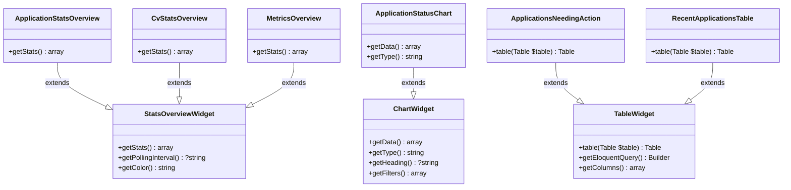
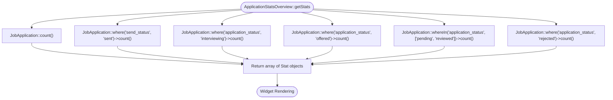
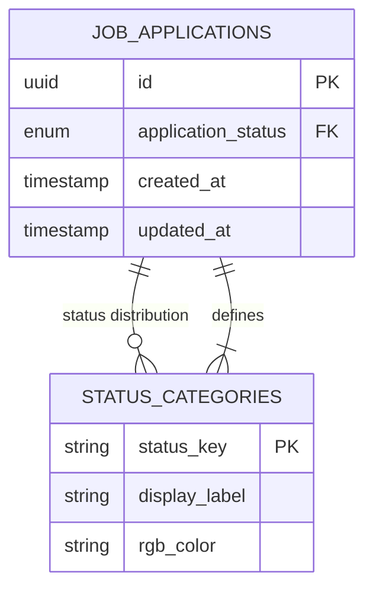
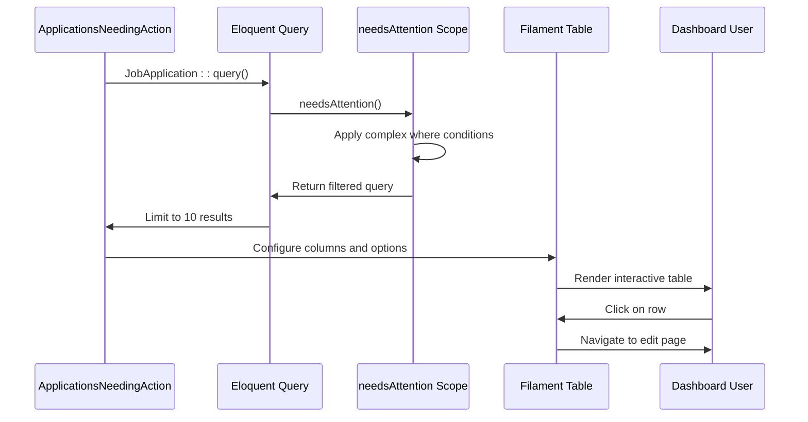
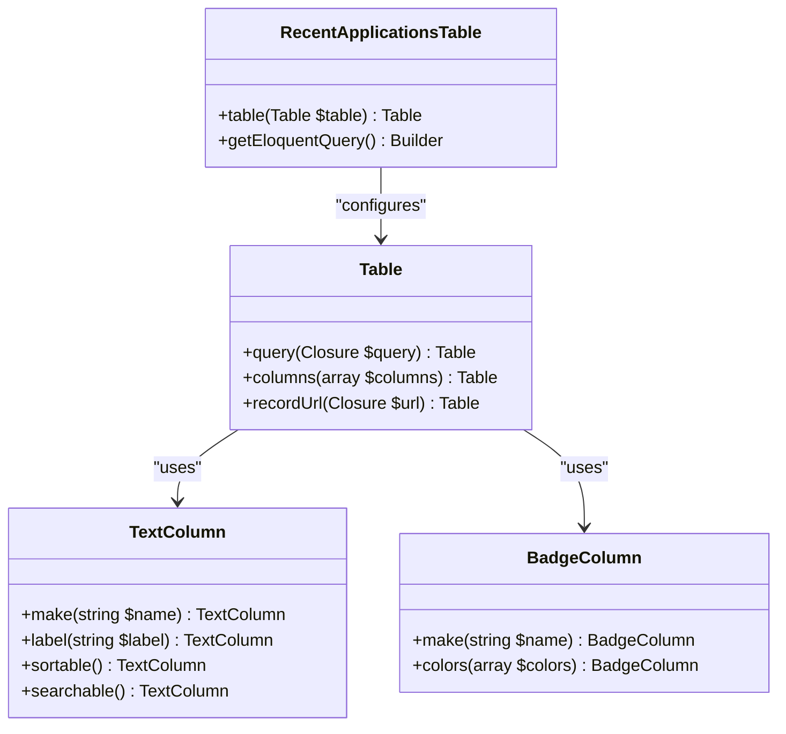
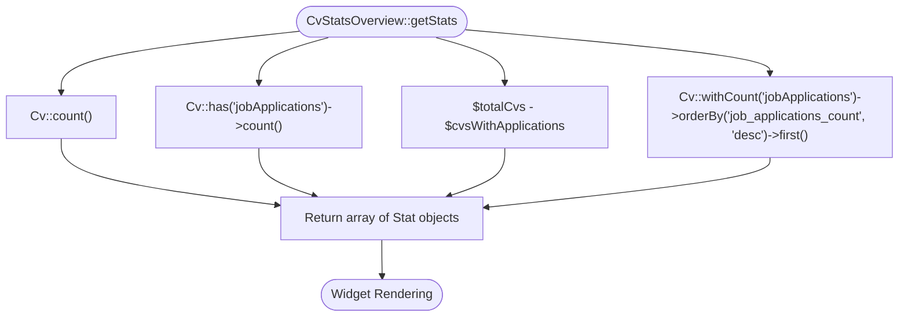
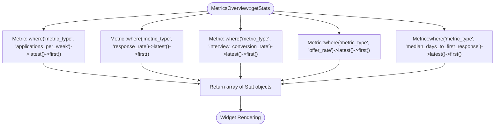
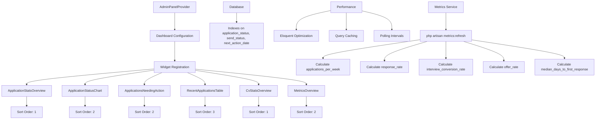

# Dashboard Widgets

<cite>
**Referenced Files in This Document**   
- [ApplicationStatsOverview.php](file://app/Filament/Widgets/ApplicationStatsOverview.php) - *Added in initial implementation*
- [ApplicationStatusChart.php](file://app/Filament/Widgets/ApplicationStatusChart.php) - *Added in initial implementation*
- [ApplicationsNeedingAction.php](file://app/Filament/Widgets/ApplicationsNeedingAction.php) - *Added in initial implementation*
- [RecentApplicationsTable.php](file://app/Filament/Widgets/RecentApplicationsTable.php) - *Added in initial implementation*
- [CvStatsOverview.php](file://app/Filament/Widgets/CvStatsOverview.php) - *Added in initial implementation*
- [MetricsOverview.php](file://app/Filament/Widgets/MetricsOverview.php) - *Added in recent commit*
- [JobApplication.php](file://app/Models/JobApplication.php) - *Added in initial implementation*
- [Cv.php](file://app/Models/Cv.php) - *Added in initial implementation*
- [AdminPanelProvider.php](file://app/Providers/Filament/AdminPanelProvider.php) - *Added in initial implementation*
- [MetricsCalculationService.php](file://app/Services/MetricsCalculationService.php) - *Added in recent commit*
</cite>

## Update Summary
- **Changes Made**: Added documentation for the new MetricsOverview widget that displays calculated performance metrics on the dashboard
- **New Sections Added**: Metrics Overview Widget section
- **Deprecated/Removed Sections**: None
- **Source Tracking System Updates**: Added new source files for MetricsOverview.php and MetricsCalculationService.php with update annotations

## Table of Contents
1. [Introduction](#introduction)
2. [Core Widgets Overview](#core-widgets-overview)
3. [Application Statistics Widget](#application-statistics-widget)
4. [Application Status Chart Widget](#application-status-chart-widget)
5. [Applications Needing Action Widget](#applications-needing-action-widget)
6. [Recent Applications Table Widget](#recent-applications-table-widget)
7. [CV Statistics Widget](#cv-statistics-widget)
8. [Metrics Overview Widget](#metrics-overview-widget)
9. [Widget Integration and Performance](#widget-integration-and-performance)
10. [Conclusion](#conclusion)

## Introduction
The Filament dashboard widgets provide a comprehensive overview of job application and CV management activities within the CV Builder application. These widgets are designed to deliver actionable insights through visual metrics, charts, and tables that help users track their job search progress and optimize their application strategy. The widgets are integrated into the admin dashboard and leverage Laravel's Eloquent ORM for efficient data querying.

**Section sources**
- [AdminPanelProvider.php](file://app/Providers/Filament/AdminPanelProvider.php#L21-L56)

## Core Widgets Overview
The dashboard features six core widgets that extend Filament's base widget classes to provide specialized functionality. The ApplicationStatsOverview, CvStatsOverview, and MetricsOverview widgets extend `Filament\Widgets\StatsOverviewWidget` to display key metrics, while ApplicationStatusChart extends `Filament\Widgets\ChartWidget` for data visualization. ApplicationsNeedingAction and RecentApplicationsTable extend `Filament\Widgets\TableWidget` to present tabular data with interactive features.

**Diagram sources**
- [ApplicationStatsOverview.php](file://app/Filament/Widgets/ApplicationStatsOverview.php#L1-L52)
- [CvStatsOverview.php](file://app/Filament/Widgets/CvStatsOverview.php#L1-L47)
- [MetricsOverview.php](file://app/Filament/Widgets/MetricsOverview.php#L8-L70) - *Added in recent commit*
- [ApplicationStatusChart.php](file://app/Filament/Widgets/ApplicationStatusChart.php#L1-L66)
- [ApplicationsNeedingAction.php](file://app/Filament/Widgets/ApplicationsNeedingAction.php#L1-L49)
- [RecentApplicationsTable.php](file://app/Filament/Widgets/RecentApplicationsTable.php#L1-L60)

**Section sources**
- [ApplicationStatsOverview.php](file://app/Filament/Widgets/ApplicationStatsOverview.php#L1-L52)
- [CvStatsOverview.php](file://app/Filament/Widgets/CvStatsOverview.php#L1-L47)
- [MetricsOverview.php](file://app/Filament/Widgets/MetricsOverview.php#L8-L70) - *Added in recent commit*
- [ApplicationStatusChart.php](file://app/Filament/Widgets/ApplicationStatusChart.php#L1-L66)
- [ApplicationsNeedingAction.php](file://app/Filament/Widgets/ApplicationsNeedingAction.php#L1-L49)
- [RecentApplicationsTable.php](file://app/Filament/Widgets/RecentApplicationsTable.php#L1-L60)

## Application Statistics Widget

The ApplicationStatsOverview widget displays key metrics related to job applications, providing users with a quick snapshot of their application status. It extends `Filament\Widgets\StatsOverviewWidget` and implements the `getStats()` method to define six distinct metrics: total applications, sent applications, interviewing count, offers received, pending responses, and rejections.

Each metric is defined using the `Stat` class, which allows for customization of appearance through color coding and icon selection. The widget queries the JobApplication model using Eloquent's count method to calculate each metric. The color property uses Filament's color system with values like 'primary', 'success', 'info', 'warning', 'gray', and 'danger' to provide visual differentiation.

**Diagram sources**
- [ApplicationStatsOverview.php](file://app/Filament/Widgets/ApplicationStatsOverview.php#L1-L52)

**Section sources**
- [ApplicationStatsOverview.php](file://app/Filament/Widgets/ApplicationStatsOverview.php#L1-L52)
- [JobApplication.php](file://app/Models/JobApplication.php#L1-L66)

## Application Status Chart Widget

The ApplicationStatusChart widget visualizes the distribution of job applications across different application statuses using a doughnut chart. It extends `Filament\Widgets\ChartWidget` and implements both `getData()` and `getType()` methods. The chart displays seven possible statuses: pending, reviewed, interviewing, offered, rejected, accepted, and withdrawn.

The implementation uses Eloquent with DB facade to group applications by status and count occurrences. It then maps these counts to predefined labels and filters out zero-value categories. The chart uses custom RGB colors for each status category to maintain visual consistency across the application. The widget is configured with a heading "Application Status Breakdown" and has a sort order of 2, determining its position on the dashboard.

**Diagram sources**
- [ApplicationStatusChart.php](file://app/Filament/Widgets/ApplicationStatusChart.php#L1-L66)
- [JobApplication.php](file://app/Models/JobApplication.php#L1-L66)

**Section sources**
- [ApplicationStatusChart.php](file://app/Filament/Widgets/ApplicationStatusChart.php#L1-L66)
- [JobApplication.php](file://app/Models/JobApplication.php#L1-L66)

## Applications Needing Action Widget

The ApplicationsNeedingAction widget identifies job applications that require user attention by surfacing pending follow-ups. It extends `Filament\Widgets\TableWidget` and leverages a custom Eloquent scope `needsAttention()` defined in the JobApplication model. The widget displays a table with columns for company name, job title, application status, and next action date.

The table implementation uses Filament's Table component with several column types: TextColumn for textual data and BadgeColumn for status indicators. The next action date column includes conditional coloring, displaying in danger (red) if the date is past due, and includes an "OVERDUE" description. The widget is configured to span the full width of the dashboard and shows a maximum of 10 records. When no applications need attention, it displays a custom empty state with a check-circle icon and encouraging message.

**Diagram sources**
- [ApplicationsNeedingAction.php](file://app/Filament/Widgets/ApplicationsNeedingAction.php#L1-L49)
- [JobApplication.php](file://app/Models/JobApplication.php#L47-L65)

**Section sources**
- [ApplicationsNeedingAction.php](file://app/Filament/Widgets/ApplicationsNeedingAction.php#L1-L49)
- [JobApplication.php](file://app/Models/JobApplication.php#L47-L65)

## Recent Applications Table Widget

The RecentApplicationsTable widget provides quick access to the latest job applications by displaying them in a tabular format. It extends `Filament\Widgets\TableWidget` and queries the JobApplication model with eager loading of the related CV model to avoid N+1 query problems. The table is limited to the 10 most recent applications based on creation date.

The implementation includes five columns: company name, CV used (displaying the CV title), send status, application status, and applied date. Both send status and application status use BadgeColumn with color coding based on their values. The applied date column formats the timestamp using the "M j, Y" format for readability. The widget spans the full width of the dashboard and has a sort order of 3, positioning it below other widgets.

**Diagram sources**
- [RecentApplicationsTable.php](file://app/Filament/Widgets/RecentApplicationsTable.php#L1-L60)
- [JobApplication.php](file://app/Models/JobApplication.php#L1-L66)

**Section sources**
- [RecentApplicationsTable.php](file://app/Filament/Widgets/RecentApplicationsTable.php#L1-L60)
- [JobApplication.php](file://app/Models/JobApplication.php#L1-L66)

## CV Statistics Widget

The CvStatsOverview widget tracks CV usage and version statistics, providing insights into how CVs are being utilized in job applications. It extends `Filament\Widgets\StatsOverviewWidget` and calculates four key metrics: total CVs, CVs in use (those with associated job applications), unused CVs, and the most used CV.

The implementation leverages Eloquent relationships to count CVs with applications using the `has()` method. For the most used CV metric, it uses `withCount()` to include the job applications count in the query and orders by this count in descending order. The widget displays the most used CV as a formatted string showing both the CV title and the number of applications. Each metric includes a descriptive icon from the Heroicons library to enhance visual recognition.

**Diagram sources**
- [CvStatsOverview.php](file://app/Filament/Widgets/CvStatsOverview.php#L1-L47)
- [Cv.php](file://app/Models/Cv.php#L1-L221)

**Section sources**
- [CvStatsOverview.php](file://app/Filament/Widgets/CvStatsOverview.php#L1-L47)
- [Cv.php](file://app/Models/Cv.php#L1-L221)

## Metrics Overview Widget

The MetricsOverview widget displays calculated performance metrics for job application activities, providing users with insights into their application effectiveness. It extends `Filament\Widgets\StatsOverviewWidget` and implements the `getStats()` method to define five key performance indicators: applications per week, response rate, interview conversion rate, offer rate, and median days to first response.

Each metric is retrieved from the Metric model, which stores pre-calculated values updated by the MetricsCalculationService. The widget queries the latest value for each metric type using the `latest('time_period_start')` scope. The description for each metric includes contextual information about the data period and when it was last refreshed, using Laravel's `diffForHumans()` method for readable timestamps.

The implementation uses the `Stat` class to define each metric with appropriate formatting, icons, and colors. Numeric values are formatted with percentage signs where applicable, and decimal values are rounded for readability. The widget is configured with a sort order of 2, positioning it prominently on the dashboard.

**Diagram sources**
- [MetricsOverview.php](file://app/Filament/Widgets/MetricsOverview.php#L8-L70) - *Added in recent commit*
- [MetricsCalculationService.php](file://app/Services/MetricsCalculationService.php#L7-L169) - *Added in recent commit*

**Section sources**
- [MetricsOverview.php](file://app/Filament/Widgets/MetricsOverview.php#L8-L70) - *Added in recent commit*
- [MetricsCalculationService.php](file://app/Services/MetricsCalculationService.php#L7-L169) - *Added in recent commit*

## Widget Integration and Performance

All dashboard widgets are registered in the AdminPanelProvider class, which configures the Filament admin panel. The widgets are discovered automatically from the app/Filament/Widgets directory and explicitly registered in the panel configuration. This ensures they appear on the dashboard in the specified sort order.

Performance considerations include the use of database indexing on frequently queried columns such as application_status, send_status, and next_action_date. The widgets implement efficient Eloquent queries with appropriate constraints to prevent performance degradation with large datasets. For widgets displaying aggregated data, the queries are optimized to retrieve only necessary information.

Caching strategies can be applied to improve performance, particularly for widgets that display frequently accessed but infrequently changing data. The StatsOverviewWidget base class supports polling intervals through the `getPollingInterval()` method, allowing for periodic updates without requiring full page refreshes. For large datasets, additional optimization techniques such as query caching, database indexing, and pagination can be implemented to maintain responsive dashboard performance.

The MetricsCalculationService runs periodically (via scheduled artisan command) to calculate and store metrics in the database, preventing expensive calculations on each dashboard load. This service calculates metrics over a rolling 30-day period, including applications per week, response rate, interview conversion rate, offer rate, and median days to first response.

**Diagram sources**
- [AdminPanelProvider.php](file://app/Providers/Filament/AdminPanelProvider.php#L21-L56)
- [JobApplication.php](file://app/Models/JobApplication.php#L1-L66)
- [database/migrations/2025_10_03_224900_create_job_applications_table.php)
- [database/migrations/2025_10_04_002540_extend_job_applications_table.php)
- [MetricsCalculationService.php](file://app/Services/MetricsCalculationService.php#L7-L169) - *Added in recent commit*

**Section sources**
- [AdminPanelProvider.php](file://app/Providers/Filament/AdminPanelProvider.php#L21-L56)
- [config/cache.php](file:///config/cache.php#L1-L110)
- [MetricsCalculationService.php](file://app/Services/MetricsCalculationService.php#L7-L169) - *Added in recent commit*

## Conclusion
The Filament dashboard widgets provide a comprehensive monitoring solution for job application and CV management activities. By extending Filament's widget system, these components deliver actionable insights through well-designed metrics, charts, and tables. The implementation leverages Eloquent ORM for efficient data retrieval and follows Laravel best practices for code organization and performance optimization. The widgets are integrated into the admin dashboard through the AdminPanelProvider configuration, ensuring they are available to users immediately upon login. With proper caching strategies and database indexing, these widgets can scale effectively to handle large datasets while maintaining responsive performance. The addition of the MetricsOverview widget enhances the dashboard by providing calculated performance metrics that help users evaluate the effectiveness of their job search strategy.