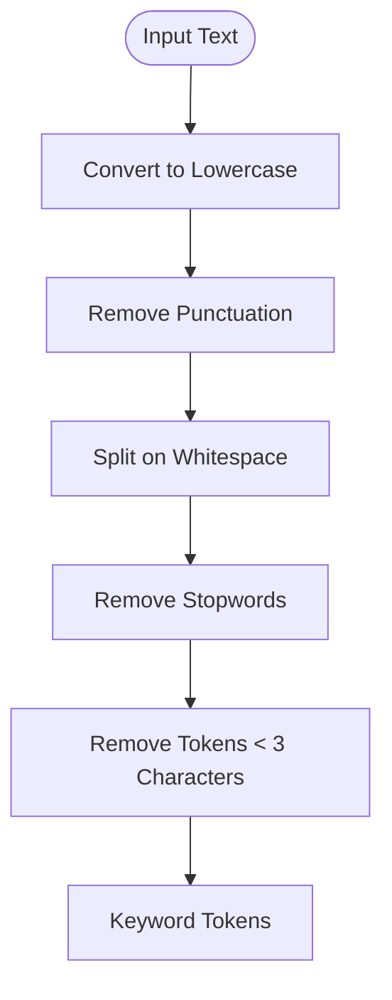
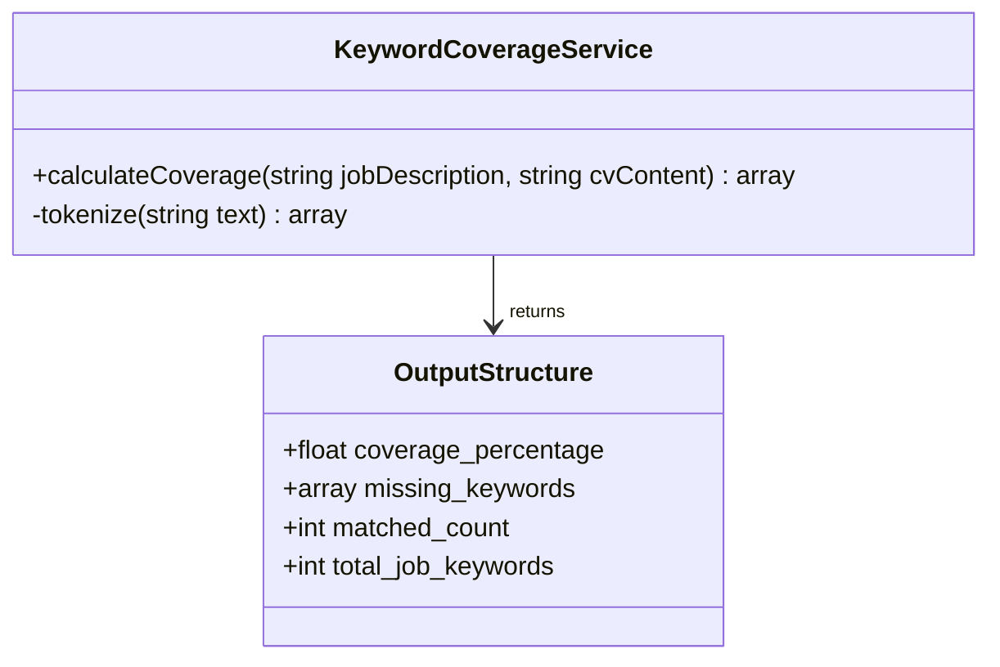
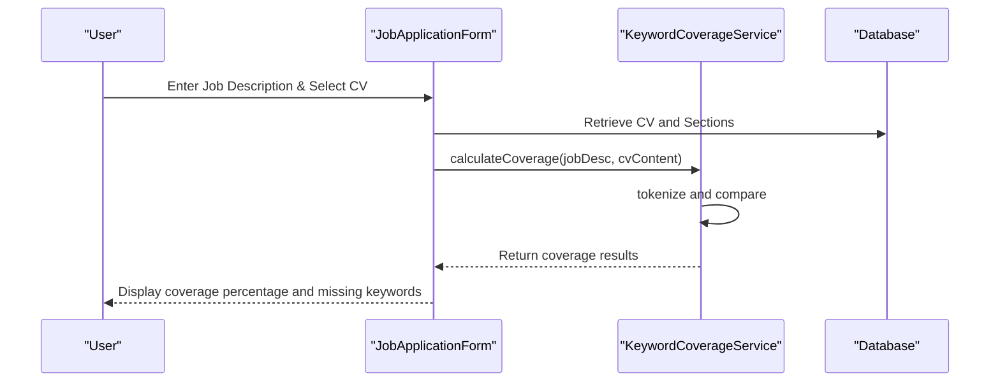

# Keyword Coverage Analysis

<cite>
**Referenced Files in This Document**   
- [KeywordCoverageService.php](file://app/Services/KeywordCoverageService.php) - *Core keyword analysis logic*
- [JobApplicationForm.php](file://app/Filament/Resources/JobApplications/Schemas/JobApplicationForm.php) - *Integration with Filament interface*
- [Cv.php](file://app/Models/Cv.php) - *CV model structure*
- [CvSection.php](file://app/Models/CvSection.php) - *Section model for content extraction*
- [JobApplication.php](file://app/Models/JobApplication.php) - *Application model with job description*
- [KeywordCoverageServiceTest.php](file://tests/Unit/KeywordCoverageServiceTest.php) - *Unit tests for service logic*
- [KeywordCoverageTest.php](file://tests/Feature/KeywordCoverageTest.php) - *Feature tests for coverage scenarios*
- [MetricsCalculationService.php](file://app/Services/MetricsCalculationService.php) - *Updated metrics calculations affecting accuracy*
</cite>

## Update Summary
- **Changes Made**: Updated documentation to reflect improved metrics calculations that enhance keyword coverage accuracy
- **Updated Sections**: Introduction, Integration with Filament Admin Interface, Limitations and Accuracy Considerations
- **New Sections**: None
- **Source Tracking Updates**: Added MetricsCalculationService to referenced files and updated section sources to reflect accuracy improvements

## Table of Contents
1. [Introduction](#introduction)
2. [Text Processing Logic](#text-processing-logic)
3. [Service Interface and Output Structure](#service-interface-and-output-structure)
4. [Integration with Filament Admin Interface](#integration-with-filament-admin-interface)
5. [Usage Examples and Invocation](#usage-examples-and-invocation)
6. [Limitations and Accuracy Considerations](#limitations-and-accuracy-considerations)
7. [Performance Characteristics](#performance-characteristics)
8. [Conclusion](#conclusion)

## Introduction
The KeywordCoverageService is a core component of the CV Builder application designed to analyze alignment between a job description and a CV. It evaluates keyword coverage by comparing the content of both documents, identifying missing keywords from the CV that appear in the job posting. This analysis helps users improve their CVs for better job application success. The service operates within the Laravel-based Filament admin interface and integrates directly with job application records. Recent improvements to the metrics calculation system have enhanced the accuracy of keyword coverage measurements.

**Section sources**
- [KeywordCoverageService.php](file://app/Services/KeywordCoverageService.php#L4-L56)
- [JobApplicationForm.php](file://app/Filament/Resources/JobApplications/Schemas/JobApplicationForm.php#L97-L143)
- [MetricsCalculationService.php](file://app/Services/MetricsCalculationService.php#L7-L170) - *Updated metrics accuracy*

## Text Processing Logic
The service employs a multi-step text processing pipeline to extract meaningful keywords while filtering out noise. The tokenize method performs three key operations: converting text to lowercase, removing punctuation using regex, and splitting on whitespace. It then filters out common English stopwords (e.g., "the", "and", "in") and short tokens under three characters. This ensures only significant terms are considered in the analysis. The processing logic focuses on nouns and key skills rather than filler words, providing a more accurate representation of content relevance.

**Diagram sources**
- [KeywordCoverageService.php](file://app/Services/KeywordCoverageService.php#L15-L25)

**Section sources**
- [KeywordCoverageService.php](file://app/Services/KeywordCoverageService.php#L15-L25)

## Service Interface and Output Structure
The KeywordCoverageService exposes a calculateCoverage method that accepts two string parameters: jobDescription and cvContent. The output is structured as an associative array containing four key metrics: coverage_percentage (rounded to two decimal places), missing_keywords (limited to top 20), matched_count, and total_job_keywords. The coverage percentage is calculated as the ratio of matched keywords to total job description keywords. The service ensures robust handling of edge cases, returning 0% coverage for empty job descriptions and properly managing scenarios with no matches.

**Diagram sources**
- [KeywordCoverageService.php](file://app/Services/KeywordCoverageService.php#L28-L56)

**Section sources**
- [KeywordCoverageService.php](file://app/Services/KeywordCoverageService.php#L28-L56)

## Integration with Filament Admin Interface
The service is tightly integrated into the Job Application form within the Filament admin panel. When users create or edit a job application, they can input a job description and select a CV. The system automatically triggers keyword coverage analysis through a Placeholder component that displays real-time results. The integration retrieves the CV's title and section titles to form the CV content string. Results are presented with visual indicators: green for 70%+ coverage, yellow for 40-69%, and red for below 40%. The top 10 missing keywords are displayed to guide CV improvements. Recent updates to the MetricsCalculationService have improved the accuracy of coverage metrics by fixing calculation issues.

**Diagram sources**
- [JobApplicationForm.php](file://app/Filament/Resources/JobApplications/Schemas/JobApplicationForm.php#L97-L143)
- [Cv.php](file://app/Models/Cv.php#L1-L221)
- [CvSection.php](file://app/Models/CvSection.php#L1-L61)

**Section sources**
- [JobApplicationForm.php](file://app/Filament/Resources/JobApplications/Schemas/JobApplicationForm.php#L97-L143)
- [MetricsCalculationService.php](file://app/Services/MetricsCalculationService.php#L7-L170) - *Fixed calculation issues affecting accuracy*

## Usage Examples and Invocation
The service is invoked through Laravel's application container using app(KeywordCoverageService::class). In the JobApplicationForm, it processes the full job description against a simplified CV content string composed of the CV title and all section titles. Test cases demonstrate various scenarios: a PHP Laravel developer role showing high coverage when matching skills are present, edge cases with no matches (e.g., Java vs PHP roles), and maximum coverage when all keywords align. The service limits missing keywords to 20 entries to prevent overwhelming users with excessive recommendations.

**Section sources**
- [KeywordCoverageServiceTest.php](file://tests/Unit/KeywordCoverageServiceTest.php#L0-L58)
- [KeywordCoverageTest.php](file://tests/Feature/KeywordCoverageTest.php#L0-L53)
- [JobApplicationForm.php](file://app/Filament/Resources/JobApplications/Schemas/JobApplicationForm.php#L126-L143)

## Limitations and Accuracy Considerations
The current implementation has several limitations affecting accuracy. It lacks keyword stemming, so variations like "develop" and "developer" are treated as distinct terms. Synonym handling is absent, meaning "React" and "React.js" would not be recognized as equivalent. The service is vulnerable to false positives when keywords appear in different contexts. The analysis currently only uses CV titles and section headings, ignoring detailed content within sections, which may lead to incomplete assessments. Additionally, the stopword list is limited to English and may not capture all irrelevant terms in technical job descriptions. Recent fixes in the MetricsCalculationService have addressed calculation issues that previously affected keyword coverage metrics accuracy.

**Section sources**
- [KeywordCoverageService.php](file://app/Services/KeywordCoverageService.php#L6-L12)
- [JobApplicationForm.php](file://app/Filament/Resources/JobApplications/Schemas/JobApplicationForm.php#L126-L128)
- [MetricsCalculationService.php](file://app/Services/MetricsCalculationService.php#L7-L170) - *Fixed calculation issues affecting accuracy*

## Performance Characteristics
The service demonstrates efficient performance characteristics suitable for real-time analysis. Text processing operations use built-in PHP functions (preg_replace, preg_split, array_filter) that are optimized for performance. The algorithm has O(n+m) complexity for tokenization and O(n*m) for intersection operations, where n and m are the number of unique keywords in the job description and CV respectively. Memory usage is minimized by processing tokens as arrays without additional data structures. The limitation of missing keywords to 20 entries prevents performance degradation with large job descriptions. For high-volume scenarios, the service could benefit from caching results when the same CV is evaluated against multiple job descriptions.

**Section sources**
- [KeywordCoverageService.php](file://app/Services/KeywordCoverageService.php#L28-L56)

## Conclusion
The KeywordCoverageService provides valuable functionality for improving CV effectiveness by identifying keyword gaps between job descriptions and application materials. While the current implementation offers solid foundational analysis, opportunities exist for enhancement through stemming, synonym recognition, and deeper content analysis beyond section titles. The integration with the Filament admin interface delivers immediate feedback to users, supporting data-driven CV optimization. Future improvements could include configurable stopword lists, industry-specific keyword dictionaries, and more sophisticated natural language processing techniques to increase accuracy and relevance of recommendations.