# Architecture & Design

<cite>
**Referenced Files in This Document**   
- [PdfSnapshotService.php](file://app/Services/PdfSnapshotService.php)
- [KeywordCoverageService.php](file://app/Services/KeywordCoverageService.php)
- [JobApplicationObserver.php](file://app/Observers/JobApplicationObserver.php)
- [ApplicationEventObserver.php](file://app/Observers/ApplicationEventObserver.php) - *Updated in recent commit*
- [MetricsCalculationService.php](file://app/Services/MetricsCalculationService.php) - *Updated in recent commit*
- [AdminPanelProvider.php](file://app/Providers/Filament/AdminPanelProvider.php)
- [AppServiceProvider.php](file://app/Providers/AppServiceProvider.php)
- [CvPdfController.php](file://app/Http/Controllers/CvPdfController.php)
- [CVVersionResource.php](file://app/Filament/Resources/CVVersions/CVVersionResource.php) - *Updated in recent commit*
- [CvResource.php](file://app/Filament/Resources/Cvs/CvResource.php) - *Updated in recent commit*
- [JobApplicationResource.php](file://app/Filament/Resources/JobApplications/JobApplicationResource.php)
- [PDFSnapshotResource.php](file://app/Filament/Resources/PDFSnapshots/PDFSnapshotResource.php)
- [ApplicationEventResource.php](file://app/Filament/Resources/JobApplications/RelationManagers/EventsRelationManager.php)
- [web.php](file://routes/web.php)
- [console.php](file://routes/console.php)
- [filesystems.php](file://config/filesystems.php)
- [cache.php](file://config/cache.php)
</cite>

## Update Summary
**Changes Made**   
- Updated ApplicationEventObserver documentation to reflect use of saveQuietly() to prevent infinite loops
- Updated MetricsCalculationService documentation to reflect division by zero prevention in metrics calculations
- Updated Filament resource navigation icons and labels for CV and CV Versions resources
- Added details about UI/UX improvements in Filament navigation
- Updated dependency analysis to reflect observer pattern implementation details
- Enhanced troubleshooting guide with new observer-specific issues

## Table of Contents
1. [Introduction](#introduction)
2. [Project Structure](#project-structure)
3. [Core Components](#core-components)
4. [Architecture Overview](#architecture-overview)
5. [Detailed Component Analysis](#detailed-component-analysis)
6. [Dependency Analysis](#dependency-analysis)
7. [Performance Considerations](#performance-considerations)
8. [Troubleshooting Guide](#troubleshooting-guide)
9. [Conclusion](#conclusion)

## Introduction
The CV Builder application is a Laravel MVC application designed to help users manage CVs and job applications efficiently. It features a service layer for business logic, a Filament admin panel for CRUD operations, and implements several architectural patterns including Service, Observer, Repository, and MVC. The system supports PDF snapshot creation, keyword coverage analysis, CV versioning, and now includes comprehensive activity tracking and metrics calculation. This document outlines the high-level design, component interactions, service container configuration, infrastructure considerations, and extensibility points.

## Project Structure
The application follows a standard Laravel directory structure with additional Filament-specific directories for resources and widgets. The core components are organized into models, services, observers, and controllers. Filament resources provide the admin interface for managing CVs, job applications, and related entities. Configuration files define storage, caching, and other infrastructure settings.

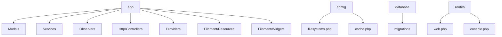

**Diagram sources**
- [app](file://app)
- [config](file://config)
- [database](file://database)
- [routes](file://routes)

**Section sources**
- [Project Structure](file://)

## Core Components
The application's core functionality revolves around managing CVs and job applications. Key components include service classes for PDF snapshot creation, keyword coverage analysis, and metrics calculation, observer classes for automatic behavior, and Filament resources for admin interface functionality. The system uses Eloquent models as repositories for data access and implements MVC patterns for request handling.

**Section sources**
- [PdfSnapshotService.php](file://app/Services/PdfSnapshotService.php)
- [KeywordCoverageService.php](file://app/Services/KeywordCoverageService.php)
- [JobApplicationObserver.php](file://app/Observers/JobApplicationObserver.php)
- [ApplicationEventObserver.php](file://app/Observers/ApplicationEventObserver.php)
- [MetricsCalculationService.php](file://app/Services/MetricsCalculationService.php)
- [CvPdfController.php](file://app/Http/Controllers/CvPdfController.php)

## Architecture Overview
The CV Builder application follows a layered architecture with clear separation of concerns. The Filament admin panel provides the user interface, controllers handle HTTP requests, services encapsulate business logic, and Eloquent models manage data persistence. The system uses the Service pattern for reusable business logic, the Observer pattern for event-driven behavior, and the Repository pattern through Eloquent models.

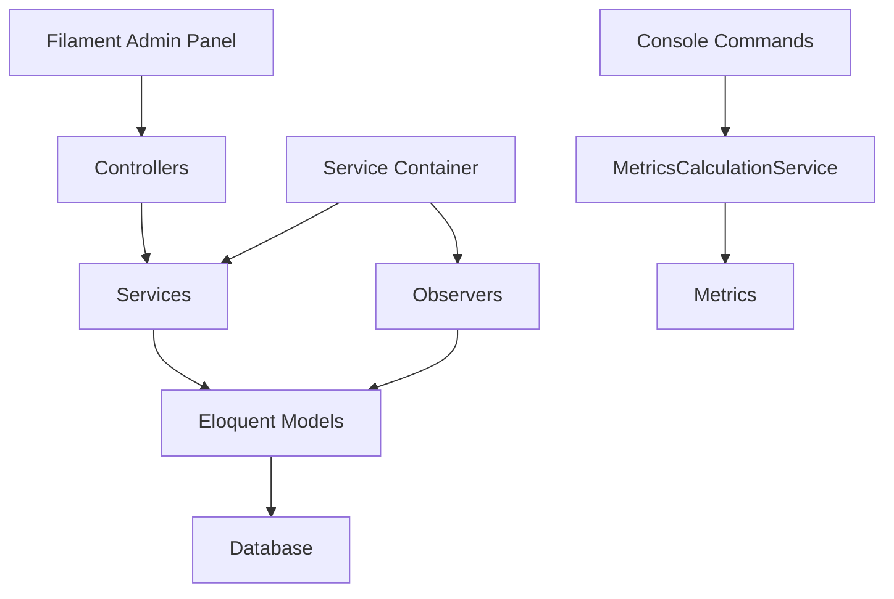

**Diagram sources**
- [AdminPanelProvider.php](file://app/Providers/Filament/AdminPanelProvider.php)
- [AppServiceProvider.php](file://app/Providers/AppServiceProvider.php)
- [CvPdfController.php](file://app/Http/Controllers/CvPdfController.php)
- [PdfSnapshotService.php](file://app/Services/PdfSnapshotService.php)
- [JobApplicationObserver.php](file://app/Observers/JobApplicationObserver.php)
- [ApplicationEventObserver.php](file://app/Observers/ApplicationEventObserver.php)
- [MetricsCalculationService.php](file://app/Services/MetricsCalculationService.php)
- [console.php](file://routes/console.php)

## Detailed Component Analysis

### Service Layer Analysis
The service layer contains business logic that is independent of the HTTP request cycle. Services are injected with dependencies through the Laravel service container and can be reused across different parts of the application.

#### PdfSnapshotService
This service creates PDF snapshots of CVs when job applications are marked as sent. It generates a PDF, calculates a SHA-256 hash, stores the file, and creates a database record with metadata.

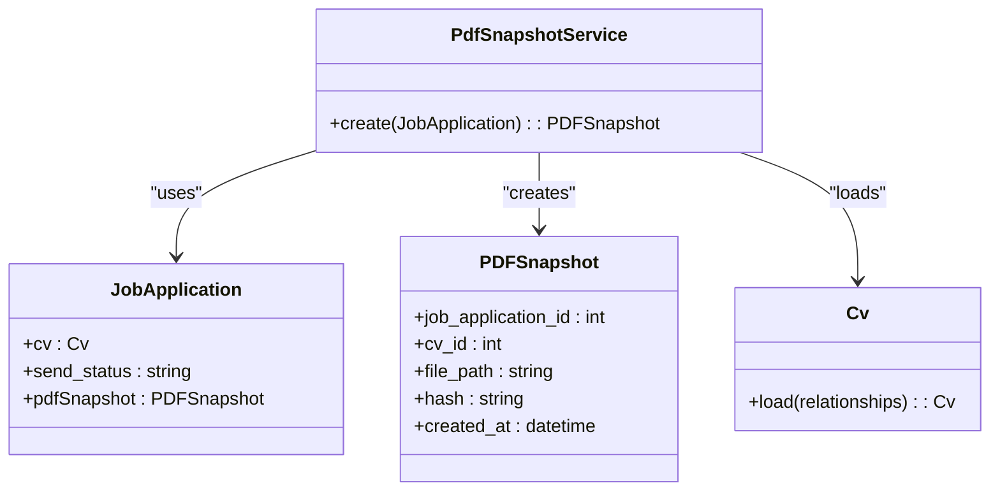

**Diagram sources**
- [PdfSnapshotService.php](file://app/Services/PdfSnapshotService.php)
- [JobApplication.php](file://app/Models/JobApplication.php)
- [PDFSnapshot.php](file://app/Models/PDFSnapshot.php)
- [Cv.php](file://app/Models/Cv.php)

#### KeywordCoverageService
This service analyzes job descriptions and CV content to calculate keyword coverage. It tokenizes text, removes stopwords, and compares keywords to identify gaps in the CV.

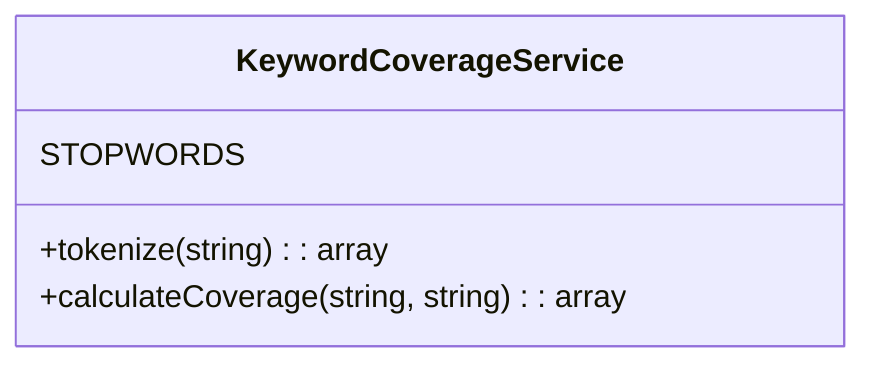

**Diagram sources**
- [KeywordCoverageService.php](file://app/Services/KeywordCoverageService.php)

#### MetricsCalculationService
This service calculates key performance metrics for job applications over specified time periods. It computes applications per week, response rate, interview conversion rate, offer rate, and median days to first response. The implementation includes safeguards against division by zero by using `max(1, ceil($days / 7))` for week calculation and checking `$totalActiveApplications > 0` before division operations.

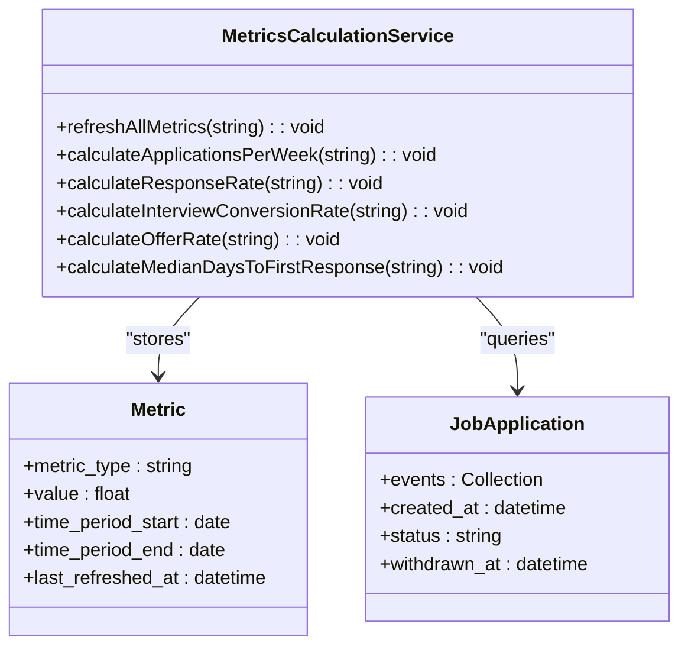

**Diagram sources**
- [MetricsCalculationService.php](file://app/Services/MetricsCalculationService.php)
- [Metric.php](file://app/Models/Metric.php)
- [JobApplication.php](file://app/Models/JobApplication.php)

### Observer Pattern Implementation
The observer pattern is used to automatically update timestamps and trigger business logic when models are modified.

#### JobApplicationObserver
This observer automatically updates timestamps and triggers PDF snapshot creation when job applications are modified.

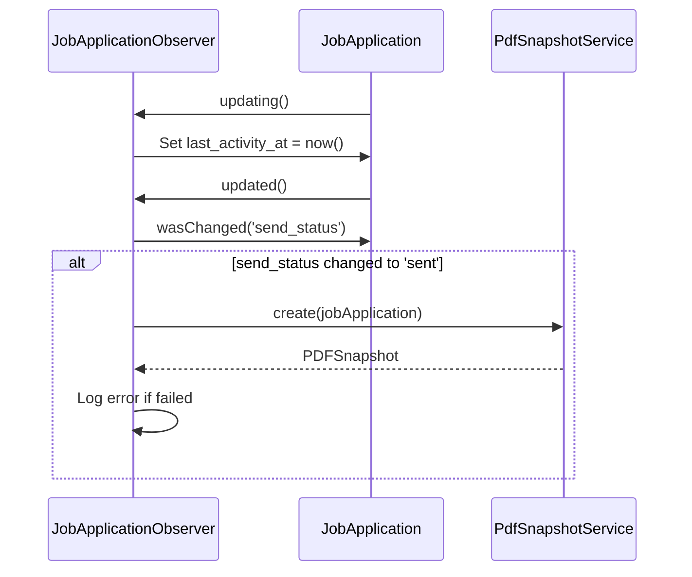

**Diagram sources**
- [JobApplicationObserver.php](file://app/Observers/JobApplicationObserver.php)
- [PdfSnapshotService.php](file://app/Services/PdfSnapshotService.php)

#### ApplicationEventObserver
This observer automatically updates the parent job application's last activity timestamp when a new application event is created. The implementation uses `saveQuietly()` to prevent infinite loops that could occur if updating the job application triggered additional observer events.

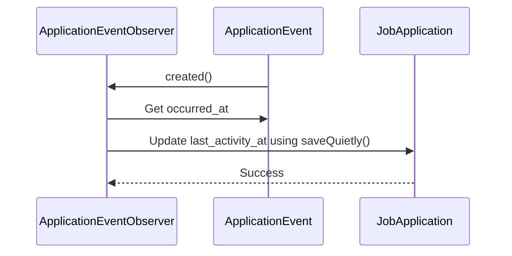

**Diagram sources**
- [ApplicationEventObserver.php](file://app/Observers/ApplicationEventObserver.php)
- [ApplicationEvent.php](file://app/Models/ApplicationEvent.php)
- [JobApplication.php](file://app/Models/JobApplication.php)

### Application Event System
The ApplicationEvent model tracks discrete occurrences in the job application lifecycle, providing a timeline of interactions with flexible metadata storage.

#### ApplicationEvent Model
The ApplicationEvent model represents specific events in the job application process with structured metadata.

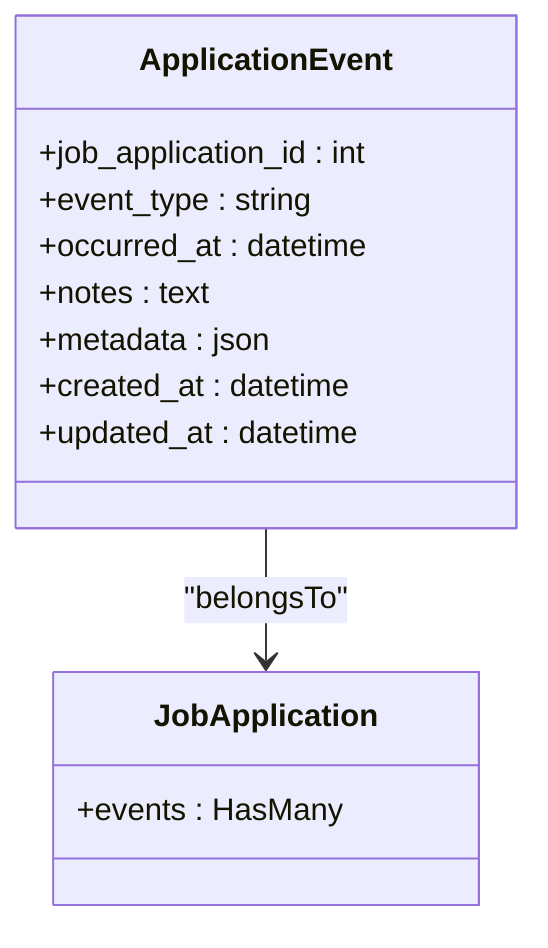

**Diagram sources**
- [ApplicationEvent.php](file://app/Models/ApplicationEvent.php)
- [JobApplication.php](file://app/Models/JobApplication.php)

#### EventsRelationManager
The EventsRelationManager provides a Filament interface for managing application events within the job application context.

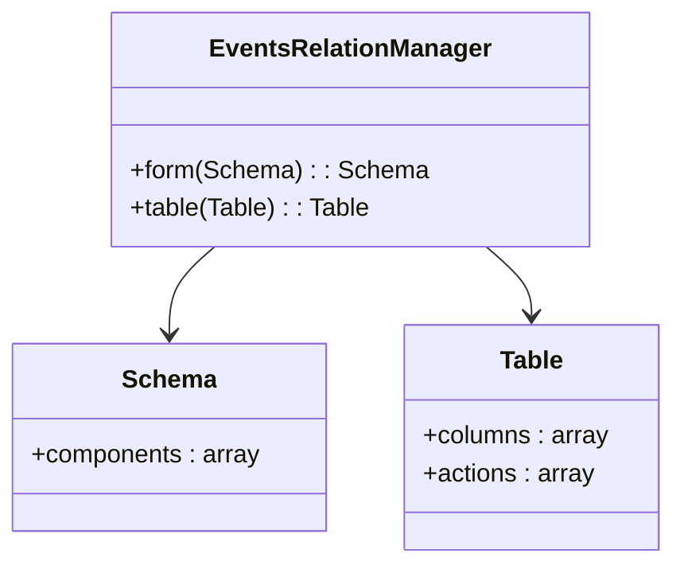

**Diagram sources**
- [EventsRelationManager.php](file://app/Filament/Resources/JobApplications/RelationManagers/EventsRelationManager.php)

### Metrics System
The metrics system provides quantitative insights into job application performance through scheduled calculation and storage of key metrics.

#### Metrics Calculation Flow
The metrics calculation process is triggered by a console command and runs on a daily schedule.

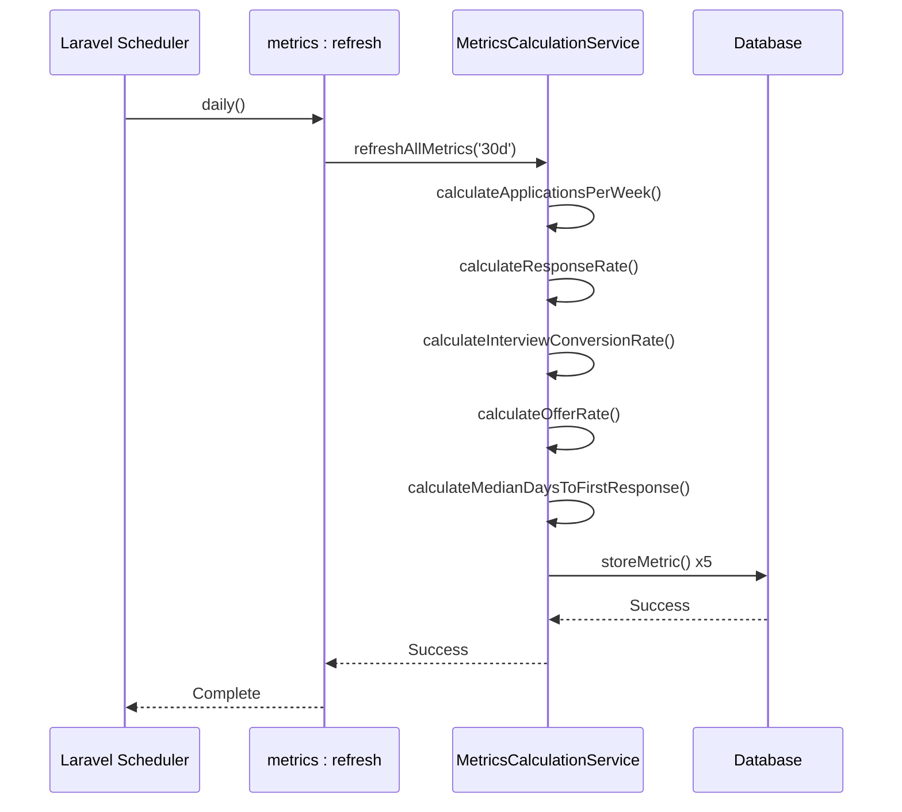

**Diagram sources**
- [console.php](file://routes/console.php)
- [MetricsCalculationService.php](file://app/Services/MetricsCalculationService.php)
- [Metric.php](file://app/Models/Metric.php)

### Filament Resource System
Filament resources abstract CRUD operations and provide a consistent admin interface. Each resource defines forms, tables, and pages for managing a specific model.

#### CV Resource
The CvResource manages CV entities with support for cloning and soft deletion. The navigation icon has been updated to Heroicon::OutlinedDocumentText for better clarity in the UI.

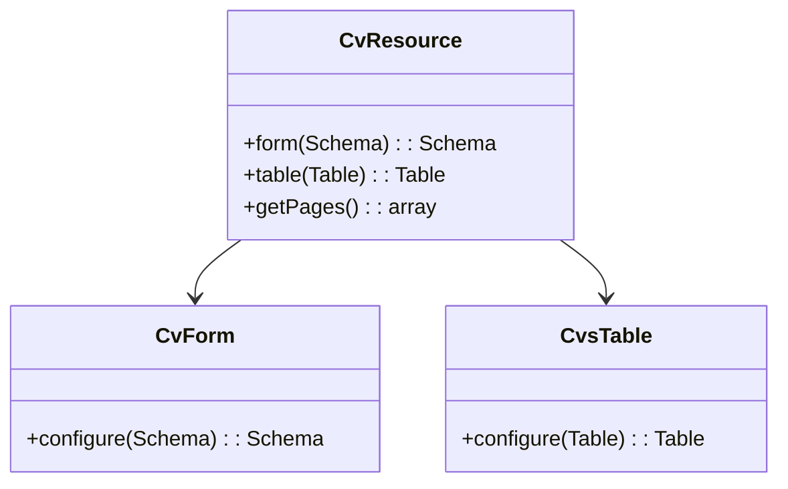

**Diagram sources**
- [CvResource.php](file://app/Filament/Resources/Cvs/CvResource.php)
- [CvForm.php](file://app/Filament/Resources/Cvs/Schemas/CvForm.php)
- [CvsTable.php](file://app/Filament/Resources/Cvs/Tables/CvsTable.php)

#### JobApplication Resource
The JobApplicationResource manages job applications with extended functionality for tracking status and next actions.

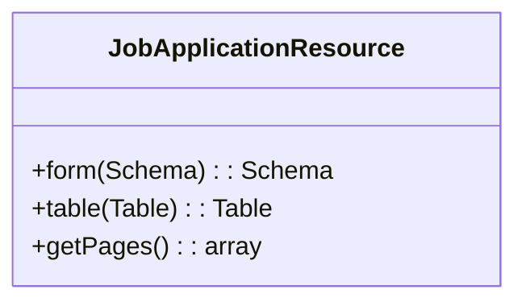

**Diagram sources**
- [JobApplicationResource.php](file://app/Filament/Resources/JobApplications/JobApplicationResource.php)

#### PDFSnapshot Resource
The PDFSnapshotResource provides read-only access to PDF snapshots with download and hash verification functionality.

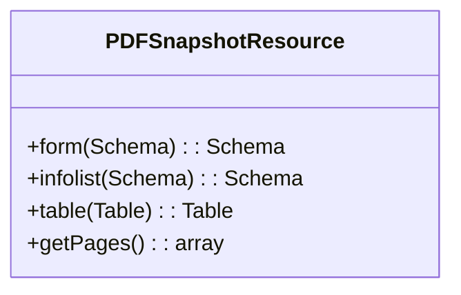

**Diagram sources**
- [PDFSnapshotResource.php](file://app/Filament/Resources/PDFSnapshots/PDFSnapshotResource.php)

#### CVVersion Resource
The CVVersionResource manages immutable snapshots of CVs created when cloning. The navigation icon has been updated to Heroicon::OutlinedDocumentDuplicate for better clarity in the UI.

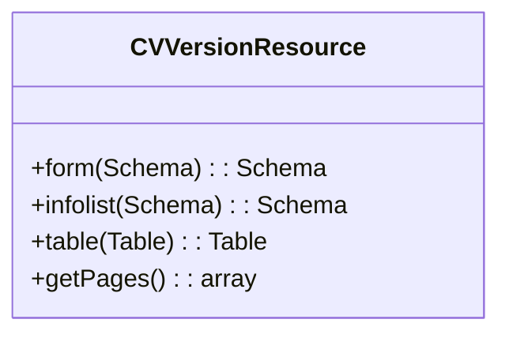

**Diagram sources**
- [CVVersionResource.php](file://app/Filament/Resources/CVVersions/CVVersionResource.php)

### Request Flow Analysis
The application follows standard Laravel MVC patterns for handling requests, with additional Filament-specific routing for the admin panel.

#### PDF Generation Request Flow
When a user requests a PDF download, the request flows through the router to the controller, which orchestrates PDF generation.

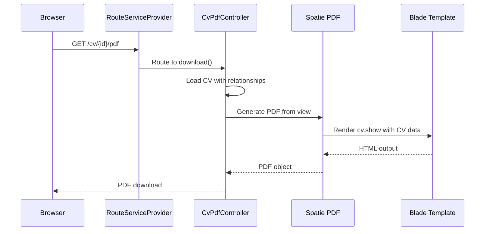

**Diagram sources**
- [web.php](file://routes/web.php)
- [CvPdfController.php](file://app/Http/Controllers/CvPdfController.php)
- [cv.show.blade.php](file://resources/views/cv/show.blade.php)

## Dependency Analysis
The application's components are loosely coupled through Laravel's service container and dependency injection. Services depend on models and external packages, while controllers depend on services. Observers are registered with models through the service provider. The ApplicationEventObserver uses saveQuietly() to prevent infinite loops, and the MetricsCalculationService includes safeguards against division by zero.

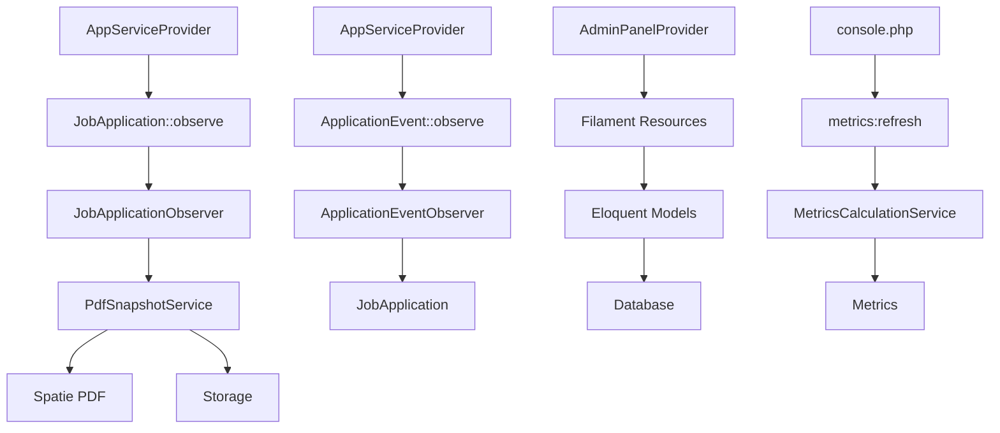

**Diagram sources**
- [AppServiceProvider.php](file://app/Providers/AppServiceProvider.php)
- [AdminPanelProvider.php](file://app/Providers/Filament/AdminPanelProvider.php)
- [PdfSnapshotService.php](file://app/Services/PdfSnapshotService.php)
- [ApplicationEventObserver.php](file://app/Observers/ApplicationEventObserver.php)
- [MetricsCalculationService.php](file://app/Services/MetricsCalculationService.php)
- [console.php](file://routes/console.php)

## Performance Considerations
The application uses several strategies to optimize performance:

- **Caching**: Configuration shows database cache store with table definition
- **Eager Loading**: Controllers and services use eager loading to prevent N+1 queries
- **Indexing**: Database migrations include indexes on frequently queried columns
- **File Storage**: Local disk storage configured for private file access
- **Scheduled Processing**: Metrics calculation runs daily via scheduler to avoid real-time computation
- **Efficient Queries**: Metrics calculations use optimized database queries with proper filtering

The system is designed to be stateless, allowing for horizontal scaling. PDF generation is handled synchronously but could be moved to queues for better performance under load. The metrics system uses a refresh strategy rather than real-time calculation to maintain performance.

**Section sources**
- [cache.php](file://config/cache.php)
- [filesystems.php](file://config/filesystems.php)
- [PdfSnapshotService.php](file://app/Services/PdfSnapshotService.php)
- [MetricsCalculationService.php](file://app/Services/MetricsCalculationService.php)
- [console.php](file://routes/console.php)

## Troubleshooting Guide
Common issues and their solutions:

- **PDF generation fails**: Check storage permissions and available disk space
- **Missing observer behavior**: Verify AppServiceProvider boot method registers observers
- **Filament resource not appearing**: Check AdminPanelProvider discovers resources
- **File not found errors**: Verify storage disk configuration and file paths
- **Metrics not updating**: Check that the scheduler is running and console command executes successfully
- **Application events not updating last_activity_at**: Verify ApplicationEventObserver is registered in AppServiceProvider and using saveQuietly() to prevent infinite loops
- **Division by zero in metrics**: Ensure time period calculations use max(1, ceil($days / 7)) and check for zero denominators in rate calculations

The application logs PDF snapshot creation failures and metrics calculation errors, which can be checked in the Laravel log files.

**Section sources**
- [JobApplicationObserver.php](file://app/Observers/JobApplicationObserver.php)
- [ApplicationEventObserver.php](file://app/Observers/ApplicationEventObserver.php)
- [AdminPanelProvider.php](file://app/Providers/Filament/AdminPanelProvider.php)
- [filesystems.php](file://config/filesystems.php)
- [MetricsCalculationService.php](file://app/Services/MetricsCalculationService.php)
- [console.php](file://routes/console.php)

## Conclusion
The CV Builder application implements a clean, maintainable architecture using Laravel's MVC pattern with additional service and observer patterns. The Filament admin panel provides a robust interface for data management, while the service layer encapsulates business logic for reusability. The system is designed with scalability in mind, using stateless operation and configurable caching. Security is addressed through proper file storage configuration and data integrity measures like PDF hash verification. The recent addition of the ApplicationEvent and Metrics systems enhances the application's capabilities for activity tracking and performance analysis. The architecture provides clear extensibility points for adding new features while maintaining separation of concerns. Recent improvements to the observer pattern implementation and metrics calculations demonstrate attention to edge cases and robustness, ensuring reliable operation in production environments.