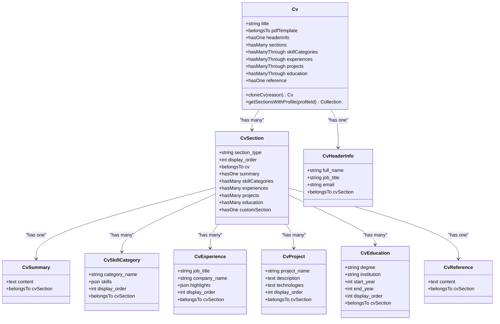

# Architecture & Design

<cite>
**Referenced Files in This Document**   
- [CvReviewService.php](file://app/Services/CvReviewService.php)
- [PdfSnapshotService.php](file://app/Services/PdfSnapshotService.php)
- [KeywordCoverageService.php](file://app/Services/KeywordCoverageService.php)
- [MetricsCalculationService.php](file://app/Services/MetricsCalculationService.php)
- [Cv.php](file://app/Models/Cv.php)
- [JobApplication.php](file://app/Models/JobApplication.php)
- [PDFSnapshot.php](file://app/Models/PDFSnapshot.php)
- [PdfTemplate.php](file://app/Models/PdfTemplate.php)
- [CvResource.php](file://app/Filament/Resources/Cvs/CvResource.php)
- [JobApplicationResource.php](file://app/Filament/Resources/JobApplications/JobApplicationResource.php)
- [CvPdfController.php](file://app/Http/Controllers/CvPdfController.php)
- [config/services.php](file://config/services.php)
- [config/filesystems.php](file://config/filesystems.php)
- [pdf.blade.php](file://resources/views/cv/pdf.blade.php)
</cite>

## Table of Contents
1. [Introduction](#introduction)
2. [Project Structure](#project-structure)
3. [Core Components](#core-components)
4. [Architecture Overview](#architecture-overview)
5. [Detailed Component Analysis](#detailed-component-analysis)
6. [Dependency Analysis](#dependency-analysis)
7. [Performance Considerations](#performance-considerations)
8. [Troubleshooting Guide](#troubleshooting-guide)
9. [Conclusion](#conclusion)

## Introduction
The cv-builder application is a Laravel-based productivity tool designed to streamline the job application process through structured CV management, application tracking, and AI-powered optimization. The system follows the MVC pattern enhanced with a dedicated service layer for business logic separation and leverages Filament as an admin interface for CRUD operations. Key architectural patterns include the Service Pattern for encapsulating business logic, the Observer Pattern for model lifecycle events, and the Repository Pattern via Eloquent ORM. The application integrates with external services like OpenAI for CV analysis and uses Spatie Laravel-PDF for document generation. This documentation provides a comprehensive overview of the system's architecture, component interactions, data flow, and design decisions.

## Project Structure
The application follows a standard Laravel directory structure with domain-specific organization. The `app` directory contains core components including Models, Services, Observers, and Filament Resources. Models in `app/Models` represent database entities with Eloquent relationships. Services in `app/Services` encapsulate business logic such as CV review, PDF generation, and metrics calculation. The `app/Filament/Resources` directory contains Filament resource classes that define admin interface behavior for each model. The `database/migrations` directory contains schema definitions with incremental versioning. The `resources/views` directory contains Blade templates for PDF rendering. The `app/Http/Controllers` directory contains minimal controller logic, with most functionality delegated to services. The `config` directory contains configuration for services including OpenAI API credentials and filesystem settings.

**Diagram sources**
- [app](file://app)
- [database](file://database)
- [resources](file://resources)
- [config](file://config)

**Section sources**
- [Project Structure](file://)

## Core Components
The application's core components include the CV management system, job application tracking, AI-powered CV review, PDF generation, and analytics. The CV model represents a resume with sections for header information, summary, skills, experience, projects, education, and references. The JobApplication model tracks the application lifecycle with statuses, deadlines, and events. The CvReviewService provides AI-powered analysis of CVs against job descriptions using the OpenAI API. The PdfSnapshotService generates and stores PDF versions of CVs when applications are sent. The MetricsCalculationService computes performance metrics such as response rates and interview conversion rates. These components work together to provide a comprehensive job application management system.

**Section sources**
- [Cv.php](file://app/Models/Cv.php)
- [JobApplication.php](file://app/Models/JobApplication.php)
- [CvReviewService.php](file://app/Services/CvReviewService.php)
- [PdfSnapshotService.php](file://app/Services/PdfSnapshotService.php)
- [MetricsCalculationService.php](file://app/Services/MetricsCalculationService.php)

## Architecture Overview
The application follows a layered architecture with clear separation of concerns. At the top layer, Filament provides an admin interface for managing CVs and job applications. Controllers handle HTTP requests but delegate business logic to service classes. The service layer contains the core business logic for CV review, PDF generation, and metrics calculation. Models represent database entities and their relationships using Eloquent ORM. The Observer Pattern is used to trigger actions when model events occur, such as creating a PDF snapshot when a job application is sent. External services like OpenAI are accessed through service classes that handle API communication and error handling. The architecture promotes maintainability by isolating business logic from presentation and persistence concerns.

**Diagram sources**
- [CvReviewService.php](file://app/Services/CvReviewService.php)
- [PdfSnapshotService.php](file://app/Services/PdfSnapshotService.php)
- [MetricsCalculationService.php](file://app/Services/MetricsCalculationService.php)
- [JobApplicationObserver.php](file://app/Observers/JobApplicationObserver.php)
- [Cv.php](file://app/Models/Cv.php)

## Detailed Component Analysis

### CV Management System
The CV management system allows users to create multiple CVs with customizable sections. Each CV consists of a header, summary, skills, experience, projects, education, and references. Sections can be reordered and customized through Filament's relation managers. The system supports CV cloning and versioning, allowing users to create variants for different job applications. The CV model uses Eloquent relationships to connect with its sections and related data.

**Diagram sources**
- [Cv.php](file://app/Models/Cv.php#L15-L354)
- [CvSection.php](file://app/Models/CvSection.php)
- [CvHeaderInfo.php](file://app/Models/CvHeaderInfo.php)
- [CvSummary.php](file://app/Models/CvSummary.php)
- [CvSkillCategory.php](file://app/Models/CvSkillCategory.php)
- [CvExperience.php](file://app/Models/CvExperience.php)
- [CvProject.php](file://app/Models/CvProject.php)
- [CvEducation.php](file://app/Models/CvEducation.php)
- [CvReference.php](file://app/Models/CvReference.php)

**Section sources**
- [Cv.php](file://app/Models/Cv.php#L15-L354)

### Job Application Tracking
The job application tracking system manages the application lifecycle from creation to outcome. Each job application is linked to a CV and contains details such as company information, job title, source, deadline, and status. The system tracks application events like submission, replies, interviews, and offers through the ApplicationEvent model. The Needs Attention feature highlights applications requiring action based on deadlines and status. The system supports cover letter management with template interpolation for dynamic content.

**Diagram sources**
- [JobApplication.php](file://app/Models/JobApplication.php#L15-L122)
- [ApplicationEvent.php](file://app/Models/ApplicationEvent.php)
- [CoverLetter.php](file://app/Models/CoverLetter.php)
- [PDFSnapshot.php](file://app/Models/PDFSnapshot.php)

**Section sources**
- [JobApplication.php](file://app/Models/JobApplication.php#L15-L122)

### AI-Powered CV Review System
The AI-powered CV review system analyzes CVs against job descriptions to provide optimization suggestions. The CvReviewService orchestrates the analysis process by extracting job requirements, comparing them with CV content, and generating actionable recommendations. The service uses the OpenAI API to perform natural language processing and returns structured JSON containing match scores, skill gaps, section recommendations, and language suggestions. The system includes safeguards for incomplete CVs and missing job descriptions through custom exceptions.

**Diagram sources**
- [CvReviewService.php](file://app/Services/CvReviewService.php#L15-L225)
- [OpenAiApiException.php](file://app/Exceptions/OpenAiApiException.php)
- [IncompleteCvException.php](file://app/Exceptions/IncompleteCvException.php)
- [MissingJobDescriptionException.php](file://app/Exceptions/MissingJobDescriptionException.php)

**Section sources**
- [CvReviewService.php](file://app/Services/CvReviewService.php#L15-L225)

### PDF Generation System
The PDF generation system creates snapshots of CVs when job applications are sent. The PdfSnapshotService handles the complete workflow including CV loading, PDF rendering, hash calculation, file storage, and database record creation. The service uses Spatie Laravel-PDF to generate PDFs from Blade templates, ensuring consistent styling. Each snapshot includes a SHA-256 hash for content integrity verification and is stored with a predictable naming convention. The system validates PDF size to prevent storage exhaustion.

**Diagram sources**
- [PdfSnapshotService.php](file://app/Services/PdfSnapshotService.php#L9-L71)
- [pdf.blade.php](file://resources/views/cv/pdf.blade.php)
- [filesystems.php](file://config/filesystems.php)
- [PDFSnapshot.php](file://app/Models/PDFSnapshot.php)

**Section sources**
- [PdfSnapshotService.php](file://app/Services/PdfSnapshotService.php#L9-L71)

### Analytics and Metrics System
The analytics system calculates key performance metrics for job applications. The MetricsCalculationService computes applications per week, response rate, interview conversion rate, offer rate, and median days to first response. The service runs on a daily schedule and stores results in the metrics table for dashboard display. Calculations exclude withdrawn applications to provide accurate performance metrics. The system includes safeguards against division by zero and handles edge cases gracefully.

**Diagram sources**
- [MetricsCalculationService.php](file://app/Services/MetricsCalculationService.php#L7-L169)
- [Metric.php](file://app/Models/Metric.php)
- [JobApplication.php](file://app/Models/JobApplication.php)

**Section sources**
- [MetricsCalculationService.php](file://app/Services/MetricsCalculationService.php#L7-L169)

## Dependency Analysis
The application has a well-defined dependency structure with clear separation between components. The service layer depends on models for data access and external services for API integration. Models depend on Eloquent ORM for database operations. Controllers depend on services for business logic. The Filament admin interface depends on resources that define CRUD operations. The system uses Laravel's service container for dependency injection, promoting loose coupling. External dependencies include Spatie Laravel-PDF for PDF generation, OpenAI API for AI analysis, and Laravel's built-in components for database, queue, and storage operations.

**Diagram sources**
- [CvReviewService.php](file://app/Services/CvReviewService.php)
- [PdfSnapshotService.php](file://app/Services/PdfSnapshotService.php)
- [MetricsCalculationService.php](file://app/Services/MetricsCalculationService.php)
- [CvPdfController.php](file://app/Http/Controllers/CvPdfController.php)
- [JobApplicationObserver.php](file://app/Observers/JobApplicationObserver.php)

**Section sources**
- [CvReviewService.php](file://app/Services/CvReviewService.php)
- [PdfSnapshotService.php](file://app/Services/PdfSnapshotService.php)
- [MetricsCalculationService.php](file://app/Services/MetricsCalculationService.php)

## Performance Considerations
The application includes several performance optimizations for handling large CV datasets. The PDF generation system validates file size to prevent storage exhaustion, limiting PDFs to 10MB. The CvReviewService includes token estimation to manage API costs and prevent timeouts. Database queries use eager loading to avoid N+1 problems, particularly when rendering CVs with all sections. The metrics system uses batch calculations and stores results to avoid expensive real-time computations. The system uses Laravel's built-in caching mechanisms for configuration and routes. For scalability, the application can be deployed with queue workers to handle background jobs like PDF generation and AI analysis.

**Section sources**
- [PdfSnapshotService.php](file://app/Services/PdfSnapshotService.php#L35-L40)
- [CvReviewService.php](file://app/Services/CvReviewService.php#L100-L115)
- [Cv.php](file://app/Models/Cv.php#L100-L120)
- [MetricsCalculationService.php](file://app/Services/MetricsCalculationService.php)

## Troubleshooting Guide
Common issues in the application include API connectivity problems, PDF generation failures, and data consistency issues. For OpenAI API errors, verify the API key in `config/services.php` and check rate limits. For PDF generation issues, ensure the Spatie Laravel-PDF package is properly configured and check file permissions in the storage directory. For stale CV reviews, ensure the `ai_review_completed_at` timestamp is updated after analysis. The system includes comprehensive logging through Laravel's logging system, with error details captured in the application log. Unit and feature tests in the `tests` directory can help identify and resolve issues.

**Section sources**
- [OpenAiApiException.php](file://app/Exceptions/OpenAiApiException.php)
- [InvalidResponseException.php](file://app/Exceptions/InvalidResponseException.php)
- [IncompleteCvException.php](file://app/Exceptions/IncompleteCvException.php)
- [MissingJobDescriptionException.php](file://app/Exceptions/MissingJobDescriptionException.php)
- [logging.php](file://config/logging.php)

## Conclusion
The cv-builder application demonstrates a well-structured Laravel architecture with clear separation of concerns through the MVC pattern enhanced with a service layer. The use of Filament provides a powerful admin interface while allowing custom business logic through service classes. Architectural patterns like the Service Pattern, Observer Pattern, and Repository Pattern promote maintainability and testability. The integration of external services like OpenAI enables advanced features while proper error handling ensures reliability. The system is designed for scalability with performance optimizations for handling large datasets. Future enhancements could include additional AI features, A/B testing of CV variants, and improved search capabilities, following the YAGNI principle of implementing features only when validated as necessary.