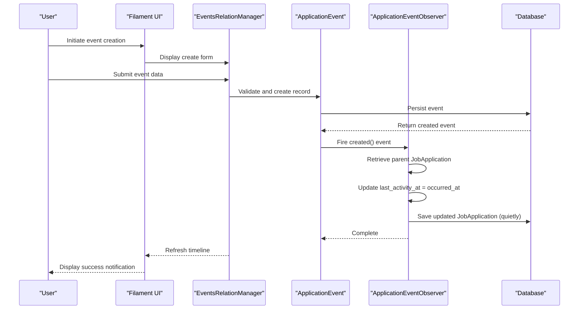
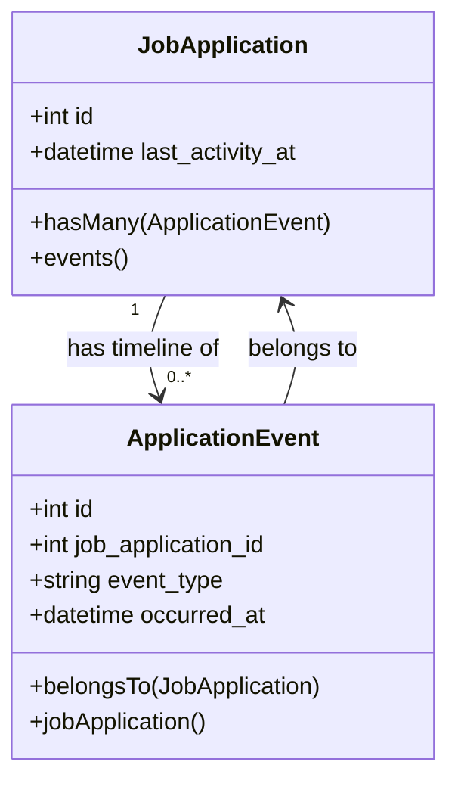
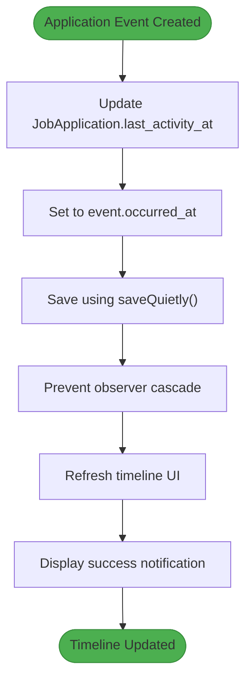
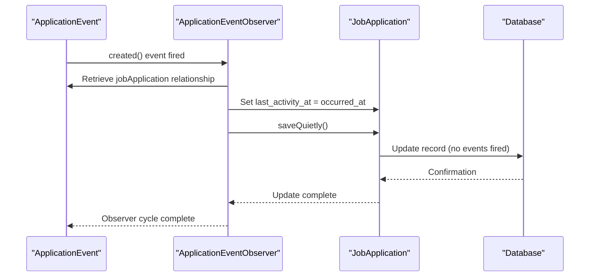
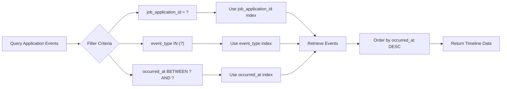
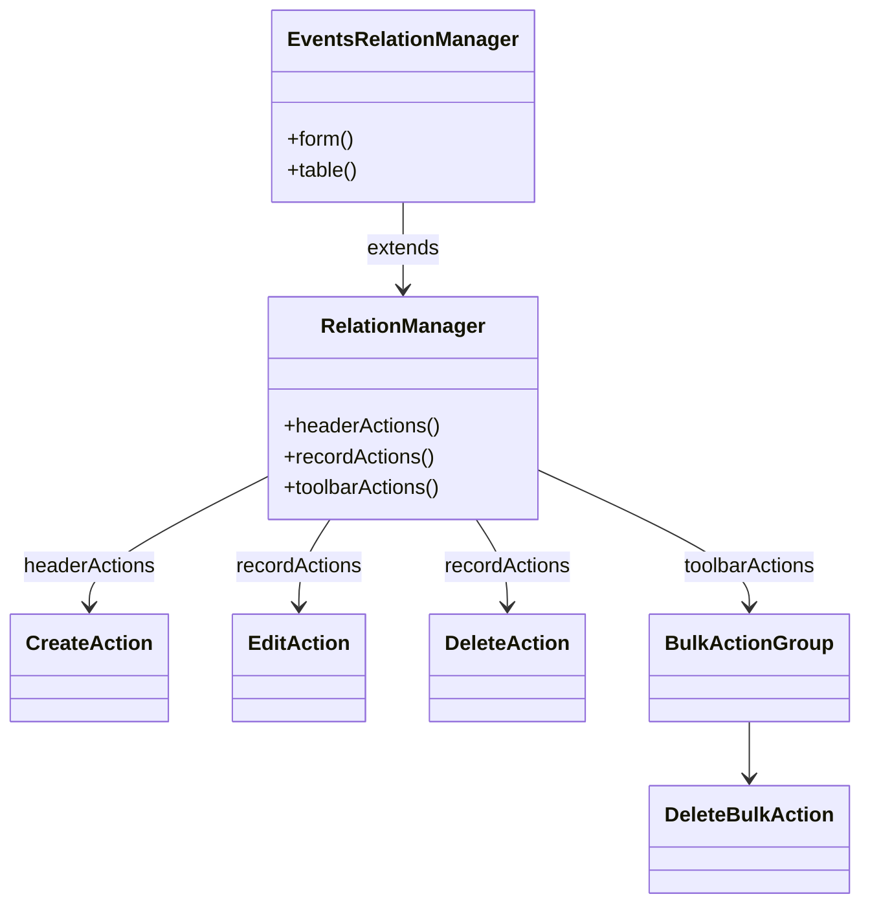

# Event System

<cite>
**Referenced Files in This Document**   
- [ApplicationEvent.php](file://app/Models/ApplicationEvent.php)
- [JobApplication.php](file://app/Models/JobApplication.php)
- [EventsRelationManager.php](file://app/Filament/Resources/JobApplications/RelationManagers/EventsRelationManager.php)
- [ApplicationEventObserver.php](file://app/Observers/ApplicationEventObserver.php)
- [create_application_events_table.php](file://database/migrations/2025_10_04_100002_create_application_events_table.php)
- [add_occurred_at_index_to_application_events_table.php](file://database/migrations/2025_10_07_073911_add_occurred_at_index_to_application_events_table.php)
</cite>

## Table of Contents
1. [Introduction](#introduction)
2. [Core Data Model](#core-data-model)
3. [Event Lifecycle Management](#event-lifecycle-management)
4. [Relationship with JobApplication](#relationship-with-jobapplication)
5. [Event Types and Metadata Structure](#event-types-and-metadata-structure)
6. [Audit Trail and Status Tracking](#audit-trail-and-status-tracking)
7. [Observer Integration](#observer-integration)
8. [Query Patterns and Reporting](#query-patterns-and-reporting)
9. [UI Integration in Filament](#ui-integration-in-filament)

## Introduction
The event system in the cv-builder application provides a comprehensive timeline for tracking the lifecycle of job applications. It enables users to record significant milestones, maintain audit trails, and analyze application progress through structured events. The system is built around the ApplicationEvent model, which captures discrete occurrences in the job application process and integrates tightly with the JobApplication model to provide real-time status updates and analytics.

## Core Data Model

The ApplicationEvent model serves as the foundation of the event tracking system, storing chronological records of key interactions throughout the job application lifecycle.

```mermaid
erDiagram
APPLICATION_EVENTS {
bigint id PK
bigint job_application_id FK
enum event_type
timestamp occurred_at
text notes
json metadata
timestamp created_at
timestamp updated_at
}
JOB_APPLICATIONS {
bigint id PK
timestamp last_activity_at
}
APPLICATION_EVENTS }o--|| JOB_APPLICATIONS : "belongs to"
classDiagram
class ApplicationEvent {
+int id
+int job_application_id
+string event_type
+datetime occurred_at
+text notes
+array metadata
+belongsTo(JobApplication)
}
class JobApplication {
+int id
+datetime last_activity_at
+hasMany(ApplicationEvent)
}
```

**Diagram sources**
- [ApplicationEvent.php](file://app/Models/ApplicationEvent.php#L1-L31)
- [JobApplication.php](file://app/Models/JobApplication.php#L1-L123)
- [create_application_events_table.php](file://database/migrations/2025_10_04_100002_create_application_events_table.php#L1-L46)

**Section sources**
- [ApplicationEvent.php](file://app/Models/ApplicationEvent.php#L1-L31)
- [create_application_events_table.php](file://database/migrations/2025_10_04_100002_create_application_events_table.php#L1-L46)

### Field Definitions
| Field | Type | Description |
|-------|------|-------------|
| `id` | bigint | Primary key, auto-incrementing identifier |
| `job_application_id` | bigint | Foreign key linking to the parent JobApplication |
| `event_type` | enum | Categorical type of the event (e.g., submitted, interview_scheduled) |
| `occurred_at` | timestamp | When the event actually occurred (supports past dates for retroactive logging) |
| `notes` | text | Free-form textual description of the event |
| `metadata` | json | Structured, event-specific data stored as JSON array |
| `created_at` | timestamp | When the event record was created |
| `updated_at` | timestamp | When the event record was last modified |

### Database Schema
The application_events table includes multiple indexes to optimize query performance:
- `(job_application_id)` - for relationship queries
- `(event_type)` - for filtering by event category
- `(job_application_id, event_type)` - for combined filtering
- `(occurred_at)` - added in a separate migration to optimize chronological queries

## Event Lifecycle Management

The event system supports full CRUD operations with specific business rules governing event creation, retrieval, and deletion. Events are managed through Filament's RelationManager interface, providing an intuitive UI for timeline management.



**Diagram sources**
- [EventsRelationManager.php](file://app/Filament/Resources/JobApplications/RelationManagers/EventsRelationManager.php#L1-L106)
- [ApplicationEventObserver.php](file://app/Observers/ApplicationEventObserver.php#L1-L20)

**Section sources**
- [EventsRelationManager.php](file://app/Filament/Resources/JobApplications/RelationManagers/EventsRelationManager.php#L1-L106)

### Event Creation
Events are created through the EventsRelationManager's form interface with the following validation rules:
- `event_type`: Required, must be one of the defined enum values
- `occurred_at`: Required, must be a valid datetime
- `notes`: Optional, up to 5000 characters
- `metadata`: Optional, must be valid JSON

The system allows retroactive logging by accepting past dates in the occurred_at field, enabling users to maintain accurate historical records.

### Event Deletion
Events can be deleted individually or in bulk through the RelationManager interface. When an event is deleted:
- The record is removed from the application_events table
- The parent JobApplication's last_activity_at is recalculated based on remaining events
- The UI automatically refreshes to reflect the updated timeline

## Relationship with JobApplication

The ApplicationEvent model maintains a bidirectional relationship with the JobApplication model, enabling rich timeline functionality and automatic status updates.



**Diagram sources**
- [JobApplication.php](file://app/Models/JobApplication.php#L1-L123)
- [ApplicationEvent.php](file://app/Models/ApplicationEvent.php#L1-L31)

**Section sources**
- [JobApplication.php](file://app/Models/JobApplication.php#L1-L123)

### Relationship Implementation
The relationship is implemented through standard Eloquent methods:
- **ApplicationEvent → JobApplication**: `belongsTo(JobApplication::class)` relationship
- **JobApplication → ApplicationEvent**: `hasMany(ApplicationEvent::class)` relationship with default ordering by occurred_at in descending order

This ordering ensures that the most recent events appear first in the timeline display, providing immediate visibility into the latest application activities.

## Event Types and Metadata Structure

The event system supports seven distinct event types, each representing a significant milestone in the job application lifecycle. These types are implemented as an enum field with predefined values.

### Supported Event Types
| Event Type | Description | UI Color | Significance |
|------------|-------------|----------|--------------|
| `submitted` | Application was sent to employer | Gray | Marks the beginning of the external application process |
| `reply_received` | Employer responded to application | Info Blue | Indicates initial engagement from hiring team |
| `interview_scheduled` | Interview has been arranged | Warning Yellow | Key milestone showing progression in hiring funnel |
| `interview_completed` | Interview has taken place | Success Green | Post-interview follow-up point |
| `offer_received` | Job offer has been extended | Success Green | Critical decision point in the process |
| `rejected` | Application was declined | Danger Red | Closure of the application process |
| `withdrawn` | Candidate withdrew from process | Gray | User-initiated closure of application |

### Metadata Structure
The metadata field provides flexible, structured storage for event-specific details. The schema varies by event type:

**interview_scheduled metadata:**
```json
{
  "format": "video|phone|in-person",
  "interviewer_names": ["string"],
  "prep_topics": ["string"],
  "questions_to_ask": ["string"]
}
```

**interview_completed metadata:**
```json
{
  "went_well": ["string"],
  "went_poorly": ["string"],
  "follow_up_needed": "string"
}
```

The metadata field is intentionally flexible to accommodate diverse use cases while still providing structure for important interview details.

## Audit Trail and Status Tracking

The event system serves as a comprehensive audit trail for job applications, automatically maintaining accurate records of all significant interactions.



**Diagram sources**
- [ApplicationEventObserver.php](file://app/Observers/ApplicationEventObserver.php#L1-L20)
- [JobApplication.php](file://app/Models/JobApplication.php#L1-L123)

**Section sources**
- [ApplicationEventObserver.php](file://app/Observers/ApplicationEventObserver.php#L1-L20)

### Audit Trail Features
- **Chronological Integrity**: Events are timestamped with their actual occurrence time (occurred_at), not just creation time
- **Retroactive Logging**: Users can record past events, maintaining historical accuracy
- **Immutable Records**: Events are designed to be append-only; corrections require deletion and recreation
- **Activity Propagation**: Parent JobApplication records automatically reflect the most recent activity

The last_activity_at field on JobApplication is critical for sorting applications by recency and identifying those needing attention.

## Observer Integration

The ApplicationEventObserver implements the observer pattern to automate updates to parent JobApplication records whenever events are created.



**Diagram sources**
- [ApplicationEventObserver.php](file://app/Observers/ApplicationEventObserver.php#L1-L20)
- [ApplicationEvent.php](file://app/Models/ApplicationEvent.php#L1-L31)

**Section sources**
- [ApplicationEventObserver.php](file://app/Observers/ApplicationEventObserver.php#L1-L20)

### Observer Implementation Details
The observer's created() method performs the following actions:
1. Retrieves the associated JobApplication through the jobApplication relationship
2. Updates the last_activity_at timestamp to the event's occurred_at time (or current time if not specified)
3. Saves the updated JobApplication using saveQuietly()

The use of saveQuietly() is critical as it prevents the update from triggering additional model events, which could create infinite observer loops. This design ensures reliable operation while maintaining performance.

## Query Patterns and Reporting

The event system supports various query patterns for retrieving timelines and generating reports, leveraging the indexed database structure.



**Diagram sources**
- [EventsRelationManager.php](file://app/Filament/Resources/JobApplications/RelationManagers/EventsRelationManager.php#L1-L106)
- [create_application_events_table.php](file://database/migrations/2025_10_04_100002_create_application_events_table.php#L1-L46)
- [add_occurred_at_index_to_application_events_table.php](file://database/migrations/2025_10_07_073911_add_occurred_at_index_to_application_events_table.php#L1-L29)

**Section sources**
- [EventsRelationManager.php](file://app/Filament/Resources/JobApplications/RelationManagers/EventsRelationManager.php#L1-L106)

### Common Query Patterns
- **Timeline Retrieval**: `JobApplication::find($id)->events` - Gets all events ordered by occurred_at DESC
- **Event Type Filtering**: `ApplicationEvent::where('event_type', 'interview_scheduled')` - Finds all scheduled interviews
- **Date Range Queries**: `ApplicationEvent::whereBetween('occurred_at', [$start, $end])` - Retrieves events within a time period
- **Recent Activity**: `JobApplication::orderBy('last_activity_at', 'desc')` - Sorts applications by most recent interaction

These query patterns enable reporting features such as:
- Interview frequency analysis
- Response time metrics from employers
- Application success rates by company or role type
- Time-to-offer calculations
- Funnel conversion rates across different application stages

## UI Integration in Filament

The event system is seamlessly integrated into the Filament admin panel through the EventsRelationManager, providing an intuitive interface for timeline management.



**Diagram sources**
- [EventsRelationManager.php](file://app/Filament/Resources/JobApplications/RelationManagers/EventsRelationManager.php#L1-L106)

**Section sources**
- [EventsRelationManager.php](file://app/Filament/Resources/JobApplications/RelationManagers/EventsRelationManager.php#L1-L106)

### Form Configuration
The event creation form includes:
- **event_type**: Select field with all valid enum options, displayed as user-friendly labels
- **occurred_at**: DateTimePicker with default value set to current time
- **notes**: Textarea with 3 rows for detailed descriptions
- **metadata**: KeyValue component for flexible key-value pair entry

### Table Configuration
The event timeline table displays:
- **event_type**: As a colored badge with human-readable formatting (underscores replaced with spaces)
- **occurred_at**: In "M j, Y g:i A" format with relative time description (e.g., "2 hours ago")
- **notes**: Truncated to 50 characters with text wrapping
- **Actions**: Edit and Delete actions available per record, with bulk delete in toolbar

The table is configured to sort by occurred_at in descending order by default, ensuring the most recent events appear at the top of the timeline.