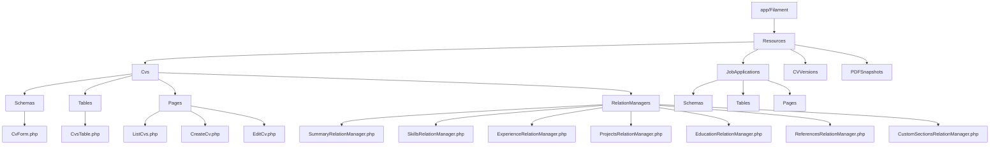
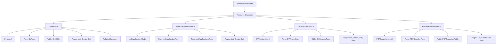
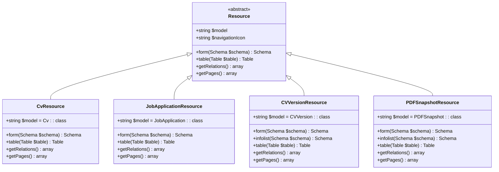
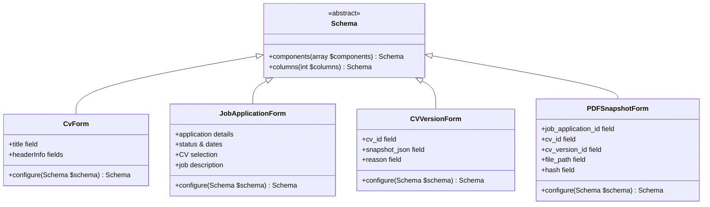
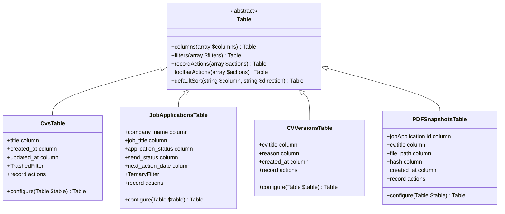
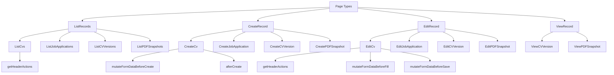
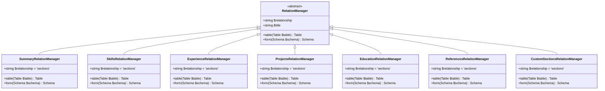

# Filament Resource System

<cite>
**Referenced Files in This Document**   
- [CvResource.php](file://app/Filament/Resources/Cvs/CvResource.php)
- [JobApplicationResource.php](file://app/Filament/Resources/JobApplications/JobApplicationResource.php)
- [CVVersionResource.php](file://app/Filament/Resources/CVVersions/CVVersionResource.php)
- [PDFSnapshotResource.php](file://app/Filament/Resources/PDFSnapshots/PDFSnapshotResource.php)
- [CvForm.php](file://app/Filament/Resources/Cvs/Schemas/CvForm.php)
- [JobApplicationForm.php](file://app/Filament/Resources/JobApplications/Schemas/JobApplicationForm.php)
- [CVVersionForm.php](file://app/Filament/Resources/CVVersions/Schemas/CVVersionForm.php)
- [PDFSnapshotForm.php](file://app/Filament/Resources/PDFSnapshots/Schemas/PDFSnapshotForm.php)
- [CvsTable.php](file://app/Filament/Resources/Cvs/Tables/CvsTable.php)
- [JobApplicationsTable.php](file://app/Filament/Resources/JobApplications/Tables/JobApplicationsTable.php)
- [CVVersionsTable.php](file://app/Filament/Resources/CVVersions/Tables/CVVersionsTable.php)
- [PDFSnapshotsTable.php](file://app/Filament/Resources/PDFSnapshots/Tables/PDFSnapshotsTable.php)
- [SummaryRelationManager.php](file://app/Filament/Resources/Cvs/RelationManagers/SummaryRelationManager.php)
- [SkillsRelationManager.php](file://app/Filament/Resources/Cvs/RelationManagers/SkillsRelationManager.php)
- [ExperienceRelationManager.php](file://app/Filament/Resources/Cvs/RelationManagers/ExperienceRelationManager.php)
- [ProjectsRelationManager.php](file://app/Filament/Resources/Cvs/RelationManagers/ProjectsRelationManager.php)
- [EducationRelationManager.php](file://app/Filament/Resources/Cvs/RelationManagers/EducationRelationManager.php)
- [ReferencesRelationManager.php](file://app/Filament/Resources/Cvs/RelationManagers/ReferencesRelationManager.php)
- [CustomSectionsRelationManager.php](file://app/Filament/Resources/Cvs/RelationManagers/CustomSectionsRelationManager.php)
- [ListCvs.php](file://app/Filament/Resources/Cvs/Pages/ListCvs.php)
- [CreateCv.php](file://app/Filament/Resources/Cvs/Pages/CreateCv.php)
- [EditCv.php](file://app/Filament/Resources/Cvs/Pages/EditCv.php)
- [ListJobApplications.php](file://app/Filament/Resources/JobApplications/Pages/ListJobApplications.php)
- [CreateJobApplication.php](file://app/Filament/Resources/JobApplications/Pages/CreateJobApplication.php)
- [EditJobApplication.php](file://app/Filament/Resources/JobApplications/Pages/EditJobApplication.php)
- [ListCVVersions.php](file://app/Filament/Resources/CVVersions/Pages/ListCVVersions.php)
- [CreateCVVersion.php](file://app/Filament/Resources/CVVersions/Pages/CreateCVVersion.php)
- [EditCVVersion.php](file://app/Filament/Resources/CVVersions/Pages/EditCVVersion.php)
- [ViewCVVersion.php](file://app/Filament/Resources/CVVersions/Pages/ViewCVVersion.php)
- [ListPDFSnapshots.php](file://app/Filament/Resources/PDFSnapshots/Pages/ListPDFSnapshots.php)
- [CreatePDFSnapshot.php](file://app/Filament/Resources/PDFSnapshots/Pages/CreatePDFSnapshot.php)
- [EditPDFSnapshot.php](file://app/Filament/Resources/PDFSnapshots/Pages/EditPDFSnapshot.php)
- [ViewPDFSnapshot.php](file://app/Filament/Resources/PDFSnapshots/Pages/ViewPDFSnapshot.php)
- [AdminPanelProvider.php](file://app/Providers/Filament/AdminPanelProvider.php)
- [filament.php](file://config/filament.php)
- [Cv.php](file://app/Models/Cv.php)
- [JobApplication.php](file://app/Models/JobApplication.php)
- [CVVersion.php](file://app/Models/CVVersion.php)
- [PDFSnapshot.php](file://app/Models/PDFSnapshot.php)
</cite>

## Table of Contents
1. [Introduction](#introduction)
2. [Project Structure](#project-structure)
3. [Core Components](#core-components)
4. [Architecture Overview](#architecture-overview)
5. [Detailed Component Analysis](#detailed-component-analysis)
6. [Dependency Analysis](#dependency-analysis)
7. [Performance Considerations](#performance-considerations)
8. [Troubleshooting Guide](#troubleshooting-guide)
9. [Conclusion](#conclusion)

## Introduction
The Filament resource system in the CV Builder application provides a comprehensive admin interface for managing domain models through a structured abstraction of CRUD operations. This documentation details how Filament resources such as CvResource, JobApplicationResource, CVVersionResource, and PDFSnapshotResource organize and present data through forms, tables, pages, and relation managers. The system enables efficient management of CVs, job applications, version snapshots, and PDF exports through a consistent interface pattern. Resources are registered in the AdminPanelProvider and configured in filament.php, establishing the foundation for the admin interface. Each resource connects to an Eloquent model and defines its presentation through form schemas, table definitions, and relationship management.

## Project Structure
The Filament resource system follows a structured organization within the app/Filament directory, with resources categorized by domain model. Each resource has dedicated subdirectories for Schemas, Tables, Pages, and RelationManagers, creating a clear separation of concerns. The resource structure enables maintainable code organization and consistent patterns across different domain entities.

**Diagram sources**
- [CvResource.php](file://app/Filament/Resources/Cvs/CvResource.php)
- [JobApplicationResource.php](file://app/Filament/Resources/JobApplications/JobApplicationResource.php)
- [CVVersionResource.php](file://app/Filament/Resources/CVVersions/CVVersionResource.php)
- [PDFSnapshotResource.php](file://app/Filament/Resources/PDFSnapshots/PDFSnapshotResource.php)

**Section sources**
- [CvResource.php](file://app/Filament/Resources/Cvs/CvResource.php)
- [JobApplicationResource.php](file://app/Filament/Resources/JobApplications/JobApplicationResource.php)
- [CVVersionResource.php](file://app/Filament/Resources/CVVersions/CVVersionResource.php)
- [PDFSnapshotResource.php](file://app/Filament/Resources/PDFSnapshots/PDFSnapshotResource.php)

## Core Components
The Filament resource system in the CV Builder application consists of several core components that work together to provide a comprehensive admin interface. Each resource extends the base Resource class and defines its behavior through form, table, relation, and page configurations. The system abstracts CRUD operations while providing extensive customization capabilities for complex data entry interfaces and relationship management.

**Section sources**
- [CvResource.php](file://app/Filament/Resources/Cvs/CvResource.php#L16-L53)
- [JobApplicationResource.php](file://app/Filament/Resources/JobApplications/JobApplicationResource.php#L16-L47)
- [CVVersionResource.php](file://app/Filament/Resources/CVVersions/CVVersionResource.php#L18-L55)
- [PDFSnapshotResource.php](file://app/Filament/Resources/PDFSnapshots/PDFSnapshotResource.php#L18-L55)

## Architecture Overview
The Filament resource system follows a component-based architecture where each resource serves as a container for related functionality. Resources connect to Eloquent models and define their presentation through form schemas, table definitions, and relationship management. The system uses a discovery mechanism in AdminPanelProvider to automatically register resources, pages, and widgets, creating a cohesive admin interface.

**Diagram sources**
- [AdminPanelProvider.php](file://app/Providers/Filament/AdminPanelProvider.php#L21-L56)
- [CvResource.php](file://app/Filament/Resources/Cvs/CvResource.php)
- [JobApplicationResource.php](file://app/Filament/Resources/JobApplications/JobApplicationResource.php)
- [CVVersionResource.php](file://app/Filament/Resources/CVVersions/CVVersionResource.php)
- [PDFSnapshotResource.php](file://app/Filament/Resources/PDFSnapshots/PDFSnapshotResource.php)

## Detailed Component Analysis

### Resource Structure and Configuration
Each Filament resource in the CV Builder application follows a consistent structure that defines its relationship to an Eloquent model and configures its presentation. The resource class serves as the central configuration point, defining form behavior, table display, relationships, and available pages. This abstraction allows for consistent CRUD operations while enabling extensive customization for specific use cases.

#### Resource Class Implementation

**Diagram sources**
- [CvResource.php](file://app/Filament/Resources/Cvs/CvResource.php#L16-L53)
- [JobApplicationResource.php](file://app/Filament/Resources/JobApplications/JobApplicationResource.php#L16-L47)
- [CVVersionResource.php](file://app/Filament/Resources/CVVersions/CVVersionResource.php#L18-L55)
- [PDFSnapshotResource.php](file://app/Filament/Resources/PDFSnapshots/PDFSnapshotResource.php#L18-L55)

**Section sources**
- [CvResource.php](file://app/Filament/Resources/Cvs/CvResource.php#L16-L53)
- [JobApplicationResource.php](file://app/Filament/Resources/JobApplications/JobApplicationResource.php#L16-L47)
- [CVVersionResource.php](file://app/Filament/Resources/CVVersions/CVVersionResource.php#L18-L55)
- [PDFSnapshotResource.php](file://app/Filament/Resources/PDFSnapshots/PDFSnapshotResource.php#L18-L55)

### Form Schemas and Data Entry Interfaces
The form schemas in the Filament resource system define the data entry interfaces for creating and editing records. Each resource uses a dedicated schema class that configures the form layout, fields, validation, and relationships. The system supports complex field configurations, conditional logic, and relationship-based fields to handle sophisticated data entry requirements.

#### Form Schema Implementation

**Diagram sources**
- [CvForm.php](file://app/Filament/Resources/Cvs/Schemas/CvForm.php#L7-L64)
- [JobApplicationForm.php](file://app/Filament/Resources/JobApplications/Schemas/JobApplicationForm.php#L16-L176)
- [CVVersionForm.php](file://app/Filament/Resources/CVVersions/Schemas/CVVersionForm.php#L9-L25)
- [PDFSnapshotForm.php](file://app/Filament/Resources/PDFSnapshots/Schemas/PDFSnapshotForm.php#L8-L27)

**Section sources**
- [CvForm.php](file://app/Filament/Resources/Cvs/Schemas/CvForm.php#L7-L64)
- [JobApplicationForm.php](file://app/Filament/Resources/JobApplications/Schemas/JobApplicationForm.php#L16-L176)
- [CVVersionForm.php](file://app/Filament/Resources/CVVersions/Schemas/CVVersionForm.php#L9-L25)
- [PDFSnapshotForm.php](file://app/Filament/Resources/PDFSnapshots/Schemas/PDFSnapshotForm.php#L8-L27)

### Table Definitions and Data Display
The table definitions in the Filament resource system configure how records are displayed in list views. Each resource uses a dedicated table class that defines columns, filters, actions, and sorting behavior. The system supports searchable, sortable, and filterable columns, as well as record-level and toolbar actions for efficient data management.

#### Table Definition Implementation

**Diagram sources**
- [CvsTable.php](file://app/Filament/Resources/Cvs/Tables/CvsTable.php#L14-L75)
- [JobApplicationsTable.php](file://app/Filament/Resources/JobApplications/Tables/JobApplicationsTable.php#L12-L103)
- [CVVersionsTable.php](file://app/Filament/Resources/CVVersions/Tables/CVVersionsTable.php#L11-L39)
- [PDFSnapshotsTable.php](file://app/Filament/Resources/PDFSnapshots/Tables/PDFSnapshotsTable.php#L11-L45)

**Section sources**
- [CvsTable.php](file://app/Filament/Resources/Cvs/Tables/CvsTable.php#L14-L75)
- [JobApplicationsTable.php](file://app/Filament/Resources/JobApplications/Tables/JobApplicationsTable.php#L12-L103)
- [CVVersionsTable.php](file://app/Filament/Resources/CVVersions/Tables/CVVersionsTable.php#L11-L39)
- [PDFSnapshotsTable.php](file://app/Filament/Resources/PDFSnapshots/Tables/PDFSnapshotsTable.php#L11-L45)

### Pages and User Navigation
The pages in the Filament resource system define the user interface for different operations such as listing, creating, editing, and viewing records. Each resource has dedicated page classes that extend Filament's base page classes and configure the specific behavior for each operation. The system supports custom header actions and data mutation hooks to handle complex business logic.

#### Page Implementation

**Diagram sources**
- [ListCvs.php](file://app/Filament/Resources/Cvs/Pages/ListCvs.php#L8-L18)
- [CreateCv.php](file://app/Filament/Resources/Cvs/Pages/CreateCv.php#L8-L33)
- [EditCv.php](file://app/Filament/Resources/Cvs/Pages/EditCv.php#L11-L78)
- [ListJobApplications.php](file://app/Filament/Resources/JobApplications/Pages/ListJobApplications.php#L8-L18)
- [CreateJobApplication.php](file://app/Filament/Resources/JobApplications/Pages/CreateJobApplication.php#L7-L10)
- [EditJobApplication.php](file://app/Filament/Resources/JobApplications/Pages/EditJobApplication.php#L8-L18)
- [ListCVVersions.php](file://app/Filament/Resources/CVVersions/Pages/ListCVVersions.php#L8-L18)
- [CreateCVVersion.php](file://app/Filament/Resources/CVVersions/Pages/CreateCVVersion.php#L7-L10)
- [EditCVVersion.php](file://app/Filament/Resources/CVVersions/Pages/EditCVVersion.php#L9-L20)
- [ViewCVVersion.php](file://app/Filament/Resources/CVVersions/Pages/ViewCVVersion.php#L8-L18)
- [ListPDFSnapshots.php](file://app/Filament/Resources/PDFSnapshots/Pages/ListPDFSnapshots.php#L8-L18)
- [CreatePDFSnapshot.php](file://app/Filament/Resources/PDFSnapshots/Pages/CreatePDFSnapshot.php#L7-L10)
- [EditPDFSnapshot.php](file://app/Filament/Resources/PDFSnapshots/Pages/EditPDFSnapshot.php#L9-L20)
- [ViewPDFSnapshot.php](file://app/Filament/Resources/PDFSnapshots/Pages/ViewPDFSnapshot.php#L8-L18)

**Section sources**
- [ListCvs.php](file://app/Filament/Resources/Cvs/Pages/ListCvs.php#L8-L18)
- [CreateCv.php](file://app/Filament/Resources/Cvs/Pages/CreateCv.php#L8-L33)
- [EditCv.php](file://app/Filament/Resources/Cvs/Pages/EditCv.php#L11-L78)
- [ListJobApplications.php](file://app/Filament/Resources/JobApplications/Pages/ListJobApplications.php#L8-L18)
- [CreateJobApplication.php](file://app/Filament/Resources/JobApplications/Pages/CreateJobApplication.php#L7-L10)
- [EditJobApplication.php](file://app/Filament/Resources/JobApplications/Pages/EditJobApplication.php#L8-L18)
- [ListCVVersions.php](file://app/Filament/Resources/CVVersions/Pages/ListCVVersions.php#L8-L18)
- [CreateCVVersion.php](file://app/Filament/Resources/CVVersions/Pages/CreateCVVersion.php#L7-L10)
- [EditCVVersion.php](file://app/Filament/Resources/CVVersions/Pages/EditCVVersion.php#L9-L20)
- [ViewCVVersion.php](file://app/Filament/Resources/CVVersions/Pages/ViewCVVersion.php#L8-L18)
- [ListPDFSnapshots.php](file://app/Filament/Resources/PDFSnapshots/Pages/ListPDFSnapshots.php#L8-L18)
- [CreatePDFSnapshot.php](file://app/Filament/Resources/PDFSnapshots/Pages/CreatePDFSnapshot.php#L7-L10)
- [EditPDFSnapshot.php](file://app/Filament/Resources/PDFSnapshots/Pages/EditPDFSnapshot.php#L9-L20)
- [ViewPDFSnapshot.php](file://app/Filament/Resources/PDFSnapshots/Pages/ViewPDFSnapshot.php#L8-L18)

### Relation Managers and Complex Relationships
The relation managers in the Filament resource system handle the management of related records for a parent resource. For the CvResource, multiple relation managers handle different section types such as summary, skills, experience, projects, education, references, and custom sections. These managers provide dedicated interfaces for managing related data with custom table configurations and creation logic.

#### Relation Manager Implementation

**Diagram sources**
- [SummaryRelationManager.php](file://app/Filament/Resources/Cvs/RelationManagers/SummaryRelationManager.php#L16-L74)
- [SkillsRelationManager.php](file://app/Filament/Resources/Cvs/RelationManagers/SkillsRelationManager.php#L18-L108)
- [ExperienceRelationManager.php](file://app/Filament/Resources/Cvs/RelationManagers/ExperienceRelationManager.php#L21-L144)
- [ProjectsRelationManager.php](file://app/Filament/Resources/Cvs/RelationManagers/ProjectsRelationManager.php#L18-L110)
- [EducationRelationManager.php](file://app/Filament/Resources/Cvs/RelationManagers/EducationRelationManager.php#L18-L120)
- [ReferencesRelationManager.php](file://app/Filament/Resources/Cvs/RelationManagers/ReferencesRelationManager.php#L16-L75)
- [CustomSectionsRelationManager.php](file://app/Filament/Resources/Cvs/RelationManagers/CustomSectionsRelationManager.php#L18-L115)

**Section sources**
- [SummaryRelationManager.php](file://app/Filament/Resources/Cvs/RelationManagers/SummaryRelationManager.php#L16-L74)
- [SkillsRelationManager.php](file://app/Filament/Resources/Cvs/RelationManagers/SkillsRelationManager.php#L18-L108)
- [ExperienceRelationManager.php](file://app/Filament/Resources/Cvs/RelationManagers/ExperienceRelationManager.php#L21-L144)
- [ProjectsRelationManager.php](file://app/Filament/Resources/Cvs/RelationManagers/ProjectsRelationManager.php#L18-L110)
- [EducationRelationManager.php](file://app/Filament/Resources/Cvs/RelationManagers/EducationRelationManager.php#L18-L120)
- [ReferencesRelationManager.php](file://app/Filament/Resources/Cvs/RelationManagers/ReferencesRelationManager.php#L16-L75)
- [CustomSectionsRelationManager.php](file://app/Filament/Resources/Cvs/RelationManagers/CustomSectionsRelationManager.php#L18-L115)

## Dependency Analysis
The Filament resource system in the CV Builder application has a well-defined dependency structure that connects the admin interface components with the underlying domain models. The system uses Laravel's service container and Filament's discovery mechanisms to automatically register and configure resources, pages, and widgets.

```mermaid
graph TD
A[AdminPanelProvider] --> B[Resource Discovery]
A --> C[Page Discovery]
A --> D[Widget Discovery]
B --> E[CvResource]
B --> F[JobApplicationResource]
B --> G[CVVersionResource]
B --> H[PDFSnapshotResource]
E --> I[Cv Model]
F --> J[JobApplication Model]
G --> K[CVVersion Model]
H --> L[PDFSnapshot Model]
E --> M[CvForm]
E --> N[CvsTable]
E --> O[ListCvs]
E --> P[CreateCv]
E --> Q[EditCv]
E --> R[RelationManagers]
F --> S[JobApplicationForm]
F --> T[JobApplicationsTable]
F --> U[ListJobApplications]
F --> V[CreateJobApplication]
F --> W[EditJobApplication]
G --> X[CVVersionForm]
G --> Y[CVVersionInfolist]
G --> Z[CVVersionsTable]
G --> AA[ListCVVersions]
G --> AB[CreateCVVersion]
G --> AC[EditCVVersion]
G --> AD[ViewCVVersion]
H --> AE[PDFSnapshotForm]
H --> AF[PDFSnapshotInfolist]
H --> AG[PDFSnapshotsTable]
H --> AH[ListPDFSnapshots]
H --> AI[CreatePDFSnapshot]
H --> AJ[EditPDFSnapshot]
H --> AK[ViewPDFSnapshot]
R --> AL[SummaryRelationManager]
R --> AM[SkillsRelationManager]
R --> AN[ExperienceRelationManager]
R --> AO[ProjectsRelationManager]
R --> AP[EducationRelationManager]
R --> AQ[ReferencesRelationManager]
R --> AR[CustomSectionsRelationManager]
```

**Diagram sources**
- [AdminPanelProvider.php](file://app/Providers/Filament/AdminPanelProvider.php#L21-L56)
- [CvResource.php](file://app/Filament/Resources/Cvs/CvResource.php)
- [JobApplicationResource.php](file://app/Filament/Resources/JobApplications/JobApplicationResource.php)
- [CVVersionResource.php](file://app/Filament/Resources/CVVersions/CVVersionResource.php)
- [PDFSnapshotResource.php](file://app/Filament/Resources/PDFSnapshots/PDFSnapshotResource.php)

**Section sources**
- [AdminPanelProvider.php](file://app/Providers/Filament/AdminPanelProvider.php#L21-L56)
- [CvResource.php](file://app/Filament/Resources/Cvs/CvResource.php)
- [JobApplicationResource.php](file://app/Filament/Resources/JobApplications/JobApplicationResource.php)
- [CVVersionResource.php](file://app/Filament/Resources/CVVersions/CVVersionResource.php)
- [PDFSnapshotResource.php](file://app/Filament/Resources/PDFSnapshots/PDFSnapshotResource.php)

## Performance Considerations
The Filament resource system in the CV Builder application includes several performance considerations for handling large datasets and complex relationships. The system uses Laravel's query builder and Eloquent ORM efficiently, with proper indexing and eager loading to prevent N+1 query issues. For large datasets, the system implements pagination, filtering, and selective loading of related data to maintain responsive performance.

The application also considers performance in data processing operations such as CV cloning and PDF snapshot creation. These operations are wrapped in database transactions to ensure data integrity and use efficient replication methods to minimize processing time. The keyword coverage calculation is optimized to handle large job descriptions within acceptable time limits, as specified in the non-functional requirements.

**Section sources**
- [Cv.php](file://app/Models/Cv.php#L100-L221)
- [JobApplication.php](file://app/Models/JobApplication.php#L45-L66)
- [filament.php](file://config/filament.php#L0-L120)

## Troubleshooting Guide
When working with the Filament resource system in the CV Builder application, several common issues may arise. These include configuration errors in resource registration, form validation issues, relationship management problems, and performance bottlenecks with large datasets.

For configuration issues, verify that resources are properly registered in the AdminPanelProvider and that the filament.php configuration file is correctly set up. Check that the resource classes extend the correct base classes and implement the required methods.

For form and table display issues, ensure that the schema and table classes are properly configured with the correct field names and relationships. Verify that any custom logic in relation managers is correctly implemented and that the database schema matches the expected structure.

For performance issues with large datasets, implement proper database indexing on frequently queried columns and use eager loading to prevent N+1 query problems. Consider implementing caching for frequently accessed data and optimizing complex operations like CV cloning and PDF generation.

**Section sources**
- [AdminPanelProvider.php](file://app/Providers/Filament/AdminPanelProvider.php#L21-L56)
- [filament.php](file://config/filament.php#L0-L120)
- [Cv.php](file://app/Models/Cv.php#L100-L221)

## Conclusion
The Filament resource system in the CV Builder application provides a robust and extensible framework for managing domain models through a comprehensive admin interface. By abstracting CRUD operations and providing a consistent pattern for form schemas, table definitions, pages, and relation managers, the system enables efficient management of complex data structures. The integration with Eloquent models ensures data integrity while allowing for sophisticated business logic through custom methods and event handling. The system's modular design and clear separation of concerns make it highly maintainable and extensible, supporting the application's evolution from a simple CV manager to a comprehensive job application productivity tool.