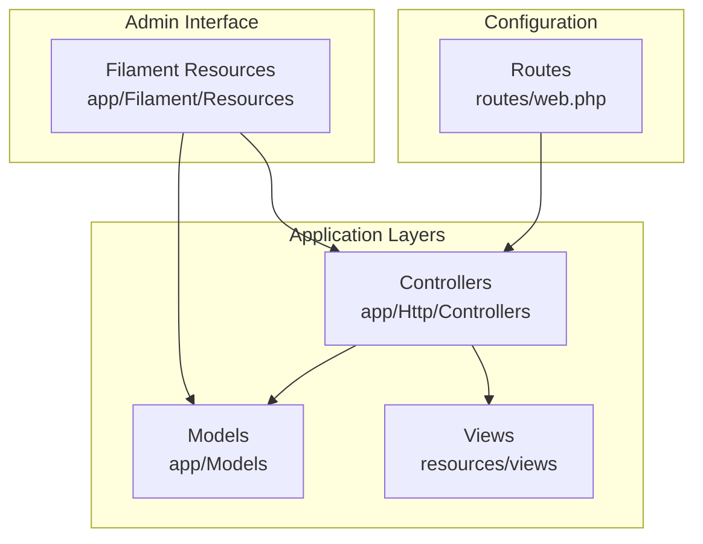
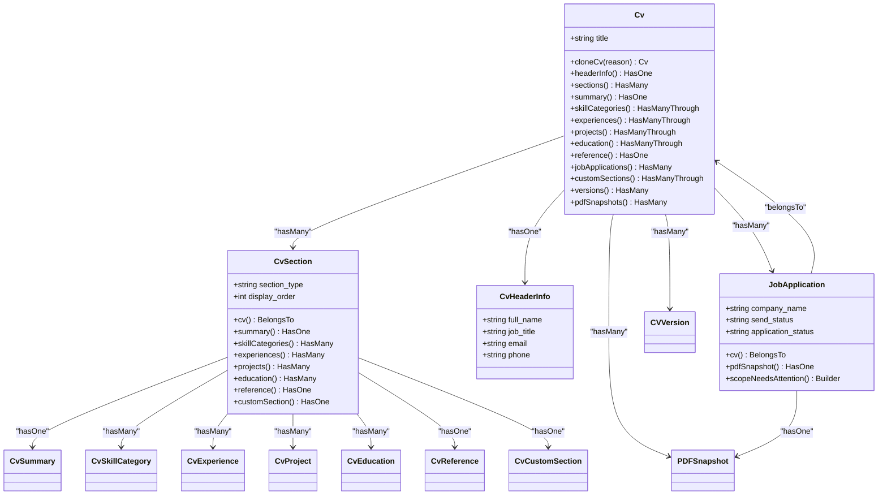
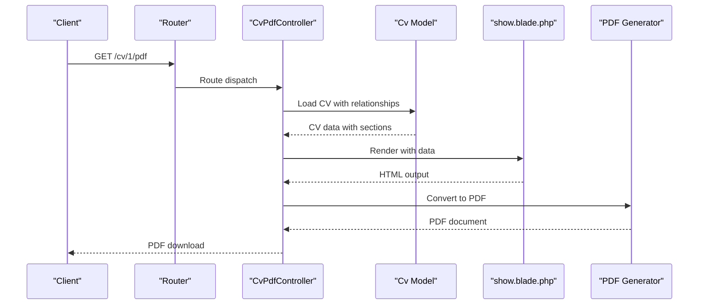
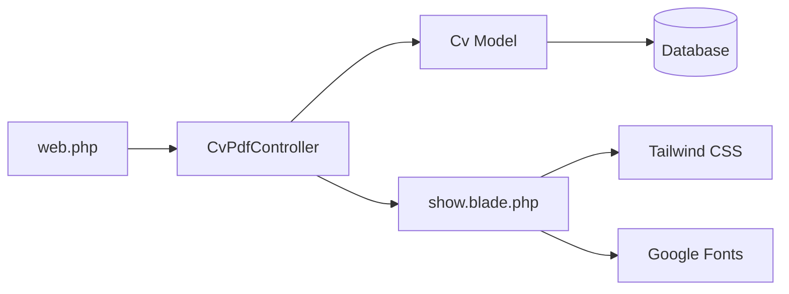

# MVC Architecture

<cite>
**Referenced Files in This Document**   
- [Cv.php](file://app/Models/Cv.php)
- [JobApplication.php](file://app/Models/JobApplication.php)
- [CvPdfController.php](file://app/Http/Controllers/CvPdfController.php)
- [web.php](file://routes/web.php)
- [show.blade.php](file://resources/views/cv/show.blade.php)
</cite>

## Table of Contents
1. [Introduction](#introduction)
2. [Project Structure](#project-structure)
3. [Core Components](#core-components)
4. [Architecture Overview](#architecture-overview)
5. [Detailed Component Analysis](#detailed-component-analysis)
6. [Dependency Analysis](#dependency-analysis)
7. [Performance Considerations](#performance-considerations)
8. [Troubleshooting Guide](#troubleshooting-guide)
9. [Conclusion](#conclusion)

## Introduction
This document provides a comprehensive overview of the Model-View-Controller (MVC) architecture implemented in the CV Builder application. The application follows Laravel's MVC pattern with clear separation of concerns between models, views, and controllers. The architecture enables efficient management of CV data, job applications, and PDF exports through a well-structured approach that emphasizes maintainability and testability. This documentation explains how the components interact, the request lifecycle from route to response, and best practices followed in the implementation.

## Project Structure
The CV Builder application follows Laravel's standard directory structure with components organized by responsibility. The core MVC components are located in their respective directories: models in `app/Models`, controllers in `app/Http/Controllers`, and views in `resources/views`. The application also leverages Filament for admin interface components, which are organized in `app/Filament/Resources`. The routing configuration is defined in `routes/web.php`, directing HTTP requests to appropriate controllers.



**Diagram sources**
- [web.php](file://routes/web.php#L1-L10)
- [CvPdfController.php](file://app/Http/Controllers/CvPdfController.php#L1-L33)

**Section sources**
- [web.php](file://routes/web.php#L1-L10)
- [app/Models](file://app/Models)
- [app/Http/Controllers](file://app/Http/Controllers)
- [resources/views](file://resources/views)

## Core Components
The CV Builder application implements the MVC pattern with three primary components: Models that manage data and relationships, Views that handle presentation, and Controllers that orchestrate requests. The `Cv` and `JobApplication` models represent the data layer, managing CV information and job application details respectively. The Blade templates in `resources/views` constitute the view layer, responsible for rendering the CV content. The `CvPdfController` serves as the controller layer, handling PDF export requests and coordinating between models and views.

**Section sources**
- [Cv.php](file://app/Models/Cv.php#L1-L221)
- [JobApplication.php](file://app/Models/JobApplication.php#L1-L66)
- [CvPdfController.php](file://app/Http/Controllers/CvPdfController.php#L1-L33)
- [show.blade.php](file://resources/views/cv/show.blade.php#L1-L263)

## Architecture Overview
The MVC architecture of the CV Builder application follows a clear request-response flow. When a user requests a CV PDF, the route defined in `web.php` directs the request to the `CvPdfController`. The controller retrieves the requested CV model with all related data, then passes this data to the Blade view template for rendering. The rendered HTML is converted to PDF format and returned to the user. This separation ensures that each component has a single responsibility, making the application easier to maintain and test.

```mermaid
graph LR
A[Route: /cv/{cv}/pdf] --> B[CvPdfController]
B --> C[Cv Model]
C --> D[Database]
B --> E[show.blade.php View]
E --> F[PDF Output]
D --> C
C --> B
B --> F
```

**Diagram sources**
- [web.php](file://routes/web.php#L6-L8)
- [CvPdfController.php](file://app/Http/Controllers/CvPdfController.php#L1-L33)
- [Cv.php](file://app/Models/Cv.php#L1-L221)
- [show.blade.php](file://resources/views/cv/show.blade.php#L1-L263)

## Detailed Component Analysis
This section provides an in-depth analysis of the key components in the CV Builder application's MVC architecture, focusing on how they implement the separation of concerns principle and interact with each other to deliver functionality.

### Model Analysis
The models in the CV Builder application implement rich domain logic and manage complex relationships between different data entities. The `Cv` model serves as the central entity, establishing relationships with various CV sections through Eloquent relationships. The model implements business logic such as the `cloneCv` method, which creates a deep copy of a CV with all its sections while maintaining data integrity through database transactions.



**Diagram sources**
- [Cv.php](file://app/Models/Cv.php#L1-L221)
- [JobApplication.php](file://app/Models/JobApplication.php#L1-L66)
- [CvHeaderInfo.php](file://app/Models/CvHeaderInfo.php#L1-L22)
- [CvSection.php](file://app/Models/CvSection.php#L1-L60)

**Section sources**
- [Cv.php](file://app/Models/Cv.php#L1-L221)
- [JobApplication.php](file://app/Models/JobApplication.php#L1-L66)

### Controller Analysis
The `CvPdfController` exemplifies the thin controller pattern by focusing solely on request handling and coordination between models and views. The controller's `download` method accepts a CV model instance through Laravel's route model binding, eager loads all necessary relationships to prevent N+1 query issues, and passes the data to the view for rendering. The controller does not contain business logic, which is properly encapsulated in the model layer, adhering to the principle of rich models and thin controllers.



**Diagram sources**
- [CvPdfController.php](file://app/Http/Controllers/CvPdfController.php#L1-L33)
- [Cv.php](file://app/Models/Cv.php#L1-L221)
- [show.blade.php](file://resources/views/cv/show.blade.php#L1-L263)

**Section sources**
- [CvPdfController.php](file://app/Http/Controllers/CvPdfController.php#L1-L33)

### View Analysis
The Blade template `show.blade.php` implements the presentation layer, transforming the structured data from the model into a visually appealing CV format. The template uses Tailwind CSS for styling and includes responsive design elements to ensure proper rendering in both web and PDF formats. The view iterates through the CV sections in display order, rendering each section type with appropriate formatting. The template also includes print-specific CSS to optimize the layout for PDF output, including page size, margins, and font rendering.

**Section sources**
- [show.blade.php](file://resources/views/cv/show.blade.php#L1-L263)

## Dependency Analysis
The MVC components in the CV Builder application have well-defined dependencies that follow the dependency inversion principle. Controllers depend on models for data access, while views depend on controllers for data provision. The models have no dependencies on controllers or views, allowing them to be tested in isolation. The route configuration depends on the controller, establishing the entry point for HTTP requests. This dependency structure enables loose coupling between components, making the application more maintainable and testable.



**Diagram sources**
- [web.php](file://routes/web.php#L1-L10)
- [CvPdfController.php](file://app/Http/Controllers/CvPdfController.php#L1-L33)
- [Cv.php](file://app/Models/Cv.php#L1-L221)
- [show.blade.php](file://resources/views/cv/show.blade.php#L1-L263)

**Section sources**
- [web.php](file://routes/web.php#L1-L10)
- [CvPdfController.php](file://app/Http/Controllers/CvPdfController.php#L1-L33)

## Performance Considerations
The MVC implementation in the CV Builder application incorporates several performance optimizations. The controller uses eager loading to retrieve all necessary model relationships in a single query, preventing N+1 query problems. The view template is optimized for rendering performance by using efficient Blade directives and minimizing complex logic. The PDF generation process is handled by the Spatie Laravel-PDF package, which efficiently converts HTML to PDF format. The model layer uses database indexing on frequently queried fields to ensure fast data retrieval.

## Troubleshooting Guide
When troubleshooting issues in the CV Builder MVC architecture, start by verifying the route configuration in `web.php` to ensure requests are properly directed to the controller. Check that the controller is correctly loading all necessary model relationships to avoid missing data in the view. Validate that the model relationships are properly defined and that foreign key constraints are maintained in the database. For PDF generation issues, verify that the view template is properly formatted and that external resources like CSS and fonts are accessible. Use Laravel's debugging tools to trace the request flow from route to controller to view.

**Section sources**
- [web.php](file://routes/web.php#L1-L10)
- [CvPdfController.php](file://app/Http/Controllers/CvPdfController.php#L1-L33)
- [Cv.php](file://app/Models/Cv.php#L1-L221)
- [show.blade.php](file://resources/views/cv/show.blade.php#L1-L263)

## Conclusion
The CV Builder application demonstrates a well-implemented MVC architecture that follows Laravel best practices. The clear separation between models, views, and controllers enhances maintainability, testability, and scalability. The rich models encapsulate business logic and data relationships, while thin controllers focus on request handling and coordination. The view layer provides a clean presentation of data with proper formatting for both web and PDF output. This architectural approach enables efficient development and makes the application easier to understand and extend.