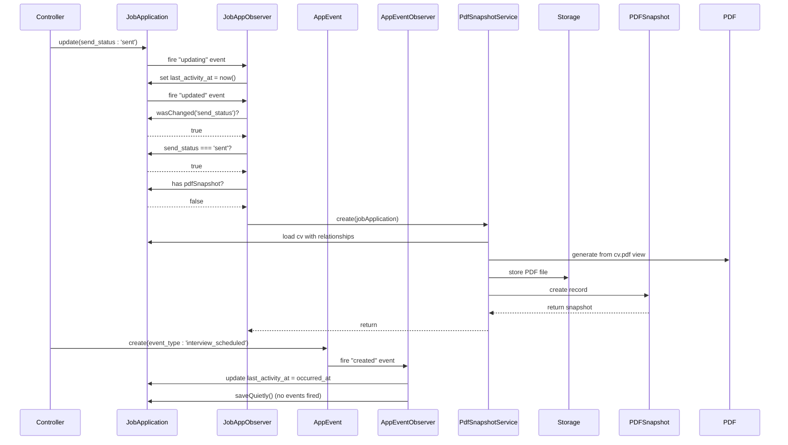

# Observer Pattern Implementation

<cite>
**Referenced Files in This Document**   
- [JobApplicationObserver.php](file://app/Observers/JobApplicationObserver.php) - *Updated in recent commit*
- [ApplicationEventObserver.php](file://app/Observers/ApplicationEventObserver.php) - *Updated to use saveQuietly*
- [AppServiceProvider.php](file://app/Providers/AppServiceProvider.php) - *Updated to register new observer*
- [JobApplication.php](file://app/Models/JobApplication.php) - *Model with last_activity_at field*
- [ApplicationEvent.php](file://app/Models/ApplicationEvent.php) - *New model for tracking application events*
- [PdfSnapshotService.php](file://app/Services/PdfSnapshotService.php) - *Service for PDF generation*
- [ApplicationsNeedingAction.php](file://app/Filament/Widgets/ApplicationsNeedingAction.php) - *Widget using needs attention logic*
- [ApplicationStatsOverview.php](file://app/Filament/Widgets/ApplicationStatsOverview.php) - *Dashboard widget for application metrics*
- [PDFSnapshot.php](file://app/Models/PDFSnapshot.php) - *Immutable snapshot model*
</cite>

## Update Summary
**Changes Made**   
- Updated ApplicationEventObserver section to reflect use of saveQuietly()
- Enhanced Cross-Observer Coordination section to explain loop prevention mechanism
- Updated Potential Pitfalls and Testing Strategies with new implementation details
- Revised Sequence Diagram to reflect actual code behavior
- Added clarification on observer cascade prevention in design implications

## Table of Contents
1. [Introduction](#introduction)
2. [Observer Registration and Event Mapping](#observer-registration-and-event-mapping)
3. [JobApplicationObserver Business Logic](#jobapplicationobserver-business-logic)
4. [ApplicationEventObserver Business Logic](#applicationeventobserver-business-logic)
5. [Cross-Observer Coordination](#cross-observer-coordination)
6. [Event Flow and Component Interactions](#event-flow-and-component-interactions)
7. [Decoupling Benefits and Design Implications](#decoupling-benefits-and-design-implications)
8. [Dashboard Widget Integration](#dashboard-widget-integration)
9. [Sequence Diagram: Event Flow](#sequence-diagram-event-flow)
10. [Potential Pitfalls and Testing Strategies](#potential-pitfalls-and-testing-strategies)
11. [Conclusion](#conclusion)

## Introduction
The CV Builder application implements the Observer pattern to handle lifecycle events of the JobApplication model and related entities. This architectural approach enables automatic execution of business logic in response to model state changes without tightly coupling the logic to controllers or the model itself. The primary observers, JobApplicationObserver and ApplicationEventObserver, respond to updating, updated, and created events, triggering critical functionality such as timestamp updates, PDF snapshot generation, and activity tracking. This documentation details the implementation, integration points, and design benefits of this event-driven architecture.

## Observer Registration and Event Mapping
The JobApplicationObserver and ApplicationEventObserver are registered during application bootstrapping in the AppServiceProvider, establishing a persistent connection between their respective models and observers. This registration ensures that all instances automatically notify their observers of lifecycle events without requiring explicit instantiation or method calls.

**Section sources**
- [AppServiceProvider.php](file://app/Providers/AppServiceProvider.php#L10-L28) - *Updated to register both observers*

## JobApplicationObserver Business Logic
The JobApplicationObserver implements two primary event handlers that encapsulate distinct business concerns:

1. **updating method**: Automatically updates the last_activity_at timestamp whenever a JobApplication is modified, provided it hasn't been explicitly set, providing an audit trail of user engagement.
2. **updated method**: Triggers PDF snapshot creation when the send_status transitions to 'sent' and no existing snapshot is present, ensuring document immutability at submission time.

The observer employs defensive programming by catching exceptions during PDF generation, preventing failure of the primary update operation while logging errors for monitoring.

**Section sources**
- [JobApplicationObserver.php](file://app/Observers/JobApplicationObserver.php#L7-L43) - *Updated with improved timestamp logic*
- [JobApplication.php](file://app/Models/JobApplication.php#L15-L65)

## ApplicationEventObserver Business Logic
The ApplicationEventObserver handles the created event for ApplicationEvent model instances, automatically updating the parent JobApplication's last_activity_at timestamp to the occurred_at time of the newly created event. This ensures that any significant interaction with a job application (such as interview scheduling or reply received) automatically updates the application's activity timestamp, providing a comprehensive audit trail.

The observer accesses the jobApplication relationship and performs an update operation using saveQuietly(), which prevents additional model events from being fired during the update. This is critical for preventing observer cascades when the JobApplication update might trigger other observers.

**Section sources**
- [ApplicationEventObserver.php](file://app/Observers/ApplicationEventObserver.php#L6-L18) - *Updated to use saveQuietly()*
- [ApplicationEvent.php](file://app/Models/ApplicationEvent.php#L8-L29) - *Event model with jobApplication relationship*

## Cross-Observer Coordination
The implementation features coordinated behavior between multiple observers that may respond to related changes. When an ApplicationEvent is created, its observer updates the JobApplication's last_activity_at timestamp using saveQuietly(). This specifically prevents the JobApplication's updating event from being fired again, which would occur with a normal save() operation and could lead to infinite loops.

The system prevents infinite loops through careful design:
- The ApplicationEventObserver uses saveQuietly() to update the JobApplication
- The JobApplicationObserver only sets last_activity_at if it's not already being modified
- The PDF snapshot creation only occurs on send_status transition to 'sent'

This coordination ensures that activity tracking works consistently whether the user directly edits an application or creates a new event, while preventing potential observer cascades.

**Section sources**
- [JobApplicationObserver.php](file://app/Observers/JobApplicationObserver.php#L7-L43)
- [ApplicationEventObserver.php](file://app/Observers/ApplicationEventObserver.php#L6-L18)

## Event Flow and Component Interactions
When a JobApplication's send_status changes to 'sent', the observer initiates a chain of operations through the PdfSnapshotService. This service coordinates the generation of a PDF representation of the associated CV, including all related sections and data. The generated PDF is stored with a SHA-256 hash of its content, enabling content-based deduplication and integrity verification. The immutable nature of the PDF snapshot ensures that the exact document submitted to an employer can be retrieved at any time.

Similarly, when an ApplicationEvent is created, its observer updates the parent JobApplication's last_activity_at field to reflect the event's occurred_at timestamp, ensuring the application's activity timeline remains accurate. The use of saveQuietly() prevents this update from triggering additional observer events.

**Section sources**
- [PdfSnapshotService.php](file://app/Services/PdfSnapshotService.php#L7-L65)
- [PDFSnapshot.php](file://app/Models/PDFSnapshot.php#L1-L44)

## Decoupling Benefits and Design Implications
The Observer pattern provides significant architectural advantages by separating cross-cutting concerns from core business logic. The JobApplication model remains focused on data storage and validation, while observers handle secondary operations like document generation, timestamp management, and activity tracking. This separation enables independent development and testing of these concerns. The pattern also facilitates extensibility, allowing new observers to be added for additional events (e.g., sending notifications, updating analytics) without modifying existing code, adhering to the Open/Closed Principle.

The use of saveQuietly() in the ApplicationEventObserver demonstrates a sophisticated understanding of observer pattern implications, specifically addressing the risk of cascading events. This design choice maintains the benefits of event-driven architecture while preventing potential infinite loops, showcasing a mature implementation of the pattern.

## Dashboard Widget Integration
The observer pattern indirectly influences dashboard functionality by ensuring data consistency for widgets that display job application metrics. The ApplicationStatsOverview widget presents aggregated statistics on application status, while the ApplicationsNeedingAction widget uses the scopeNeedsAttention query scope to identify applications requiring user action. These widgets automatically reflect changes processed by the observers, such as updated application statuses, timestamps, or newly created events, without requiring direct integration with the observer logic.

**Section sources**
- [ApplicationStatsOverview.php](file://app/Filament/Widgets/ApplicationStatsOverview.php#L8-L51)
- [ApplicationsNeedingAction.php](file://app/Filament/Widgets/ApplicationsNeedingAction.php#L10-L49)

## Sequence Diagram: Event Flow

**Diagram sources**
- [JobApplicationObserver.php](file://app/Observers/JobApplicationObserver.php#L7-L43)
- [ApplicationEventObserver.php](file://app/Observers/ApplicationEventObserver.php#L6-L18)
- [PdfSnapshotService.php](file://app/Services/PdfSnapshotService.php#L7-L65)

## Potential Pitfalls and Testing Strategies
While the Observer pattern provides significant benefits, it introduces potential challenges. Observer cascades could occur if multiple observers trigger each other in a loop. The current implementation mitigates this by making the PDFSnapshot model immutable (no updated_at timestamp), by having the JobApplicationObserver check if last_activity_at is already being modified, and crucially, by using saveQuietly() in the ApplicationEventObserver when updating the parent JobApplication.

Testing event-driven code requires careful setup to verify both the primary operation and observer side effects. The application employs feature tests that assert the creation of PDF snapshots after status changes, verify that existing snapshots are not duplicated, and confirm that creating application events updates the parent job application's last_activity_at timestamp. These tests ensure the reliability of this critical workflow, with specific tests validating that saveQuietly() prevents unnecessary observer cascades.

**Section sources**
- [PdfSnapshotService.php](file://app/Services/PdfSnapshotService.php#L7-L65)
- [PDFSnapshot.php](file://app/Models/PDFSnapshot.php#L1-L44)
- [ApplicationEventTest.php](file://tests/Feature/ApplicationEventTest.php#L100-L120)
- [ApplicationEventObserver.php](file://app/Observers/ApplicationEventObserver.php#L6-L18)

## Conclusion
The Observer pattern implementation in the CV Builder application effectively decouples secondary business logic from core model operations, enhancing maintainability and extensibility. The JobApplicationObserver and ApplicationEventObserver demonstrate how event-driven architecture can automate critical workflows like document snapshotting and activity tracking while maintaining system reliability through proper error handling and coordination. The strategic use of saveQuietly() in the ApplicationEventObserver showcases a sophisticated approach to preventing observer cascades, ensuring the system remains stable and predictable. This approach enables the application to provide comprehensive audit trails, document integrity, and real-time dashboard updates without cluttering controllers or models with cross-cutting concerns.