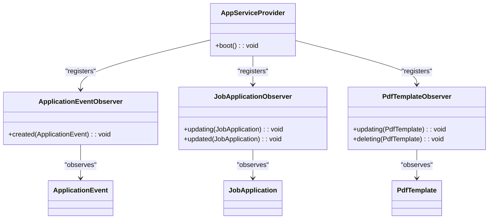
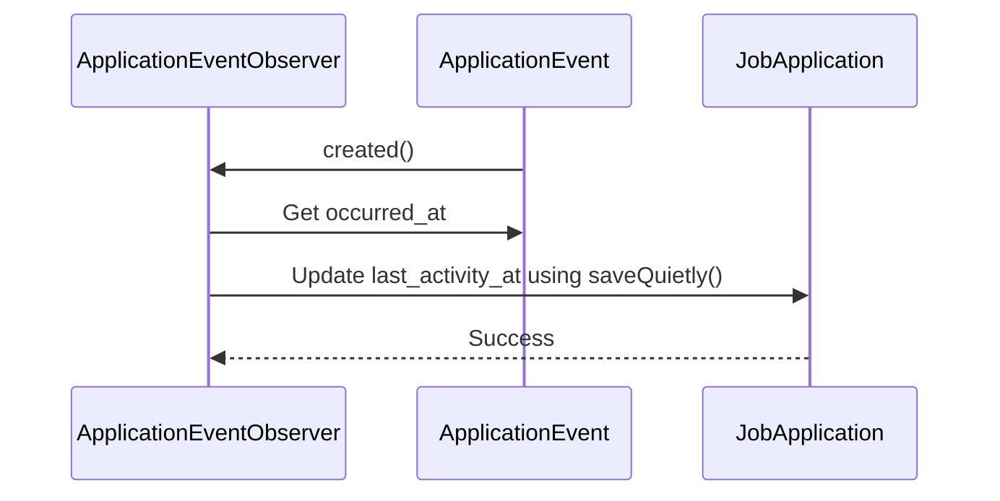
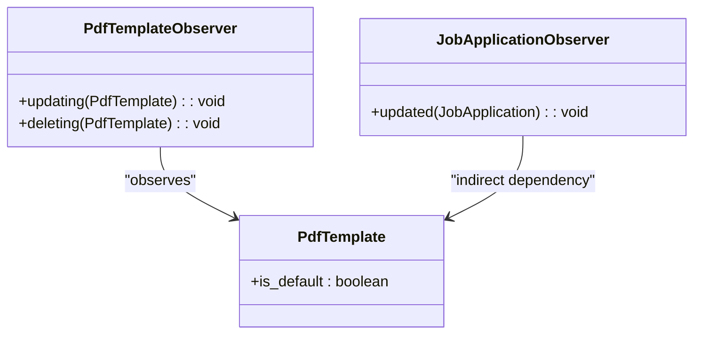

# Observer Pattern Usage

<cite>
**Referenced Files in This Document**   
- [ApplicationEventObserver.php](file://app/Observers/ApplicationEventObserver.php)
- [JobApplicationObserver.php](file://app/Observers/JobApplicationObserver.php)
- [PdfTemplateObserver.php](file://app/Observers/PdfTemplateObserver.php)
- [AppServiceProvider.php](file://app/Providers/AppServiceProvider.php)
- [ApplicationEvent.php](file://app/Models/ApplicationEvent.php)
- [JobApplication.php](file://app/Models/JobApplication.php)
- [PdfTemplate.php](file://app/Models/PdfTemplate.php)
- [PdfSnapshotService.php](file://app/Services/PdfSnapshotService.php)
</cite>

## Table of Contents
1. [Introduction](#introduction)
2. [Observer Registration and Lifecycle](#observer-registration-and-lifecycle)
3. [ApplicationEventObserver Implementation](#applicationeventobserver-implementation)
4. [JobApplicationObserver Implementation](#jobapplicationobserver-implementation)
5. [PdfTemplateObserver Implementation](#pdftemplateobserver-implementation)
6. [Benefits of Observer Pattern](#benefits-of-observer-pattern)
7. [Potential Pitfalls and Performance](#potential-pitfalls-and-performance)
8. [Conclusion](#conclusion)

## Introduction
The cv-builder application implements the observer pattern through Laravel's model observer system to handle side effects for key domain models. This architectural approach separates business logic from core model operations, ensuring clean separation of concerns while maintaining data consistency across related entities. The implementation focuses on three primary models: ApplicationEvent, JobApplication, and PdfTemplate, each with dedicated observers that respond to specific lifecycle events (created, updated, deleted). This documentation details how observers are registered, their specific implementations, and the business logic they encapsulate, providing insight into the application's event-driven architecture.

## Observer Registration and Lifecycle
The observer pattern in the cv-builder application is orchestrated through the AppServiceProvider, which serves as the central registration point for all model observers. During the application boot process, the service provider attaches observers to their respective models using Laravel's observe() method. This registration ensures that observer methods are automatically invoked when specific model events occur.



**Diagram sources**
- [AppServiceProvider.php](file://app/Providers/AppServiceProvider.php#L15-L25)
- [ApplicationEventObserver.php](file://app/Observers/ApplicationEventObserver.php)
- [JobApplicationObserver.php](file://app/Observers/JobApplicationObserver.php)
- [PdfTemplateObserver.php](file://app/Observers/PdfTemplateObserver.php)

**Section sources**
- [AppServiceProvider.php](file://app/Providers/AppServiceProvider.php#L15-L25)

## ApplicationEventObserver Implementation
The ApplicationEventObserver handles the created event for ApplicationEvent model instances, automatically updating the parent JobApplication's last_activity_at timestamp. This observer ensures that any significant interaction with a job application (such as interview scheduling or reply received) automatically updates the application's activity timestamp, providing a comprehensive audit trail.

The observer accesses the jobApplication relationship and performs an update operation using saveQuietly(), which prevents additional model events from being fired during the update. This is critical for preventing observer cascades when the JobApplication update might trigger other observers.



**Diagram sources**
- [ApplicationEventObserver.php](file://app/Observers/ApplicationEventObserver.php#L6-L18)
- [ApplicationEvent.php](file://app/Models/ApplicationEvent.php#L8-L29)
- [JobApplication.php](file://app/Models/JobApplication.php#L15-L65)

**Section sources**
- [ApplicationEventObserver.php](file://app/Observers/ApplicationEventObserver.php#L6-L18)

## JobApplicationObserver Implementation
The JobApplicationObserver implements two primary event handlers that encapsulate distinct business concerns. The updating method automatically updates the last_activity_at timestamp whenever a JobApplication is modified, provided it hasn't been explicitly set, providing an audit trail of user engagement. The updated method triggers PDF snapshot creation when the send_status transitions to 'sent' and no existing snapshot is present, ensuring document immutability at submission time.

The observer employs defensive programming by catching exceptions during PDF generation, preventing failure of the primary update operation while logging errors for monitoring. It checks three conditions before creating a snapshot: the send_status field was actually changed, the new status is 'sent', and no PDF snapshot already exists for this job application.

```mermaid
flowchart TD
A[Job Application Updated] --> B{send_status changed?}
B --> |No| C[Exit]
B --> |Yes| D{send_status = 'sent'?}
D --> |No| C
D --> |Yes| E{Snapshot exists?}
E --> |Yes| C
E --> |No| F[Call PdfSnapshotService::create()]
F --> G[Handle exceptions]
G --> H[Log error if failed]
H --> I[Continue application flow]
```

**Diagram sources**
- [JobApplicationObserver.php](file://app/Observers/JobApplicationObserver.php#L24-L35)
- [PdfSnapshotService.php](file://app/Services/PdfSnapshotService.php#L1-L72)

**Section sources**
- [JobApplicationObserver.php](file://app/Observers/JobApplicationObserver.php#L7-L43)

## PdfTemplateObserver Implementation
The PdfTemplateObserver handles two critical operations for template management: updating and deletion. During the updating event, it ensures data consistency by automatically unsetting the is_default flag on all other templates when a new template is designated as default. This prevents multiple default templates from existing simultaneously and maintains referential integrity.

The deleting event handler implements a safety mechanism that prevents deletion of the default template. When a template marked as default is being deleted, the observer throws an exception with a user-friendly message, requiring the user to designate another template as default before deletion can proceed. This protective measure ensures the application always has a default template available for rendering CVs.



**Diagram sources**
- [PdfTemplateObserver.php](file://app/Observers/PdfTemplateObserver.php#L6-L32)
- [PdfTemplate.php](file://app/Models/PdfTemplate.php#L8-L35)

**Section sources**
- [PdfTemplateObserver.php](file://app/Observers/PdfTemplateObserver.php#L6-L32)

## Benefits of Observer Pattern
The observer pattern implementation in the cv-builder application provides several significant benefits. First, it enables clean separation of concerns by moving side-effect logic out of model classes and controllers, keeping core business logic focused and maintainable. Second, it ensures data consistency across related entities by automatically synchronizing state changes, such as updating activity timestamps when events occur.

The pattern also promotes reusability and testability, as observer classes can be easily unit tested in isolation. Additionally, it provides a clear extension point for adding new functionality without modifying existing code, adhering to the open/closed principle. The centralized registration in AppServiceProvider makes it easy to understand which models have observers and what events they respond to, improving code discoverability and maintainability.

## Potential Pitfalls and Performance
While the observer pattern offers numerous benefits, it also presents potential pitfalls that require careful consideration. One significant risk is observer cascades, where updating one model triggers an observer that updates another model, potentially creating infinite loops. The application mitigates this risk by using saveQuietly() in the ApplicationEventObserver, which prevents additional model events from being fired during the update.

Performance implications of synchronous observation should also be considered, as observer methods execute within the same request lifecycle. The JobApplicationObserver addresses this by wrapping PDF generation in a try-catch block, ensuring that failures in snapshot creation don't prevent the primary update operation from completing. For high-volume operations, consider moving intensive tasks like PDF generation to queued jobs to maintain responsive application performance.

## Conclusion
The observer pattern implementation in the cv-builder application demonstrates a thoughtful approach to managing side effects and maintaining data consistency across related domain models. By leveraging Laravel's model observer system, the application achieves clean separation of concerns while ensuring critical business rules are consistently enforced. The pattern enables automatic timestamp updates, PDF snapshot creation, and template management safeguards, all without cluttering core model classes with incidental logic. With proper consideration of potential pitfalls like observer cascades and performance implications, this architectural approach provides a robust foundation for maintaining data integrity and implementing complex business workflows.