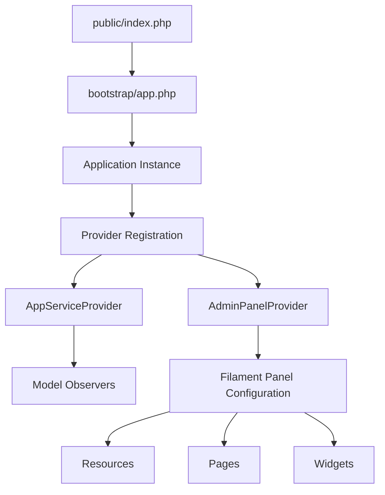
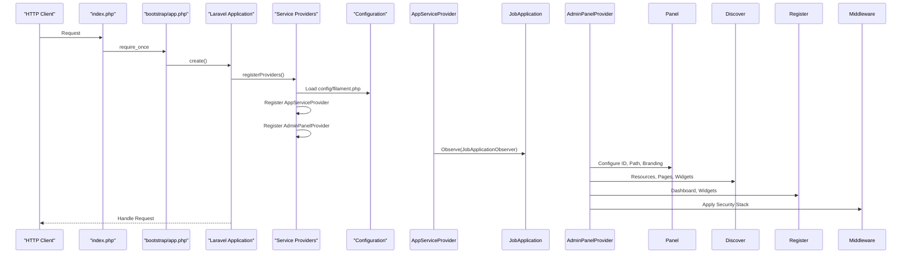
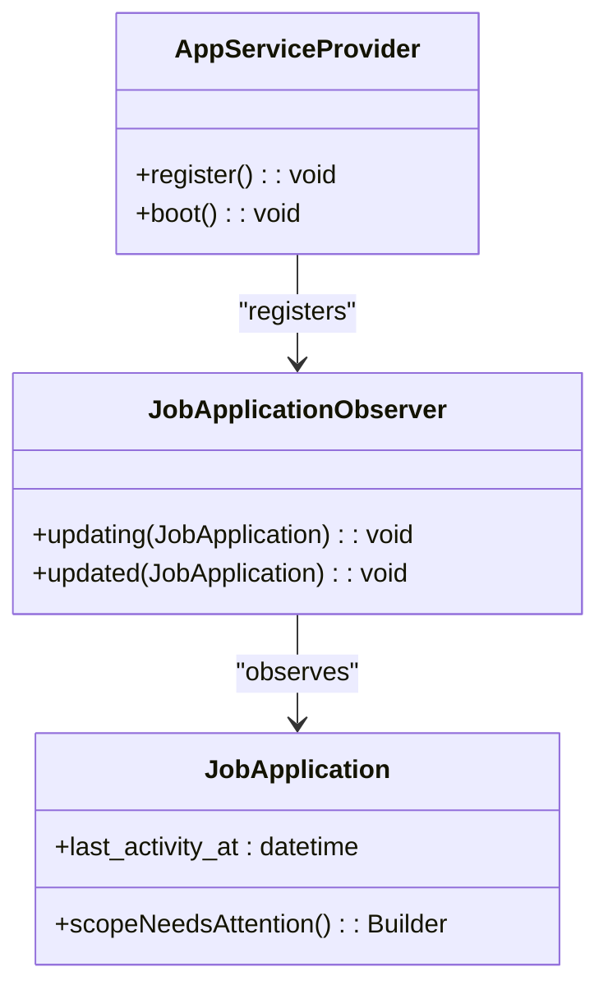
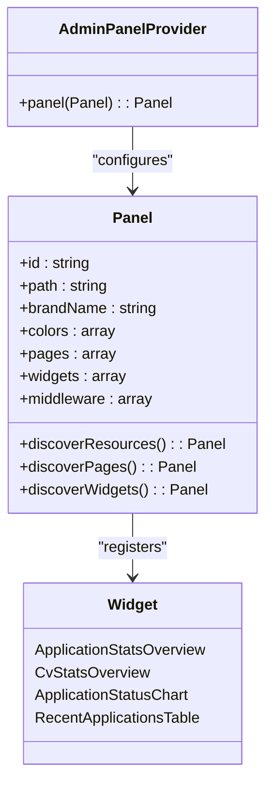
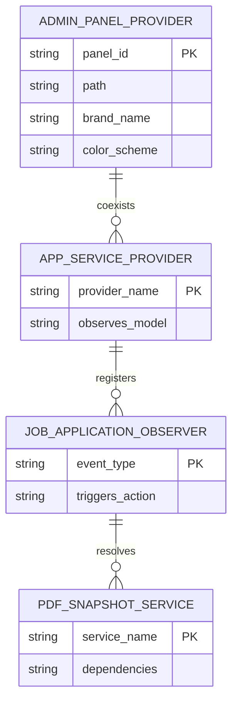

# Service Container and Providers

<cite>
**Referenced Files in This Document**   
- [AppServiceProvider.php](file://app/Providers/AppServiceProvider.php)
- [AdminPanelProvider.php](file://app/Providers/Filament/AdminPanelProvider.php)
- [app.php](file://bootstrap/app.php)
- [index.php](file://public/index.php)
- [filament.php](file://config/filament.php)
- [JobApplication.php](file://app/Models/JobApplication.php)
- [JobApplicationObserver.php](file://app/Observers/JobApplicationObserver.php)
- [PdfSnapshotService.php](file://app/Services/PdfSnapshotService.php)
- [JobApplicationResource.php](file://app/Filament/Resources/JobApplications/JobApplicationResource.php)
</cite>

## Table of Contents
1. [Introduction](#introduction)
2. [Project Structure](#project-structure)
3. [Core Components](#core-components)
4. [Architecture Overview](#architecture-overview)
5. [Detailed Component Analysis](#detailed-component-analysis)
6. [Dependency Analysis](#dependency-analysis)
7. [Performance Considerations](#performance-considerations)
8. [Troubleshooting Guide](#troubleshooting-guide)
9. [Conclusion](#conclusion)

## Introduction
This document provides comprehensive architectural documentation for the service container and service providers within the CV Builder application. It details the bootstrapping process, dependency configuration, and initialization flow of key components such as AppServiceProvider and AdminPanelProvider. The document explains how the Filament admin panel is configured, including resource registration and widget setup, and covers service binding mechanisms, configuration loading, and best practices for provider organization.

## Project Structure
The CV Builder application follows a standard Laravel directory structure with specific enhancements for the Filament admin panel. Key directories include `app/Filament` for admin resources, pages, and widgets; `app/Providers` for service providers; and configuration files under `config/`. The bootstrap process begins in `public/index.php`, proceeds through `bootstrap/app.php`, and culminates in provider registration and application initialization.



**Diagram sources**
- [index.php](file://public/index.php#L1-L20)
- [app.php](file://bootstrap/app.php#L1-L18)
- [AppServiceProvider.php](file://app/Providers/AppServiceProvider.php#L8-L25)
- [AdminPanelProvider.php](file://app/Providers/Filament/AdminPanelProvider.php#L21-L56)

**Section sources**
- [index.php](file://public/index.php#L1-L20)
- [app.php](file://bootstrap/app.php#L1-L18)

## Core Components
The core components of the service container and provider system include the AppServiceProvider for general application bootstrapping, AdminPanelProvider for Filament-specific configuration, and the underlying Laravel service container for dependency resolution. These components work together to register observers, configure admin resources, and initialize application services.

**Section sources**
- [AppServiceProvider.php](file://app/Providers/AppServiceProvider.php#L8-L25)
- [AdminPanelProvider.php](file://app/Providers/Filament/AdminPanelProvider.php#L21-L56)

## Architecture Overview
The application bootstrapping process follows a well-defined sequence from HTTP entry point to fully initialized admin panel. The service container manages dependency injection and service resolution throughout this process, with configuration values loaded from both `config/filament.php` and environment variables.



**Diagram sources**
- [index.php](file://public/index.php#L1-L20)
- [app.php](file://bootstrap/app.php#L1-L18)
- [AppServiceProvider.php](file://app/Providers/AppServiceProvider.php#L8-L25)
- [AdminPanelProvider.php](file://app/Providers/Filament/AdminPanelProvider.php#L21-L56)
- [filament.php](file://config/filament.php#L1-L120)

## Detailed Component Analysis

### AppServiceProvider Analysis
The AppServiceProvider is responsible for bootstrapping application services, primarily by registering model observers. In this implementation, it attaches the JobApplicationObserver to the JobApplication model to automate timestamp updates and trigger PDF snapshot creation.



**Diagram sources**
- [AppServiceProvider.php](file://app/Providers/AppServiceProvider.php#L8-L25)
- [JobApplicationObserver.php](file://app/Observers/JobApplicationObserver.php#L1-L42)
- [JobApplication.php](file://app/Models/JobApplication.php#L1-L66)

**Section sources**
- [AppServiceProvider.php](file://app/Providers/AppServiceProvider.php#L8-L25)
- [JobApplicationObserver.php](file://app/Observers/JobApplicationObserver.php#L1-L42)

### AdminPanelProvider Analysis
The AdminPanelProvider configures the Filament admin panel with custom branding, navigation, and component discovery. It sets up the default panel with amber color scheme, discovers resources and pages automatically, and registers key dashboard widgets for application monitoring.



**Diagram sources**
- [AdminPanelProvider.php](file://app/Providers/Filament/AdminPanelProvider.php#L21-L56)
- [ApplicationStatsOverview.php](file://app/Filament/Widgets/ApplicationStatsOverview.php)
- [CvStatsOverview.php](file://app/Filament/Widgets/CvStatsOverview.php)
- [ApplicationStatusChart.php](file://app/Filament/Widgets/ApplicationStatusChart.php)
- [RecentApplicationsTable.php](file://app/Filament/Widgets/RecentApplicationsTable.php)

**Section sources**
- [AdminPanelProvider.php](file://app/Providers/Filament/AdminPanelProvider.php#L21-L56)

### Service Binding and Resolution
The service container manages dependency resolution for application components, including the PdfSnapshotService which is resolved via the service container in the JobApplicationObserver. This demonstrates proper dependency injection practices and error handling during service resolution.

```mermaid
flowchart TD
A["JobApplication updated event"] --> B{"send_status changed to 'sent'?}
B --> |Yes| C["Resolve PdfSnapshotService"]
C --> D["Call create() method"]
D --> E{"Success?"}
E --> |Yes| F["Create PDFSnapshot record"]
E --> |No| G["Log error, continue"]
B --> |No| H["No action needed"]
```

**Diagram sources**
- [JobApplicationObserver.php](file://app/Observers/JobApplicationObserver.php#L1-L42)
- [PdfSnapshotService.php](file://app/Services/PdfSnapshotService.php#L1-L65)

**Section sources**
- [JobApplicationObserver.php](file://app/Observers/JobApplicationObserver.php#L1-L42)
- [PdfSnapshotService.php](file://app/Services/PdfSnapshotService.php#L1-L65)

## Dependency Analysis
The service providers establish critical dependencies between application components. The AppServiceProvider creates a dependency between the JobApplication model and its observer, while the AdminPanelProvider establishes dependencies between the admin panel and its discovered resources, pages, and widgets.



**Diagram sources**
- [AppServiceProvider.php](file://app/Providers/AppServiceProvider.php#L8-L25)
- [AdminPanelProvider.php](file://app/Providers/Filament/AdminPanelProvider.php#L21-L56)
- [JobApplicationObserver.php](file://app/Observers/JobApplicationObserver.php#L1-L42)
- [PdfSnapshotService.php](file://app/Services/PdfSnapshotService.php#L1-L65)

**Section sources**
- [AppServiceProvider.php](file://app/Providers/AppServiceProvider.php#L8-L25)
- [AdminPanelProvider.php](file://app/Providers/Filament/AdminPanelProvider.php#L21-L56)

## Performance Considerations
The current implementation demonstrates several performance considerations:
- Lazy loading of model relationships in PdfSnapshotService to ensure complete data for PDF generation
- Selective observer registration only for necessary models
- Efficient service container resolution with proper error handling
- Caching configuration through bootstrap/cache directory
- Conditional logic in JobApplication scope to minimize database queries

The service container's ability to resolve services on-demand rather than at boot time helps maintain application performance. However, monitoring should be implemented to track PDF generation performance and potential bottlenecks in the observer pattern.

## Troubleshooting Guide
Common issues and their solutions:
- **PDF snapshots not created**: Verify JobApplicationObserver is registered and send_status transitions correctly
- **Filament resources not appearing**: Check directory structure and namespace in AdminPanelProvider discovery paths
- **Service resolution failures**: Ensure proper binding in service container and check for circular dependencies
- **Configuration not applied**: Verify config/filament.php is properly loaded and environment variables are set

**Section sources**
- [AppServiceProvider.php](file://app/Providers/AppServiceProvider.php#L8-L25)
- [JobApplicationObserver.php](file://app/Observers/JobApplicationObserver.php#L1-L42)
- [PdfSnapshotService.php](file://app/Services/PdfSnapshotService.php#L1-L65)

## Conclusion
The service container and provider system in the CV Builder application provides a robust foundation for application bootstrapping and dependency management. The AppServiceProvider and AdminPanelProvider work in concert to configure application services and the Filament admin panel, respectively. The implementation follows Laravel best practices for service container usage, observer patterns, and dependency injection. Proper error handling and logging ensure reliability, while the modular structure allows for easy maintenance and extension.