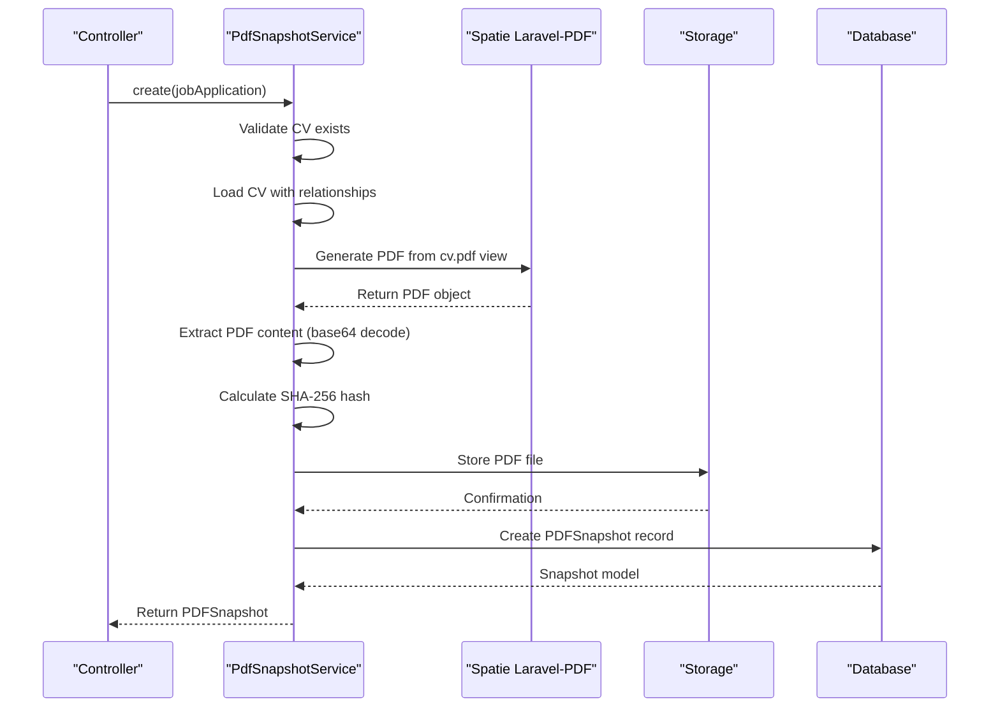
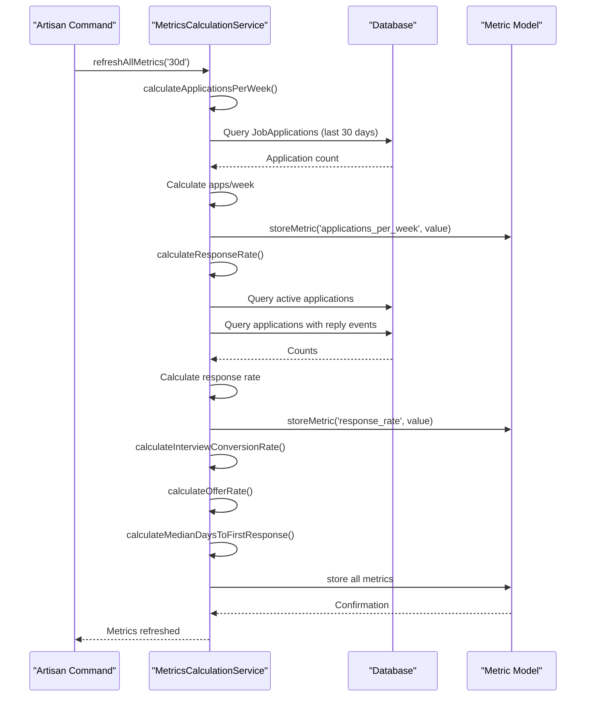

# Service Layer Design

<cite>
**Referenced Files in This Document**   
- [PdfSnapshotService.php](file://app/Services/PdfSnapshotService.php) - *Updated in recent commit*
- [KeywordCoverageService.php](file://app/Services/KeywordCoverageService.php) - *Updated in recent commit*
- [MetricsCalculationService.php](file://app/Services/MetricsCalculationService.php) - *Updated in recent commit*
- [ApplicationEventObserver.php](file://app/Observers/ApplicationEventObserver.php) - *Updated in recent commit*
- [CvPdfController.php](file://app/Http/Controllers/CvPdfController.php)
- [JobApplicationObserver.php](file://app/Observers/JobApplicationObserver.php)
- [JobApplicationForm.php](file://app/Filament/Resources/JobApplications/Schemas/JobApplicationForm.php)
- [Metric.php](file://app/Models/Metric.php) - *Added in recent commit*
</cite>

## Update Summary
**Changes Made**   
- Updated MetricsCalculationService Implementation section to reflect division-by-zero fix using max() function
- Added ApplicationEventObserver Implementation section detailing the use of saveQuietly()
- Updated Benefits of Service Layer Pattern to include observer pattern benefits
- Enhanced Error Handling and Logging section with new observer error handling details
- Updated referenced files list to include ApplicationEventObserver.php

## Table of Contents
1. [Introduction](#introduction)
2. [Core Services Overview](#core-services-overview)
3. [PdfSnapshotService Implementation](#pdfsnapshotservice-implementation)
4. [KeywordCoverageService Implementation](#keywordcoverageservice-implementation)
5. [MetricsCalculationService Implementation](#metricscalculationservice-implementation)
6. [ApplicationEventObserver Implementation](#applicationeventobserver-implementation)
7. [Service Injection and Controller Usage](#service-injection-and-controller-usage)
8. [Sequence Diagram: Controller-Service Interaction](#sequence-diagram-controller-service-interaction)
9. [Sequence Diagram: Metrics Calculation Workflow](#sequence-diagram-metrics-calculation-workflow)
10. [Benefits of Service Layer Pattern](#benefits-of-service-layer-pattern)
11. [Error Handling and Logging](#error-handling-and-logging)
12. [Conclusion](#conclusion)

## Introduction
The CV Builder application implements a service layer pattern to encapsulate business logic in dedicated service classes. This architectural approach separates business concerns from HTTP and presentation logic, promoting cleaner code organization, improved testability, and enhanced reusability across different application components. The service layer contains three primary classes: PdfSnapshotService for PDF generation, KeywordCoverageService for keyword analysis, and MetricsCalculationService for performance metrics calculation. These services are injected into controllers and other components to perform complex operations while maintaining separation of concerns.

## Core Services Overview
The service layer in the CV Builder application consists of three specialized service classes that handle distinct business capabilities:

- **PdfSnapshotService**: Manages the creation of PDF snapshots for job applications, including PDF generation, file storage, and integrity verification through SHA-256 hashing.
- **KeywordCoverageService**: Performs keyword analysis between job descriptions and CV content to calculate coverage percentages and identify missing keywords.
- **MetricsCalculationService**: Calculates and persists key performance metrics for job applications, including response rates, interview conversion rates, and median response times.

These services are designed to be stateless, reusable components that can be invoked from various parts of the application, including controllers, observers, and Filament forms. They encapsulate complex business logic while abstracting away implementation details such as third-party package integration and data validation.

**Section sources**
- [PdfSnapshotService.php](file://app/Services/PdfSnapshotService.php#L9-L64)
- [KeywordCoverageService.php](file://app/Services/KeywordCoverageService.php#L4-L56)
- [MetricsCalculationService.php](file://app/Services/MetricsCalculationService.php#L7-L169)

## PdfSnapshotService Implementation
The PdfSnapshotService class handles the complete workflow for creating PDF snapshots of CVs when job applications are sent. The service's primary method, `create()`, accepts a JobApplication model and orchestrates the entire PDF generation process.

The implementation follows a structured sequence:
1. Validates that the job application has an associated CV
2. Eager loads the CV with all related sections and content
3. Generates a PDF using the Spatie Laravel-PDF package
4. Calculates a SHA-256 hash for content integrity verification
5. Stores the PDF file with a predictable naming convention
6. Creates a database record in the PDFSnapshots table

The service ensures data consistency by storing both the file path and cryptographic hash, enabling verification of file integrity. The PDF is stored in a dedicated directory with a filename that includes the job application ID and content hash, preventing duplicate files and enabling content-based deduplication.

The service integrates with Laravel's Storage facade for file persistence and uses the Spatie Laravel-PDF package as the underlying PDF generation engine, abstracting away the complexity of PDF rendering from the calling components.

**Section sources**
- [PdfSnapshotService.php](file://app/Services/PdfSnapshotService.php#L9-L64)

## KeywordCoverageService Implementation
The KeywordCoverageService class provides functionality for analyzing keyword coverage between job descriptions and CV content. This service implements a text processing pipeline that tokenizes input text, removes common stopwords, and calculates keyword matching metrics.

The service exposes two primary methods:
- `tokenize(string $text)`: Processes text by converting to lowercase, removing punctuation, splitting into tokens, and filtering out stopwords and short tokens (less than 3 characters). The method uses a predefined list of common English stopwords to improve analysis accuracy.
- `calculateCoverage(string $jobDescription, string $cvContent)`: Computes the keyword coverage percentage by comparing tokenized keywords from the job description against those in the CV content. The method returns a comprehensive analysis including coverage percentage, matched count, total keywords, and the top 20 missing keywords.

The implementation uses PHP's array functions to efficiently compute set operations (intersection and difference) between keyword sets. The coverage percentage is calculated as the ratio of matched keywords to total job description keywords, rounded to two decimal places. The service limits the returned missing keywords to 20 items to prevent overwhelming output while still providing actionable insights.

This service enables the application to provide immediate feedback to users about how well their CV matches specific job requirements, helping them identify areas for improvement.

**Section sources**
- [KeywordCoverageService.php](file://app/Services/KeywordCoverageService.php#L4-L56)

## MetricsCalculationService Implementation
The MetricsCalculationService class handles the calculation and persistence of key performance metrics for job applications. This service provides a comprehensive analytics capability that tracks application performance over configurable time periods.

The service exposes several calculation methods, each focused on a specific metric:
- `calculateApplicationsPerWeek()`: Computes the average number of applications submitted per week over a specified period
- `calculateResponseRate()`: Calculates the percentage of applications that received a reply, excluding withdrawn applications
- `calculateInterviewConversionRate()`: Determines the percentage of applications that progressed to the interview stage
- `calculateOfferRate()`: Measures the percentage of applications that resulted in job offers
- `calculateMedianDaysToFirstResponse()`: Computes the median number of days between application submission and first response

The service uses a consistent pattern across all calculation methods:
1. Parse the time period parameter (e.g., '30d' for 30 days)
2. Query the database for relevant job applications within the time period
3. Apply business rules (e.g., excluding withdrawn applications)
4. Perform the specific calculation using appropriate mathematical formulas
5. Store the result in the metrics table using the `storeMetric()` method

A critical improvement in the implementation is the handling of division-by-zero scenarios. In the `calculateApplicationsPerWeek()` method, the code now uses `max(1, ceil($days / 7))` to ensure the number of weeks is never zero, preventing division-by-zero errors. This makes the service more robust and eliminates a potential source of exceptions.

The `refreshAllMetrics()` method provides a convenient way to update all metrics at once, which is used by the scheduled Artisan command. The service stores metrics with their time period and last refresh timestamp, enabling historical tracking and ensuring data freshness.

The implementation handles edge cases gracefully, returning 0 for metrics when no data is available rather than throwing exceptions. This makes the service robust and easy to integrate into various parts of the application.

**Section sources**
- [MetricsCalculationService.php](file://app/Services/MetricsCalculationService.php#L7-L169)
- [Metric.php](file://app/Models/Metric.php)

## ApplicationEventObserver Implementation
The ApplicationEventObserver class handles the creation of application events and updates related job application records. This observer implements the observer pattern to automatically update job application state when events occur.

The primary method, `created()`, is triggered when a new ApplicationEvent is created. It performs the following actions:
1. Retrieves the associated job application from the event
2. Updates the job application's last_activity_at timestamp to the event's occurred_at time (or current time if not specified)
3. Saves the updated job application using saveQuietly() to prevent infinite observer loops

The use of saveQuietly() is a critical implementation detail that prevents recursive observer calls. Without this, updating the job application would trigger its own observer, potentially creating an infinite loop. This demonstrates a thoughtful approach to event-driven architecture and observer pattern implementation.

The observer ensures that job applications always have accurate last activity timestamps, which is essential for sorting, filtering, and displaying application timelines in the user interface.

**Section sources**
- [ApplicationEventObserver.php](file://app/Observers/ApplicationEventObserver.php#L6-L18)

## Service Injection and Controller Usage
Services in the CV Builder application are injected into controllers and other components using Laravel's service container. The application demonstrates multiple patterns for service utilization across different contexts.

In the CvPdfController, the Spatie Laravel-PDF facade is used directly to generate downloadable PDFs of CVs. While this controller doesn't explicitly inject the PdfSnapshotService, it demonstrates similar PDF generation functionality for direct CV downloads.

More significantly, the KeywordCoverageService is directly instantiated in the JobApplicationForm schema using Laravel's `app()` helper to resolve the service from the container. This occurs when displaying keyword coverage information in the job application creation form, where the service analyzes the job description against the selected CV's content to provide real-time feedback.

The PdfSnapshotService is automatically invoked through the JobApplicationObserver when a job application's send status changes to "sent". The observer resolves the PdfSnapshotService from the container and calls its create method, demonstrating event-driven service invocation. This pattern ensures that PDF snapshots are created consistently whenever an application is sent, without requiring the controller to manage this business logic.

The MetricsCalculationService is injected into the Artisan command via constructor injection and is also used directly in tests. The service is designed to be called from multiple entry points, including scheduled tasks, API endpoints, and manual refresh operations.

These usage patterns illustrate how services can be accessed and utilized in different parts of the application while maintaining loose coupling between components.

**Section sources**
- [CvPdfController.php](file://app/Http/Controllers/CvPdfController.php#L8-L33)
- [JobApplicationObserver.php](file://app/Observers/JobApplicationObserver.php#L7-L41)
- [JobApplicationForm.php](file://app/Filament/Resources/JobApplications/Schemas/JobApplicationForm.php#L126-L143)
- [routes/console.php](file://routes/console.php#L15-L17)

## Sequence Diagram: Controller-Service Interaction

**Diagram sources**
- [PdfSnapshotService.php](file://app/Services/PdfSnapshotService.php#L9-L64)
- [CvPdfController.php](file://app/Http/Controllers/CvPdfController.php#L8-L33)

## Sequence Diagram: Metrics Calculation Workflow

**Diagram sources**
- [MetricsCalculationService.php](file://app/Services/MetricsCalculationService.php#L7-L169)
- [routes/console.php](file://routes/console.php#L15-L17)
- [Metric.php](file://app/Models/Metric.php)

## Benefits of Service Layer Pattern
The service layer pattern implemented in the CV Builder application provides several significant architectural benefits:

**Separation of Concerns**: By encapsulating business logic in dedicated service classes, the application achieves clear separation between business rules and HTTP concerns. Controllers focus on request handling and response formatting, while services manage complex business operations.

**Improved Testability**: Services are easily testable in isolation, as demonstrated by the comprehensive unit and feature tests in the application. The PdfSnapshotServiceTest, KeywordCoverageServiceTest, and MetricsCalculationServiceTest verify service behavior without requiring HTTP requests or database setup, enabling fast and reliable testing.

**Enhanced Reusability**: Services can be invoked from multiple entry points, including controllers, observers, commands, and scheduled jobs. The MetricsCalculationService, for example, is used in both the Artisan command and directly in tests, demonstrating its reusability across different contexts.

**Simplified Maintenance**: Business logic changes can be made in a single location (the service) rather than being scattered across multiple controllers. This reduces the risk of inconsistencies and makes the codebase easier to maintain.

**Better Error Handling**: Services can implement centralized error handling and logging strategies. The PdfSnapshotService, for instance, could be extended to include comprehensive error handling, retry mechanisms, and detailed logging without affecting calling components.

**Easier Debugging**: When issues occur, developers can trace business operations through well-defined service boundaries, making it easier to identify the source of problems.

**Consistent Business Logic**: The service layer ensures that business rules are applied consistently across the application. For example, the MetricsCalculationService always excludes withdrawn applications from rate calculations, ensuring consistent metrics throughout the system.

**Observer Pattern Integration**: The ApplicationEventObserver demonstrates how the service layer can integrate with Laravel's observer pattern to automatically update related data. The use of saveQuietly() prevents infinite loops, showing thoughtful implementation of event-driven architecture.

**Section sources**
- [PdfSnapshotService.php](file://app/Services/PdfSnapshotService.php#L9-L64)
- [KeywordCoverageService.php](file://app/Services/KeywordCoverageService.php#L4-L56)
- [MetricsCalculationService.php](file://app/Services/MetricsCalculationService.php#L7-L169)
- [ApplicationEventObserver.php](file://app/Observers/ApplicationEventObserver.php#L6-L18)

## Error Handling and Logging
The service layer implements appropriate error handling strategies to ensure robust operation and provide meaningful feedback when issues occur.

The PdfSnapshotService includes validation at the beginning of its create method, throwing an exception if the job application lacks an associated CV. This prevents the service from proceeding with invalid data and provides clear error messaging.

In the JobApplicationObserver, the application implements defensive error handling around PDF snapshot creation. If the PdfSnapshotService fails to create a snapshot, the error is caught, logged using Laravel's logger, but does not prevent the job application update from completing. This graceful degradation ensures that critical operations (updating the application status) are not blocked by secondary operations (creating a PDF snapshot).

The KeywordCoverageService implements defensive programming by handling edge cases such as empty job descriptions, returning appropriate default values (0% coverage, empty missing keywords array) rather than throwing exceptions. This makes the service more robust and easier to use in various contexts.

The MetricsCalculationService follows a similar pattern, returning 0 for metrics when no data is available rather than throwing exceptions. The service has been enhanced to prevent division-by-zero errors by using max(1, ceil($days / 7)) to ensure the number of weeks is never zero. This makes the service more robust and eliminates a potential source of exceptions.

The ApplicationEventObserver uses saveQuietly() when updating job applications to prevent infinite observer loops. This is a critical error prevention mechanism that avoids recursive calls and potential stack overflow issues.

All services follow the principle of failing gracefully when possible, allowing the application to continue functioning even when non-critical operations encounter issues. The services also provide clear return values that calling components can use to determine success or failure and take appropriate action.

**Section sources**
- [PdfSnapshotService.php](file://app/Services/PdfSnapshotService.php#L9-L64)
- [JobApplicationObserver.php](file://app/Observers/JobApplicationObserver.php#L7-L41)
- [MetricsCalculationService.php](file://app/Services/MetricsCalculationService.php#L7-L169)
- [ApplicationEventObserver.php](file://app/Observers/ApplicationEventObserver.php#L6-L18)

## Conclusion
The service layer in the CV Builder application effectively encapsulates business logic in dedicated, reusable components that promote clean architecture and maintainability. The PdfSnapshotService, KeywordCoverageService, and MetricsCalculationService demonstrate how complex operations like PDF generation, text analysis, and performance metrics calculation can be abstracted into focused service classes that are easy to test, maintain, and reuse.

By separating business concerns from HTTP and presentation logic, the application achieves better code organization, improved testability, and enhanced flexibility. The service layer pattern enables the application to evolve more easily, as business logic changes can be made in isolated components without affecting the broader system architecture.

The implementation shows effective integration with third-party packages, proper error handling, and thoughtful consideration of edge cases. Recent improvements, such as the division-by-zero fix in MetricsCalculationService and the use of saveQuietly() in ApplicationEventObserver, demonstrate ongoing refinement of the codebase for stability and reliability.

As the application grows, additional business logic can be similarly encapsulated in new service classes, maintaining the architectural integrity and scalability of the codebase.