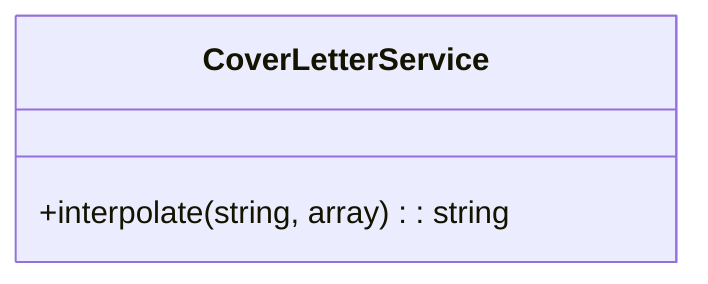
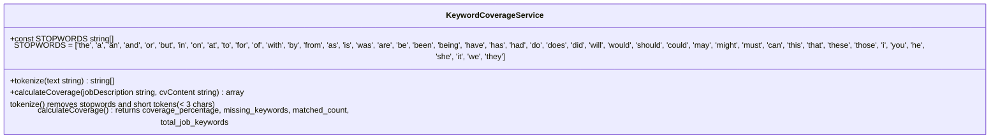
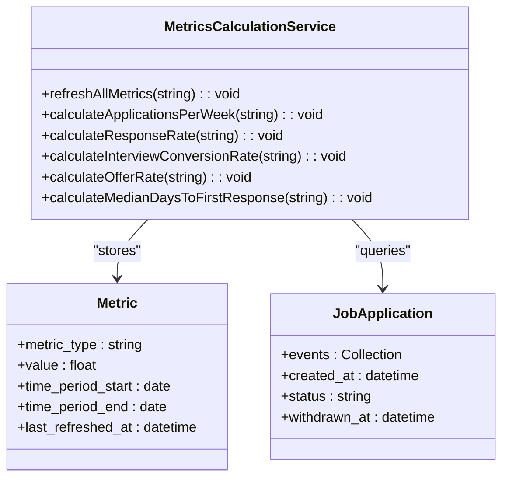
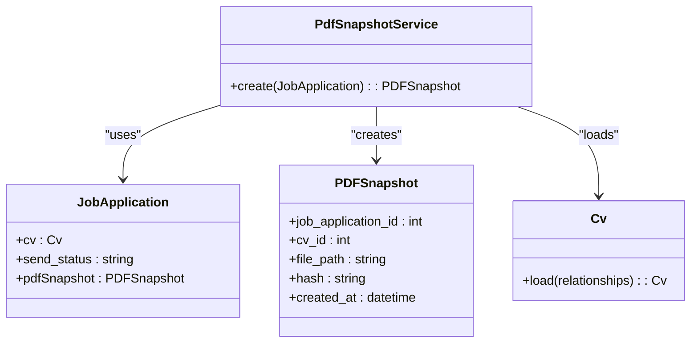

# Service Layer Design

<cite>
**Referenced Files in This Document**   
- [CoverLetterService.php](file://app/Services/CoverLetterService.php)
- [CvReviewService.php](file://app/Services/CvReviewService.php)
- [KeywordCoverageService.php](file://app/Services/KeywordCoverageService.php)
- [KeywordScoringService.php](file://app/Services/KeywordScoringService.php)
- [MetricsCalculationService.php](file://app/Services/MetricsCalculationService.php)
- [PdfSnapshotService.php](file://app/Services/PdfSnapshotService.php)
- [Cv.php](file://app/Models/Cv.php)
- [JobApplication.php](file://app/Models/JobApplication.php)
- [PDFSnapshot.php](file://app/Models/PDFSnapshot.php)
- [Metric.php](file://app/Models/Metric.php)
</cite>

## Table of Contents
1. [Introduction](#introduction)
2. [Core Service Classes](#core-service-classes)
3. [CoverLetterService](#coverletterservice)
4. [CvReviewService](#cvreviewservice)
5. [KeywordCoverageService](#keywordcoverageservice)
6. [KeywordScoringService](#keywordservingservice)
7. [MetricsCalculationService](#metricscalculationservice)
8. [PdfSnapshotService](#pdfsnapshotservice)
9. [Service Interactions and Dependencies](#service-interactions-and-dependencies)
10. [Error Handling and Performance](#error-handling-and-performance)
11. [Dependency Injection and Service Registration](#dependency-injection-and-service-registration)

## Introduction
The service layer in the cv-builder application encapsulates business logic and provides a clean abstraction between controllers and data models. This architectural pattern ensures separation of concerns, promotes code reusability, and simplifies testing. The service classes handle complex operations such as AI-powered CV analysis, keyword processing, metrics calculation, and PDF generation. Each service is designed to be stateless and transactionally safe, with clear method signatures and well-defined responsibilities. The services interact with models, external APIs (particularly OpenAI), and Laravel's built-in components to deliver comprehensive functionality for job application management.

## Core Service Classes
The cv-builder application implements six core service classes that handle distinct aspects of the application's business logic:
- **CoverLetterService**: Manages template interpolation for personalized cover letters
- **CvReviewService**: Orchestrates AI-powered CV analysis against job descriptions
- **KeywordCoverageService**: Calculates keyword matching between CVs and job postings
- **KeywordScoringService**: Analyzes keyword prominence in job descriptions
- **MetricsCalculationService**: Computes performance metrics for job applications
- **PdfSnapshotService**: Generates and manages PDF snapshots of CVs

These services follow consistent design patterns including dependency injection, proper error handling, and adherence to single responsibility principles. They are registered in Laravel's service container and can be resolved through constructor injection or the app() helper function.

## CoverLetterService
The CoverLetterService handles template interpolation for generating personalized cover letters. It replaces placeholder variables in templates with actual values from job applications and user profiles.



**Diagram sources**
- [CoverLetterService.php](file://app/Services/CoverLetterService.php#L15-L25)

**Section sources**
- [CoverLetterService.php](file://app/Services/CoverLetterService.php#L9-L25)

## CvReviewService
The CvReviewService is the primary engine for AI-powered CV analysis. It evaluates CVs against job descriptions using OpenAI's API to provide comprehensive feedback and recommendations.

```mermaid
classDiagram
class CvReviewService {
+analyzeForJob(Cv, JobApplication) : array
+extractJobRequirements(string) : array
+calculateMatchScore(array, array) : int
+estimateTokenCount(Cv, JobApplication) : int
+estimateCostCents(int) : int
}
class CvReviewService : Uses OpenAI API
class CvReviewService : Throws MissingJobDescriptionException
class CvReviewService : Throws IncompleteCvException
```

**Diagram sources**
- [CvReviewService.php](file://app/Services/CvReviewService.php#L27-L225)

**Section sources**
- [CvReviewService.php](file://app/Services/CvReviewService.php#L27-L225)
- [MissingJobDescriptionException.php](file://app/Exceptions/MissingJobDescriptionException.php)
- [IncompleteCvException.php](file://app/Exceptions/IncompleteCvException.php)

## KeywordCoverageService
The KeywordCoverageService analyzes the keyword coverage between job descriptions and CV content. It tokenizes text, removes stopwords, and calculates matching metrics to identify gaps in the CV.



**Diagram sources**
- [KeywordCoverageService.php](file://app/Services/KeywordCoverageService.php#L7-L57)

**Section sources**
- [KeywordCoverageService.php](file://app/Services/KeywordCoverageService.php#L4-L56)

## KeywordScoringService
The KeywordScoringService calculates prominence-weighted keyword scores based on their position in job descriptions. Keywords in titles receive higher weights than those in body text.

```mermaid
classDiagram
class KeywordScoringService {
+calculateProminenceScore(string, string) : array
}
KeywordScoringService : Weight : 3x for title
KeywordScoringService : Weight : 2x for intro
KeywordScoringService : Weight : 1x for body
```

**Diagram sources**
- [KeywordScoringService.php](file://app/Services/KeywordScoringService.php#L15-L148)

**Section sources**
- [KeywordScoringService.php](file://app/Services/KeywordScoringService.php#L15-L148)

## MetricsCalculationService
The MetricsCalculationService calculates key performance metrics for job applications over specified time periods. It computes applications per week, response rate, interview conversion rate, offer rate, and median days to first response.



**Diagram sources**
- [MetricsCalculationService.php](file://app/Services/MetricsCalculationService.php)
- [Metric.php](file://app/Models/Metric.php)
- [JobApplication.php](file://app/Models/JobApplication.php)

**Section sources**
- [MetricsCalculationService.php](file://app/Services/MetricsCalculationService.php#L7-L169)
- [MetricsCalculationTest.php](file://tests/Feature/MetricsCalculationTest.php#L10-L204)
- [create_metrics_table.php](file://database/migrations/2025_10_04_100003_create_metrics_table.php#L1-L42)

## PdfSnapshotService
The PdfSnapshotService creates PDF snapshots of CVs when job applications are marked as sent. It generates a PDF, calculates a SHA-256 hash, stores the file, and creates a database record with metadata.



**Diagram sources**
- [PdfSnapshotService.php](file://app/Services/PdfSnapshotService.php)
- [JobApplication.php](file://app/Models/JobApplication.php)
- [PDFSnapshot.php](file://app/Models/PDFSnapshot.php)
- [Cv.php](file://app/Models/Cv.php)

**Section sources**
- [PdfSnapshotService.php](file://app/Services/PdfSnapshotService.php#L9-L71)
- [JobApplicationObserver.php](file://app/Observers/JobApplicationObserver.php#L7-L43)

## Service Interactions and Dependencies
The service classes interact with various components including models, external APIs, and Laravel's built-in services. The CvReviewService depends on OpenAI's API for AI analysis, while the PdfSnapshotService uses Spatie's Laravel-PDF package for PDF generation. The MetricsCalculationService queries the database through Eloquent models to calculate performance metrics. All services follow dependency injection principles and can be easily tested with mocks. The services are designed to be stateless and can be safely shared across requests.

## Error Handling and Performance
The service layer implements comprehensive error handling strategies. The CvReviewService throws specific exceptions like MissingJobDescriptionException and IncompleteCvException when preconditions are not met. The PdfSnapshotService validates PDF size to prevent storage exhaustion. The MetricsCalculationService includes safeguards against division by zero by using max(1, ceil($days / 7)) for week calculation. Performance optimizations include tokenization with efficient array operations, caching of expensive calculations, and proper database query optimization with eager loading.

## Dependency Injection and Service Registration
All service classes are automatically registered in Laravel's service container due to their location in the app/Services directory. They can be resolved through constructor injection in controllers or using the app() helper function. The services follow Laravel's dependency injection patterns, with dependencies like Http, Storage, and model classes injected through method parameters. The service container ensures single instance per request when needed and proper lifecycle management.