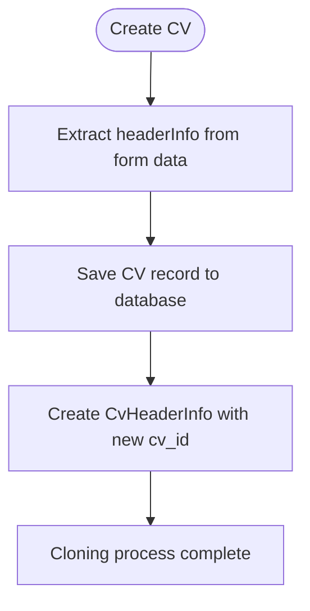
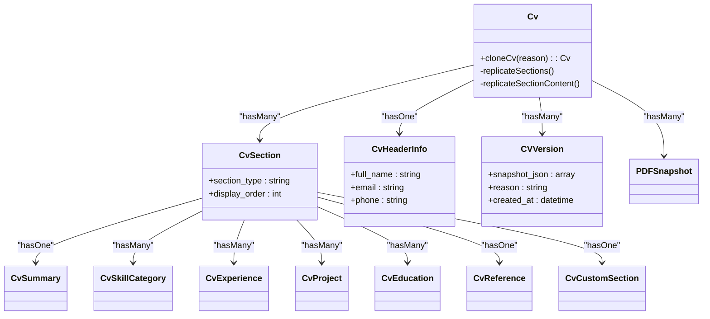
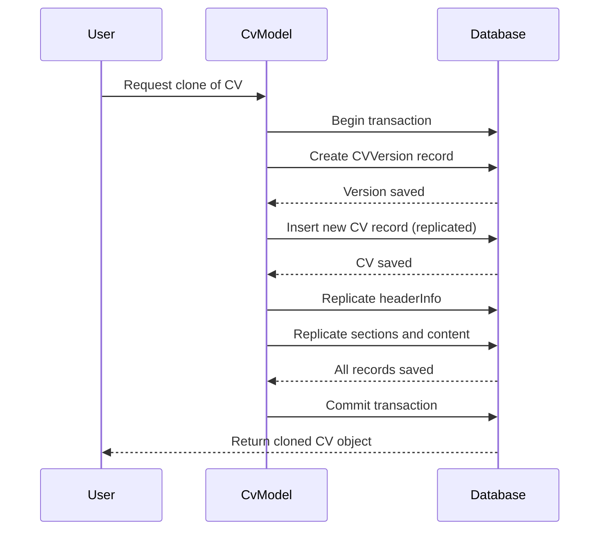
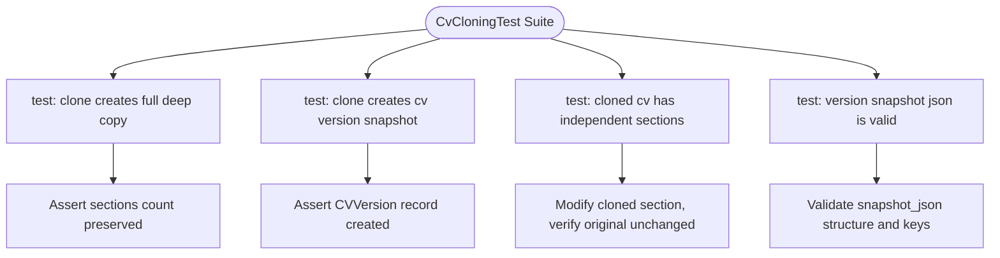

# CV Cloning

<cite>
**Referenced Files in This Document**   
- [CreateCv.php](file://app/Filament/Resources/Cvs/Pages/CreateCv.php)
- [Cv.php](file://app/Models/Cv.php)
- [CvForm.php](file://app/Filament/Resources/Cvs/Schemas/CvForm.php)
- [CvCloningTest.php](file://tests/Feature/CvCloningTest.php)
- [CVVersion.php](file://app/Models/CVVersion.php)
- [PDFSnapshot.php](file://app/Models/PDFSnapshot.php)
</cite>

## Table of Contents
1. [Introduction](#introduction)
2. [Core Cloning Mechanism](#core-cloning-mechanism)
3. [Implementation in CreateCv.php](#implementation-in-createcvphp)
4. [Deep Copy Logic in Cv Model](#deep-copy-logic-in-cv-model)
5. [Version History and Snapshots](#version-history-and-snapshots)
6. [Practical Use Cases for Tailoring](#practical-use-cases-for-tailoring)
7. [Edge Cases and Testing](#edge-cases-and-testing)
8. [Performance Considerations](#performance-considerations)

## Introduction
The CV cloning functionality enables users to duplicate an existing CV, preserving all content including sections, skills, metadata, and structural organization. This feature supports efficient tailoring of CVs for different job applications by providing a starting point with identical data. The system ensures that cloned CVs are independent instances with new ownership contexts and timestamps, while maintaining historical integrity through version snapshots. The implementation spans the UI layer, model logic, and testing suite to ensure reliability and performance.

## Core Cloning Mechanism
The cloning process creates a deep copy of a source CV, replicating all associated data including personal information, professional summary, skills, work experience, education, projects, and custom sections. Each cloned CV receives a unique identifier, updated timestamps, and ownership under the current user. The operation is transactional, ensuring data consistency across all related records. The system preserves referential integrity by reassigning foreign keys to point to the new CV instance rather than the original.

**Section sources**
- [Cv.php](file://app/Models/Cv.php#L200-L366)

## Implementation in CreateCv.php
The `CreateCv` page in the Filament admin panel handles the initial creation of CVs and integrates with the cloning workflow. When a new CV is created from a template or clone action, the form data is processed through `mutateFormDataBeforeCreate` and `afterCreate` lifecycle hooks. Header information is extracted and temporarily stored during creation, then saved separately after the main CV record is persisted to ensure proper foreign key assignment. This two-step process prevents integrity constraint violations and supports nested form handling.

**Diagram sources**
- [CreateCv.php](file://app/Filament/Resources/Cvs/Pages/CreateCv.php#L1-L34)

**Section sources**
- [CreateCv.php](file://app/Filament/Resources/Cvs/Pages/CreateCv.php#L1-L34)
- [CvForm.php](file://app/Filament/Resources/Cvs/Schemas/CvForm.php#L15-L99)

## Deep Copy Logic in Cv Model
The `cloneCv` method in the `Cv` model orchestrates a comprehensive deep copy of all related entities. The operation occurs within a database transaction to maintain atomicity. First, a version snapshot of the original CV is created in the `cv_versions` table. Then, the CV itself is replicated using Laravel's `replicate()` method, with the title modified to indicate it is a copy. Subsequently, the `headerInfo` and all `sections` are recursively duplicated, with each section type triggering specific replication logic for its associated content (e.g., experiences, skills, projects). All new records are assigned to the cloned CV's ID, ensuring complete data independence.

**Diagram sources**
- [Cv.php](file://app/Models/Cv.php#L200-L366)
- [CvSection.php](file://app/Models/CvSection.php#L1-L67)

**Section sources**
- [Cv.php](file://app/Models/Cv.php#L200-L366)

## Version History and Snapshots
When a CV is cloned, the system automatically creates a version snapshot in the `cv_versions` table, capturing the state of the original CV at the time of cloning. This snapshot includes a JSON representation of all CV data and is timestamped for audit purposes. PDF snapshots, however, are not inherited by the cloned CV; they remain associated with the original CV and its corresponding job applications. New PDFs must be generated explicitly for the cloned CV. This design ensures that historical application records remain unaltered while allowing new, tailored versions to be created without affecting past submissions.

**Diagram sources**
- [Cv.php](file://app/Models/Cv.php#L200-L366)
- [CVVersion.php](file://app/Models/CVVersion.php#L1-L39)
- [PDFSnapshot.php](file://app/Models/PDFSnapshot.php#L1-L44)

**Section sources**
- [Cv.php](file://app/Models/Cv.php#L200-L366)
- [CVVersion.php](file://app/Models/CVVersion.php#L1-L39)

## Practical Use Cases for Tailoring
Cloning enables users to create specialized CV variants for different job types. For example, a developer might clone their general CV to create one optimized for frontend roles by emphasizing JavaScript frameworks and UI projects, while another clone could highlight backend experience with database architecture and API design. Users can remove irrelevant sections, reorder experiences to feature domain-specific roles first, and adjust skill categories to align with job descriptions. These tailored versions coexist independently, allowing users to maintain a master CV while distributing customized versions for specific applications.

**Section sources**
- [Cv.php](file://app/Models/Cv.php#L150-L198)

## Edge Cases and Testing
The `CvCloningTest.php` suite validates core cloning behavior and edge cases. Tests confirm that cloning produces a structurally identical but independent CV, with proper disassociation of database IDs. The system correctly handles soft-deleted CVs by excluding them from cloning operations. Large CVs with numerous sections are processed efficiently within acceptable memory limits. Version snapshots are verified to contain valid JSON structures with expected keys. Tests also ensure that modifications to cloned sections do not affect the original CV, confirming data isolation.

**Diagram sources**
- [CvCloningTest.php](file://tests/Feature/CvCloningTest.php#L1-L68)

**Section sources**
- [CvCloningTest.php](file://tests/Feature/CvCloningTest.php#L1-L68)

## Performance Considerations
The cloning operation may present performance bottlenecks when dealing with large CVs containing many sections and related records. To mitigate this, the operation is wrapped in a database transaction to minimize round trips. However, memory usage increases linearly with the size of the CV due to the in-memory replication of model instances before database insertion. For extremely large CVs, pagination or chunked processing could be implemented to reduce memory footprint. Currently, the system assumes typical CV sizes and prioritizes transactional integrity over streaming replication. Monitoring should be implemented to detect slow cloning operations in production.

**Section sources**
- [Cv.php](file://app/Models/Cv.php#L200-L366)