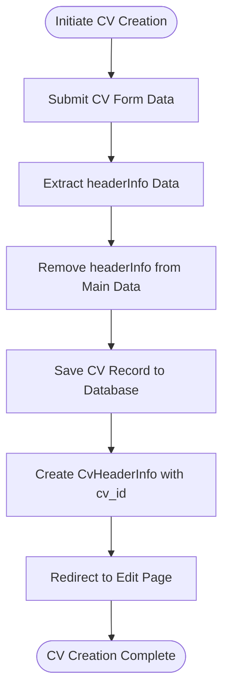
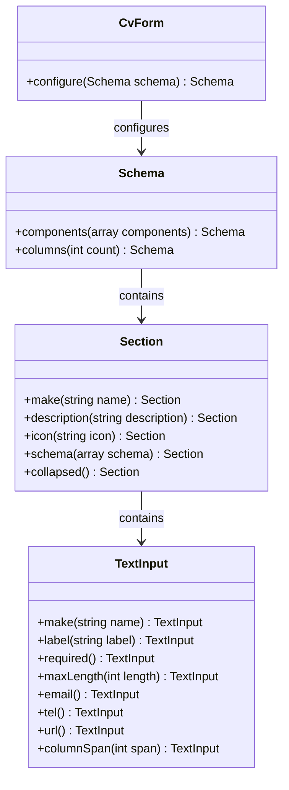
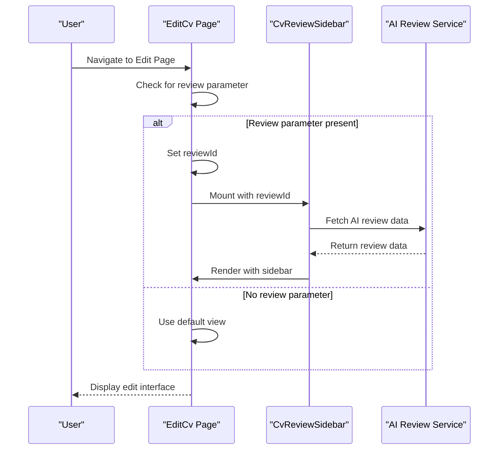
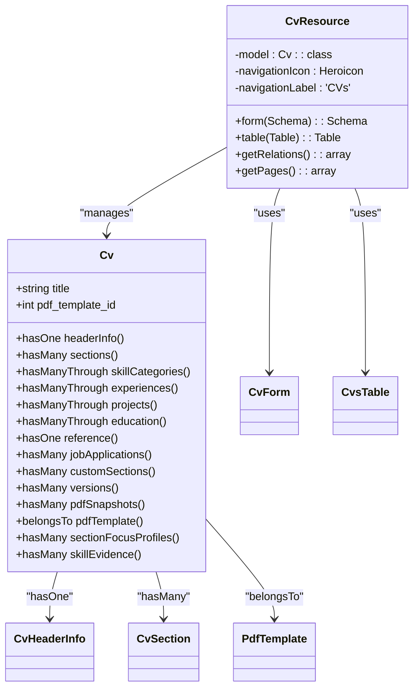
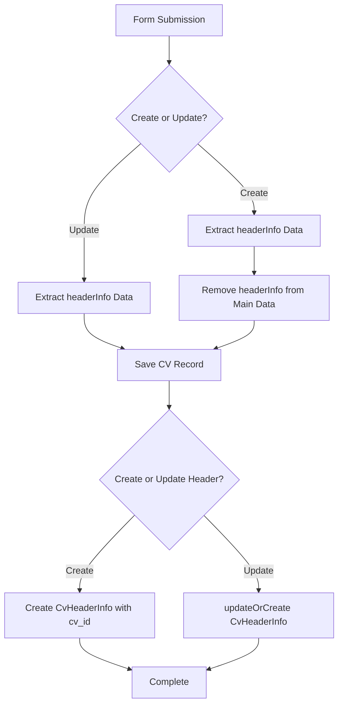

# CV Creation and Editing

<cite>
**Referenced Files in This Document**   
- [CvForm.php](file://app/Filament/Resources/Cvs/Schemas/CvForm.php)
- [CreateCv.php](file://app/Filament/Resources/Cvs/Pages/CreateCv.php)
- [EditCv.php](file://app/Filament/Resources/Cvs/Pages/EditCv.php)
- [CvResource.php](file://app/Filament/Resources/Cvs/CvResource.php)
- [Cv.php](file://app/Models/Cv.php)
- [cv-edit-with-sidebar.blade.php](file://resources/views/filament/pages/cv-edit-with-sidebar.blade.php)
- [CvReviewSidebar.php](file://app/Livewire/CvReviewSidebar.php)
</cite>

## Table of Contents
1. [Introduction](#introduction)
2. [CV Creation Workflow](#cv-creation-workflow)
3. [Form Structure and Validation](#form-structure-and-validation)
4. [CV Editing and Sidebar Integration](#cv-editing-and-sidebar-integration)
5. [Filament Resource and Model Relationships](#filament-resource-and-model-relationships)
6. [Data Persistence and Eloquent Integration](#data-persistence-and-eloquent-integration)
7. [Common Issues and Troubleshooting](#common-issues-and-troubleshooting)
8. [Conclusion](#conclusion)

## Introduction

The CV creation and editing functionality in the CV Builder application provides a comprehensive interface for users to create, customize, and manage their curriculum vitae. Built on the Filament admin panel framework, the system offers a structured approach to CV management with support for multiple sections, template selection, and AI-powered review features. The workflow begins with creating a new CV through the CreateCv page and extends to editing existing CVs with enhanced user experience through the sidebar UI component. This documentation details the complete process from initial CV creation to final editing, covering form structure, validation rules, dynamic UI components, and integration with Livewire components for real-time feedback.

## CV Creation Workflow

The CV creation process begins with the CreateCv page, which serves as the entry point for new CVs. When a user initiates the creation of a new CV, the system follows a structured workflow to ensure proper data persistence and relationship management. The CreateCv class extends Filament's CreateRecord functionality and implements specific logic to handle the creation of both the CV record and its associated header information.

The workflow begins with the extraction of header information from the form data before the main CV record is created. This is necessary because the CvHeaderInfo model requires a reference to the CV's ID, which is only available after the CV record has been persisted to the database. The mutateFormDataBeforeCreate method temporarily stores the header information and removes it from the main data array to prevent validation errors. After the CV record is successfully created, the afterCreate method is triggered, which creates the CvHeaderInfo record with the proper cv_id relationship.

**Diagram sources**
- [CreateCv.php](file://app/Filament/Resources/Cvs/Pages/CreateCv.php#L15-L33)

**Section sources**
- [CreateCv.php](file://app/Filament/Resources/Cvs/Pages/CreateCv.php#L15-L33)

## Form Structure and Validation

The CV form structure is defined in the CvForm.php class, which organizes the input fields into logical sections with appropriate validation rules and UI enhancements. The form is divided into three main sections: CV Information, Personal Information, and Online Presence, each with specific field groupings and validation requirements.

The CV Information section contains the title field, which is required with a maximum length of 255 characters. This field includes a descriptive placeholder and helper text to guide users in creating a meaningful title for their CV. The form also includes a PDF template selection field that allows users to choose from available templates for PDF export.

The Personal Information section is organized in a two-column layout and includes fields for full name, job title, email, phone, and location. Each field has appropriate validation rules and input types: the email field uses email validation with an envelope icon, the phone field uses tel input type with a phone icon, and all required fields are properly marked.

The Online Presence section is collapsed by default to reduce visual clutter and contains fields for LinkedIn, GitHub, and personal website URLs. These fields are validated as proper URLs and include appropriate icons and helper text. The form uses nested field notation (e.g., headerInfo.full_name) to manage related model data within a single form, allowing for seamless editing of associated models without requiring separate forms or API calls.

**Diagram sources**
- [CvForm.php](file://app/Filament/Resources/Cvs/Schemas/CvForm.php#L15-L99)

**Section sources**
- [CvForm.php](file://app/Filament/Resources/Cvs/Schemas/CvForm.php#L15-L99)

## CV Editing and Sidebar Integration

The EditCv page provides an enhanced user experience for modifying existing CVs, with integration of the cv-edit-with-sidebar.blade.php component for real-time AI feedback. The EditCv class extends Filament's EditRecord functionality and includes custom header actions for downloading PDFs, cloning the CV, and accessing the AI review sidebar.

The sidebar integration is implemented through the CvReviewSidebar Livewire component, which is conditionally loaded when a review ID is present in the URL parameters. The mount method in EditCv checks for the review query parameter and sets the reviewId property, which is then passed to the sidebar component. When the review ID is present, the getView method returns the custom view with the sidebar; otherwise, it uses the default edit view.

The header actions include a download PDF action that allows users to generate PDFs with optional focus profiles, a clone action that creates a full copy of the CV with all sections and creates a version snapshot, and a delete action that archives the CV rather than permanently removing it. The clone functionality is particularly important for creating tailored CVs for different job applications, as it allows users to maintain multiple versions of their CV with different content emphases.

**Diagram sources**
- [EditCv.php](file://app/Filament/Resources/Cvs/Pages/EditCv.php#L50-L127)
- [cv-edit-with-sidebar.blade.php](file://resources/views/filament/pages/cv-edit-with-sidebar.blade.php#L1-L2)
- [CvReviewSidebar.php](file://app/Livewire/CvReviewSidebar.php#L15-L45)

**Section sources**
- [EditCv.php](file://app/Filament/Resources/Cvs/Pages/EditCv.php#L50-L127)
- [cv-edit-with-sidebar.blade.php](file://resources/views/filament/pages/cv-edit-with-sidebar.blade.php#L1-L2)

## Filament Resource and Model Relationships

The CvResource class serves as the main resource for managing CVs within the Filament admin panel, defining the form, table, and page routing configurations. It establishes the relationship between the Filament interface and the underlying Cv model, handling mass assignment protection and attribute casting through Eloquent.

The resource defines several important relationships through the getRelations method, including summary, custom sections, skills, experience, projects, education, references, section focus profiles, and skill evidence. These relationships are managed through Eloquent's relationship methods in the Cv model, which use various relationship types such as HasOne, HasMany, and HasManyThrough to properly structure the data.

The Cv model implements mass assignment protection through the $fillable array, which specifies that only the title and pdf_template_id attributes can be mass assigned. This security measure prevents unauthorized modification of sensitive fields. The model also uses attribute casting implicitly through Eloquent's automatic type conversion for database columns.

The resource also implements soft delete functionality, which archives CVs rather than permanently deleting them. This preserves all associated data, including job applications and PDF snapshots, while removing the CV from default views. The archived CVs can be accessed through a dedicated filter in the list view.

**Diagram sources**
- [CvResource.php](file://app/Filament/Resources/Cvs/CvResource.php#L20-L62)
- [Cv.php](file://app/Models/Cv.php#L1-L354)

**Section sources**
- [CvResource.php](file://app/Filament/Resources/Cvs/CvResource.php#L20-L62)
- [Cv.php](file://app/Models/Cv.php#L1-L354)

## Data Persistence and Eloquent Integration

Data persistence in the CV system is handled through Eloquent ORM, with careful consideration for relationship management and data integrity. When creating or updating CVs, the system follows a specific pattern to ensure that related models are properly synchronized with the main CV record.

For new CV creation, the system uses a two-phase approach: first creating the CV record, then creating the associated CvHeaderInfo record with the generated cv_id. This pattern ensures referential integrity while working within the constraints of database foreign key relationships. The CreateCv page implements this through the mutateFormDataBeforeCreate and afterCreate methods, which temporarily store the header information and create the related record after the main record is saved.

For CV updates, the EditCv page uses the updateOrCreate method to handle both creation and updating of the CvHeaderInfo record. This approach ensures that if a header record already exists, it is updated; otherwise, a new record is created. The mutateFormDataBeforeSave method extracts the header information from the form data, saves it separately, and then removes it from the main data array to prevent validation errors.

The Cv model includes a cloneCv method that demonstrates advanced Eloquent usage, creating a deep copy of a CV with all its sections and related content. This method uses database transactions to ensure data consistency and creates a version snapshot before cloning. It replicates the main CV record, then iterates through all sections and their related content, creating copies of each with updated foreign key references.

**Diagram sources**
- [CreateCv.php](file://app/Filament/Resources/Cvs/Pages/CreateCv.php#L15-L33)
- [EditCv.php](file://app/Filament/Resources/Cvs/Pages/EditCv.php#L100-L127)
- [Cv.php](file://app/Models/Cv.php#L300-L354)

**Section sources**
- [CreateCv.php](file://app/Filament/Resources/Cvs/Pages/CreateCv.php#L15-L33)
- [EditCv.php](file://app/Filament/Resources/Cvs/Pages/EditCv.php#L100-L127)
- [Cv.php](file://app/Models/Cv.php#L300-L354)

## Common Issues and Troubleshooting

Several common issues may arise during CV creation and editing, primarily related to form validation and data persistence. Form validation errors typically occur when required fields are left empty or when data does not meet validation criteria (e.g., invalid email format or URL). These errors are displayed inline with the form fields and prevent submission until resolved.

Draft saving issues may occur if the user navigates away from the form before submission, resulting in lost data. To mitigate this, users should ensure they complete and submit the form before navigating away. The system does not currently implement auto-save functionality, so manual saving is required.

When cloning CVs, users may encounter issues if the system fails to properly replicate all sections and related content. This can be verified by checking that all sections from the original CV appear in the cloned version. If sections are missing, the issue may be related to database transaction failures or permission issues.

Integration with the AI review sidebar may fail if the review ID parameter is not properly passed or if the JobApplication record cannot be found. Users should ensure they are accessing the edit page with the correct review parameter and that the associated job application exists and has AI review data.

For template selection issues, users should verify that the PDF template exists and is properly configured. Template selection is stored as a foreign key relationship, so invalid template IDs will result in validation errors.

## Conclusion

The CV creation and editing functionality provides a robust and user-friendly interface for managing curriculum vitae within the CV Builder application. By leveraging Filament's powerful admin panel framework and Livewire's real-time capabilities, the system offers a seamless experience for creating, customizing, and refining CVs. The structured approach to form design, with proper validation and relationship management, ensures data integrity while providing flexibility for users to tailor their CVs to specific job applications. The integration of AI-powered review features through the sidebar component enhances the editing experience by providing real-time feedback and suggestions. With proper understanding of the workflow, form structure, and common issues, users can effectively utilize this functionality to create professional and compelling CVs.