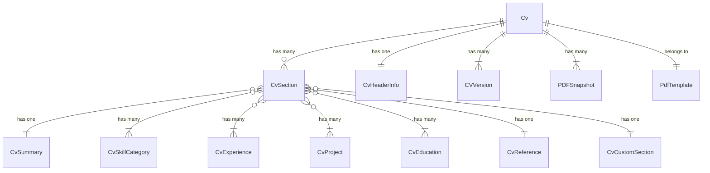
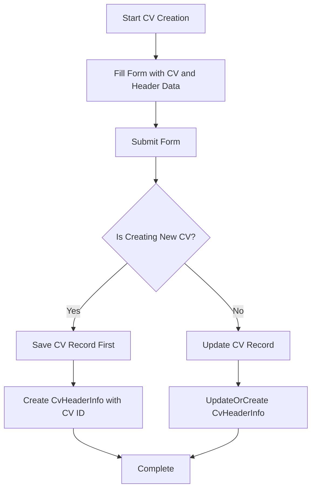
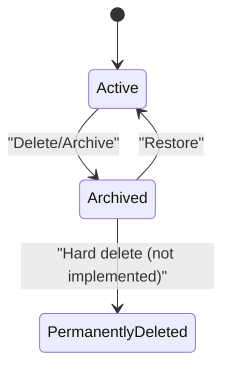

# CV Management

<cite>
**Referenced Files in This Document**   
- [CvResource.php](file://app/Filament/Resources/Cvs/CvResource.php)
- [CvForm.php](file://app/Filament/Resources/Cvs/Schemas/CvForm.php)
- [CvsTable.php](file://app/Filament/Resources/Cvs/Tables/CvsTable.php)
- [CreateCv.php](file://app/Filament/Resources/Cvs/Pages/CreateCv.php)
- [EditCv.php](file://app/Filament/Resources/Cvs/Pages/EditCv.php)
- [Cv.php](file://app/Models/Cv.php)
- [CvSection.php](file://app/Models/CvSection.php)
- [CvExperience.php](file://app/Models/CvExperience.php)
- [CvEducation.php](file://app/Models/CvEducation.php)
- [cv-edit-with-sidebar.blade.php](file://resources/views/filament/pages/cv-edit-with-sidebar.blade.php)
</cite>

## Table of Contents
1. [CV Structure and Components](#cv-structure-and-components)
2. [Creating and Editing CVs](#creating-and-editing-cvs)
3. [Section Management](#section-management)
4. [UI Components and Edit Interface](#ui-components-and-edit-interface)
5. [CV Cloning and Versioning](#cv-cloning-and-versioning)
6. [Soft Delete and Archive](#soft-delete-and-archive)

## CV Structure and Components

The CV system is built around a hierarchical data model where a CV contains multiple sections, each with specific content types. The core model `Cv` serves as the parent entity that organizes all CV-related data.

The main sections of a CV include:
- **Header Information**: Personal details such as full name, job title, email, phone, location, and professional links (LinkedIn, GitHub, website)
- **Summary**: A professional summary section
- **Skills**: Organized into categories with JSON-stored skill arrays
- **Experience**: Professional work history with job titles, companies, dates, and achievement highlights
- **Education**: Academic background with degrees, institutions, and years
- **Projects**: Notable projects with descriptions and technologies
- **References**: Professional references
- **Custom Sections**: User-defined sections for specialized content

These components are related through a well-defined Eloquent relationship structure. The `Cv` model has a one-to-one relationship with `CvHeaderInfo` and a one-to-many relationship with `CvSection`. Each `CvSection` then has morph-to-one relationships with specific content models like `CvSummary`, `CvExperience`, `CvEducation`, and `CvCustomSection`.



**Diagram sources**
- [Cv.php](file://app/Models/Cv.php#L15-L354)
- [CvSection.php](file://app/Models/CvSection.php#L15-L67)

**Section sources**
- [Cv.php](file://app/Models/Cv.php#L15-L354)
- [CvSection.php](file://app/Models/CvSection.php#L15-L67)

## Creating and Editing CVs

Users create and edit CVs through the Filament admin interface using the `CvResource` which provides a comprehensive form interface. The creation process is handled by `CreateCv.php` and editing by `EditCv.php`, both extending Filament's page system.

When creating a new CV, the form collects both CV-level information (title, PDF template selection) and personal information (full name, job title, contact details). The form is structured into logical sections using Filament's `Section` component with appropriate icons and descriptions.

The creation process involves two phases:
1. First, the CV record is created
2. Then, the associated `CvHeaderInfo` record is created with the CV's ID

This two-phase approach is necessary because the `CvHeaderInfo` requires the CV's ID as a foreign key, which is only available after the CV is saved to the database.

For editing existing CVs, the system uses `updateOrCreate` to handle both creation and updating of the header information, ensuring data consistency regardless of whether a header record already exists.



**Section sources**
- [CreateCv.php](file://app/Filament/Resources/Cvs/Pages/CreateCv.php#L15-L34)
- [EditCv.php](file://app/Filament/Resources/Cvs/Pages/EditCv.php#L50-L127)
- [CvForm.php](file://app/Filament/Resources/Cvs/Schemas/CvForm.php#L10-L112)

## Section Management

CV sections are managed through Filament's relation managers, which provide a clean interface for adding, editing, and organizing content within each section type. The system supports both standard sections (Experience, Education, Skills) and custom sections.

Each section has a `display_order` field that determines its position within the CV. Sections are automatically ordered by this field in ascending order, allowing users to control the sequence of sections in the final CV output.

The relationship between sections and their content is polymorphic, with each `CvSection` having a `section_type` field that determines which content model it references. This flexible design allows for easy extension with new section types in the future.

Section visibility is controlled through the database - sections are included in the CV output if they exist in the database and are ordered by their `display_order` value. There is no explicit "visibility" flag; instead, sections are effectively hidden by removing them from the database or not including them in the output generation process.

```php
// In Cv.php model
public function sections(): HasMany
{
    return $this->hasMany(CvSection::class)->orderBy('display_order');
}
```

**Section sources**
- [Cv.php](file://app/Models/Cv.php#L25-L30)
- [CvSection.php](file://app/Models/CvSection.php#L15-L67)

## UI Components and Edit Interface

The CV edit interface is enhanced with a sidebar implementation in `cv-edit-with-sidebar.blade.php`, which provides a rich editing experience with additional context and tools. This custom view is used when reviewing CVs, as indicated by the presence of a review parameter in the request.

The main edit interface uses Filament's form components organized into collapsible sections:
- **CV Information**: Contains the CV title and PDF template selection
- **Personal Information**: Includes full name, job title, email, phone, and location
- **Online Presence**: Collapsed by default, containing LinkedIn, GitHub, and website URLs

The interface includes several key actions:
- **Download PDF**: Generates and downloads the CV as a PDF document
- **Clone This CV**: Creates a complete copy of the CV with all sections
- **Archive CV**: Soft deletes the CV, moving it to the archived state

The PDF download action includes an optional parameter for selecting a section focus profile, allowing users to generate tailored versions of their CV for different job applications.

```mermaid
classDiagram
class EditCv {
+getView() string
+getViewData() array
+getHeaderActions() array
+mutateFormDataBeforeFill(array) array
+mutateFormDataBeforeSave(array) array
}
class CvForm {
+configure(Schema) Schema
}
EditCv --> CvForm : "uses"
EditCv --> "cv-edit-with-sidebar.blade.php" : "custom view"
```

**Diagram sources**
- [EditCv.php](file://app/Filament/Resources/Cvs/Pages/EditCv.php#L15-L127)
- [cv-edit-with-sidebar.blade.php](file://resources/views/filament/pages/cv-edit-with-sidebar.blade.php)

**Section sources**
- [EditCv.php](file://app/Filament/Resources/Cvs/Pages/EditCv.php#L15-L127)
- [cv-edit-with-sidebar.blade.php](file://resources/views/filament/pages/cv-edit-with-sidebar.blade.php)

## CV Cloning and Versioning

The system provides robust CV cloning functionality that creates a complete deep copy of a CV with all its sections and content. This feature is accessible both from the list view (as a row action) and from the edit view (as a header action).

When a user clones a CV, the system performs the following operations in a database transaction:
1. Creates a version snapshot of the original CV by storing its complete data structure as JSON in the `cv_versions` table
2. Creates a new CV record with "(Copy)" appended to the title
3. Deep copies all associated data including header information and all sections with their content

The cloning process preserves the relationships between all entities while generating new IDs for the cloned records, ensuring data independence between the original and cloned CVs.

Version snapshots serve as a historical record of CV states, allowing users to track changes over time and revert to previous versions if needed. Each snapshot includes a reason field that documents why the snapshot was created.

```php
// In Cv.php model
public function cloneCv(string $reason = 'manual clone'): Cv
{
    return DB::transaction(function () use ($reason) {
        // Create version snapshot
        CVVersion::create([
            'cv_id' => $this->id,
            'snapshot_json' => $this->toArray(),
            'reason' => $reason,
            'created_at' => now(),
        ]);
        
        // Clone the CV and all related data
        // ... implementation details
    });
}
```

**Section sources**
- [Cv.php](file://app/Models/Cv.php#L250-L354)
- [CvsTable.php](file://app/Filament/Resources/Cvs/Tables/CvsTable.php#L45-L70)
- [EditCv.php](file://app/Filament/Resources/Cvs/Pages/EditCv.php#L35-L50)

## Soft Delete and Archive

The CV system implements soft delete functionality using Laravel's `SoftDeletes` trait, allowing users to archive CVs without permanently removing them from the database. This approach preserves related data such as job applications and PDF snapshots while removing the CV from the default view.

The list view includes a status filter with two tabs:
- **Active**: Shows non-deleted CVs (default view)
- **Archived**: Shows soft-deleted CVs using the `withTrashed()` scope

When a user deletes a CV, they are presented with a warning modal that clarifies the archiving behavior: "This CV will be archived. Job applications and PDF snapshots will remain accessible."

Archived CVs can be restored through the admin interface by removing the `deleted_at` timestamp, returning them to the active state. This design follows the principle of data preservation, ensuring that historical records remain available for reference even when a CV is no longer actively used.



**Section sources**
- [CvsTable.php](file://app/Filament/Resources/Cvs/Tables/CvsTable.php#L25-L35)
- [EditCv.php](file://app/Filament/Resources/Cvs/Pages/EditCv.php#L100-L110)
- [Cv.php](file://app/Models/Cv.php#L18-L19)