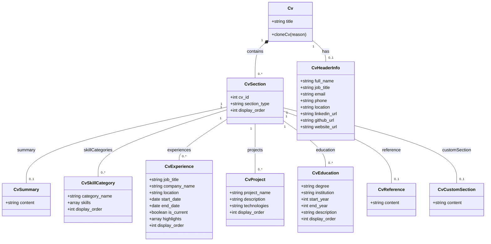

# CV Management

<cite>
**Referenced Files in This Document**   
- [CvResource.php](file://app/Filament/Resources/Cvs/CvResource.php) - *Updated with improved UI/UX*
- [Cv.php](file://app/Models/Cv.php) - *Core model with cloning and relationships*
- [CvSection.php](file://app/Models/CvSection.php)
- [CvForm.php](file://app/Filament/Resources/Cvs/Schemas/CvForm.php) - *Enhanced with structured sections and icons*
- [CvHeaderInfo.php](file://app/Models/CvHeaderInfo.php)
- [CvSummary.php](file://app/Models/CvSummary.php)
- [CvSkillCategory.php](file://app/Models/CvSkillCategory.php)
- [CvExperience.php](file://app/Models/CvExperience.php)
- [CvProject.php](file://app/Models/CvProject.php)
- [CvEducation.php](file://app/Models/CvEducation.php)
- [CvReference.php](file://app/Models/CvReference.php)
- [CvCustomSection.php](file://app/Models/CvCustomSection.php)
- [HeaderInfoRelationManager.php](file://app/Filament/Resources/Cvs/RelationManagers/HeaderInfoRelationManager.php) - *Updated with better organization*
- [ExperienceRelationManager.php](file://app/Filament/Resources/Cvs/RelationManagers/ExperienceRelationManager.php) - *Enhanced with improved UI/UX*
</cite>

## Update Summary
**Changes Made**   
- Updated documentation to reflect UI/UX improvements in CV form and relation managers
- Added details about structured sections, icons, and collapsed sections in the form
- Enhanced description of Personal Information and Online Presence sections with new field details
- Updated HeaderInfoRelationManager documentation with improved organization
- Added information about website_url field in header information
- Improved accuracy of form schema examples and section descriptions

## Table of Contents
1. [CV Structure and Components](#cv-structure-and-components)
2. [Creating and Editing CVs](#creating-and-editing-cvs)
3. [Section Management via Relation Managers](#section-management-via-relation-managers)
4. [CV Cloning Mechanism](#cv-cloning-mechanism)
5. [Soft Delete and Restoration](#soft-delete-and-restoration)
6. [Programmatic CV Manipulation](#programmatic-cv-manipulation)
7. [Common Issues and Validation](#common-issues-and-validation)

## CV Structure and Components

A CV in the system is composed of multiple sections, each representing a distinct part of the resume. The core structure is defined by the `Cv` model and its relationships with various section models. The main components include:

- **HeaderInfo**: Contains personal information such as full name, job title, contact details, and social links
- **Summary**: A professional summary section
- **Skills**: Organized into categories with JSON arrays of skills
- **Experience**: Work experience entries with job titles, companies, dates, and highlights
- **Projects**: Side projects with descriptions and technologies used
- **Education**: Academic background including degrees and institutions
- **References**: References text
- **CustomSections**: User-defined sections for additional content

The relationships are structured through the `CvSection` model, which acts as a polymorphic container for different section types, maintaining order through the `display_order` field.

**Section sources**
- [Cv.php](file://app/Models/Cv.php#L10-L60)
- [CvSection.php](file://app/Models/CvSection.php#L10-L60)

## Creating and Editing CVs

Users can create and edit CVs through the Filament admin interface using the `CvResource`. The form schema is defined in `CvForm.php` and includes fields for the CV title and header information. When creating a new CV, users enter a descriptive title and fill in their personal details in the header section.

The form has been enhanced with improved UI/UX, featuring structured sections with descriptive icons and better organization. The form is organized into three main sections:

1. **CV Information**: Contains the CV title field with descriptive placeholder and helper text
2. **Personal Information**: Includes full name, job title, email, phone, and location fields in a two-column layout
3. **Online Presence**: Collapsed by default, contains LinkedIn, GitHub, and personal website URLs

The form uses appropriate validation rules and input types:
- Title is required with a maximum length of 255 characters
- Email field has email validation and envelope icon
- Phone field uses tel input type with phone icon
- URL fields are validated as proper URLs with appropriate icons
- The Online Presence section is collapsed by default to reduce visual clutter


**Diagram sources **
- [CvForm.php](file://app/Filament/Resources/Cvs/Schemas/CvForm.php#L15-L99)
- [CvResource.php](file://app/Filament/Resources/Cvs/CvResource.php#L20-L28)

**Section sources**
- [CvForm.php](file://app/Filament/Resources/Cvs/Schemas/CvForm.php#L15-L99)
- [CvResource.php](file://app/Filament/Resources/Cvs/CvResource.php#L20-L28)

## Section Management via Relation Managers

The Filament admin interface provides relation managers for each section type, allowing users to manage CV content through dedicated interfaces. These relation managers are registered in the `getRelations()` method of `CvResource` and include:

- **SummaryRelationManager**: For managing the professional summary
- **SkillsRelationManager**: For organizing skills into categories
- **ExperienceRelationManager**: For adding and editing work experiences
- **ProjectsRelationManager**: For managing project entries
- **EducationRelationManager**: For academic background
- **ReferencesRelationManager**: For references text
- **CustomSectionsRelationManager**: For user-defined sections

Each relation manager allows users to:
- Add new section entries
- Edit existing entries
- Reorder entries using drag-and-drop (based on `display_order`)
- Remove entries (soft delete)

The **HeaderInfoRelationManager** has been improved with better organization, separating information into "Basic Information" and "Online Profiles" sections. The "Online Profiles" section is collapsed by default to reduce visual clutter. The manager includes fields for full name, job title, email, phone, location, LinkedIn URL, GitHub URL, and website URL.

The **ExperienceRelationManager** has been enhanced with a more intuitive interface, organizing form fields into logical sections: "Position Details", "Employment Period", "Key Achievements", and "Display Order". The "Key Achievements" section uses a repeater component for adding multiple highlights with a text area placeholder encouraging the use of metrics.

The sections are organized under the main CV record in the Filament interface, providing a hierarchical view of the CV structure. Users can navigate between section types and make changes without leaving the main CV editing context.



**Diagram sources **
- [Cv.php](file://app/Models/Cv.php#L10-L60)
- [CvSection.php](file://app/Models/CvSection.php#L10-L60)
- [CvHeaderInfo.php](file://app/Models/CvHeaderInfo.php#L10-L30)
- [CvSummary.php](file://app/Models/CvSummary.php#L7-L18)
- [CvSkillCategory.php](file://app/Models/CvSkillCategory.php#L7-L24)
- [CvExperience.php](file://app/Models/CvExperience.php#L7-L33)
- [CvProject.php](file://app/Models/CvProject.php#L7-L22)
- [CvEducation.php](file://app/Models/CvEducation.php#L7-L23)
- [CvReference.php](file://app/Models/CvReference.php#L7-L18)
- [CvCustomSection.php](file://app/Models/CvCustomSection.php#L7-L18)

**Section sources**
- [CvResource.php](file://app/Filament/Resources/Cvs/CvResource.php#L30-L50)
- [HeaderInfoRelationManager.php](file://app/Filament/Resources/Cvs/RelationManagers/HeaderInfoRelationManager.php#L13-L106)
- [ExperienceRelationManager.php](file://app/Filament/Resources/Cvs/RelationManagers/ExperienceRelationManager.php#L22-L249)

## CV Cloning Mechanism

The system provides a cloning mechanism that creates a complete copy of a CV with all its related data. This is implemented through the `cloneCv()` method in the `Cv` model, which performs a deep copy of the entire CV structure.

When a user clones a CV:
1. A version snapshot of the original CV is created and stored in the `cv_versions` table
2. The main CV record is replicated with "(Copy)" appended to the title
3. The header information is deeply copied
4. All sections are replicated with their display order preserved
5. Section-specific content (summary, skills, experiences, etc.) is copied based on the section type

The cloning process is wrapped in a database transaction to ensure data consistency. The method returns the newly created CV instance, allowing for further modifications.


**Diagram sources **
- [Cv.php](file://app/Models/Cv.php#L150-L220)

**Section sources**
- [Cv.php](file://app/Models/Cv.php#L150-L220)

## Soft Delete and Restoration

The CV system implements soft delete functionality using Laravel's `SoftDeletes` trait. When a user deletes a CV, it is not permanently removed from the database but marked with a `deleted_at` timestamp. This allows for restoration of accidentally deleted CVs.

Key aspects of the soft delete implementation:
- The `Cv` model uses the `SoftDeletes` trait
- Deleted CVs are moved to an "Archived" status and can be viewed using the "Archived" filter
- The delete action shows a warning modal explaining that the CV will be archived
- Job applications and PDF snapshots associated with the CV remain accessible
- Users can restore deleted CVs through the admin interface

The system maintains data integrity by preserving all related records (sections, experiences, projects, etc.) when a CV is soft-deleted. This ensures that historical application data remains intact even if the CV is no longer actively used.

**Section sources**
- [Cv.php](file://app/Models/Cv.php#L15-L20)

## Programmatic CV Manipulation

The CV system provides programmatic interfaces for manipulating CV data outside the admin interface. The primary method is the `cloneCv()` method on the `Cv` model, which can be called from anywhere in the application code.

Example usage:
```php
$originalCv = Cv::find(1);
$clonedCv = $originalCv->cloneCv('Created variant for frontend role');
```

The method accepts an optional reason parameter that is stored with the version snapshot. This allows for tracking why a particular clone was created.

Additional programmatic operations include:
- Querying CVs with their sections using Eloquent relationships
- Creating new CVs programmatically
- Updating CV sections through their respective models
- Retrieving CV versions for historical comparison

**Section sources**
- [Cv.php](file://app/Models/Cv.php#L150-L220)

## Common Issues and Validation

When working with CVs, several common issues may arise:

**Missing Sections**: If a required section type is not present, the system handles this gracefully by returning empty collections or null values. For example, if a CV has no skills section, the `skillCategories()` relationship will return an empty collection rather than throwing an error.

**Validation Errors**: The form validation prevents common input issues:
- Required fields are validated on the server side
- Email format is validated
- URL fields are checked for proper format
- String length limits prevent database overflow

**Data Integrity**: The cloning process ensures that all relationships are properly maintained in the cloned CV. The transactional nature of the operation prevents partial clones where some sections might be missing.

**Performance Considerations**: For CVs with many sections, the cloning operation could be resource-intensive. The system mitigates this by using efficient database operations and minimizing the number of queries through proper relationship loading.

**Section sources**
- [CvForm.php](file://app/Filament/Resources/Cvs/Schemas/CvForm.php#L15-L99)
- [Cv.php](file://app/Models/Cv.php#L150-L220)