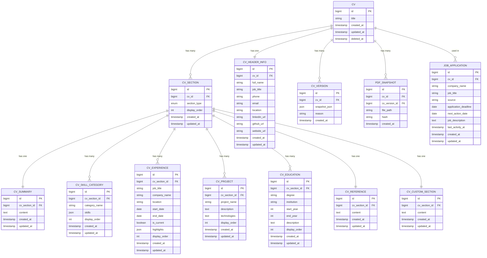
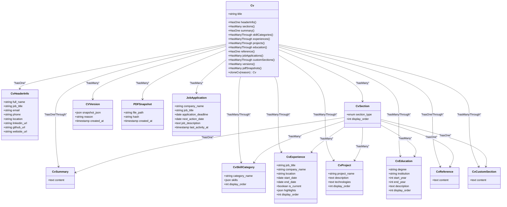
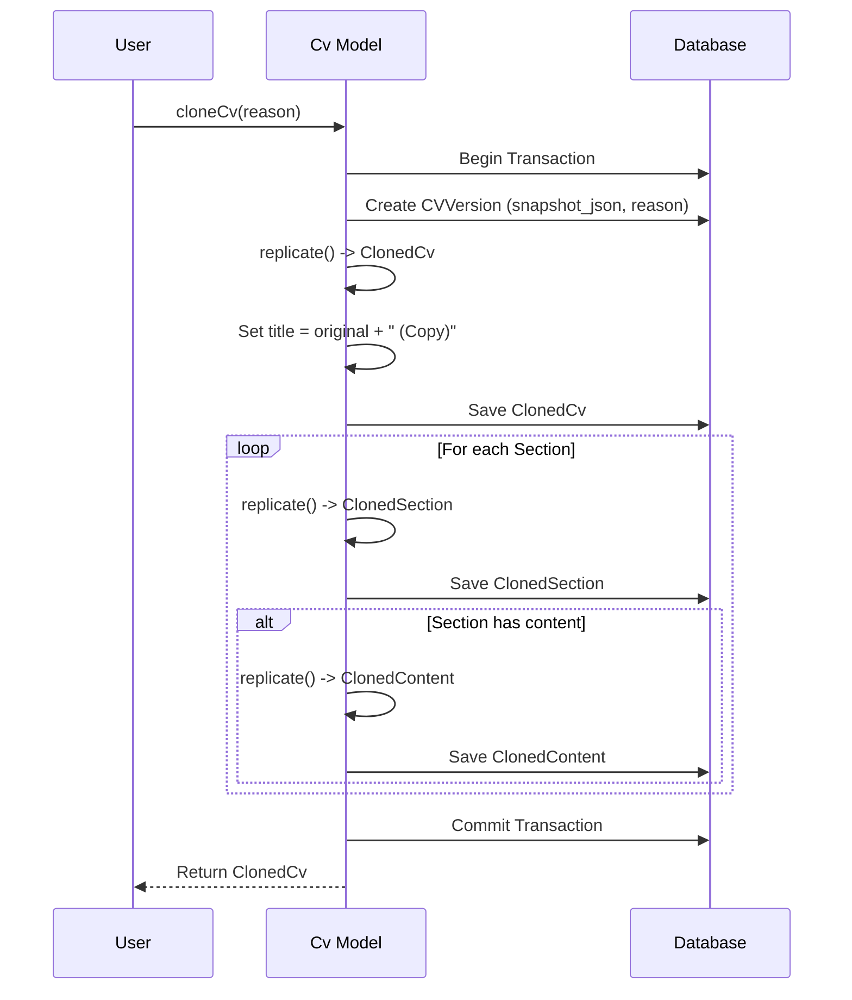

# CV Structure

<cite>
**Referenced Files in This Document**   
- [Cv.php](file://app/Models/Cv.php)
- [2025_10_03_201646_create_cvs_table.php](file://database/migrations/2025_10_03_201646_create_cvs_table.php)
- [2025_10_03_201651_create_cv_sections_table.php](file://database/migrations/2025_10_03_201651_create_cv_sections_table.php)
- [2025_10_03_201656_create_cv_header_info_table.php](file://database/migrations/2025_10_03_201656_create_cv_header_info_table.php)
- [2025_10_03_201701_create_cv_summaries_table.php](file://database/migrations/2025_10_03_201701_create_cv_summaries_table.php)
- [2025_10_03_201706_create_cv_skill_categories_table.php](file://database/migrations/2025_10_03_201706_create_cv_skill_categories_table.php)
- [2025_10_03_201713_create_cv_experiences_table.php](file://database/migrations/2025_10_03_201713_create_cv_experiences_table.php)
- [2025_10_03_201718_create_cv_projects_table.php](file://database/migrations/2025_10_03_201718_create_cv_projects_table.php)
- [2025_10_03_201722_create_cv_education_table.php](file://database/migrations/2025_10_03_201722_create_cv_education_table.php)
- [2025_10_03_201727_create_cv_references_table.php](file://database/migrations/2025_10_03_201727_create_cv_references_table.php)
- [2025_10_03_225951_create_cv_custom_sections_table.php](file://database/migrations/2025_10_03_225951_create_cv_custom_sections_table.php)
- [2025_10_04_002505_add_soft_deletes_to_cvs.php](file://database/migrations/2025_10_04_002505_add_soft_deletes_to_cvs.php)
- [2025_10_04_002612_create_cv_versions_table.php](file://database/migrations/2025_10_04_002612_create_cv_versions_table.php)
</cite>

## Table of Contents
1. [Introduction](#introduction)
2. [Core CV Model Structure](#core-cv-model-structure)
3. [Section Types and Their Roles](#section-types-and-their-roles)
4. [Database Schema and Relationships](#database-schema-and-relationships)
5. [Eloquent Relationships in Cv.php](#eloquent-relationships-in-cvphp)
6. [Data Integrity and Cascading Behavior](#data-integrity-and-cascading-behavior)
7. [Handling Missing Required Sections](#handling-missing-required-sections)
8. [Extending the CV Structure with New Section Types](#extending-the-cv-structure-with-new-section-types)
9. [CV Cloning and Versioning Mechanism](#cv-cloning-and-versioning-mechanism)
10. [Conclusion](#conclusion)

## Introduction
The CV structure in this system is designed as a hierarchical, extensible model where the `Cv` entity serves as the root container for all resume content. It organizes information through a flexible section-based architecture, enabling dynamic ordering and composition of standard and custom sections. This document details the fundamental structure of the CV, focusing on its Eloquent relationships, database schema, data integrity mechanisms, and extensibility patterns. The design supports both atomic section management and holistic operations like cloning and versioning, ensuring robustness and flexibility for future enhancements.

## Core CV Model Structure
The `Cv` model acts as the central entity that aggregates all components of a resume. Each CV has a title and can contain multiple sections, each representing a distinct part of the resume such as summary, skills, or experience. The model uses Laravel's Eloquent ORM to define relationships with its constituent parts, leveraging both direct (`hasOne`) and indirect (`hasManyThrough`) relationships to maintain a clean and efficient data access pattern. Soft deletes are implemented to preserve historical data when a CV is removed, ensuring traceability and preventing accidental data loss.

**Section sources**
- [Cv.php](file://app/Models/Cv.php#L8-L221)
- [2025_10_03_201646_create_cvs_table.php](file://database/migrations/2025_10_03_201646_create_cvs_table.php#L15-L22)
- [2025_10_04_002505_add_soft_deletes_to_cvs.php](file://database/migrations/2025_10_04_002505_add_soft_deletes_to_cvs.php#L15-L18)

## Section Types and Their Roles
Each CV is composed of sections, which are defined by their `section_type` field. These types include `header`, `summary`, `skills`, `experience`, `projects`, `education`, `references`, and `custom`. Standard sections like `header` and `summary` are expected to exist once per CV, while others like `experience` and `projects` support multiple entries. The `custom` section type allows users to add free-form content, enhancing the system's adaptability. Sections are ordered via the `display_order` field, enabling user-defined arrangement.

**Section sources**
- [2025_10_03_201651_create_cv_sections_table.php](file://database/migrations/2025_10_03_201651_create_cv_sections_table.php#L17-L20)
- [Cv.php](file://app/Models/Cv.php#L34-L37)

## Database Schema and Relationships
The database schema reflects a normalized structure where the `cvs` table is the root, linked to `cv_sections` via a foreign key. Each section then connects to type-specific tables (e.g., `cv_header_info`, `cv_summaries`) through their respective foreign keys. This design ensures referential integrity and enables efficient querying. The `cv_sections` table includes a unique constraint on `cv_id` and `section_type` for singleton sections, while others allow multiple records. Cascading deletes are enforced at the database level to automatically remove dependent records when a parent is deleted.

**Diagram sources**
- [2025_10_03_201646_create_cvs_table.php](file://database/migrations/2025_10_03_201646_create_cvs_table.php#L15-L22)
- [2025_10_03_201651_create_cv_sections_table.php](file://database/migrations/2025_10_03_201651_create_cv_sections_table.php#L15-L20)
- [2025_10_03_201656_create_cv_header_info_table.php](file://database/migrations/2025_10_03_201656_create_cv_header_info_table.php#L15-L30)
- [2025_10_03_201701_create_cv_summaries_table.php](file://database/migrations/2025_10_03_201701_create_cv_summaries_table.php#L15-L24)
- [2025_10_03_201706_create_cv_skill_categories_table.php](file://database/migrations/2025_10_03_201706_create_cv_skill_categories_table.php#L15-L28)
- [2025_10_03_201713_create_cv_experiences_table.php](file://database/migrations/2025_10_03_201713_create_cv_experiences_table.php#L15-L34)
- [2025_10_03_201718_create_cv_projects_table.php](file://database/migrations/2025_10_03_201718_create_cv_projects_table.php#L15-L29)
- [2025_10_03_201722_create_cv_education_table.php](file://database/migrations/2025_10_03_201722_create_cv_education_table.php#L15-L32)
- [2025_10_03_201727_create_cv_references_table.php](file://database/migrations/2025_10_03_201727_create_cv_references_table.php#L15-L24)
- [2025_10_03_225951_create_cv_custom_sections_table.php](file://database/migrations/2025_10_03_225951_create_cv_custom_sections_table.php#L15-L25)
- [2025_10_04_002612_create_cv_versions_table.php](file://database/migrations/2025_10_04_002612_create_cv_versions_table.php#L15-L25)

## Eloquent Relationships in Cv.php
The `Cv` model defines several Eloquent relationships to access its components. Singleton sections like `headerInfo` and `summary` use `hasOne`, while collections like `experiences` and `projects` use `hasManyThrough` to traverse the `cv_sections` intermediary. This approach simplifies data access by abstracting the section layer, allowing direct retrieval of content models. The `skillCategories` and `education` relationships include ordering constraints to ensure consistent presentation. The `versions` and `pdfSnapshots` relationships support historical tracking and auditability.

**Diagram sources**
- [Cv.php](file://app/Models/Cv.php#L8-L221)

**Section sources**
- [Cv.php](file://app/Models/Cv.php#L30-L221)

## Data Integrity and Cascading Behavior
Data integrity is maintained through database-level constraints and cascading deletes. The `cv_sections` table enforces referential integrity via `cv_id` foreign key with `cascadeOnDelete`, ensuring sections are removed when their parent CV is deleted. Similarly, section-specific tables like `cv_experiences` cascade deletes from `cv_sections`. Unique constraints on `(cv_id, section_type)` prevent duplicate singleton sections. Soft deletes on the `cvs` table preserve records and their relationships, allowing recovery and historical analysis. These mechanisms collectively prevent orphaned records and maintain consistency across the data hierarchy.

**Section sources**
- [2025_10_03_201646_create_cvs_table.php](file://database/migrations/2025_10_03_201646_create_cvs_table.php#L15-L22)
- [2025_10_03_201651_create_cv_sections_table.php](file://database/migrations/2025_10_03_201651_create_cv_sections_table.php#L17-L20)
- [2025_10_03_201656_create_cv_header_info_table.php](file://database/migrations/2025_10_03_201656_create_cv_header_info_table.php#L17-L18)
- [2025_10_04_002505_add_soft_deletes_to_cvs.php](file://database/migrations/2025_10_04_002505_add_soft_deletes_to_cvs.php#L15-L18)

## Handling Missing Required Sections
The system does not enforce the presence of all section types at the database level, allowing flexibility in CV composition. However, the application logic assumes certain sections (e.g., `header`, `summary`) are typically present. When accessing these via Eloquent relationships, null checks should be performed to handle cases where a section is missing. The `cloneCv` method in the `Cv` model includes conditional logic to only copy sections if they exist, demonstrating a pattern for safely handling optional components. This approach balances structural flexibility with operational robustness.

**Section sources**
- [Cv.php](file://app/Models/Cv.php#L150-L155)
- [Cv.php](file://app/Models/Cv.php#L160-L163)

## Extending the CV Structure with New Section Types
New section types can be added by introducing a new value to the `section_type` enum in the `cv_sections` table and creating a corresponding model and migration. For example, adding a `certifications` section would involve creating a `cv_certifications` table with a foreign key to `cv_sections`, then defining a `certifications()` relationship in the `Cv` model using `hasManyThrough`. The `display_order` field ensures the new section can be ordered with others. This extensibility is facilitated by the generic section model, which decouples the section metadata from its content, allowing new types to be integrated with minimal changes to existing code.

**Section sources**
- [2025_10_03_201651_create_cv_sections_table.php](file://database/migrations/2025_10_03_201651_create_cv_sections_table.php#L17-L20)
- [Cv.php](file://app/Models/Cv.php#L90-L95)

## CV Cloning and Versioning Mechanism
The `cloneCv` method in the `Cv` model provides a deep copy functionality that replicates the entire CV structure, including all sections and their content. Before cloning, it creates a `CVVersion` record containing a JSON snapshot of the original CV, preserving its state for historical reference. The cloning process is wrapped in a database transaction to ensure atomicity. Each section type is handled in a switch statement, where its associated content is replicated and linked to the new section. This mechanism supports experimentation with CV variants while maintaining a complete audit trail of changes.

**Diagram sources**
- [Cv.php](file://app/Models/Cv.php#L130-L221)

**Section sources**
- [Cv.php](file://app/Models/Cv.php#L130-L221)
- [2025_10_04_002612_create_cv_versions_table.php](file://database/migrations/2025_10_04_002612_create_cv_versions_table.php#L15-L25)

## Conclusion
The CV structure in this system is a well-organized, relational model that balances flexibility with data integrity. By using the `Cv` model as a root entity with Eloquent relationships to its components, the system enables efficient data access and manipulation. The database schema enforces referential integrity through foreign keys and cascading deletes, while soft deletes preserve historical data. The design supports both standard and custom section types, and the cloning mechanism allows for safe experimentation with CV variants. This foundation provides a robust platform for managing resumes and can be extended to support additional features as needed.