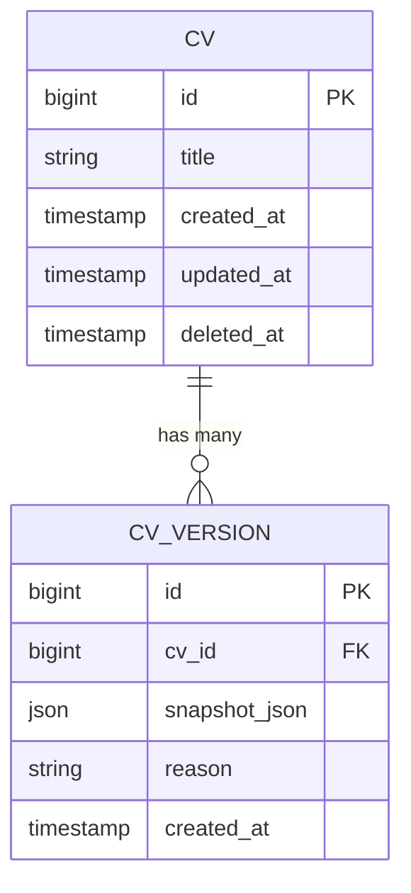
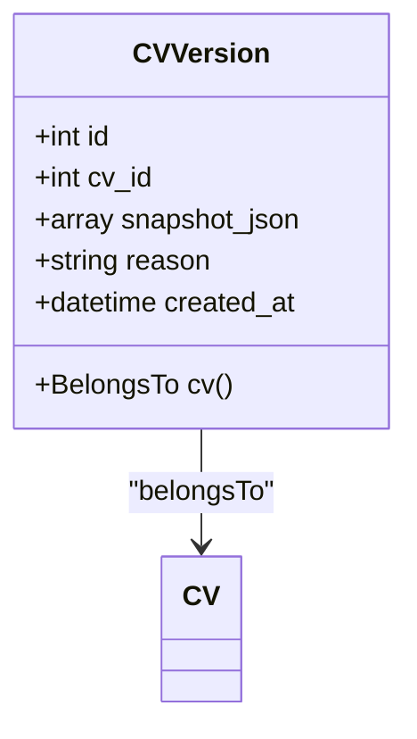
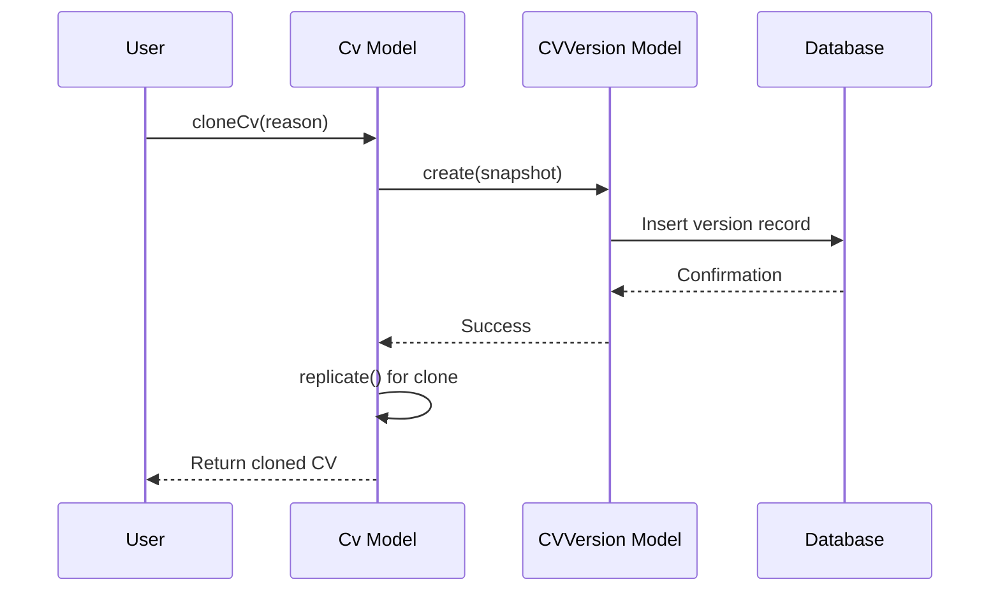
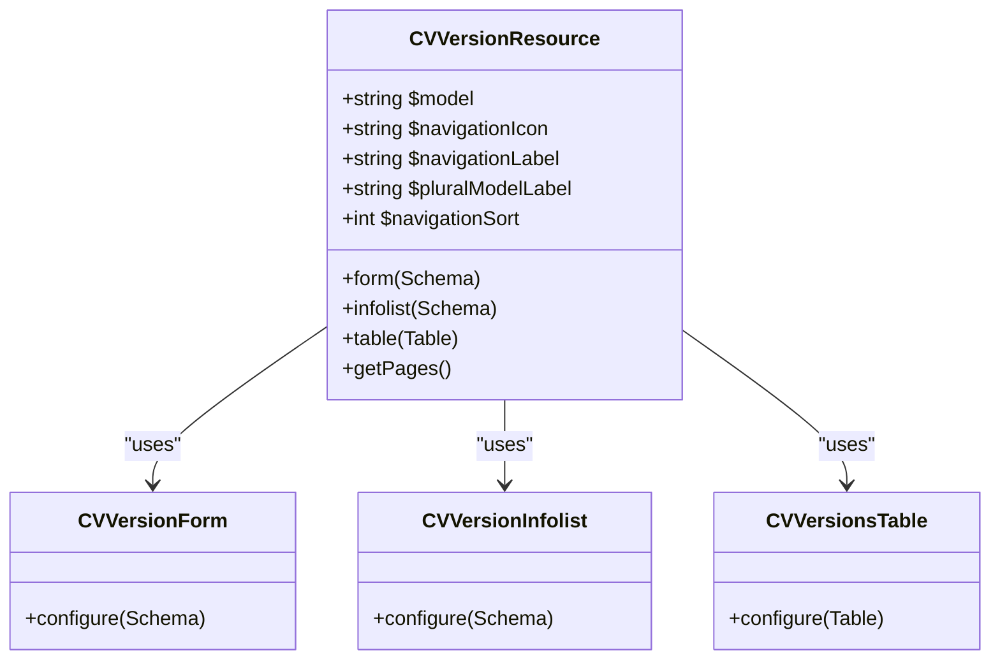
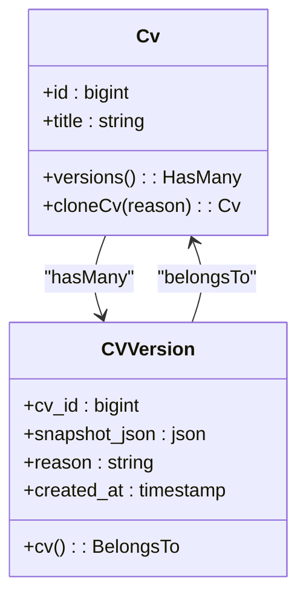
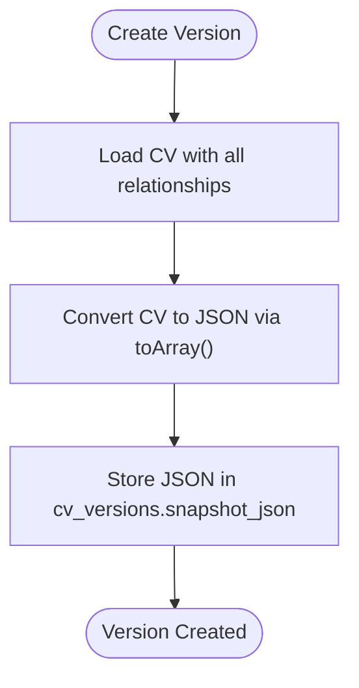
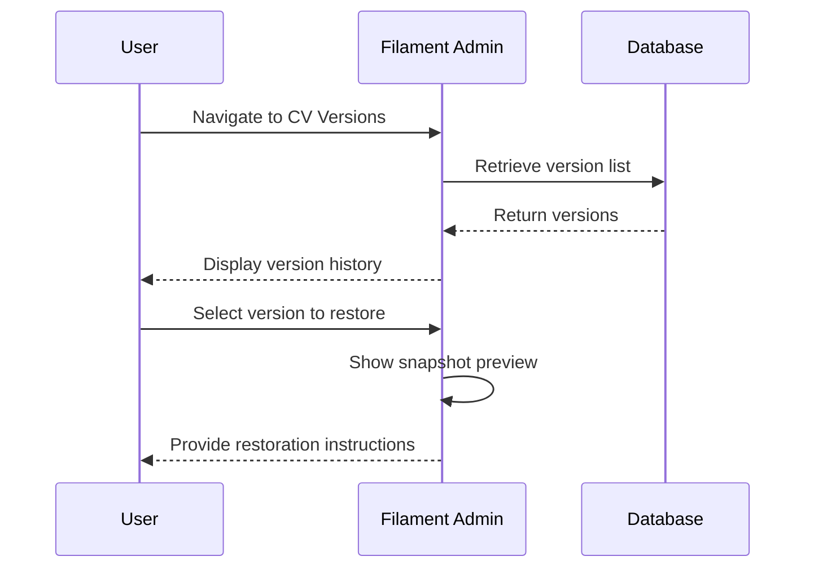
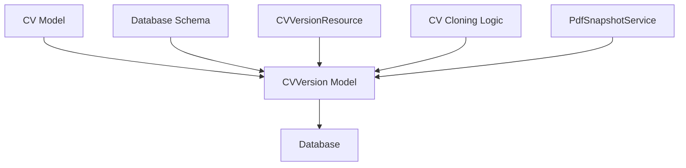

# CV Versioning

<cite>
**Referenced Files in This Document**   
- [CVVersion.php](file://app/Models/CVVersion.php)
- [Cv.php](file://app/Models/Cv.php)
- [CVVersionResource.php](file://app/Filament/Resources/CVVersions/CVVersionResource.php)
- [CVVersionForm.php](file://app/Filament/Resources/CVVersions/Schemas/CVVersionForm.php)
- [CVVersionInfolist.php](file://app/Filament/Resources/CVVersions/Schemas/CVVersionInfolist.php)
- [CVVersionsTable.php](file://app/Filament/Resources/CVVersions/Tables/CVVersionsTable.php)
- [PdfSnapshotService.php](file://app/Services/PdfSnapshotService.php)
- [PDFSnapshot.php](file://app/Models/PDFSnapshot.php)
- [create_cv_versions_table.php](file://database/migrations/2025_10_04_002612_create_cv_versions_table.php)
</cite>

## Table of Contents
1. [Introduction](#introduction)
2. [Core Components](#core-components)
3. [Architecture Overview](#architecture-overview)
4. [Detailed Component Analysis](#detailed-component-analysis)
5. [Dependency Analysis](#dependency-analysis)
6. [Performance Considerations](#performance-considerations)
7. [Troubleshooting Guide](#troubleshooting-guide)
8. [Conclusion](#conclusion)

## Introduction
The CV Versioning system captures immutable snapshots of CV states at specific points in time, enabling historical tracking, rollback capabilities, and data integrity preservation. This documentation details the implementation of version capture and storage using the CVVersion model, the trigger mechanisms for version creation, the Filament resource interface for version management, the relationship between CV and CVVersion, the JSON-based data serialization strategy, integration with PdfSnapshotService for versioned PDF generation, version rollback scenarios, data integrity considerations, performance implications, and retention strategies.

**Section sources**
- [create_cv_versions_table.php](file://database/migrations/2025_10_04_002612_create_cv_versions_table.php#L1-L31)
- [CVVersion.php](file://app/Models/CVVersion.php#L1-L38)

## Core Components
The CV versioning system consists of the CVVersion model for storing snapshots, the Cv model containing version creation logic, the CVVersionResource and associated Filament components for admin interface management, and integration with PdfSnapshotService for PDF versioning. These components work together to provide a comprehensive versioning solution that captures full CV state, maintains historical records, and enables restoration of previous versions.

**Section sources**
- [CVVersion.php](file://app/Models/CVVersion.php#L1-L38)
- [Cv.php](file://app/Models/Cv.php#L250-L342)
- [CVVersionResource.php](file://app/Filament/Resources/CVVersions/CVVersionResource.php#L18-L61)

## Architecture Overview
The CV versioning architecture implements a one-to-many relationship between CVs and their versions, with each version storing a complete JSON serialization of the CV state at a specific point in time. The system captures snapshots before significant operations like cloning and provides a read-only interface for browsing historical versions.



**Diagram sources**
- [create_cv_versions_table.php](file://database/migrations/2025_10_04_002612_create_cv_versions_table.php#L1-L31)
- [CVVersion.php](file://app/Models/CVVersion.php#L7-L38)

## Detailed Component Analysis

### CVVersion Model Analysis
The CVVersion model represents an immutable snapshot of a CV at a specific point in time, storing the complete state as JSON with metadata about the creation reason and timestamp.



**Diagram sources**
- [CVVersion.php](file://app/Models/CVVersion.php#L7-L38)

**Section sources**
- [CVVersion.php](file://app/Models/CVVersion.php#L1-L38)

### Version Creation Trigger Mechanism
The versioning system is automatically triggered during key operations, primarily when a CV is cloned. The `cloneCv` method in the Cv model handles this transactionally, creating a version snapshot before the clone operation.



**Diagram sources**
- [Cv.php](file://app/Models/Cv.php#L300-L340)
- [CVVersion.php](file://app/Models/CVVersion.php#L20-L25)

**Section sources**
- [Cv.php](file://app/Models/Cv.php#L300-L340)

### CVVersions Resource in Filament
The Filament admin interface provides comprehensive tools for managing CV versions through the CVVersionResource, including list, create, edit, and view pages that allow users to browse and restore previous versions.



**Diagram sources**
- [CVVersionResource.php](file://app/Filament/Resources/CVVersions/CVVersionResource.php#L18-L61)
- [CVVersionForm.php](file://app/Filament/Resources/CVVersions/Schemas/CVVersionForm.php#L10-L62)
- [CVVersionInfolist.php](file://app/Filament/Resources/CVVersions/Schemas/CVVersionInfolist.php#L7-L86)
- [CVVersionsTable.php](file://app/Filament/Resources/CVVersions/Tables/CVVersionsTable.php#L11-L39)

**Section sources**
- [CVVersionResource.php](file://app/Filament/Resources/CVVersions/CVVersionResource.php#L18-L61)
- [CVVersionForm.php](file://app/Filament/Resources/CVVersions/Schemas/CVVersionForm.php#L10-L62)
- [CVVersionInfolist.php](file://app/Filament/Resources/CVVersions/Schemas/CVVersionInfolist.php#L7-L86)
- [CVVersionsTable.php](file://app/Filament/Resources/CVVersions/Tables/CVVersionsTable.php#L11-L39)

### CV and CVVersion Relationship
The system implements a bidirectional relationship between CVs and their versions, with the CV model defining a one-to-many relationship to CVVersion and the CVVersion model defining a belongs-to relationship to the parent CV.



**Diagram sources**
- [Cv.php](file://app/Models/Cv.php#L250-L342)
- [CVVersion.php](file://app/Models/CVVersion.php#L7-L38)

**Section sources**
- [Cv.php](file://app/Models/Cv.php#L250-L342)
- [CVVersion.php](file://app/Models/CVVersion.php#L7-L38)

### Data Serialization Strategy
The system uses JSON serialization to store the complete state of a CV in the snapshot_json field, capturing all sections, skills, experiences, and other content in a structured format that can be easily restored.



**Diagram sources**
- [Cv.php](file://app/Models/Cv.php#L300-L340)
- [CVVersion.php](file://app/Models/CVVersion.php#L20-L25)

**Section sources**
- [Cv.php](file://app/Models/Cv.php#L300-L340)

### Integration with PdfSnapshotService
The PdfSnapshotService creates PDF snapshots for job applications and can be linked to CV versions, ensuring versioned PDFs are generated and properly associated with their corresponding CV states.

```mermaid
flowchart TD
A[create() called] --> B{CV exists?}
B --> |No| C[Throw Exception]
B --> |Yes| D[Load CV with all relationships]
D --> E[Render PDF from blade template]
E --> F[Extract binary content]
F --> G[Calculate SHA-256 hash]
G --> H[Store file with hash in filename]
H --> I[Create database record]
I --> J[Return snapshot]
```

**Diagram sources**
- [PdfSnapshotService.php](file://app/Services/PdfSnapshotService.php#L10-L60)

**Section sources**
- [PdfSnapshotService.php](file://app/Services/PdfSnapshotService.php#L1-L72)
- [PDFSnapshot.php](file://app/Models/PDFSnapshot.php#L1-L44)

### Version Rollback Scenarios
The system supports version restoration through manual recreation of CV state from a previous version's snapshot, allowing recovery from accidental changes or experimentation with different CV formats.



**Diagram sources**
- [CVVersionInfolist.php](file://app/Filament/Resources/CVVersions/Schemas/CVVersionInfolist.php#L7-L86)
- [CVVersionsTable.php](file://app/Filament/Resources/CVVersions/Tables/CVVersionsTable.php#L11-L39)

**Section sources**
- [CVVersionInfolist.php](file://app/Filament/Resources/CVVersions/Schemas/CVVersionInfolist.php#L7-L86)
- [CVVersionsTable.php](file://app/Filament/Resources/CVVersions/Tables/CVVersionsTable.php#L11-L39)

## Dependency Analysis
The CV versioning system depends on the core CV model, Eloquent ORM for database interactions, Filament components for the admin interface, and the PdfSnapshotService for PDF versioning integration. The system maintains data integrity through proper relationship constraints and transactional operations.



**Diagram sources**
- [create_cv_versions_table.php](file://database/migrations/2025_10_04_002612_create_cv_versions_table.php#L1-L31)
- [CVVersion.php](file://app/Models/CVVersion.php#L1-L29)
- [Cv.php](file://app/Models/Cv.php#L300-L340)
- [PdfSnapshotService.php](file://app/Services/PdfSnapshotService.php#L10-L60)

**Section sources**
- [create_cv_versions_table.php](file://database/migrations/2025_10_04_002612_create_cv_versions_table.php#L1-L31)
- [CVVersion.php](file://app/Models/CVVersion.php#L1-L29)
- [Cv.php](file://app/Models/Cv.php#L300-L340)
- [PdfSnapshotService.php](file://app/Services/PdfSnapshotService.php#L1-L72)

## Performance Considerations
Storing complete CV snapshots as JSON payloads has performance implications that require careful management. The system includes an index on the cv_id column to optimize queries for retrieving version history. Storage considerations include JSON payload size, query patterns, and optimization strategies such as retention policies.

**Section sources**
- [create_cv_versions_table.php](file://database/migrations/2025_10_04_002612_create_cv_versions_table.php#L16-L18)
- [CVVersion.php](file://app/Models/CVVersion.php#L15-L18)

## Troubleshooting Guide
When troubleshooting CV versioning issues, verify that version snapshots are created during CV cloning operations, check that the snapshot_json field contains valid JSON data, and ensure the foreign key relationship between cv_versions and cvs tables is maintained. Common issues include missing versions, invalid JSON serialization, performance bottlenecks, and data integrity concerns.

**Section sources**
- [Cv.php](file://app/Models/Cv.php#L300-L340)
- [CVVersion.php](file://app/Models/CVVersion.php#L1-L29)
- [PdfSnapshotService.php](file://app/Services/PdfSnapshotService.php#L1-L72)

## Conclusion
The CV Versioning system provides a robust mechanism for tracking changes to CVs over time, enabling rollback capabilities and preserving historical states. By capturing complete snapshots of CV content as JSON payloads, the system ensures that previous versions can be restored when needed. The implementation follows a clear one-to-many relationship between CVs and their versions, with automatic version creation during key operations like cloning. The integration with Filament provides an intuitive interface for version management, while the connection to PdfSnapshotService ensures consistent PDF versioning. The system is designed to be immutable after creation, ensuring data integrity and providing a reliable audit trail of CV changes.