# Cloning CVs

<cite>
**Referenced Files in This Document**   
- [Cv.php](file://app/Models/Cv.php)
- [CvCloningTest.php](file://tests/Feature/CvCloningTest.php)
- [CVVersion.php](file://app/Models/CVVersion.php)
- [CvHeaderInfo.php](file://app/Models/CvHeaderInfo.php)
- [CvSection.php](file://app/Models/CvSection.php)
- [CvSummary.php](file://app/Models/CvSummary.php)
- [CvSkillCategory.php](file://app/Models/CvSkillCategory.php)
- [CvExperience.php](file://app/Models/CvExperience.php)
- [CvProject.php](file://app/Models/CvProject.php)
- [CvEducation.php](file://app/Models/CvEducation.php)
- [CvReference.php](file://app/Models/CvReference.php)
- [CvCustomSection.php](file://app/Models/CvCustomSection.php)
- [EditCv.php](file://app/Filament/Resources/Cvs/Pages/EditCv.php)
- [CvsTable.php](file://app/Filament/Resources/Cvs/Tables/CvsTable.php)
</cite>

## Table of Contents
1. [Introduction](#introduction)
2. [Core Cloning Process](#core-cloning-process)
3. [Architecture Overview](#architecture-overview)
4. [Detailed Component Analysis](#detailed-component-analysis)
5. [Use Cases](#use-cases)
6. [Common Issues](#common-issues)
7. [Performance Considerations](#performance-considerations)
8. [Conclusion](#conclusion)

## Introduction

The CV cloning functionality enables users to create complete copies of existing CVs while maintaining referential integrity across all related sections. This feature supports the creation of variations for different job applications by duplicating the entire CV structure including HeaderInfo, Summary, Skills, Experience, Projects, Education, References, and Custom Sections. The cloning process is implemented as a transactional operation within the Cv model, ensuring data consistency and creating audit trails through version snapshots.

**Section sources**
- [Cv.php](file://app/Models/Cv.php#L120-L220)
- [CvCloningTest.php](file://tests/Feature/CvCloningTest.php#L1-L68)

## Core Cloning Process

The `cloneCv` method in the Cv model orchestrates a deep copy of a CV and all its associated data. The process follows a systematic approach to ensure complete duplication while preserving relationships and creating audit trails.


**Diagram sources**
- [Cv.php](file://app/Models/Cv.php#L120-L220)

**Section sources**
- [Cv.php](file://app/Models/Cv.php#L120-L220)

## Architecture Overview

The cloning functionality is built on a polymorphic relationship pattern where the CvSection model acts as a typed pivot between the CV and its various content types. This architecture enables flexible section management and efficient cloning.


**Diagram sources**
- [Cv.php](file://app/Models/Cv.php#L10-L118)
- [CVVersion.php](file://app/Models/CVVersion.php#L7-L30)
- [CvHeaderInfo.php](file://app/Models/CvHeaderInfo.php#L8-L30)
- [CvSection.php](file://app/Models/CvSection.php#L10-L60)

## Detailed Component Analysis

### Cloning Method Implementation

The `cloneCv` method implements a transactional deep copy process that ensures data integrity and creates audit trails.

#### Cloning Process Flow


**Diagram sources**
- [Cv.php](file://app/Models/Cv.php#L120-L220)

**Section sources**
- [Cv.php](file://app/Models/Cv.php#L120-L220)

### Test Suite Validation

The test suite validates the cloning functionality through multiple test cases that verify deep copying, independence of clones, and version snapshot creation.

#### Test Coverage

```mermaid
flowchart TD
TestSuite[CV Cloning Test Suite] --> Test1["clone creates full deep copy"]
TestSuite --> Test2["clone creates cv version snapshot"]
TestSuite --> Test3["cloned cv has independent sections"]
TestSuite --> Test4["version snapshot json is valid"]
Test1 --> Verify["Verify:"]
Verify --> NewId["New CV ID ≠ Original ID"]
Verify --> CopyTitle["Title contains 'Copy'"]
Verify --> SectionCount["Section count preserved"]
Test2 --> Snapshot["Verify CVVersion created with:"]
Snapshot --> Reason["Reason field set"]
Snapshot --> JsonArray["snapshot_json is array"]
Snapshot --> CreatedAt["created_at is Carbon instance"]
Test3 --> Independence["Verify modifications to cloned section"]
Independence --> OriginalUnchanged["Original section unchanged"]
Independence --> CloneModified["Clone section modified"]
Test4 --> Structure["Verify snapshot_json structure:"]
Structure --> HasId["Contains 'id' key"]
Structure --> HasTitle["Contains 'title' key"]
```


**Diagram sources**
- [CvCloningTest.php](file://tests/Feature/CvCloningTest.php#L1-L68)

**Section sources**
- [CvCloningTest.php](file://tests/Feature/CvCloningTest.php#L1-L68)

## Use Cases

### Creating Job Application Variations

Users can create tailored CVs for different job applications by cloning their base CV and modifying specific sections to highlight relevant skills and experiences.


**Section sources**
- [EditCv.php](file://app/Filament/Resources/Cvs/Pages/EditCv.php#L25-L35)
- [CvsTable.php](file://app/Filament/Resources/Cvs/Tables/CvsTable.php#L50-L60)

### Version Management

The cloning process automatically creates version snapshots, enabling users to track changes and revert to previous states if needed.

```mermaid
flowchart TB
CV1[CV Version 1] --> |Clone with changes| CV2[CV Version 2]
CV2 --> |Clone with changes| CV3[CV Version 3]
CV3 --> |Clone with changes| CV4[CV Version 4]
subgraph Version Snapshots
S1[CVVersion: Reason="Initial"]
S2[CVVersion: Reason="Added projects"]
S3[CVVersion: Reason="Updated experience"]
S4[CVVersion: Reason="Cloned via edit page"]
end
CV1 --> S1
CV2 --> S2
CV3 --> S3
CV4 --> S4
```

**Section sources**
- [Cv.php](file://app/Models/Cv.php#L125-L135)
- [CVVersion.php](file://app/Models/CVVersion.php#L7-L30)

## Common Issues

### Incomplete Clones

Incomplete clones may occur if relationships are not properly defined or if the transaction fails mid-process.


**Section sources**
- [Cv.php](file://app/Models/Cv.php#L120-L220)

### Validation Failures

Validation failures can prevent successful cloning when required fields are missing or data types are incompatible.


**Section sources**
- [Cv.php](file://app/Models/Cv.php#L120-L220)

## Performance Considerations

### Large CV Cloning

Cloning large CVs with many sections can impact performance due to the recursive nature of the operation.


**Section sources**
- [Cv.php](file://app/Models/Cv.php#L120-L220)

## Conclusion

The CV cloning functionality provides a robust mechanism for creating complete copies of CVs while maintaining referential integrity across all related sections. The implementation uses a transactional approach to ensure data consistency and creates version snapshots for audit purposes. The polymorphic relationship pattern through the CvSection model enables flexible section management and efficient cloning. Users can leverage this feature to create tailored CVs for different job applications while maintaining a history of changes through version snapshots.