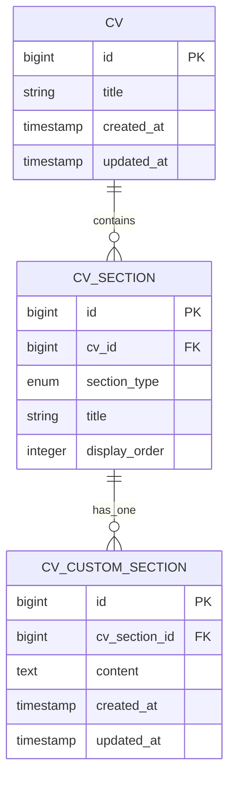
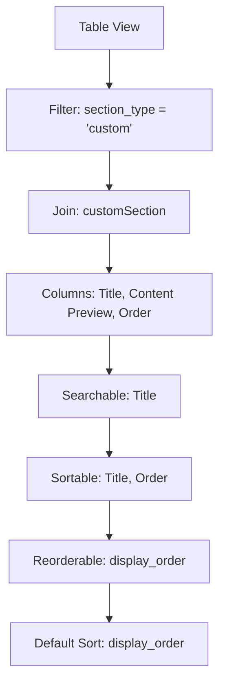
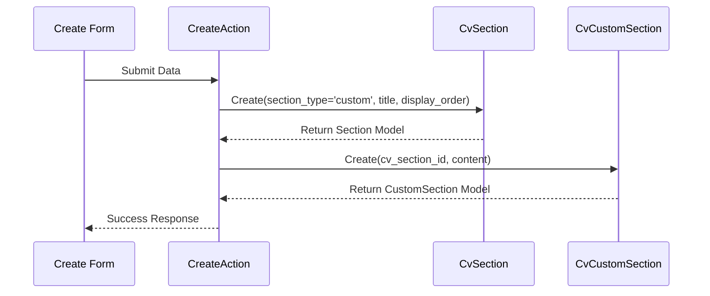

# Custom Sections

<cite>
**Referenced Files in This Document**   
- [CustomSectionsRelationManager.php](file://app/Filament/Resources/Cvs/RelationManagers/CustomSectionsRelationManager.php) - *Updated in recent commit*
- [CvSection.php](file://app/Models/CvSection.php)
- [CvCustomSection.php](file://app/Models/CvCustomSection.php)
- [pdf.blade.php](file://resources/views/cv/pdf.blade.php)
- [2025_10_03_225856_modify_cv_sections_table_for_custom_sections.php](file://database/migrations/2025_10_03_225856_modify_cv_sections_table_for_custom_sections.php)
- [2025_10_03_225951_create_cv_custom_sections_table.php](file://database/migrations/2025_10_03_225951_create_cv_custom_sections_table.php)
</cite>

## Update Summary
**Changes Made**   
- Updated **Form Schema and Dynamic Default Values** section to reflect improved labeling and dynamic default logic for `display_order`
- Enhanced clarity in **Table Configuration and User Interface** regarding column labels and sorting behavior
- No structural or functional changes beyond UI/UX improvements in form fields
- Maintained all existing functionality and data flow descriptions

## Table of Contents
1. [Introduction](#introduction)
2. [Data Model and Relationships](#data-model-and-relationships)
3. [Form Schema and Dynamic Default Values](#form-schema-and-dynamic-default-values)
4. [Table Configuration and User Interface](#table-configuration-and-user-interface)
5. [Transaction-Safe Record Creation](#transaction-safe-record-creation)
6. [PDF Rendering of Custom Sections](#pdf-rendering-of-custom-sections)
7. [Common Issues and Troubleshooting](#common-issues-and-troubleshooting)
8. [Best Practices for Effective Custom Sections](#best-practices-for-effective-custom-sections)

## Introduction
The Custom Sections feature in the CV Builder application enables users to create personalized content sections within their CVs through the Filament admin interface. These sections are managed via the `CustomSectionsRelationManager`, which handles user-defined entries through a hasMany relationship using the `sections` table and the `CvCustomSection` model. This system supports flexible content creation for elements such as certifications, publications, or languages, allowing candidates to enhance their professional profiles with tailored information. The implementation ensures data integrity, proper ordering, and consistent rendering in both web and PDF outputs.

## Data Model and Relationships
The custom sections functionality is built on a polymorphic relationship pattern using the `cv_sections` table as a typed pivot. When a section is designated as 'custom', it links to a corresponding `CvCustomSection` record that stores the rich content. This design allows for extensibility without altering the core CV structure.

**Diagram sources**
- [CvSection.php](file://app/Models/CvSection.php#L10-L60)
- [CvCustomSection.php](file://app/Models/CvCustomSection.php#L7-L18)
- [2025_10_03_225856_modify_cv_sections_table_for_custom_sections.php](file://database/migrations/2025_10_03_225856_modify_cv_sections_table_for_custom_sections.php#L1-L37)
- [2025_10_03_225951_create_cv_custom_sections_table.php](file://database/migrations/2025_10_03_225951_create_cv_custom_sections_table.php#L1-L31)

**Section sources**
- [CvSection.php](file://app/Models/CvSection.php#L10-L60)
- [CvCustomSection.php](file://app/Models/CvCustomSection.php#L7-L18)

## Form Schema and Dynamic Default Values
The form schema for custom sections includes three fields: `title`, `content` (rich textarea), and `display_order`. The `title` is required and limited to 255 characters, while the `content` field supports extensive text input with 10 rows visible by default. A key feature is the dynamic default value for `display_order`, which calculates the next available position by querying the maximum current order value for the associated CV and incrementing it by one.

This approach ensures new sections are automatically placed at the end of the section list, maintaining logical ordering without requiring manual input. The dynamic default is implemented using a closure that references the owner record's ID, ensuring context-aware calculation during creation. The field is now explicitly labeled as "Display Order" in the UI, improving clarity and consistency with other relation managers.

**Section sources**
- [CustomSectionsRelationManager.php](file://app/Filament/Resources/Cvs/RelationManagers/CustomSectionsRelationManager.php#L45-L55)

## Table Configuration and User Interface
The table configuration in the `CustomSectionsRelationManager` provides an intuitive interface for managing custom sections. It includes searchability on the `title` field, a content preview limited to 100 characters, and sortable display of the `display_order` column. The table is configured to reorder records via drag-and-drop interactions on the `display_order` field, enabling effortless visual reorganization.

The query is modified to filter only sections where `section_type` is 'custom' and eager loads the related `customSection` data to optimize performance. Sorting defaults to `display_order`, ensuring consistent presentation aligned with the intended layout sequence. Column labels have been standardized, with the order column now clearly labeled as "Order" to match UI conventions.

**Diagram sources**
- [CustomSectionsRelationManager.php](file://app/Filament/Resources/Cvs/RelationManagers/CustomSectionsRelationManager.php#L22-L43)

**Section sources**
- [CustomSectionsRelationManager.php](file://app/Filament/Resources/Cvs/RelationManagers/CustomSectionsRelationManager.php#L22-L43)

## Transaction-Safe Record Creation
The `using` callback in the create action ensures transaction-safe creation of both `CvSection` and `CvCustomSection` records. When a new custom section is added, the system first creates a `CvSection` record with `section_type` set to 'custom', along with the provided title and calculated display order. Immediately following, a `CvCustomSection` record is created, linking to the newly created section via `cv_section_id` and storing the rich content.

Although the current implementation does not explicitly wrap these operations in a database transaction, Laravel's model creation methods provide inherent atomicity for individual saves. For enhanced reliability, wrapping the entire operation in a transaction would prevent partial failures and ensure data consistency.

**Diagram sources**
- [CustomSectionsRelationManager.php](file://app/Filament/Resources/Cvs/RelationManagers/CustomSectionsRelationManager.php#L56-L73)

**Section sources**
- [CustomSectionsRelationManager.php](file://app/Filament/Resources/Cvs/RelationManagers/CustomSectionsRelationManager.php#L56-L73)

## PDF Rendering of Custom Sections
Custom sections are rendered in the PDF output through the `pdf.blade.php` template, which iterates over all sections sorted by `display_order`. When the template encounters a section with `section_type` set to 'custom', it displays the title and content accordingly. The content is output directly within a section div, preserving formatting as defined in the rich text editor.

The styling applied in the Blade template ensures consistent typography and spacing, with the title displayed as an `<h2>` element and the content rendered as paragraph text. This integration maintains visual coherence across all section types in the final document.

**Section sources**
- [pdf.blade.php](file://resources/views/cv/pdf.blade.php#L1-L135)

## Common Issues and Troubleshooting
Two common issues may arise when managing custom sections: content formatting preservation and ordering inconsistencies. Rich text content may lose formatting if not properly sanitized or escaped during storage or rendering. Ensuring the content is stored in its original HTML form and rendered safely in the Blade template prevents this issue.

Ordering problems can occur if multiple users modify section order simultaneously or if the `display_order` values become non-sequential due to deletions. Implementing a background job to normalize display order values after bulk changes can mitigate this. Additionally, validating that `display_order` values remain unique per CV prevents conflicts in sorting.

**Section sources**
- [CustomSectionsRelationManager.php](file://app/Filament/Resources/Cvs/RelationManagers/CustomSectionsRelationManager.php#L22-L115)
- [pdf.blade.php](file://resources/views/cv/pdf.blade.php#L1-L135)

## Best Practices for Effective Custom Sections
To maximize the impact of custom sections, users should focus on relevance and clarity. Sections like certifications should include issuing organization, date earned, and credential ID when applicable. Publications should follow a consistent citation format, including title, publication venue, date, and co-authors. Language proficiency sections should specify the language and level (e.g., "Fluent", "Professional Working Proficiency").

Avoid duplicating information present in standard sections. Instead, use custom sections to highlight unique achievements or specialized knowledge that differentiates the candidate. Keep content concise and use bullet points where appropriate to improve readability in both digital and printed formats.