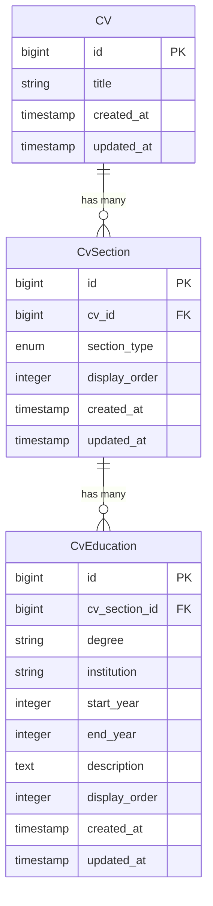

# Education History

<cite>
**Referenced Files in This Document**   
- [EducationRelationManager.php](file://app/Filament/Resources/Cvs/RelationManagers/EducationRelationManager.php)
- [CvEducation.php](file://app/Models/CvEducation.php)
- [CvSection.php](file://app/Models/CvSection.php)
- [data-model.md](file://specs/001-cv-builder-application/data-model.md)
- [filament-actions.md](file://specs/001-cv-builder-application/contracts/filament-actions.md)
- [cv_builder_spec.md](file://cv_builder_spec.md)
- [2025_10_03_201722_create_cv_education_table.php](file://database/migrations/2025_10_03_201722_create_cv_education_table.php)
</cite>

## Table of Contents
1. [Introduction](#introduction)
2. [Core Architecture](#core-architecture)
3. [Form Schema and Validation](#form-schema-and-validation)
4. [Data Creation Process](#data-creation-process)
5. [Table Display and Sorting](#table-display-and-sorting)
6. [Common Issues and Validation Rules](#common-issues-and-validation-rules)
7. [Best Practices for Education Presentation](#best-practices-for-education-presentation)
8. [Conclusion](#conclusion)

## Introduction
The Education History section in the CV Builder application allows users to manage multiple academic qualifications through the Filament admin interface. This document details how the EducationRelationManager handles educational entries via a hasMany relationship through the sections table using the CvEducation model. The system supports comprehensive management of degree information, institutions, date ranges, and descriptions with robust validation and sorting capabilities.

## Core Architecture
The education management system uses a polymorphic pattern where the `cv_sections` table acts as a typed pivot between CVs and their content sections. The EducationRelationManager establishes a relationship with the sections table, specifically targeting entries where `section_type` is 'education'.

The architecture follows a layered approach:
- **CV**: Root entity containing multiple sections
- **CvSection**: Polymorphic pivot with `section_type` = 'education' and `display_order`
- **CvEducation**: Contains actual education records linked to a CvSection

This design provides a single source of truth for section ordering while enabling flexible content management.



**Diagram sources**
- [CvSection.php](file://app/Models/CvSection.php#L10-L60)
- [CvEducation.php](file://app/Models/CvEducation.php#L7-L23)
- [data-model.md](file://specs/001-cv-builder-application/data-model.md#L76-L109)

**Section sources**
- [CvSection.php](file://app/Models/CvSection.php#L10-L60)
- [CvEducation.php](file://app/Models/CvEducation.php#L7-L23)

## Form Schema and Validation
The EducationRelationManager implements a comprehensive form schema with strict validation rules to ensure data integrity.

### Form Fields
- **Degree**: Required text field with 255 character limit
- **Institution**: Required text field with 255 character limit  
- **Start Year**: Required numeric field with min value 1900 and max value 2100
- **End Year**: Optional numeric field with min value 1900 and max value 2100
- **Description**: Optional textarea with 3 rows for additional details
- **Display Order**: Required numeric field for sorting

### Validation Rules
The system enforces the following validation constraints:
- Degree and institution are required fields
- Start year must be between 1900 and 2100
- End year must be greater than or equal to start year
- End year must be between 1900 and 2100
- Description is optional with no length restrictions
- Display order is required and must be a positive integer

The validation ensures that all educational entries maintain consistent formatting and logical date relationships.

**Section sources**
- [EducationRelationManager.php](file://app/Filament/Resources/Cvs/RelationManagers/EducationRelationManager.php#L67-L81)
- [data-model.md](file://specs/001-cv-builder-application/data-model.md#L276-L310)

## Data Creation Process
The data creation process involves linking CvEducation records to the appropriate CvSection through a well-defined workflow.

### Section Initialization
When accessing the education section for the first time, the system ensures the existence of a corresponding CvSection:

```php
$section = CvSection::firstOrCreate([
    'cv_id' => $this->getOwnerRecord()->id,
    'section_type' => 'education',
], [
    'display_order' => 5,
]);
```

This operation creates the section if it doesn't exist, with a default display_order of 5, or retrieves the existing section.

### Record Creation
During the creation process, the system:
1. Creates or identifies the appropriate CvSection
2. Assigns the cv_section_id to the education record
3. Creates the CvEducation record with all provided data

The custom `using` callback in the CreateAction handles this process:

```php
->using(function (array $data): Model {
    $section = CvSection::firstOrCreate([
        'cv_id' => $this->getOwnerRecord()->id,
        'section_type' => 'education',
    ], [
        'display_order' => 5,
    ]);

    $data['cv_section_id'] = $section->id;
    return CvEducation::create($data);
})
```

This ensures proper relationship establishment between the education record and its parent section.

**Section sources**
- [EducationRelationManager.php](file://app/Filament/Resources/Cvs/RelationManagers/EducationRelationManager.php#L18-L120)
- [CvSection.php](file://app/Models/CvSection.php#L10-L60)

## Table Display and Sorting
The education records are displayed in a sortable table with drag-and-drop reordering capabilities.

### Table Columns
The table displays the following columns:
- **Degree**: Name of the academic qualification
- **Institution**: Educational institution name
- **Start Year**: Year of program commencement
- **Order**: Display order value used for sorting

### Sorting and Reordering
The system implements two sorting mechanisms:
1. **Default Sort**: Records are sorted by `display_order` in ascending order
2. **Drag-and-Drop Reordering**: Users can reorder records using drag-and-drop functionality

The table configuration enables reordering:
```php
->defaultSort('display_order')
->reorderable('display_order')
```

Missing end dates are handled gracefully in the display, showing "N/A" when no end year is provided. The start year is always required, ensuring every educational entry has at least a commencement date.

The table query is optimized through the `getTableQuery` method, which ensures the parent section exists before retrieving education records.

**Section sources**
- [EducationRelationManager.php](file://app/Filament/Resources/Cvs/RelationManagers/EducationRelationManager.php#L36-L69)
- [filament-actions.md](file://specs/001-cv-builder-application/contracts/filament-actions.md#L263-L312)

## Common Issues and Validation Rules
Several common issues can arise when managing education history, primarily related to date validation and data consistency.

### Year Validation Issues
The most common validation issues involve year fields:
- **Invalid Date Ranges**: End year before start year
- **Out-of-Range Values**: Years outside 1900-2100 range
- **Missing Start Year**: Required field not provided

The system prevents invalid date ranges by enforcing that the end year must be greater than or equal to the start year. This validation is implemented in both the form and database layers.

### Data Consistency Rules
Additional validation rules ensure data quality:
- Degree and institution fields are required and limited to 255 characters
- Description field is optional but supports rich text content
- Display order must be a positive integer
- Each education record must be linked to a valid CvSection

The polymorphic relationship through CvSection ensures referential integrity and prevents orphaned education records.

**Section sources**
- [EducationRelationManager.php](file://app/Filament/Resources/Cvs/RelationManagers/EducationRelationManager.php#L67-L81)
- [data-model.md](file://specs/001-cv-builder-application/data-model.md#L276-L310)

## Best Practices for Education Presentation
Effective presentation of education information enhances the overall impact of a CV.

### Content Organization
- List education entries in reverse chronological order
- Include relevant coursework that aligns with target positions
- Highlight academic achievements and honors
- Use consistent date formatting across all entries

### Information Hierarchy
Prioritize information based on relevance:
1. Degree and major
2. Institution name and location
3. Graduation date (or expected graduation)
4. Academic achievements and honors
5. Relevant coursework and projects

### Achievement Documentation
For maximum impact, include:
- GPA (if 3.5 or higher)
- Dean's List recognition
- Academic awards and scholarships
- Thesis or capstone project titles
- Relevant research experience

The optional description field should be used strategically to highlight accomplishments that demonstrate skills relevant to the target position.

## Conclusion
The Education History management system in the CV Builder application provides a robust framework for maintaining academic qualifications. Through the EducationRelationManager, the system effectively handles multiple educational entries via a hasMany relationship through the sections table. The implementation includes comprehensive validation for degree, institution, and date fields, with special attention to year range validation. The table display supports intuitive sorting through drag-and-drop reordering based on display_order, while gracefully handling missing end dates. By following best practices for education presentation, users can create compelling CVs that effectively showcase their academic background and achievements.