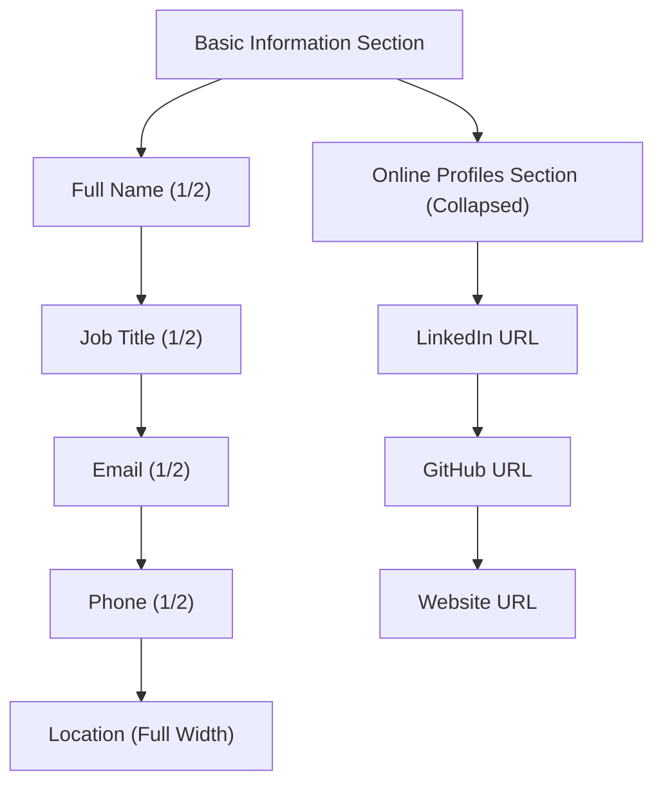
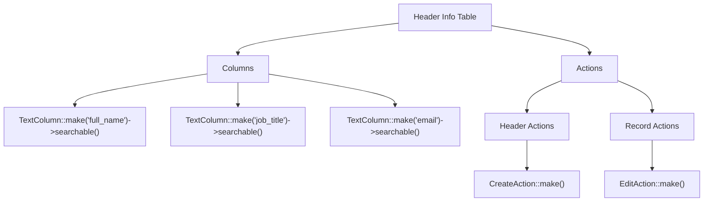
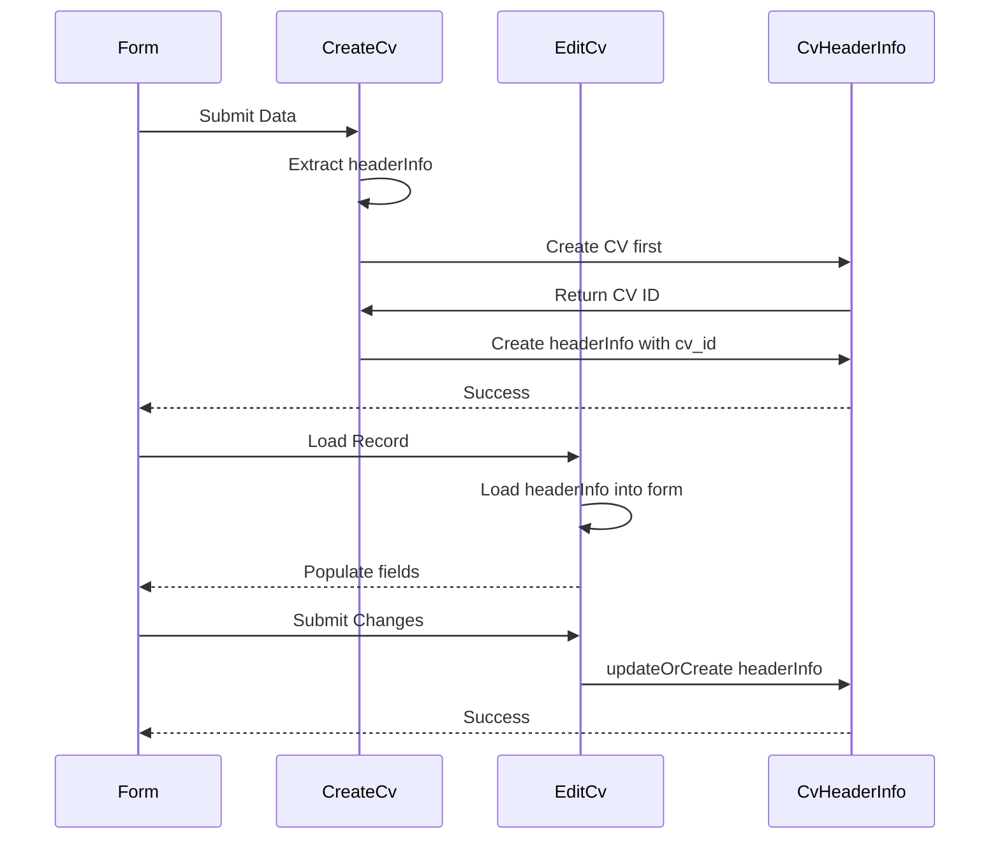

# Header Information

<cite>
**Referenced Files in This Document**   
- [HeaderInfoRelationManager.php](file://app/Filament/Resources/Cvs/RelationManagers/HeaderInfoRelationManager.php) - *Updated with UI/UX improvements*
- [CvHeaderInfo.php](file://app/Models/CvHeaderInfo.php) - *Model for header information*
- [Cv.php](file://app/Models/Cv.php) - *Main CV model with relationship definition*
- [CreateCv.php](file://app/Filament/Resources/Cvs/Pages/CreateCv.php) - *Creation workflow handling*
- [EditCv.php](file://app/Filament/Resources/Cvs/Pages/EditCv.php) - *Edit workflow with header data handling*
- [CvForm.php](file://app/Filament/Resources/Cvs/Schemas/CvForm.php) - *Form schema used in CV creation/editing*
- [create_cv_header_info_table.php](file://database/migrations/2025_10_03_201656_create_cv_header_info_table.php) - *Database schema definition*
- [BaseCVSeeder.php](file://database/seeders/BaseCVSeeder.php) - *Added website_url field in seed data*
</cite>

## Update Summary
**Changes Made**   
- Updated **Form Schema and Layout** section to reflect new section organization and icons
- Added **website_url** field documentation in validation and layout sections
- Enhanced diagram to show new section structure with collapsible online profiles
- Updated source references to include seeder file changes
- Revised code examples to match current implementation with Section components

## Table of Contents
1. [Introduction](#introduction)
2. [Relationship and Data Model](#relationship-and-data-model)
3. [Form Schema and Layout](#form-schema-and-layout)
4. [Validation Rules](#validation-rules)
5. [Table Display Configuration](#table-display-configuration)
6. [Record Title and Uniqueness](#record-title-and-uniqueness)
7. [Creation and Update Workflow](#creation-and-update-workflow)
8. [Common Issues and Error Handling](#common-issues-and-error-handling)
9. [Best Practices for Consistent Personal Information](#best-practices-for-consistent-personal-information)

## Introduction
The Header Information section in the CV Builder application manages personal and contact details for a CV through the Filament admin interface. This section is handled by the `HeaderInfoRelationManager`, which manages a `hasOne` relationship with the `CvHeaderInfo` model. It provides a structured form for entering personal details, contact information, and social links, while enforcing validation and layout rules. This document details the implementation, configuration, and best practices for managing header information in CVs.

## Relationship and Data Model
The `HeaderInfoRelationManager` establishes a one-to-one relationship between a CV and its header information via the `headerInfo` relationship. The `CvHeaderInfo` model stores personal and professional details linked to a single CV through a foreign key constraint.

The database schema enforces uniqueness of the `cv_id` field, ensuring only one header record can exist per CV. The model includes fields for full name, job title, email, phone, location, and URLs for LinkedIn, GitHub, and personal websites.

```mermaid
erDiagram
CV ||--o{ CV_HEADER_INFO : "hasOne"
CV {
bigint id PK
string title
timestamps
}
CV_HEADER_INFO {
bigint id PK
bigint cv_id FK,UK
string full_name
string job_title
string email
string phone
string location
string linkedin_url
string github_url
string website_url
timestamps
}
```

**Diagram sources**
- [Cv.php](file://app/Models/Cv.php#L20-L23)
- [CvHeaderInfo.php](file://app/Models/CvHeaderInfo.php#L20-L23)
- [create_cv_header_info_table.php](file://database/migrations/2025_10_03_201656_create_cv_header_info_table.php#L10-L11)

**Section sources**
- [Cv.php](file://app/Models/Cv.php#L20-L23)
- [CvHeaderInfo.php](file://app/Models/CvHeaderInfo.php#L20-L23)
- [create_cv_header_info_table.php](file://database/migrations/2025_10_03_201656_create_cv_header_info_table.php#L10-L11)

## Form Schema and Layout
The form schema in `HeaderInfoRelationManager` has been restructured into two distinct sections: 'Basic Information' and 'Online Profiles'. The layout uses a two-column approach within the Basic Information section while keeping the Online Profiles section collapsed by default to improve UI/UX.

Personal details (full name, job title, email, phone) are organized in a two-column grid, with location spanning both columns. The Online Profiles section contains LinkedIn, GitHub, and website URLs, each with appropriate icons (user-circle, code-bracket, and globe-alt respectively).



**Diagram sources**
- [HeaderInfoRelationManager.php](file://app/Filament/Resources/Cvs/RelationManagers/HeaderInfoRelationManager.php#L18-L50)
- [CvForm.php](file://app/Filament/Resources/Cvs/Schemas/CvForm.php#L19-L38)

**Section sources**
- [HeaderInfoRelationManager.php](file://app/Filament/Resources/Cvs/RelationManagers/HeaderInfoRelationManager.php#L18-L50)
- [CvForm.php](file://app/Filament/Resources/Cvs/Schemas/CvForm.php#L19-L38)

## Validation Rules
The form enforces strict validation rules to ensure data integrity:

- **Email**: Must be valid format and required
- **Phone**: Validated as telephone number
- **URLs**: LinkedIn, GitHub, and website URLs must be valid URLs
- **Text Length**: Maximum character limits enforced (255 for names/email, 500 for URLs)
- **Required Fields**: Full name, job title, and email are mandatory

These rules are implemented directly in the Filament form components using built-in validation methods like `->email()`, `->url()`, and `->required()`. The website_url field follows the same validation pattern as other URL fields.

**Section sources**
- [HeaderInfoRelationManager.php](file://app/Filament/Resources/Cvs/RelationManagers/HeaderInfoRelationManager.php#L24-L48)

## Table Display Configuration
The table view in `HeaderInfoRelationManager` displays key header information in a compact format with searchable columns for full name, job title, and email. The table includes:

- **Header Actions**: Create action allows adding a new header record
- **Record Actions**: Edit action enables modification of existing records
- **Searchable Columns**: Critical fields are indexed for quick lookup

This configuration provides efficient access to header information while maintaining a clean interface.



**Diagram sources**
- [HeaderInfoRelationManager.php](file://app/Filament/Resources/Cvs/RelationManagers/HeaderInfoRelationManager.php#L52-L65)

**Section sources**
- [HeaderInfoRelationManager.php](file://app/Filament/Resources/Cvs/RelationManagers/HeaderInfoRelationManager.php#L52-L65)

## Record Title and Uniqueness
The record title for the header information is derived from the `full_name` attribute using the `$recordTitleAttribute` property. This ensures that the person's name is displayed as the primary identifier in related views and dropdowns.

The uniqueness constraint is enforced at both the database and application levels:
- Database: Unique index on `cv_id` in the `cv_header_info` table
- Application: `updateOrCreate` method prevents duplicate records during save operations

This dual-layer enforcement guarantees that only one header record exists per CV.

**Section sources**
- [HeaderInfoRelationManager.php](file://app/Filament/Resources/Cvs/RelationManagers/HeaderInfoRelationManager.php#L14)
- [create_cv_header_info_table.php](file://database/migrations/2025_10_03_201656_create_cv_header_info_table.php#L10)
- [EditCv.php](file://app/Filament/Resources/Cvs/Pages/EditCv.php#L67-L69)

## Creation and Update Workflow
The creation and update workflow is handled differently during CV creation versus editing:

- **CV Creation**: Header info data is extracted in `mutateFormDataBeforeCreate` and saved after the CV record is created using `afterCreate`
- **CV Editing**: Header info is loaded into the form via `mutateFormDataBeforeFill` and saved separately using `updateOrCreate` in `mutateFormDataBeforeSave`

This approach ensures proper foreign key relationships and handles the one-to-one nature of the association.



**Diagram sources**
- [CreateCv.php](file://app/Filament/Resources/Cvs/Pages/CreateCv.php#L14-L29)
- [EditCv.php](file://app/Filament/Resources/Cvs/Pages/EditCv.php#L44-L73)

**Section sources**
- [CreateCv.php](file://app/Filament/Resources/Cvs/Pages/CreateCv.php#L14-L29)
- [EditCv.php](file://app/Filament/Resources/Cvs/Pages/EditCv.php#L44-L73)

## Common Issues and Error Handling
Common issues include validation failures and duplicate entry attempts:

- **Validation Errors**: Handled by Filament's built-in validation with user-friendly messages
- **Duplicate Prevention**: The unique constraint on `cv_id` and use of `updateOrCreate` prevent duplicates
- **Required Field Omissions**: Full name, job title, and email are required and validated before submission
- **Invalid Formats**: Email and URL fields reject improperly formatted entries

Error messages are displayed inline with the respective fields, guiding users to correct their input. The addition of the website_url field follows the same validation pattern as other URL fields.

**Section sources**
- [HeaderInfoRelationManager.php](file://app/Filament/Resources/Cvs/RelationManagers/HeaderInfoRelationManager.php#L24-L48)
- [EditCv.php](file://app/Filament/Resources/Cvs/Pages/EditCv.php#L67-L69)

## Best Practices for Consistent Personal Information
To maintain consistency across multiple CV versions:

- Always update the header information in the master CV record
- Use the clone functionality to preserve header data when creating variations
- Regularly audit social links for accuracy and relevance
- Maintain consistent formatting for phone numbers and location
- Ensure email addresses are professional and active
- Keep LinkedIn and GitHub profiles synchronized with CV content
- Include your personal website URL to provide additional professional presence

These practices ensure that personal information remains accurate and professional across all CV iterations.

**Section sources**
- [Cv.php](file://app/Models/Cv.php#L136-L140)
- [HeaderInfoRelationManager.php](file://app/Filament/Resources/Cvs/RelationManagers/HeaderInfoRelationManager.php#L18-L50)
- [BaseCVSeeder.php](file://database/seeders/BaseCVSeeder.php#L15-L25)
