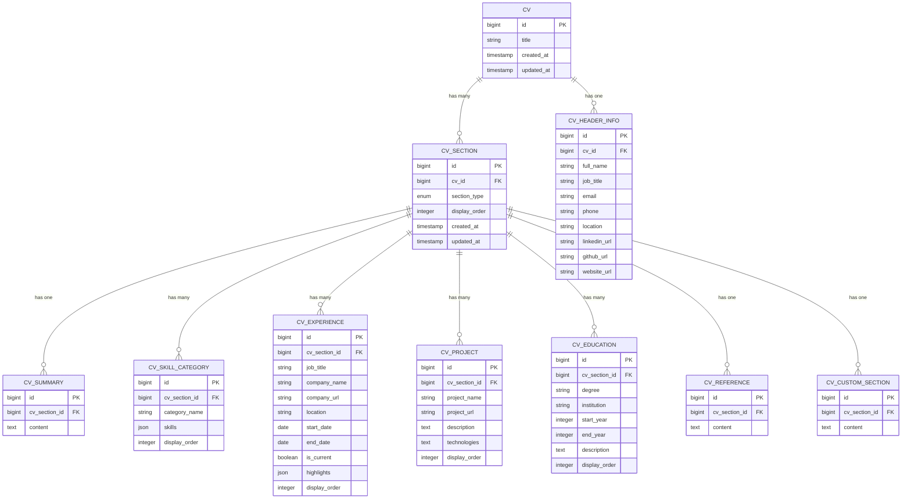
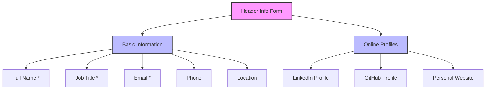
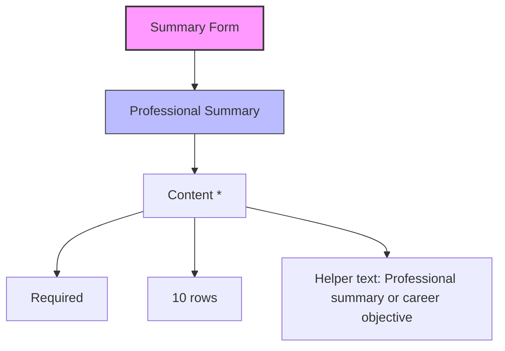
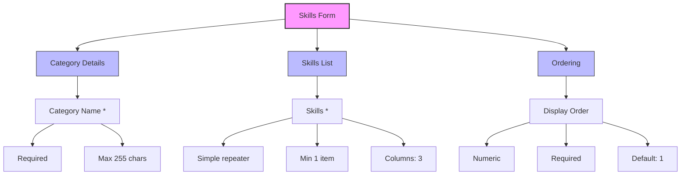
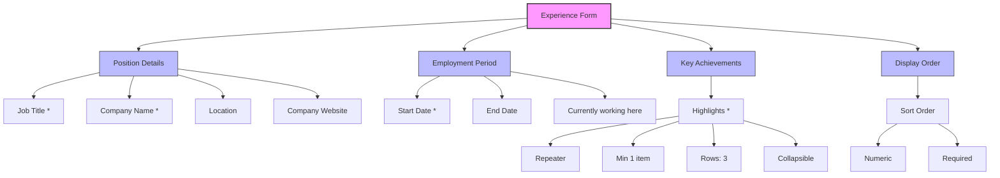
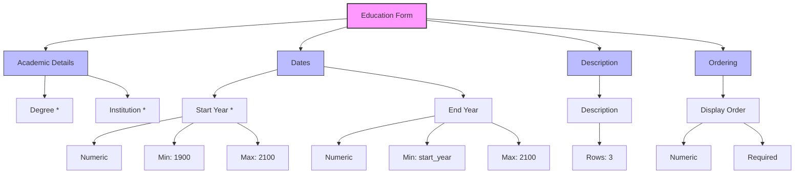
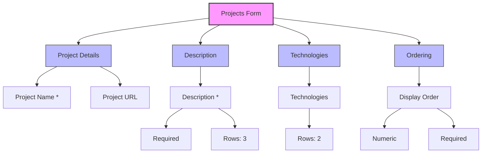
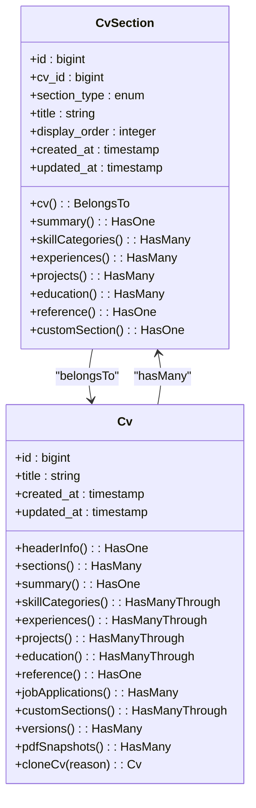
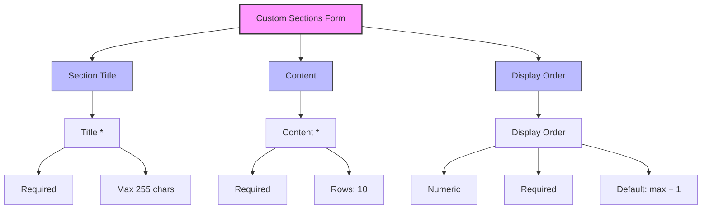

# Managing Sections

<cite>
**Referenced Files in This Document**   
- [HeaderInfoRelationManager.php](file://app/Filament/Resources/Cvs/RelationManagers/HeaderInfoRelationManager.php) - *Updated in recent commit*
- [ExperienceRelationManager.php](file://app/Filament/Resources/Cvs/RelationManagers/ExperienceRelationManager.php) - *Updated in recent commit*
- [cv_builder_spec.md](file://cv_builder_spec.md)
- [data-model.md](file://specs/001-cv-builder-application/data-model.md)
- [filament-actions.md](file://specs/001-cv-builder-application/contracts/filament-actions.md)
</cite>

## Update Summary
**Changes Made**   
- Updated Header Information Management section to reflect new UI/UX improvements with collapsible sections and icons
- Updated Experience Section Management section to include new structured form layout with icons and collapsible repeaters
- Added new diagram for Header Info form structure reflecting current implementation
- Added new diagram for Experience form structure reflecting current implementation
- Updated section sources to reflect file changes and additions

## Table of Contents
1. [Introduction](#introduction)
2. [Section Management Architecture](#section-management-architecture)
3. [Core Section Types](#core-section-types)
4. [Section Ordering and Persistence](#section-ordering-and-persistence)
5. [Custom Sections Management](#custom-sections-management)
6. [Common Issues and Troubleshooting](#common-issues-and-troubleshooting)
7. [Best Practices](#best-practices)
8. [Conclusion](#conclusion)

## Introduction

The CV Builder application utilizes Filament's RelationManagers to provide a comprehensive interface for managing CV sections. Each section type (Header Info, Summary, Skills, Experience, Education, Projects, References, and Custom Sections) is managed through dedicated RelationManagers that define form schemas and infolist displays. This documentation details the implementation, functionality, and best practices for managing CV sections through the Filament admin interface.

The system employs a polymorphic pattern via the `cv_sections` table, which acts as a typed pivot between the CV and its various content sections. This design allows for flexible section management while maintaining a single source of truth for section ordering. The RelationManagers provide the interface for adding, editing, and reordering sections, with drag-and-drop functionality available for sections that support multiple entries.

**Section sources**
- [cv_builder_spec.md](file://cv_builder_spec.md#L0-L192)
- [data-model.md](file://specs/001-cv-builder-application/data-model.md#L0-L385)

## Section Management Architecture

The CV section management system is built around a polymorphic relationship pattern that connects a CV to its various content sections through the `cv_sections` table. This table serves as a typed pivot, storing the section type, display order, and relationship to the parent CV.



**Diagram sources**
- [cv_builder_spec.md](file://cv_builder_spec.md#L0-L192)
- [data-model.md](file://specs/001-cv-builder-application/data-model.md#L76-L109)

The `CvSection` model defines the polymorphic relationships based on the `section_type` field, which can be one of: 'header', 'summary', 'skills', 'experience', 'projects', 'education', or 'references'. Each section type has its own dedicated RelationManager in the Filament admin interface, providing a tailored experience for managing that specific content type.

The polymorphic pattern offers several benefits:
- Single source of truth for section ordering
- Easy addition of new section types without changing the CV structure
- Efficient queries for retrieving sections in the correct order
- Clear separation of concerns between section metadata and content

This architecture enables the system to maintain consistent section data across multiple CVs while providing flexibility for future expansion.

**Section sources**
- [CvSection.php](file://app/Models/CvSection.php#L10-L60)
- [data-model.md](file://specs/001-cv-builder-application/data-model.md#L76-L109)
- [cv_builder_spec.md](file://cv_builder_spec.md#L0-L192)

## Core Section Types

The CV Builder application supports several core section types, each managed through a dedicated RelationManager. These sections are designed to capture the essential components of a professional CV, with tailored form schemas and validation rules for each content type.

### Header Information Management

The Header Info section captures the candidate's personal and professional identity information. This section is managed through the `HeaderInfoRelationManager`, which provides a form with structured sections, icons, and improved field organization.



**Diagram sources**
- [HeaderInfoRelationManager.php](file://app/Filament/Resources/Cvs/RelationManagers/HeaderInfoRelationManager.php#L13-L106) - *Updated in recent commit*
- [filament-actions.md](file://specs/001-cv-builder-application/contracts/filament-actions.md#L69-L104)

The form schema is organized into logical groups with appropriate validation and visual enhancements:
- **Basic Information section** with user icon (heroicon-o-user)
- Two-column layout for efficient space utilization
- Required fields: full name, job title, and email
- Format validation: email format, telephone format, and URL format for social links
- Character limits: 255 characters for text fields, 500 characters for URLs
- **Online Profiles section** is collapsible by default with link icon (heroicon-o-link)
- Input fields include appropriate prefix icons for visual context

This section is unique in that it represents a one-to-one relationship with the CV, meaning each CV can have only one header information record.

**Section sources**
- [HeaderInfoRelationManager.php](file://app/Filament/Resources/Cvs/RelationManagers/HeaderInfoRelationManager.php#L13-L106) - *Updated in recent commit*
- [cv_builder_spec.md](file://cv_builder_spec.md#L34-L42)

### Summary Section Management

The Summary section contains the candidate's professional summary or career objective. This section is managed through the `SummaryRelationManager`, which provides a simple form with a textarea for the summary content.



**Diagram sources**
- [SummaryRelationManager.php](file://app/Filament/Resources/Cvs/RelationManagers/SummaryRelationManager.php#L16-L74)
- [data-model.md](file://specs/001-cv-builder-application/data-model.md#L145-L167)

The summary content is stored in the `cv_summaries` table, linked to the CV through the `cv_sections` table with a section_type of 'summary'. The form provides a rich text area with 10 rows, allowing for a comprehensive professional summary. The content is required and has no explicit character limit, though practical considerations suggest keeping it concise.

This section is also a one-to-one relationship with the CV, ensuring each CV has a single professional summary.

**Section sources**
- [SummaryRelationManager.php](file://app/Filament/Resources/Cvs/RelationManagers/SummaryRelationManager.php#L16-L74)
- [cv_builder_spec.md](file://cv_builder_spec.md#L43-L49)

### Skills Section Management

The Skills section organizes the candidate's skills into categorized groups. This section is managed through the `SkillsRelationManager`, which provides a form for creating skill categories with multiple skills within each category.



**Diagram sources**
- [SkillsRelationManager.php](file://app/Filament/Resources/Cvs/RelationManagers/SkillsRelationManager.php#L18-L108)
- [data-model.md](file://specs/001-cv-builder-application/data-model.md#L168-L199)

The skills are stored as a JSON array in the `skills` field of the `cv_skill_categories` table, allowing for flexible storage of multiple skills within each category. The form supports:
- Required category name with a maximum of 255 characters
- Multiple skills through a simple repeater component
- Minimum of one skill per category
- Display order for sorting categories

The table view supports drag-and-drop reordering based on the `display_order` field, allowing users to prioritize skill categories in their CV.

**Section sources**
- [SkillsRelationManager.php](file://app/Filament/Resources/Cvs/RelationManagers/SkillsRelationManager.php#L18-L108)
- [cv_builder_spec.md](file://cv_builder_spec.md#L50-L56)

### Experience Section Management

The Experience section captures the candidate's work history. This section is managed through the `ExperienceRelationManager`, which provides a comprehensive form with improved UI/UX including structured sections, icons, and collapsible repeaters.



**Diagram sources**
- [ExperienceRelationManager.php](file://app/Filament/Resources/Cvs/RelationManagers/ExperienceRelationManager.php#L22-L249) - *Updated in recent commit*
- [filament-actions.md](file://specs/001-cv-builder-application/contracts/filament-actions.md#L165-L224)

The experience entries are stored in the `cv_experiences` table, with each entry linked to a CV through the `cv_sections` table with a section_type of 'experience'. Key features include:
- **Position Details section** with briefcase icon (heroicon-o-briefcase) and two-column layout
- Required job title and company name
- **Employment Period section** with calendar icon (heroicon-o-calendar) and conditional logic for current positions
- **Key Achievements section** with star icon (heroicon-o-star), description text, and collapsible repeater
- Achievements stored as a JSON array of bullet points with item labeling based on content
- **Display Order section** for sorting experiences
- Form uses consistent placeholder text and field labeling
- Collapsible repeater with "Add Achievement" action label and item labeling

The form uses conditional logic to hide the end date field when "Currently working here" is checked. The table view supports drag-and-drop reordering, allowing users to adjust the presentation order of their experiences independently of their chronological order.

**Section sources**
- [ExperienceRelationManager.php](file://app/Filament/Resources/Cvs/RelationManagers/ExperienceRelationManager.php#L22-L249) - *Updated in recent commit*
- [cv_builder_spec.md](file://cv_builder_spec.md#L57-L66)

### Education Section Management

The Education section captures the candidate's academic background. This section is managed through the `EducationRelationManager`, which provides a form for entering degrees, institutions, dates, and descriptions.



**Diagram sources**
- [EducationRelationManager.php](file://app/Filament/Resources/Cvs/RelationManagers/EducationRelationManager.php#L18-L120)
- [data-model.md](file://specs/001-cv-builder-application/data-model.md#L246-L275)

The education entries are stored in the `cv_education` table, with each entry linked to a CV through the `cv_sections` table with a section_type of 'education'. The form includes:
- Required degree and institution fields
- Year-based dates (start and end) as integers
- Validation to ensure end year is not before start year
- Optional description field for additional details
- Display order for sorting entries

The table view supports drag-and-drop reordering, allowing users to present their education history in the most effective order, which may not necessarily be chronological.

**Section sources**
- [EducationRelationManager.php](file://app/Filament/Resources/Cvs/RelationManagers/EducationRelationManager.php#L18-L120)
- [cv_builder_spec.md](file://cv_builder_spec.md#L67-L75)

### Projects Section Management

The Projects section highlights the candidate's notable projects. This section is managed through the `ProjectsRelationManager`, which provides a form for entering project names, descriptions, technologies, and URLs.



**Diagram sources**
- [ProjectsRelationManager.php](file://app/Filament/Resources/Cvs/RelationManagers/ProjectsRelationManager.php#L18-L110)
- [data-model.md](file://specs/001-cv-builder-application/data-model.md#L276-L310)

The project entries are stored in the `cv_projects` table, with each entry linked to a CV through the `cv_sections` table with a section_type of 'projects'. The form includes:
- Required project name and description
- Optional project URL for online demonstrations
- Technologies field for listing relevant technologies
- Display order for sorting projects

The table view supports drag-and-drop reordering, allowing users to prioritize their most impressive or relevant projects at the top of the section.

**Section sources**
- [ProjectsRelationManager.php](file://app/Filament/Resources/Cvs/RelationManagers/ProjectsRelationManager.php#L18-L110)
- [cv_builder_spec.md](file://cv_builder_spec.md#L76-L84)

### References Section Management

The References section contains the candidate's references information. This section is managed through the `ReferencesRelationManager`, which provides a simple form with a textarea for the references content.

```mermaid
flowchart TD
A[References Form] --> B[References Content]
B --> B1[Content *]
B1 --> B1a[Required]
B1 --> B1b[Rows: 5]
B1 --> B1c[Default: "Available upon request"]
style A fill:#f9f,stroke:#333,stroke-width:2px
style B fill:#bbf,stroke:#333,stroke-width:1px
```

**Diagram sources**
- [ReferencesRelationManager.php](file://app/Filament/Resources/Cvs/RelationManagers/ReferencesRelationManager.php#L16-L75)
- [data-model.md](file://specs/001-cv-builder-application/data-model.md#L311-L333)

The references content is stored in the `cv_references` table, linked to the CV through the `cv_sections` table with a section_type of 'references'. The form provides a rich text area with 5 rows, with a default value of "Available upon request". The content is required and allows for customization if the user wishes to include specific references.

This section is a one-to-one relationship with the CV, ensuring each CV has a single references section.

**Section sources**
- [ReferencesRelationManager.php](file://app/Filament/Resources/Cvs/RelationManagers/ReferencesRelationManager.php#L16-L75)
- [cv_builder_spec.md](file://cv_builder_spec.md#L85-L92)

## Section Ordering and Persistence

Section ordering is a critical aspect of CV management, as the presentation order significantly impacts how hiring managers perceive the candidate. The system implements a robust ordering mechanism that persists through the database and affects both the admin interface and PDF rendering.

### Database Structure for Ordering

The ordering system is built around the `display_order` field in the `cv_sections` table, which stores an integer value representing the position of each section. This field is used for sorting sections in ascending order, with lower values appearing first in the CV.



**Diagram sources**
- [CvSection.php](file://app/Models/CvSection.php#L10-L60)
- [Cv.php](file://app/Models/Cv.php#L10-L221)

The `display_order` field is indexed in the database to ensure efficient sorting queries. When retrieving sections for a CV, the query orders by `display_order` to ensure consistent presentation across all interfaces.

### Drag-and-Drop Reordering Implementation

For sections that support multiple entries (Skills, Experience, Projects, Education, and Custom Sections), the system implements drag-and-drop reordering through Filament's `reorderable()` method. This feature allows users to reorder items directly in the table view by dragging and dropping rows.

```php
// Example from SkillsRelationManager
->reorderable('display_order')
->defaultSort('display_order')
```

When a user drags and drops a row to reorder it, Filament automatically updates the `display_order` values for all affected items to maintain a consistent sequence. This operation is performed via an AJAX request to minimize page reloads and provide a smooth user experience.

The reordering functionality is implemented consistently across all relevant RelationManagers:
- Skills: Reorders skill categories
- Experience: Reorders work experiences
- Projects: Reorders projects
- Education: Reorders education entries
- Custom Sections: Reorders custom sections

### Impact on PDF Rendering

The section ordering directly affects how the CV is rendered in PDF format. The PDF generation process retrieves sections in the order specified by the `display_order` field, ensuring that the printed CV matches the order configured in the admin interface.

The `resources/views/cv/show.blade.php` template iterates through the sections in order, rendering each section according to its type. This ensures that:
- Sections appear in the correct order
- Within each section, items are sorted by their `display_order` field
- The final PDF output reflects the user's intended presentation

This consistency between the admin interface and PDF output is crucial for maintaining trust in the system and ensuring that candidates can confidently submit their CVs knowing they will appear as intended.

**Section sources**
- [CvSection.php](file://app/Models/CvSection.php#L10-L60)
- [cv_builder_spec.md](file://cv_builder_spec.md#L27-L33)
- [Cv.php](file://app/Models/Cv.php#L10-L221)

## Custom Sections Management

The Custom Sections feature provides flexibility for candidates to include unique content that doesn't fit into the standard section types. This section is managed through the `CustomSectionsRelationManager`, which allows users to create personalized sections with custom titles and content.

### Custom Sections Implementation

The Custom Sections functionality is implemented through a dedicated table (`cv_custom_sections`) and model that stores the content for each custom section. These sections are linked to the CV through the `cv_sections` table with a section_type of 'custom'.



**Diagram sources**
- [CustomSectionsRelationManager.php](file://app/Filament/Resources/Cvs/RelationManagers/CustomSectionsRelationManager.php#L18-L115)
- [data-model.md](file://specs/001-cv-builder-application/data-model.md#L336-L341)

Key features of the Custom Sections implementation include:
- Customizable title for each section
- Rich text content area with 10 rows
- Display order field for integration into the overall CV flow
- Default display order set to one more than the current maximum, placing new sections at the end

### Use Cases for Custom Sections

Custom sections are valuable for including content that doesn't fit into the standard categories, such as:
- Publications
- Certifications
- Awards and honors
- Volunteer experience
- Languages
- Interests and hobbies
- Professional affiliations

These sections can be particularly useful for candidates in academic, creative, or specialized technical fields where standard CV sections may not adequately represent their achievements.

### Integration with Section Ordering

Custom sections are fully integrated into the section ordering system, allowing them to be positioned anywhere in the CV alongside standard sections. The drag-and-drop reordering functionality works identically for custom sections, ensuring a consistent user experience.

When the PDF is generated, custom sections are rendered with their title as a heading and their content below, maintaining the same styling as other sections. This ensures that custom content appears professional and cohesive within the overall CV design.

**Section sources**
- [CustomSectionsRelationManager.php](file://app/Filament/Resources/Cvs/RelationManagers/CustomSectionsRelationManager.php#L18-L115)
- [cv_builder_spec.md](file://cv_builder_spec.md#L0-L192)

## Common Issues and Troubleshooting

While the CV section management system is designed for reliability and ease of use, certain issues may arise during normal operation. This section addresses common problems and their solutions.

### Validation Errors During Section Creation

Validation errors are the most common issue when creating or editing CV sections. These typically occur when required fields are missing or when data doesn't meet format requirements.

**Common validation errors and solutions:**
- **Required field missing**: Ensure all fields marked with an asterisk (*) are filled
- **Email format invalid**: Verify the email address follows standard format (user@domain.com)
- **URL format invalid**: Ensure URLs include the protocol (https:// or http://)
- **Numeric field out of range**: Check minimum and maximum values for year and numeric fields
- **Text too long**: Respect character limits for text fields

The system provides immediate feedback on validation errors, highlighting problematic fields and displaying descriptive error messages. Users should review these messages carefully to understand and correct the issues.

### Handling Duplicate Entries

The system prevents certain types of duplicate entries through database constraints:
- Only one header information record per CV
- Only one summary section per CV
- Only one references section per CV

For sections that support multiple entries (Skills, Experience, Projects, Education, Custom Sections), the system allows duplicates as they may represent legitimate multiple instances (e.g., multiple jobs at the same company).

If duplicate entries are created accidentally, they can be:
- Edited to correct the information
- Deleted if no longer needed
- Reordered to position them appropriately

### Data Persistence Issues

Occasionally, users may experience issues with data persistence, where changes don't appear to be saved. This can be caused by:
- Browser caching issues
- Network connectivity problems
- Server-side validation failures

**Troubleshooting steps:**
1. Check for validation error messages
2. Refresh the page to see if changes are reflected
3. Try saving again with corrected data
4. Clear browser cache if the issue persists
5. Check network connection and retry

The system includes success notifications when changes are saved successfully, providing confirmation that data has been persisted.

**Section sources**
- [HeaderInfoRelationManager.php](file://app/Filament/Resources/Cvs/RelationManagers/HeaderInfoRelationManager.php#L13-L106) - *Updated in recent commit*
- [SummaryRelationManager.php](file://app/Filament/Resources/Cvs/RelationManagers/SummaryRelationManager.php#L16-L74)
- [ReferencesRelationManager.php](file://app/Filament/Resources/Cvs/RelationManagers/ReferencesRelationManager.php#L16-L75)

## Best Practices

To maintain consistent and effective CVs across multiple versions, users should follow these best practices for section management.

### Consistent Data Entry

Maintain consistency in how information is entered across all CVs:
- Use the same date format throughout (e.g., "Jan 2020 - Present")
- Follow a consistent style for job titles and company names
- Use parallel structure in bullet points and descriptions
- Maintain consistent capitalization and punctuation

### Regular Review and Update

Schedule regular reviews of CV sections to ensure information remains current:
- Update skills to reflect current proficiencies
- Add new experiences and projects promptly
- Remove outdated or irrelevant content
- Refresh the professional summary to reflect current career goals

### Strategic Section Ordering

Use section ordering strategically to highlight the most relevant information:
- Place the most impressive or relevant sections near the top
- Group related sections together for better flow
- Consider the target role when determining section priority
- Use custom sections to emphasize unique qualifications

### Backup and Version Control

Leverage the system's versioning capabilities:
- Create CV versions before making significant changes
- Use the clone feature to experiment with different section configurations
- Maintain a record of which CV version was used for each job application
- Regularly review version history to track evolution

Following these best practices will help ensure that CVs remain professional, consistent, and effective in supporting job search efforts.

**Section sources**
- [cv_builder_spec.md](file://cv_builder_spec.md#L0-L192)
- [Cv.php](file://app/Models/Cv.php#L10-L221)

## Conclusion

The CV section management system in the CV Builder application provides a comprehensive and flexible interface for creating and maintaining professional CVs. Through the use of dedicated RelationManagers for each section type, the system offers tailored experiences for managing different kinds of content while maintaining a consistent underlying architecture.

The polymorphic pattern implemented through the `cv_sections` table enables efficient section ordering and easy extensibility, while the drag-and-drop reordering functionality provides an intuitive user experience. The integration between the admin interface and PDF rendering ensures that CVs appear as intended when shared with potential employers.

By understanding the architecture and following best practices for section management, users can create compelling CVs that effectively showcase their qualifications and experiences. The system's robust validation, data persistence, and troubleshooting capabilities ensure a reliable experience, while the custom sections feature provides flexibility for unique content.

This documentation provides a comprehensive guide to managing CV sections through the Filament admin interface, covering everything from basic usage to advanced considerations for maintaining consistent and effective CVs across multiple versions.