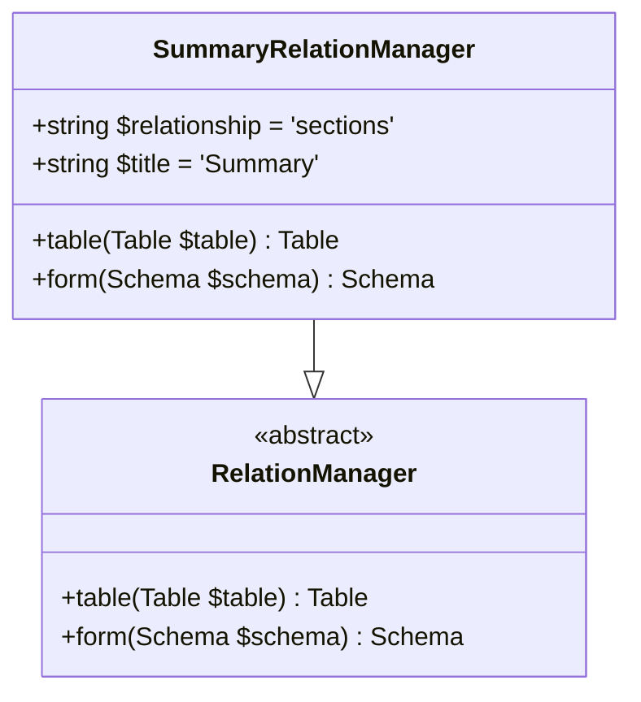
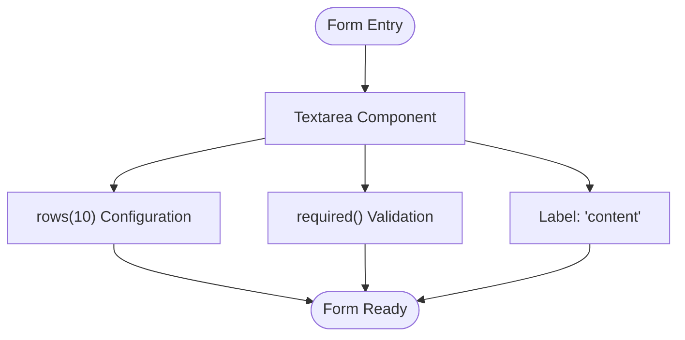
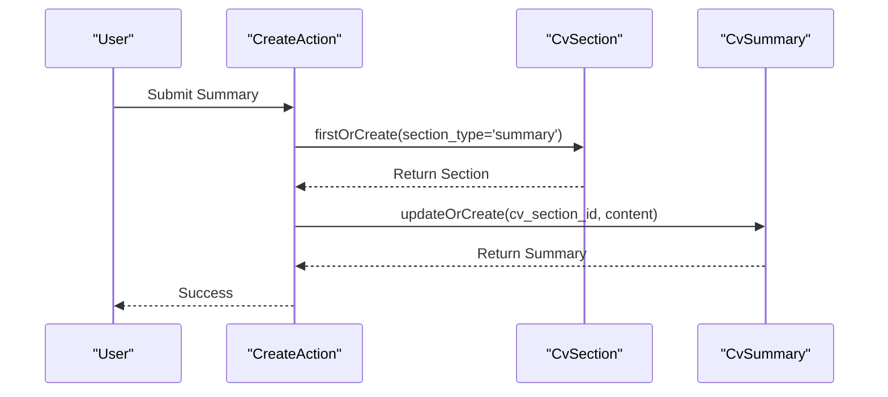

# Professional Summary

<cite>
**Referenced Files in This Document**   
- [SummaryRelationManager.php](file://app/Filament/Resources/Cvs/RelationManagers/SummaryRelationManager.php)
- [CvSummary.php](file://app/Models/CvSummary.php)
- [CvSection.php](file://app/Models/CvSection.php)
- [data-model.md](file://specs/001-cv-builder-application/data-model.md)
- [filament-actions.md](file://specs/001-cv-builder-application/contracts/filament-actions.md)
- [cv_builder_spec.md](file://cv_builder_spec.md)
</cite>

## Table of Contents
1. [Introduction](#introduction)
2. [Data Model and Relationships](#data-model-and-relationships)
3. [SummaryRelationManager Implementation](#summaryrelationmanager-implementation)
4. [Form Configuration and Validation](#form-configuration-and-validation)
5. [Custom Create and Edit Actions](#custom-create-and-edit-actions)
6. [Table Display and Content Truncation](#table-display-and-content-truncation)
7. [Single Summary Constraint](#single-summary-constraint)
8. [Common Issues and Error Handling](#common-issues-and-error-handling)
9. [Best Practices for Professional Summaries](#best-practices-for-professional-summaries)
10. [Conclusion](#conclusion)

## Introduction

The Professional Summary section in the CV Builder application provides a dedicated space for users to craft a concise overview of their professional background, skills, and career objectives. This section is managed through the Filament admin interface using the `SummaryRelationManager`, which handles a hasOne relationship via the `cv_sections` table. The implementation ensures that only one summary entry exists per CV, with specialized form and table configurations to support content creation and display. This document details the technical implementation, user interface components, and best practices for managing professional summaries within the application.

**Section sources**
- [cv_builder_spec.md](file://cv_builder_spec.md#L0-L192)
- [data-model.md](file://specs/001-cv-builder-application/data-model.md#L0-L385)

## Data Model and Relationships

The Professional Summary functionality is built on a polymorphic data model where the `cv_sections` table acts as a typed pivot between CVs and their various section types. The `CvSection` model establishes the relationship with `CvSummary` through a hasOne association, with the `section_type` field constrained to 'summary'. This design allows for flexible section ordering while maintaining strong typing for section content.

The `CvSummary` model contains the actual summary content in a text field, linked to its parent `CvSection` via the `cv_section_id` foreign key. The database schema enforces a unique constraint on `cv_section_id`, ensuring that only one summary record can exist per section. This relationship structure enables efficient querying and data integrity, with the `cv_sections` table serving as the single source of truth for section ordering and type management.

```mermaid
erDiagram
CV {
bigint id PK
string title
timestamp created_at
timestamp updated_at
}
CV_SECTION {
bigint id PK
bigint cv_id FK
enum section_type
integer display_order
timestamp created_at
timestamp updated_at
}
CV_SUMMARY {
bigint id PK
bigint cv_section_id FK UK
text content
timestamp created_at
timestamp updated_at
}
CV ||--o{ CV_SECTION : "has many"
CV_SECTION ||--o| CV_SUMMARY : "has one"
```

**Diagram sources**
- [cv_builder_spec.md](file://cv_builder_spec.md#L27-L33)
- [data-model.md](file://specs/001-cv-builder-application/data-model.md#L76-L109)
- [data-model.md](file://specs/001-cv-builder-application/data-model.md#L145-L167)

**Section sources**
- [CvSection.php](file://app/Models/CvSection.php#L10-L60)
- [CvSummary.php](file://app/Models/CvSummary.php#L7-L18)

## SummaryRelationManager Implementation

The `SummaryRelationManager` class extends Filament's `RelationManager` to provide a specialized interface for managing professional summaries. It establishes the relationship with the `sections` property on the CV model, filtering queries to only include records where `section_type` is 'summary'. The manager uses a closure-based query modification to apply this filter and eager load the associated `summary` relationship, optimizing performance by reducing database queries.

The table configuration in `SummaryRelationManager` is specifically tailored for summary content, with a single column displaying the summary text. The manager's title is set to 'Summary', providing clear labeling in the admin interface. This implementation follows the polymorphic pattern established in the data model, using the `cv_sections` table as an intermediary between the CV and its summary content.



**Diagram sources**
- [SummaryRelationManager.php](file://app/Filament/Resources/Cvs/RelationManagers/SummaryRelationManager.php#L16-L74)

**Section sources**
- [SummaryRelationManager.php](file://app/Filament/Resources/Cvs/RelationManagers/SummaryRelationManager.php#L16-L74)

## Form Configuration and Validation

The form configuration for the Professional Summary section uses a textarea component with specific attributes to support content creation. The textarea is configured with 10 rows of height, providing ample space for users to craft their summary while maintaining a clean interface. The field is marked as required, enforcing data integrity and ensuring that every summary contains content.

The form implementation uses Filament's component system to define the textarea with the following configuration:
- `Textarea::make('content')` - Creates a textarea field for the summary content
- `->required()` - Enforces that the field must contain content
- `->rows(10)` - Sets the visible height of the textarea to 10 rows

This configuration is used in both the create and edit actions, ensuring consistency across the user experience. The helper text suggests using the field for a "Professional summary or career objective", guiding users on appropriate content.



**Diagram sources**
- [filament-actions.md](file://specs/001-cv-builder-application/contracts/filament-actions.md#L105-L123)

**Section sources**
- [SummaryRelationManager.php](file://app/Filament/Resources/Cvs/RelationManagers/SummaryRelationManager.php#L50-L53)
- [SummaryRelationManager.php](file://app/Filament/Resources/Cvs/RelationManagers/SummaryRelationManager.php#L63-L65)

## Custom Create and Edit Actions

The `SummaryRelationManager` implements custom create and edit actions to manage both `CvSection` and `CvSummary` records through closure-based logic. The create action uses a `firstOrCreate` operation on the `CvSection` model to ensure that a section of type 'summary' exists for the current CV, with a display order of 1. If the section already exists, it is returned; otherwise, a new section is created.

Once the section is ensured, the action uses `updateOrCreate` on the `CvSummary` model to persist the summary content. This approach handles both creation and updating in a single operation, simplifying the data persistence logic. The edit action follows a similar pattern but operates on an existing record, updating the summary content through the relationship.

The closure-based implementation provides fine-grained control over the data persistence process, allowing for complex logic that spans multiple models. The `fillForm` closure in the edit action pre-populates the form with existing content by accessing `$record->summary->content`, ensuring that users can see and modify their current summary.



**Diagram sources**
- [SummaryRelationManager.php](file://app/Filament/Resources/Cvs/RelationManagers/SummaryRelationManager.php#L54-L61)
- [SummaryRelationManager.php](file://app/Filament/Resources/Cvs/RelationManagers/SummaryRelationManager.php#L66-L73)

**Section sources**
- [SummaryRelationManager.php](file://app/Filament/Resources/Cvs/RelationManagers/SummaryRelationManager.php#L54-L73)

## Table Display and Content Truncation

The table display for the Professional Summary section implements content truncation to maintain a clean and readable interface. The summary content is displayed in a single column with a 100-character limit, preventing excessively long text from disrupting the table layout. This truncation is implemented using Filament's `limit(100)` method on the `TextColumn` component.

The table configuration also includes proper labeling with the column header set to 'Summary', providing clear context for the displayed content. The truncation feature ensures that even lengthy summaries are presented in a consistent format, with the full content available when viewing or editing the record. This approach balances the need for content preview with interface usability.

The same truncation pattern is used across other text-based relation managers in the application, such as `CustomSectionsRelationManager` and `ReferencesRelationManager`, ensuring a consistent user experience throughout the admin interface.

**Section sources**
- [SummaryRelationManager.php](file://app/Filament/Resources/Cvs/RelationManagers/SummaryRelationManager.php#L28-L30)
- [data-model.md](file://specs/001-cv-builder-application/data-model.md#L145-L167)

## Single Summary Constraint

The application enforces a strict constraint that only one summary entry is allowed per CV through multiple mechanisms at both the database and application levels. At the database level, the `cv_summaries` table has a unique constraint on the `cv_section_id` field, preventing multiple summary records from being associated with the same section.

At the application level, the `CvSection` model's relationship configuration ensures that only one 'summary' type section can exist per CV through the unique constraint on the combination of `cv_id` and `section_type`. This dual-layer enforcement guarantees data integrity and prevents accidental duplication of summary content.

The `SummaryRelationManager` further reinforces this constraint by always working with the single 'summary' section for a CV, eliminating the possibility of creating multiple summary sections. This design aligns with the business requirement that each CV should have exactly one professional summary, providing a clear and focused overview of the candidate's qualifications.

**Section sources**
- [data-model.md](file://specs/001-cv-builder-application/data-model.md#L76-L109)
- [data-model.md](file://specs/001-cv-builder-application/data-model.md#L145-L167)

## Common Issues and Error Handling

Several common issues may arise when managing professional summaries in the CV Builder application, with corresponding error handling mechanisms in place. Content truncation in the table view is expected behavior due to the 100-character limit, but users may need guidance on accessing the full content through the edit interface.

During summary updates, validation errors are handled through Filament's built-in validation system, with the required rule ensuring that empty summaries cannot be saved. If a user attempts to submit an empty summary, they will receive a clear error message prompting them to provide content.

The closure-based data persistence logic includes implicit error handling through Eloquent's exception system. Database-level constraints will prevent invalid data from being saved, with appropriate error messages returned to the user interface. The use of `firstOrCreate` and `updateOrCreate` methods provides atomic operations that minimize the risk of data inconsistency.

Potential issues with relationship loading are mitigated by the `with('summary')` eager loading in the table query, preventing N+1 query problems and ensuring consistent performance even with multiple CVs.

**Section sources**
- [SummaryRelationManager.php](file://app/Filament/Resources/Cvs/RelationManagers/SummaryRelationManager.php#L25-L30)
- [SummaryRelationManager.php](file://app/Filament/Resources/Cvs/RelationManagers/SummaryRelationManager.php#L50-L53)

## Best Practices for Professional Summaries

When writing professional summaries for job applications, several best practices should be followed to maximize impact and effectiveness. The summary should be concise yet comprehensive, highlighting key qualifications, experience, and career goals in a brief paragraph. It should be tailored to the specific job application, incorporating relevant keywords and skills mentioned in the job description.

Effective summaries focus on achievements and value proposition rather than simply listing job responsibilities. They should demonstrate how the candidate's background aligns with the requirements of the position, using strong action verbs and quantifiable results when possible. The content should be written in the first person without using pronouns, creating a professional and confident tone.

Given the 10-row height of the textarea, users should aim for approximately 5-8 sentences that capture their professional essence. The summary should serve as a compelling introduction that encourages the reader to explore the rest of the CV in detail. Regular updates to the summary for different job applications can significantly improve the relevance and effectiveness of each submission.

## Conclusion

The Professional Summary section in the CV Builder application provides a robust and user-friendly interface for creating and managing career overviews. Through the `SummaryRelationManager`, the application implements a hasOne relationship via the `cv_sections` table, ensuring data integrity and proper organization. The specialized table configuration with 100-character truncation maintains a clean interface, while the textarea form component with 10-row height and required validation supports effective content creation.

The custom create and edit actions demonstrate sophisticated data persistence logic, managing both `CvSection` and `CvSummary` records through closure-based operations. This implementation, combined with the single summary constraint enforced at both database and application levels, creates a reliable system for professional summary management. By following best practices for summary writing and understanding the system's behavior, users can create compelling career overviews that enhance their job applications.