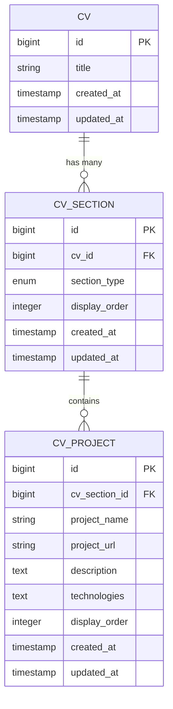
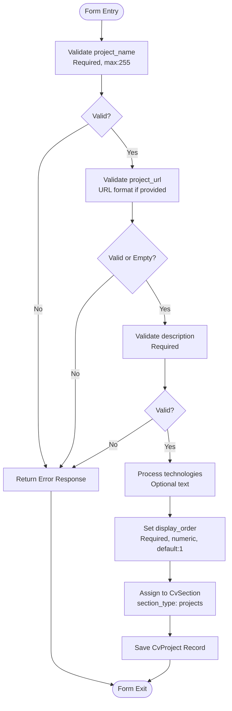
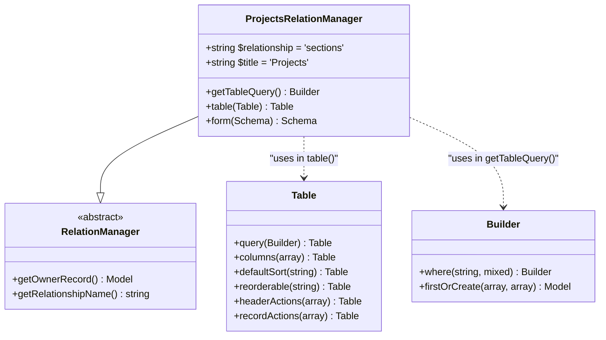
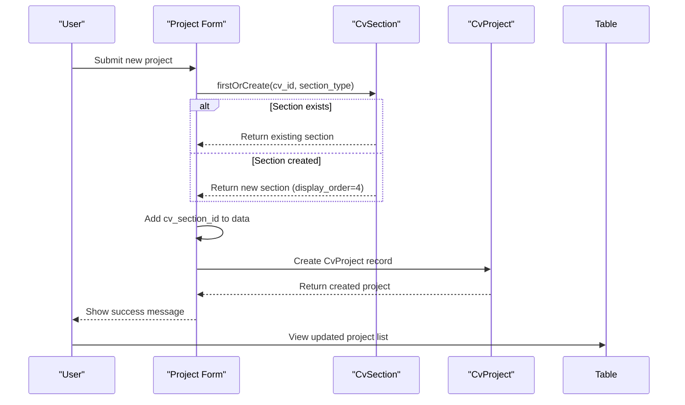

<cite>
**Referenced Files in This Document**   
- [ProjectsRelationManager.php](file://app/Filament/Resources/Cvs/RelationManagers/ProjectsRelationManager.php)
- [CvProject.php](file://app/Models/CvProject.php)
- [CvSection.php](file://app/Models/CvSection.php)
- [cv_builder_spec.md](file://cv_builder_spec.md)
- [data-model.md](file://specs/001-cv-builder-application/data-model.md)
- [filament-actions.md](file://specs/001-cv-builder-application/contracts/filament-actions.md)
</cite>

# Projects

## Table of Contents
1. [Introduction](#introduction)
2. [Core Components](#core-components)
3. [Form Schema and Validation](#form-schema-and-validation)
4. [Table Display and Reordering](#table-display-and-reordering)
5. [Data Creation Process](#data-creation-process)
6. [Best Practices for Project Entries](#best-practices-for-project-entries)
7. [Common Issues and Troubleshooting](#common-issues-and-troubleshooting)

## Introduction

The Projects section in the CV Builder application allows users to manage portfolio items or side projects through the Filament admin interface. This section is implemented using the `ProjectsRelationManager` class, which handles multiple projects through a `hasMany` relationship via the `cv_sections` table using the `CvProject` model. The system uses a polymorphic pattern where `cv_sections` acts as a typed pivot, enabling flexible section ordering while maintaining strong typing for section content.

This documentation provides comprehensive guidance on managing the Projects section, including form schema, table display, data creation process, and best practices for creating effective project entries that support job applications.

**Section sources**
- [ProjectsRelationManager.php](file://app/Filament/Resources/Cvs/RelationManagers/ProjectsRelationManager.php#L18-L110)
- [cv_builder_spec.md](file://cv_builder_spec.md#L0-L192)
- [data-model.md](file://specs/001-cv-builder-application/data-model.md#L246-L275)

## Core Components

The Projects functionality is built around three core components: the `ProjectsRelationManager`, the `CvProject` model, and the `CvSection` model. These components work together to manage project data within the CV structure.

The `ProjectsRelationManager` extends Filament's `RelationManager` class and is responsible for the UI and business logic of managing projects. It establishes a relationship with the `sections` property of the CV model, allowing it to manage projects as part of the CV's section collection.

The `CvProject` model represents individual projects and contains fields for project name, URL, description, technologies used, and display order. It belongs to a `CvSection` through the `cvSection()` relationship method.

The `CvSection` model acts as a polymorphic pivot between the CV and its various section types, including projects. It contains a `section_type` field that can be set to 'projects' and maintains a `display_order` for sorting.

**Diagram sources**
- [ProjectsRelationManager.php](file://app/Filament/Resources/Cvs/RelationManagers/ProjectsRelationManager.php#L18-L110)
- [CvProject.php](file://app/Models/CvProject.php#L7-L22)
- [CvSection.php](file://app/Models/CvSection.php#L10-L60)

**Section sources**
- [ProjectsRelationManager.php](file://app/Filament/Resources/Cvs/RelationManagers/ProjectsRelationManager.php#L18-L110)
- [CvProject.php](file://app/Models/CvProject.php#L7-L22)
- [CvSection.php](file://app/Models/CvSection.php#L10-L60)

## Form Schema and Validation

The form schema for creating and editing projects includes several fields with specific validation rules to ensure data quality and consistency.

The `project_name` field is required and has a maximum length of 255 characters. This field serves as the primary identifier for the project and should be descriptive and meaningful.

The optional `project_url` field includes URL validation to ensure that only properly formatted URLs are accepted. This field allows users to provide a link to the live project, repository, or additional information.

The `description` field is required and supports multi-line text input with three rows. This field should contain a brief but comprehensive description of the project, highlighting its purpose, functionality, and significance.

The `technologies` field is a multi-line text area with two rows that allows users to list the technologies used in the project. This field is optional but highly recommended as it helps demonstrate technical skills and expertise.

The `display_order` field is a numeric input that determines the position of the project in the list. It is required and defaults to 1 when creating new projects.

All form fields are implemented using Filament's form components, providing a consistent and user-friendly interface for data entry.

**Diagram sources**
- [ProjectsRelationManager.php](file://app/Filament/Resources/Cvs/RelationManagers/ProjectsRelationManager.php#L60-L105)
- [filament-actions.md](file://specs/001-cv-builder-application/contracts/filament-actions.md#L225-L262)

**Section sources**
- [ProjectsRelationManager.php](file://app/Filament/Resources/Cvs/RelationManagers/ProjectsRelationManager.php#L60-L105)
- [filament-actions.md](file://specs/001-cv-builder-application/contracts/filament-actions.md#L225-L262)

## Table Display and Reordering

The table display for projects includes three main columns: project name, description, and order. The description column is truncated to 50 characters to maintain a clean and readable table layout.

The table is configured to sort by `display_order` by default, ensuring that projects are displayed in the intended sequence. Drag-and-drop reordering is enabled through the `reorderable('display_order')` method, allowing users to easily rearrange projects by dragging and dropping rows in the table.

The `getTableQuery()` method in the `ProjectsRelationManager` ensures that the appropriate section exists by using `firstOrCreate()` to find or create a section with `section_type` set to 'projects'. If the section is created, it is assigned a default `display_order` of 4, which positions it appropriately within the overall CV structure.

The table includes header actions for creating new projects and record actions for editing and deleting existing projects. These actions provide a complete CRUD interface for managing project entries.

**Diagram sources**
- [ProjectsRelationManager.php](file://app/Filament/Resources/Cvs/RelationManagers/ProjectsRelationManager.php#L20-L55)
- [data-model.md](file://specs/001-cv-builder-application/data-model.md#L246-L275)

**Section sources**
- [ProjectsRelationManager.php](file://app/Filament/Resources/Cvs/RelationManagers/ProjectsRelationManager.php#L20-L55)
- [data-model.md](file://specs/001-cv-builder-application/data-model.md#L246-L275)

## Data Creation Process

The data creation process for projects involves several steps that ensure proper linking between the `CvProject` and `CvSection` models. When a new project is created, the system first ensures that a section of type 'projects' exists for the CV.

The `using()` callback in the `CreateAction` handles the custom creation logic. It calls `firstOrCreate()` on the `CvSection` model to find or create a section with `cv_id` matching the current CV and `section_type` set to 'projects'. If a new section is created, it is assigned a default `display_order` of 4.

Once the section is ensured to exist, the `cv_section_id` is added to the data array before creating the `CvProject` record. This establishes the proper relationship between the project and its containing section.

The same process is followed when editing existing projects, ensuring consistency in how projects are linked to their sections.

This approach ensures data integrity by guaranteeing that every project is properly associated with a section, and that the section structure is maintained even if it didn't previously exist.

**Diagram sources**
- [ProjectsRelationManager.php](file://app/Filament/Resources/Cvs/RelationManagers/ProjectsRelationManager.php#L70-L105)
- [cv_builder_spec.md](file://cv_builder_spec.md#L67-L75)

**Section sources**
- [ProjectsRelationManager.php](file://app/Filament/Resources/Cvs/RelationManagers/ProjectsRelationManager.php#L70-L105)
- [cv_builder_spec.md](file://cv_builder_spec.md#L67-L75)

## Best Practices for Project Entries

When creating project entries, it's important to follow best practices that highlight relevant skills and experiences that support job applications. Projects should be selected and described in a way that demonstrates technical expertise and accomplishments.

Each project should have a descriptive title that clearly identifies the project. The description should focus on the problem solved, the approach taken, and the results achieved, using action-oriented language and measurable outcomes when possible.

The technologies field should be used to highlight specific technical skills that are relevant to the target job. This provides concrete evidence of proficiency with particular tools, frameworks, or languages.

Projects should be ordered strategically, with the most relevant or impressive projects appearing first. The drag-and-drop reordering functionality makes it easy to adjust the sequence based on the specific job application.

For job-specific CVs, include projects that directly relate to the position requirements. If applying for a Laravel developer role, emphasize projects that showcase Laravel expertise. If the job emphasizes frontend skills, highlight projects with significant frontend components.

Use the project URL field to provide links to live demos, GitHub repositories, or case studies that allow employers to explore the work in more detail.

Remember that projects are an opportunity to demonstrate practical application of skills beyond work experience. Include personal projects, open source contributions, or academic projects that showcase initiative and passion for development.

**Section sources**
- [filament-actions.md](file://specs/001-cv-builder-application/contracts/filament-actions.md#L225-L262)
- [cv_builder_spec.md](file://cv_builder_spec.md#L0-L192)

## Common Issues and Troubleshooting

Several common issues may arise when managing projects in the CV Builder application. Understanding these issues and their solutions can help ensure smooth operation.

One common issue is invalid URL format in the project_url field. The system validates URLs, so entries must include the proper protocol (http:// or https://) and be properly formatted. If a URL is not validating, check for missing protocols, special characters, or typos.

Another issue is creating projects without a proper section. The system automatically handles this by creating a section if one doesn't exist, but if projects are not appearing, verify that the section was created successfully by checking the cv_sections table.

Description truncation in the table view may make it difficult to distinguish between projects with similar initial text. To address this, ensure that project descriptions start with distinctive content that clearly differentiates each project.

When drag-and-drop reordering doesn't seem to work, check that JavaScript is enabled in the browser and that there are no console errors. The reordering functionality relies on Livewire and JavaScript, so any issues with these technologies can affect the feature.

If projects are not appearing in the expected order, verify that the display_order values are set correctly and that there are no gaps or duplicates in the sequence.

For performance issues with large numbers of projects, the system is designed to handle typical CV sizes efficiently. However, if experiencing slow loading, consider whether all projects are necessary for the specific job application and remove less relevant entries.

**Section sources**
- [ProjectsRelationManager.php](file://app/Filament/Resources/Cvs/RelationManagers/ProjectsRelationManager.php#L60-L105)
- [filament-actions.md](file://specs/001-cv-builder-application/contracts/filament-actions.md#L225-L262)