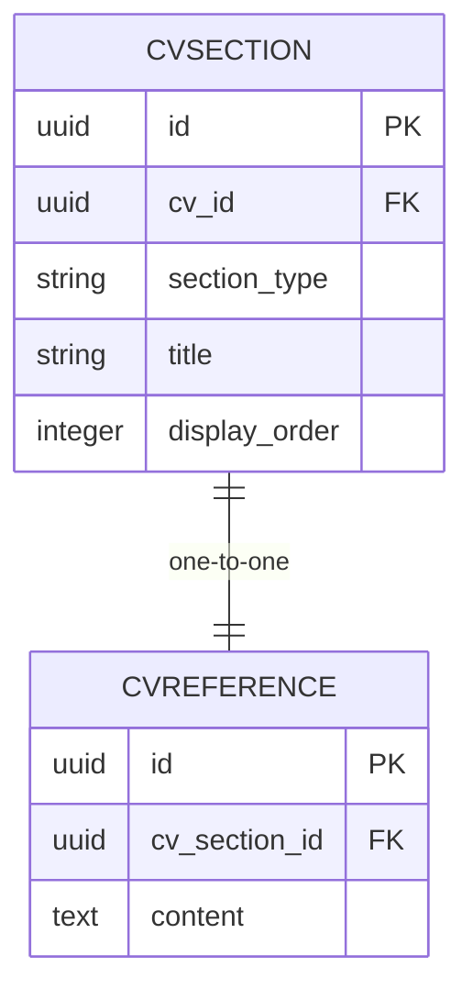

# References

<cite>
**Referenced Files in This Document**  
- [ReferencesRelationManager.php](file://app/Filament/Resources/Cvs/RelationManagers/ReferencesRelationManager.php)
- [CvReference.php](file://app/Models/CvReference.php)
- [CvSection.php](file://app/Models/CvSection.php)
</cite>

## Table of Contents
1. [Introduction](#introduction)
2. [Core Components](#core-components)
3. [Form Schema and Validation](#form-schema-and-validation)
4. [Data Query and Filtering](#data-query-and-filtering)
5. [Table Display Configuration](#table-display-configuration)
6. [Create and Edit Actions](#create-and-edit-actions)
7. [Relationship Management](#relationship-management)
8. [Best Practices for References in CVs](#best-practices-for-references-in-cvs)
9. [Troubleshooting Common Issues](#troubleshooting-common-issues)

## Introduction

The References section in the CV Builder application is managed through the Filament admin interface using the `ReferencesRelationManager` class. This component provides a structured way to handle references within a CV, leveraging a unified section management system. The implementation uses a two-layer model where `CvSection` acts as a container with type 'references', and `CvReference` holds the actual content. This design allows for consistent section management across different CV components while maintaining specialized content handling for references.

**Section sources**
- [ReferencesRelationManager.php](file://app/Filament/Resources/Cvs/RelationManagers/ReferencesRelationManager.php#L1-L77)

## Core Components

The references management system consists of three primary components working in concert: the `ReferencesRelationManager`, the `CvSection` model, and the `CvReference` model. The `ReferencesRelationManager` serves as the Filament interface layer, defining how references are displayed, created, and edited within the admin panel. It establishes a relationship with the `sections` relationship on the CV model, filtering for entries where `section_type` is 'references'. The `CvSection` model acts as a polymorphic container that can hold different types of CV content, including references, while the `CvReference` model specifically stores the reference content in a dedicated table.

This architecture enables a consistent approach to section management across the application while allowing specialized handling for different content types. The separation of concerns between the container (`CvSection`) and content (`CvReference`) models provides flexibility for future enhancements and maintains data integrity through proper relational modeling.

**Section sources**
- [ReferencesRelationManager.php](file://app/Filament/Resources/Cvs/RelationManagers/ReferencesRelationManager.php#L1-L77)
- [CvSection.php](file://app/Models/CvSection.php#L1-L62)
- [CvReference.php](file://app/Models/CvReference.php#L1-L20)

## Form Schema and Validation

The form schema for managing references is intentionally simple, consisting of a single textarea field for the content. This field is configured with required validation to ensure that references content is always provided. When creating a new references entry, the textarea is pre-filled with the default text 'Available upon request', which aligns with modern CV best practices. The textarea is configured with five rows to provide adequate space for content entry while maintaining a clean interface.

The form configuration is implemented within the closure-based create and edit actions in the `ReferencesRelationManager`. The simplicity of the form reflects the straightforward nature of references content, which typically consists of either the standard placeholder text or a list of reference names and contact information. Required validation prevents the creation of empty references sections, ensuring data completeness within the CV.

**Section sources**
- [ReferencesRelationManager.php](file://app/Filament/Resources/Cvs/RelationManagers/ReferencesRelationManager.php#L40-L45)
- [ReferencesRelationManager.php](file://app/Filament/Resources/Cvs/RelationManagers/ReferencesRelationManager.php#L60-L65)

## Data Query and Filtering

The `modifyQueryUsing` method in the `ReferencesRelationManager` implements critical filtering logic to ensure that only references sections are displayed. This method modifies the base query to include a where clause that filters for `section_type` equal to 'references'. Additionally, the query includes the related `reference` model through the `with('reference')` eager loading directive, which optimizes database performance by preventing N+1 query issues when displaying reference content.

This filtering mechanism leverages the polymorphic nature of the `CvSection` model, allowing the same underlying table to serve multiple section types while ensuring that the references manager only interacts with relevant records. The implementation uses a closure to define the query modification, providing a clean and readable way to express the filtering logic within the Filament table configuration.

**Section sources**
- [ReferencesRelationManager.php](file://app/Filament/Resources/Cvs/RelationManagers/ReferencesRelationManager.php#L25-L27)

## Table Display Configuration

The table display for references is configured to show only the essential information in a concise format. A single `TextColumn` is defined to display the reference content, with the column labeled simply as 'References'. To maintain readability in the table view, the content is limited to 100 characters using the `limit(100)` method. This truncation prevents excessively long reference lists from disrupting the table layout while still providing a preview of the content.

The table configuration also includes appropriate header and record actions, allowing users to create new references entries or edit existing ones directly from the table interface. The display order of the references section is fixed at position 6 through the `display_order` attribute set during creation, ensuring consistent placement within the CV structure.

**Section sources**
- [ReferencesRelationManager.php](file://app/Filament/Resources/Cvs/RelationManagers/ReferencesRelationManager.php#L28-L32)

## Create and Edit Actions

The create and edit actions for references are implemented using closure-based callbacks that manage both the `CvSection` and `CvReference` records. The create action uses `firstOrCreate` to ensure that only one references section exists per CV, preventing duplicate entries. If a section with type 'references' already exists, it will be used; otherwise, a new one is created with a predefined display order of 6.

The `using` callback in the create action then ensures that a corresponding `CvReference` record is created or updated with the provided content. Similarly, the edit action retrieves the existing reference content to pre-fill the form and updates the `CvReference` record upon submission. This two-step process maintains referential integrity between the section container and its content while providing a seamless user experience in the admin interface.

**Section sources**
- [ReferencesRelationManager.php](file://app/Filament/Resources/Cvs/RelationManagers/ReferencesRelationManager.php#L46-L58)
- [ReferencesRelationManager.php](file://app/Filament/Resources/Cvs/RelationManagers/ReferencesRelationManager.php#L66-L75)

## Relationship Management

The relationship between CV sections and references is established through a one-to-one (hasOne) relationship defined in the `CvSection` model. This relationship allows each `CvSection` with type 'references' to have exactly one associated `CvReference` record containing the actual content. The inverse relationship is defined in the `CvReference` model through a belongsTo relationship with `CvSection`.

This design enforces the constraint that only one references entry is allowed per CV, as multiple references sections would require multiple `CvSection` records of type 'references', but the create logic uses `firstOrCreate` to prevent duplicates. The relationship is properly typed and documented in the models, ensuring type safety and IDE support throughout the application.

**Diagram sources**
- [CvSection.php](file://app/Models/CvSection.php#L45-L48)
- [CvReference.php](file://app/Models/CvReference.php#L14-L17)

**Section sources**
- [CvSection.php](file://app/Models/CvSection.php#L45-L48)
- [CvReference.php](file://app/Models/CvReference.php#L14-L17)

## Best Practices for References in CVs

Modern CV best practices generally recommend using the "Available upon request" statement rather than listing specific references. This approach protects the privacy of references and acknowledges that most employers will request references only during the final stages of the hiring process. The default value in the references form aligns with this practice, providing a professional and appropriate starting point.

When customization is needed, users can replace the default text with specific reference information, though this should be done judiciously. If specific references are included, they should be limited to two or three professional contacts who are aware they may be contacted. Each reference should include the person's full name, job title, company, and contact information. It's also advisable to obtain permission from individuals before listing them as references.

The system's design supports both approaches: the default placeholder for general use and the ability to customize content when specific references are appropriate for a particular application.

## Troubleshooting Common Issues

Common issues with the references management system typically involve content length and data integrity. Since the table display limits content to 100 characters, users may need to click into the edit form to view complete reference information. This limitation is intentional to maintain table readability but should be communicated to users.

Data integrity issues may arise if the relationship between `CvSection` and `CvReference` becomes inconsistent, such as when a section exists without a corresponding reference record. The `using` callbacks in the create and edit actions are designed to prevent this by ensuring both records are properly synchronized. If issues occur, checking that both models have been properly saved and that foreign key constraints are maintained is essential.

Validation errors may occur if users attempt to save empty references content, as the required validation rule will prevent submission. Ensuring that the form always provides either the default text or user-entered content resolves this issue. Performance considerations are minimal due to the small amount of data typically stored in references sections and the efficient query optimization through eager loading.

**Section sources**
- [ReferencesRelationManager.php](file://app/Filament/Resources/Cvs/RelationManagers/ReferencesRelationManager.php#L40-L45)
- [ReferencesRelationManager.php](file://app/Filament/Resources/Cvs/RelationManagers/ReferencesRelationManager.php#L60-L65)