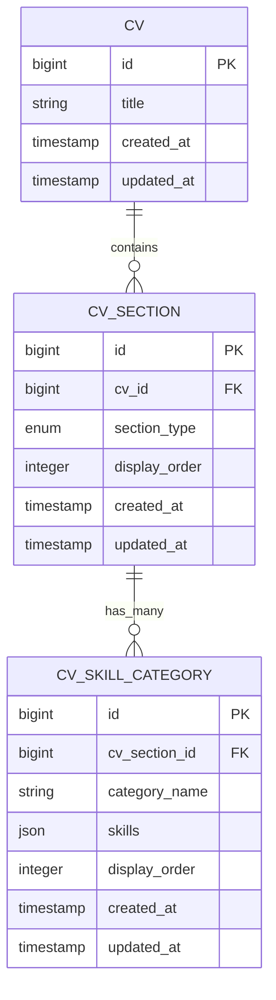
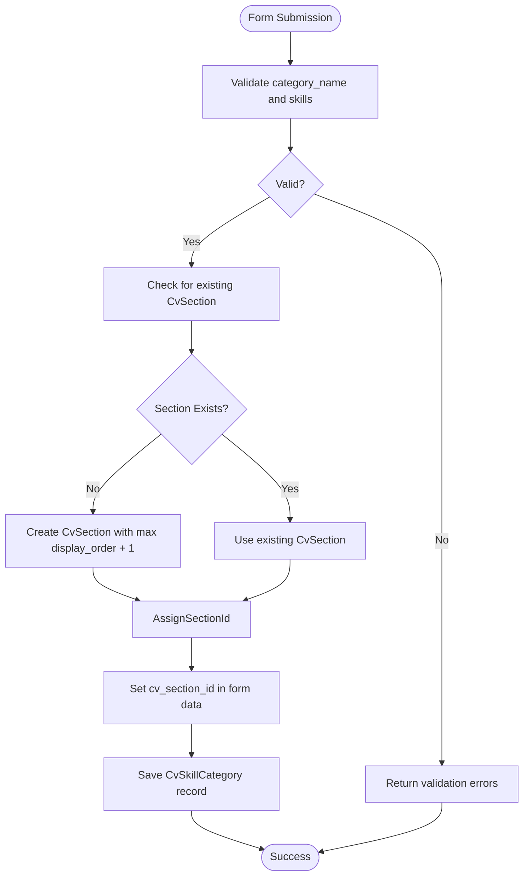

# Skills Section

<cite>
**Referenced Files in This Document**   
- [SkillCategoriesRelationManager.php](file://app/Filament/Resources/Cvs/RelationManagers/SkillCategoriesRelationManager.php)
- [CvSkillCategory.php](file://app/Models/CvSkillCategory.php)
- [CvSection.php](file://app/Models/CvSection.php)
- [cv_builder_spec.md](file://cv_builder_spec.md)
- [data-model.md](file://specs/001-cv-builder-application/data-model.md)
- [filament-actions.md](file://specs/001-cv-builder-application/contracts/filament-actions.md)
</cite>

## Table of Contents
1. [Introduction](#introduction)
2. [Core Architecture](#core-architecture)
3. [Form Schema and Data Management](#form-schema-and-data-management)
4. [Table Display and Reordering](#table-display-and-reordering)
5. [Relationship Management](#relationship-management)
6. [Best Practices for Skill Organization](#best-practices-for-skill-organization)
7. [Common Issues and Solutions](#common-issues-and-solutions)

## Introduction

The Skills section in the CV Builder application enables users to organize technical and professional competencies into categorized groups through the Filament admin interface. This section leverages a polymorphic data model where skills are managed via the `SkillCategoriesRelationManager`, which handles multiple skill categories through a hasMany relationship using the `CvSection` and `CvSkillCategory` models. The design supports structured categorization, drag-and-drop reordering, and robust validation to ensure data integrity. This documentation provides a comprehensive guide to managing the Skills section, including form configuration, relationship handling, display formatting, and best practices for maximizing keyword coverage in job applications.

**Section sources**
- [cv_builder_spec.md](file://cv_builder_spec.md#L120-L135)
- [data-model.md](file://specs/001-cv-builder-application/data-model.md#L240-L265)

## Core Architecture

The Skills section is built on a polymorphic pivot pattern using the `cv_sections` table as a central ordering and typing mechanism. This table links a CV to its various sections, with the `section_type` field set to 'skills' for skill-related content. The actual skill data is stored in the `cv_skill_categories` table, which contains fields for `category_name`, `skills` (as a JSON array), and `display_order`. This architecture allows for flexible organization of skills into meaningful categories while maintaining a consistent structure across all CVs.

The `CvSection` model serves as the parent entity, establishing a one-to-many relationship with `CvSkillCategory` through the `skillCategories()` method, which automatically orders results by `display_order`. This ensures that skill categories are consistently presented in the intended sequence across all views and exports. The polymorphic design enables easy extension to new section types without altering the core CV structure, promoting maintainability and scalability.

**Diagram sources**
- [cv_builder_spec.md](file://cv_builder_spec.md#L27-L33)
- [data-model.md](file://specs/001-cv-builder-application/data-model.md#L76-L109)
- [data-model.md](file://specs/001-cv-builder-application/data-model.md#L168-L199)

**Section sources**
- [cv_builder_spec.md](file://cv_builder_spec.md#L120-L135)
- [data-model.md](file://specs/001-cv-builder-application/data-model.md#L240-L265)

## Form Schema and Data Management

The form schema for the Skills section is defined within the `SkillCategoriesRelationManager` class and consists of three primary components: a `category_name` input field, a `Repeater` component for managing individual skills, and a `display_order` field for reordering. The `category_name` field is a required text input with a maximum length of 255 characters, allowing users to define meaningful skill groupings such as "Frameworks / Back End" or "Front End Technologies".

The `Repeater` component enables the management of multiple skills within each category, using a simple text input for each skill entry. This component enforces a minimum of one skill per category through the `minItems(1)` validation rule, preventing empty skill sets. Each skill is stored as a string in a JSON array, leveraging Laravel's array casting functionality in the `CvSkillCategory` model to seamlessly convert between PHP arrays and JSON storage.

The `display_order` field is a numeric input that determines the visual sequence of skill categories. It is required and defaults to 1, ensuring that newly created categories are properly ordered. This field is critical for the drag-and-drop reordering functionality in the table view.

A key aspect of data management is the initialization of the skills section through the `firstOrCreate` pattern in the `mutateFormDataUsing` callback. When creating a new skill category, the system first ensures that a corresponding `CvSection` record exists for the 'skills' type. If no such section exists, it creates one with an appropriate `display_order` value, calculated as the maximum existing order plus one. This guarantees that the skills section is properly initialized and maintains consistent ordering across the CV.

**Diagram sources**
- [SkillCategoriesRelationManager.php](file://app/Filament/Resources/Cvs/RelationManagers/SkillCategoriesRelationManager.php#L30-L50)
- [CvSkillCategory.php](file://app/Models/CvSkillCategory.php#L10-L15)
- [CvSection.php](file://app/Models/CvSection.php#L25-L30)

**Section sources**
- [SkillCategoriesRelationManager.php](file://app/Filament/Resources/Cvs/RelationManagers/SkillCategoriesRelationManager.php#L17-L86)
- [CvSkillCategory.php](file://app/Models/CvSkillCategory.php#L7-L24)
- [filament-actions.md](file://specs/001-cv-builder-application/contracts/filament-actions.md#L124-L164)

## Table Display and Reordering

The table display for the Skills section presents skill categories in a structured format with three main columns: Category, Skills, and Order. The Category column displays the `category_name` field, while the Skills column shows the individual skills as a comma-separated string. This formatting is achieved through the `formatStateUsing` callback, which checks if the state is an array and uses `implode(', ', $state)` to join the skill strings. This ensures consistent presentation regardless of the underlying JSON storage.

The Order column displays the `display_order` value and is sortable, allowing users to reorder categories numerically. The table is configured to default-sort by `display_order`, ensuring that categories appear in the intended sequence when first loaded. The header actions include a Create action that incorporates the `mutateFormDataUsing` and `using` callbacks to manage the relationship between `CvSection` and `CvSkillCategory` during creation.

Drag-and-drop reordering is supported through the `display_order` field, which serves as the basis for visual sequencing. When users reorder categories in the interface, the system updates the `display_order` values accordingly, maintaining the hierarchical structure defined by the `cv_sections` table. This reordering capability extends to individual skills within categories through the Repeater component, providing granular control over the presentation of technical competencies.

**Section sources**
- [SkillCategoriesRelationManager.php](file://app/Filament/Resources/Cvs/RelationManagers/SkillCategoriesRelationManager.php#L52-L86)
- [filament-actions.md](file://specs/001-cv-builder-application/contracts/filament-actions.md#L124-L164)

## Relationship Management

The relationship between `CvSection` and `CvSkillCategory` is managed through Eloquent's hasMany relationship, with the `CvSection` model defining the `skillCategories()` method that returns a `hasMany` relationship ordered by `display_order`. This relationship is polymorphic in nature, as the `cv_sections` table serves as a typed pivot for multiple section types, but specifically handles skills through the 'skills' section_type value.

The `mutateFormDataUsing` callback in the `CreateAction` plays a crucial role in relationship management by ensuring that a `CvSection` record exists before creating a `CvSkillCategory`. This callback uses the `firstOrCreate` method to either retrieve an existing skills section or create a new one with the appropriate `display_order`. The newly created or existing section's ID is then assigned to the `cv_section_id` field in the form data, establishing the parent-child relationship.

The `using` callback complements this process by handling the actual creation of the `CvSkillCategory` model instance. Together, these callbacks ensure that the relationship is properly maintained and that data integrity is preserved across the polymorphic structure. This approach prevents orphaned skill categories and ensures that all skills are properly associated with a valid section.

**Section sources**
- [SkillCategoriesRelationManager.php](file://app/Filament/Resources/Cvs/RelationManagers/SkillCategoriesRelationManager.php#L68-L78)
- [CvSection.php](file://app/Models/CvSection.php#L25-L30)

## Best Practices for Skill Organization

To maximize keyword coverage and enhance the effectiveness of CVs in job applications, skills should be organized into meaningful, industry-recognized categories. Grouping related technologies together (e.g., "Front End: Vue.js, Nuxt, Tailwind CSS") improves readability and helps applicant tracking systems (ATS) identify relevant competencies. Categories should be specific enough to highlight expertise but broad enough to encompass related technologies.

When creating skill categories, use clear, standardized naming conventions that align with common industry terminology. Avoid overly narrow categories that result in fragmented skill sets. Instead, group complementary technologies to demonstrate comprehensive expertise. For example, "DevOps & Cloud: Docker, GitHub Actions, AWS" presents a cohesive skill set that reflects modern development practices.

Maintain consistency in category naming and structure across multiple CVs to ensure a professional appearance and simplify maintenance. Regularly review and update skill categories to reflect current technologies and remove outdated entries. This proactive approach ensures that CVs remain relevant and competitive in the job market.

## Common Issues and Solutions

Common issues in the Skills section include empty skill entries, inconsistent category naming, and orphaned sections. Empty skill entries can be prevented by enforcing the `minItems(1)` validation rule in the Repeater component and ensuring that individual skill inputs are marked as required. Inconsistent category naming can be addressed by establishing a standardized naming convention and providing clear examples in the form's placeholder text.

Orphaned sections may occur if `CvSection` records are not properly initialized. This is mitigated by the `firstOrCreate` pattern in the `mutateFormDataUsing` callback, which ensures that a skills section exists before creating skill categories. If issues persist, verify that the `section_type` field is correctly set to 'skills' and that the `cv_id` is properly associated with the parent CV.

When troubleshooting display issues, check that the `formatStateUsing` callback is correctly implemented to handle the JSON array conversion. Ensure that the `skills` attribute is properly cast as an array in the `CvSkillCategory` model to prevent serialization errors. For reordering issues, verify that the `display_order` field is being updated correctly and that the table is configured to sort by this field by default.