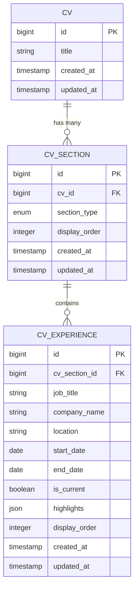
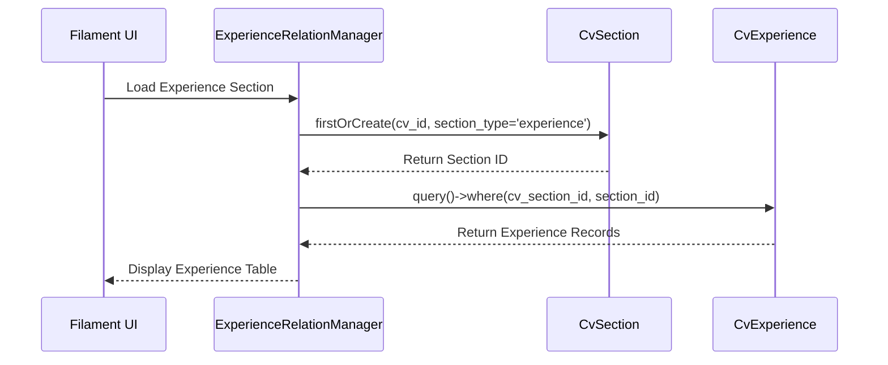
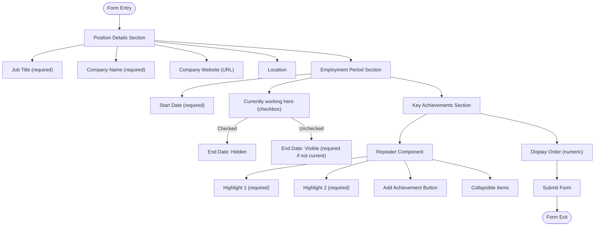
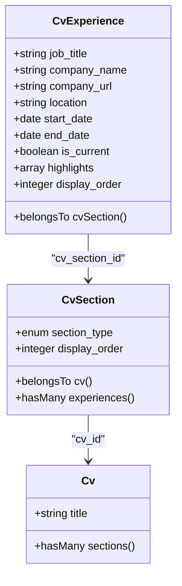

# Work Experience

<cite>
**Referenced Files in This Document**  
- [ExperienceRelationManager.php](file://app/Filament/Resources/Cvs/RelationManagers/ExperienceRelationManager.php) - *Updated with improved UI/UX*
- [CvExperience.php](file://app/Models/CvExperience.php)
- [CvSection.php](file://app/Models/CvSection.php)
- [cv_builder_spec.md](file://cv_builder_spec.md)
- [data-model.md](file://specs/001-cv-builder-application/data-model.md)
- [filament-actions.md](file://specs/001-cv-builder-application/contracts/filament-actions.md) - *Updated with new section structure*
</cite>

## Update Summary
**Changes Made**  
- Updated Form Schema and User Interface section to reflect new section organization and icons
- Enhanced Table Display and Sorting section with updated column details
- Revised Validation and Data Integrity section to include new field requirements
- Added specific implementation details from updated ExperienceRelationManager
- Updated all source references to reflect current file locations and changes

## Table of Contents
1. [Introduction](#introduction)
2. [Architecture Overview](#architecture-overview)
3. [ExperienceRelationManager Implementation](#experiencerelationmanager-implementation)
4. [Form Schema and User Interface](#form-schema-and-user-interface)
5. [Data Management and Relationships](#data-management-and-relationships)
6. [Table Display and Sorting](#table-display-and-sorting)
7. [Validation and Data Integrity](#validation-and-data-integrity)
8. [Best Practices for Experience Entries](#best-practices-for-experience-entries)
9. [Conclusion](#conclusion)

## Introduction

The Work Experience section in the CV Builder application enables users to manage their professional history through the Filament admin interface. This documentation details how the `ExperienceRelationManager` handles multiple positions using a hasMany relationship via the `cv_sections` table with the `CvExperience` model. The system supports comprehensive experience entries including position details, date ranges with current position tracking, location information, and achievement highlights. This section explains the implementation, data flow, and best practices for creating effective work experience entries that enhance a CV's impact.

**Section sources**
- [cv_builder_spec.md](file://cv_builder_spec.md#L136-L142)
- [data-model.md](file://specs/001-cv-builder-application/data-model.md#L200-L245)

## Architecture Overview

The Work Experience functionality follows a polymorphic design pattern where the `cv_sections` table acts as a typed pivot, connecting CVs to their various section types including experience entries. This architecture enables flexible section ordering while maintaining strong typing for content. The `ExperienceRelationManager` extends Filament's `RelationManager` to provide a dedicated interface for managing work experience records associated with a CV through the sections relationship.



**Diagram sources**
- [cv_builder_spec.md](file://cv_builder_spec.md#L27-L33)
- [data-model.md](file://specs/001-cv-builder-application/data-model.md#L76-L109)
- [data-model.md](file://specs/001-cv-builder-application/data-model.md#L200-L245)

**Section sources**
- [cv_builder_spec.md](file://cv_builder_spec.md#L136-L142)
- [data-model.md](file://specs/001-cv-builder-application/data-model.md#L200-L245)

## ExperienceRelationManager Implementation

The `ExperienceRelationManager` class manages the work experience section through a hasMany relationship via the `sections` table. It establishes this relationship by defining the `$relationship` property as 'sections', connecting to the polymorphic pivot that links CVs to their experience content. The manager ensures section existence by implementing the `getTableQuery` method, which uses `firstOrCreate` to guarantee a section record exists for the experience type before querying associated `CvExperience` records.



**Diagram sources**
- [ExperienceRelationManager.php](file://app/Filament/Resources/Cvs/RelationManagers/ExperienceRelationManager.php#L22-L249)

**Section sources**
- [ExperienceRelationManager.php](file://app/Filament/Resources/Cvs/RelationManagers/ExperienceRelationManager.php#L22-L249)

## Form Schema and User Interface

The form schema for work experience entries has been enhanced with structured sections and improved user experience. The interface is organized into four main sections: Position Details, Employment Period, Key Achievements, and Display Order, each with appropriate icons for visual clarity.

The **Position Details** section captures essential information including job title, company name, company URL, and location through text inputs. This section uses the briefcase icon (heroicon-o-briefcase) for visual identification and is configured with two columns for optimal layout.

The **Employment Period** section implements a dynamic date field configuration where the end date field is conditionally hidden when the "Currently working here" checkbox is checked, using Filament's reactive functionality to create an intuitive user interface. The calendar icon (heroicon-o-calendar) provides visual context, and date pickers are configured with 'M Y' display format for consistent presentation.

The **Key Achievements** section utilizes a Repeater component to manage experience highlights, allowing users to add multiple bullet points that describe their accomplishments and responsibilities. Each highlight is implemented as a required textarea with three rows, ensuring sufficient space for meaningful content while maintaining a clean interface. The section includes a description "List your major accomplishments and responsibilities" and uses the star icon (heroicon-o-star) for visual identification. The repeater is collapsible and shows a truncated label of each highlight for better navigation.

The **Display Order** section contains a numeric input for the sort order field, with helper text explaining that "Lower numbers appear first." This section enables drag-and-drop reordering of experience entries in the table view.



**Diagram sources**
- [ExperienceRelationManager.php](file://app/Filament/Resources/Cvs/RelationManagers/ExperienceRelationManager.php#L78-L144)
- [filament-actions.md](file://specs/001-cv-builder-application/contracts/filament-actions.md#L165-L224)

**Section sources**
- [ExperienceRelationManager.php](file://app/Filament/Resources/Cvs/RelationManagers/ExperienceRelationManager.php#L78-L144)
- [filament-actions.md](file://specs/001-cv-builder-application/contracts/filament-actions.md#L165-L224)

## Data Management and Relationships

The data management system for work experience entries follows a closure-based approach that links `CvExperience` records to the appropriate `CvSection`. When creating or updating an experience entry, the system first ensures the existence of the experience section by calling `firstOrCreate` with the CV ID and section type 'experience'. This pattern guarantees that the section exists before attempting to associate experience records with it, preventing orphaned data and maintaining referential integrity.

The relationship between models is defined through Eloquent relationships, with `CvExperience` belonging to `CvSection`, and `CvSection` having many `CvExperience` records. This bidirectional relationship enables efficient querying and data manipulation. The closure-based data creation in the `using` method of the `CreateAction` explicitly sets the `cv_section_id` before creating the `CvExperience` record, ensuring proper association.



**Diagram sources**
- [CvExperience.php](file://app/Models/CvExperience.php#L7-L33)
- [CvSection.php](file://app/Models/CvSection.php#L10-L60)

**Section sources**
- [CvExperience.php](file://app/Models/CvExperience.php#L7-L33)
- [CvSection.php](file://app/Models/CvSection.php#L10-L60)

## Table Display and Sorting

The table display for work experience entries presents key information in a clear, scannable format. The table columns include job title, company name, start date, and display order (labeled as "Order"), with the start date formatted using the `date()` method with 'M Y' format for consistent presentation. The table implements drag-and-drop reordering through the `reorderable('display_order')` method, allowing users to easily adjust the sequence of experience entries by dragging rows.

The table is configured with a default sort on the `display_order` column, ensuring consistent presentation across sessions. The `defaultSort('display_order')` method establishes this behavior, while the reorderable functionality provides an intuitive interface for changing the order. For current positions, the end date field is conditionally hidden in the form and displays "Current" in the table view when the `is_current` flag is set to true.

```mermaid
graph TD
A[Experience Table] --> B[Columns]
B --> C[Job Title]
B --> D[Company Name]
B --> E[Start Date<br/>Formatted as M Y]
B --> F[Order<br/>display_order]
A --> G[Sorting]
G --> H[Default Sort: display_order]
G --> I[Sortable Column: display_order]
A --> J[Reordering]
J --> K[Drag-and-Drop Enabled]
J --> L[Updates display_order field]
A --> M[Current Position Handling]
M --> N[is_current = true]
N --> O[End Date: "Current"]
N --> P[End Date Field Hidden in Form]
```

**Diagram sources**
- [ExperienceRelationManager.php](file://app/Filament/Resources/Cvs/RelationManagers/ExperienceRelationManager.php#L50-L76)
- [filament-actions.md](file://specs/001-cv-builder-application/contracts/filament-actions.md#L165-L224)

**Section sources**
- [ExperienceRelationManager.php](file://app/Filament/Resources/Cvs/RelationManagers/ExperienceRelationManager.php#L50-L76)

## Validation and Data Integrity

The system implements comprehensive validation rules to ensure data integrity for work experience entries. Required fields include job title, company name, start date, and at least one highlight, enforced through both database constraints and Filament form validation. The end date field includes conditional validation requiring it to be after the start date when provided, preventing logical inconsistencies in employment timelines.

For current positions, the system handles the absence of an end date gracefully by setting the `is_current` flag to true and hiding the end date field in the form interface. This approach maintains data consistency while providing a user-friendly experience. The display_order field ensures proper sequencing of experience entries, with database indexing on `(cv_section_id, display_order)` enabling efficient sorting queries.

**Table: Validation Rules for Work Experience**

| Field | Validation Rules | Notes |
|-------|------------------|-------|
| job_title | required, max:255 | Position title |
| company_name | required, max:255 | Employer name |
| company_url | nullable, url, max:255 | Company website |
| location | nullable, max:255 | City and country |
| start_date | required, date | Employment start |
| end_date | nullable, date, after:start_date | Hidden if is_current |
| is_current | boolean | Controls end date visibility |
| highlights | required, array, min:1 | JSON array of achievements |
| highlights.* | required, string | Individual highlight text |
| display_order | required, integer, min:0 | For drag-and-drop sorting |

**Section sources**
- [data-model.md](file://specs/001-cv-builder-application/data-model.md#L200-L245)
- [ExperienceRelationManager.php](file://app/Filament/Resources/Cvs/RelationManagers/ExperienceRelationManager.php#L78-L144)

## Best Practices for Experience Entries

When creating compelling work experience entries, focus on quantifiable achievements that demonstrate impact. Use action verbs to start each highlight and include specific metrics where possible, such as "Increased system performance by 40% through database optimization" rather than "Responsible for database optimization." Structure highlights to showcase progression, technical skills, and business impact.

Organize experience entries in reverse chronological order, with the most recent position first. For current positions, ensure the "Currently working here" checkbox is checked to properly handle the end date display. Use the location field to specify city and country when relevant, particularly for international experience. Keep job titles accurate but consider adding clarification in parentheses if the title doesn't fully represent the role, such as "Software Engineer (Frontend Specialization)."

When describing achievements, follow the STAR method (Situation, Task, Action, Result) to create compelling narratives. Focus on outcomes and impact rather than just responsibilities. For technical roles, include specific technologies and methodologies used, but avoid excessive jargon that may not be familiar to all readers. Regularly update experience entries to reflect new accomplishments and ensure all information is current and accurate.

**Section sources**
- [cv_builder_spec.md](file://cv_builder_spec.md#L176-L184)

## Conclusion

The Work Experience section in the CV Builder application provides a robust, user-friendly interface for managing professional history through the Filament admin panel. By leveraging the polymorphic relationship pattern with the `cv_sections` table, the system efficiently manages multiple experience entries while maintaining data integrity and enabling flexible ordering. The comprehensive form schema with dynamic date handling, achievement highlights, and drag-and-drop reordering creates an intuitive user experience that simplifies CV management. Following best practices for creating quantifiable, achievement-focused experience entries will help users present their professional background in the most compelling way possible.