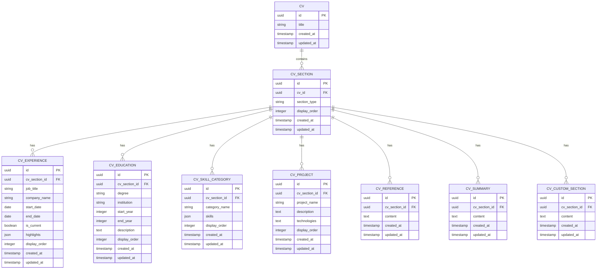

# Section Management

<cite>
**Referenced Files in This Document**   
- [Cv.php](file://app/Models/Cv.php)
- [CvSection.php](file://app/Models/CvSection.php)
- [CvExperience.php](file://app/Models/CvExperience.php)
- [CvEducation.php](file://app/Models/CvEducation.php)
- [CvSkillCategory.php](file://app/Models/CvSkillCategory.php)
- [CvProject.php](file://app/Models/CvProject.php)
- [CvReference.php](file://app/Models/CvReference.php)
- [CvSummary.php](file://app/Models/CvSummary.php)
- [CvCustomSection.php](file://app/Models/CvCustomSection.php)
- [CvHeaderInfo.php](file://app/Models/CvHeaderInfo.php)
- [ExperienceRelationManager.php](file://app/Filament/Resources/Cvs/RelationManagers/ExperienceRelationManager.php)
- [EducationRelationManager.php](file://app/Filament/Resources/Cvs/RelationManagers/EducationRelationManager.php)
- [SkillsRelationManager.php](file://app/Filament/Resources/Cvs/RelationManagers/SkillsRelationManager.php)
- [ProjectsRelationManager.php](file://app/Filament/Resources/Cvs/RelationManagers/ProjectsRelationManager.php)
- [ReferencesRelationManager.php](file://app/Filament/Resources/Cvs/RelationManagers/ReferencesRelationManager.php)
- [SummaryRelationManager.php](file://app/Filament/Resources/Cvs/RelationManagers/SummaryRelationManager.php)
- [CustomSectionsRelationManager.php](file://app/Filament/Resources/Cvs/RelationManagers/CustomSectionsRelationManager.php)
- [cv_builder_spec.md](file://specs/cv_builder_spec.md)
</cite>

## Table of Contents
1. [Introduction](#introduction)
2. [Section Types and Relation Managers](#section-types-and-relation-managers)
3. [Database Schema and Relationships](#database-schema-and-relationships)
4. [UI Patterns for Section Management](#ui-patterns-for-section-management)
5. [Dynamic Section Handling and Ordering](#dynamic-section-handling-and-ordering)
6. [Custom Section Implementation](#custom-section-implementation)
7. [Common Issues and Best Practices](#common-issues-and-best-practices)

## Introduction
The CV Builder application implements a flexible section management system that allows users to create, organize, and customize multiple CVs with various section types. Built on Laravel with Filament 4 as the admin interface, the system uses a relational database structure with polymorphic relationships to manage different section types efficiently. This document details how each section type is implemented, their database schema, UI patterns for management, and best practices for maintaining data consistency.

**Section sources**
- [cv_builder_spec.md](file://specs/cv_builder_spec.md#L0-L193)

## Section Types and Relation Managers
The application implements seven core section types through dedicated Filament RelationManagers: Experience, Education, Skills, Projects, References, Summary, and Custom Sections. Each section type is managed through a specific RelationManager class that defines the form schema, table columns, and actions available in the admin interface.

The ExperienceRelationManager, for example, provides a comprehensive form with sections for position details, employment period, and key achievements. It uses Filament's Section component to organize fields into logical groups with icons for visual clarity. The form includes a Repeater component for managing multiple achievement highlights, allowing users to add, remove, and reorder bullet points within each experience entry.

All section types support inline creation through the headerActions array, which includes a CreateAction that opens a modal form. Record actions include EditAction and DeleteAction, with appropriate validation and confirmation dialogs. The relation managers are designed to provide a consistent user experience across all section types while accommodating the specific data requirements of each.

**Section sources**
- [ExperienceRelationManager.php](file://app/Filament/Resources/Cvs/RelationManagers/ExperienceRelationManager.php#L8-L250)
- [cv_builder_spec.md](file://specs/cv_builder_spec.md#L116-L123)

## Database Schema and Relationships
The section management system uses a normalized database schema with a central cv_sections table that acts as a polymorphic container for different section types. The cv_sections table contains the foreign key to the parent CV, the section_type enum, and the display_order field for sorting.

Each section type has its own dedicated table that stores the specific content:
- cv_experiences for work experience entries
- cv_education for educational background
- cv_skill_categories for skills organized by category
- cv_projects for project descriptions
- cv_references for references text
- cv_summaries for professional summaries
- cv_custom_sections for user-defined sections

The relationships are implemented through Eloquent models with appropriate belongsTo and hasMany relationships. The Cv model defines methods like experiences(), education(), and skillCategories() that use hasManyThrough relationships to connect to the content tables via the cv_sections intermediary. This design allows for efficient querying while maintaining data integrity and separation of concerns.

**Diagram sources **
- [cv_builder_spec.md](file://specs/cv_builder_spec.md#L57-L110)
- [Cv.php](file://app/Models/Cv.php#L0-L366)
- [CvSection.php](file://app/Models/CvSection.php#L0-L67)

## UI Patterns for Section Management
The admin interface implements consistent UI patterns for managing all section types. Each relation manager displays sections in a sortable table with drag-and-drop reordering enabled through the reorderable() method. The table includes key information for quick scanning, such as job title and company name for experiences, or degree and institution for education entries.

Inline creation is supported through modal forms that are triggered by the "Create" button in the headerActions. These forms use a structured layout with Section components to group related fields, improving usability and reducing cognitive load. For example, the experience form separates position details, employment period, and key achievements into distinct sections with appropriate icons.

All forms implement client-side validation with required field indicators and appropriate input types (e.g., date pickers for dates, URL inputs for web addresses). The Repeater component is used for multi-value fields like experience highlights, allowing users to dynamically add or remove items. The table supports searching and sorting on key columns, making it easy to find specific entries in CVs with many sections.

**Section sources**
- [ExperienceRelationManager.php](file://app/Filament/Resources/Cvs/RelationManagers/ExperienceRelationManager.php#L8-L250)
- [cv_builder_spec.md](file://specs/cv_builder_spec.md#L124-L332)

## Dynamic Section Handling and Ordering
Section visibility and ordering are preserved through the display_order field in the cv_sections table and related content tables. When retrieving sections for display, the application uses orderBy('display_order') to ensure consistent ordering. The reorderable() method in the table configuration enables drag-and-drop reordering in the admin interface, automatically updating the display_order values in the database.

The system handles dynamic section management through the polymorphic relationship pattern, where the cv_sections table acts as a container for different section types. This allows the application to iterate through sections in a consistent manner regardless of their type, while still providing type-specific functionality through the dedicated content tables.

For sections that should appear only once per CV (like Summary and References), the application uses hasOne relationships with additional constraints to ensure only one record exists per section type. For repeatable sections (like Experience and Education), hasMany relationships allow multiple entries that can be individually sorted and managed.

**Section sources**
- [Cv.php](file://app/Models/Cv.php#L0-L366)
- [CvSection.php](file://app/Models/CvSection.php#L0-L67)

## Custom Section Implementation
Custom sections are implemented through the CustomSectionsRelationManager and the cv_custom_sections table. This feature allows users to add sections with arbitrary content that doesn't fit into the predefined categories. The implementation follows the same pattern as other section types, with a dedicated model and relation manager.

The CustomSectionsRelationManager provides a simple form with a single textarea field for the content, making it easy to add custom information without complex configuration. These sections are fully integrated into the ordering system and appear in the section list alongside standard sections, maintaining a consistent user experience.

The polymorphic design of the section system makes it straightforward to add new section types in the future by creating a new model, migration, and relation manager that follows the established patterns. This extensibility is a key advantage of the current architecture.

**Section sources**
- [CvCustomSection.php](file://app/Models/CvCustomSection.php#L0-L19)
- [CustomSectionsRelationManager.php](file://app/Filament/Resources/Cvs/RelationManagers/CustomSectionsRelationManager.php)

## Common Issues and Best Practices
When managing sections, several common issues should be addressed to maintain data consistency. Empty sections can be handled by implementing validation rules that require minimum content, such as requiring at least one highlight for experience entries. The application should also provide clear feedback when validation fails, helping users understand what information is missing.

Performance considerations are important when managing CVs with large numbers of entries. The use of eager loading (with() method) when retrieving related data can prevent N+1 query problems. For very large datasets, pagination should be implemented in the relation managers to avoid loading excessive data into memory.

Best practices for maintaining data consistency include using database transactions when performing complex operations like cloning a CV, which involves copying multiple related records. The cloneCv method in the Cv model demonstrates this approach by wrapping the entire operation in a DB::transaction() to ensure atomicity.

Validation should be implemented at both the form and model levels to catch errors early. The fillable properties in each model define which attributes can be mass-assigned, preventing unauthorized field modifications. Soft deletes are used for the main CV model, allowing users to archive CVs without permanently losing data.

**Section sources**
- [Cv.php](file://app/Models/Cv.php#L0-L366)
- [cv_builder_spec.md](file://specs/cv_builder_spec.md#L111-L115)