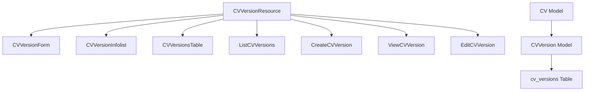
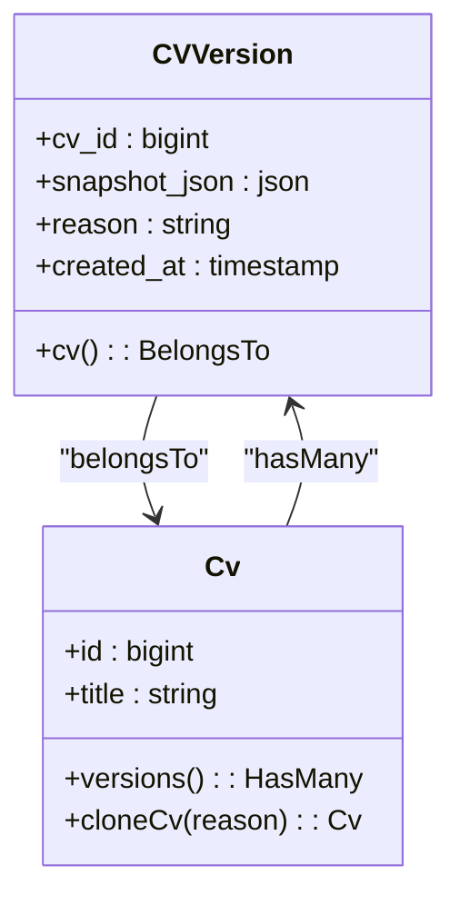
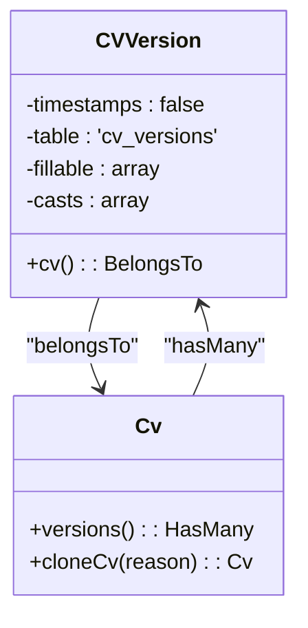
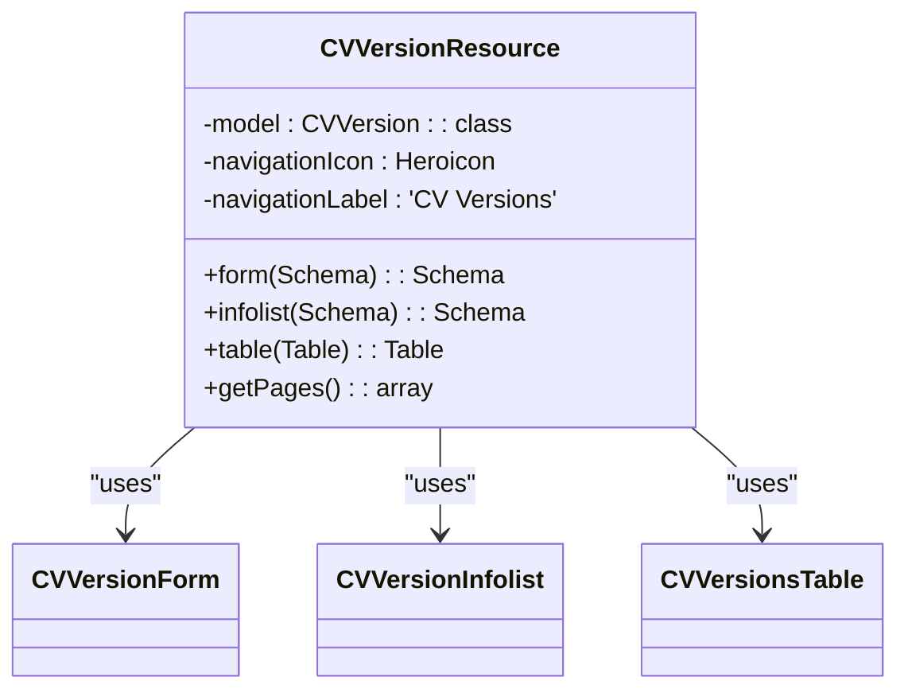
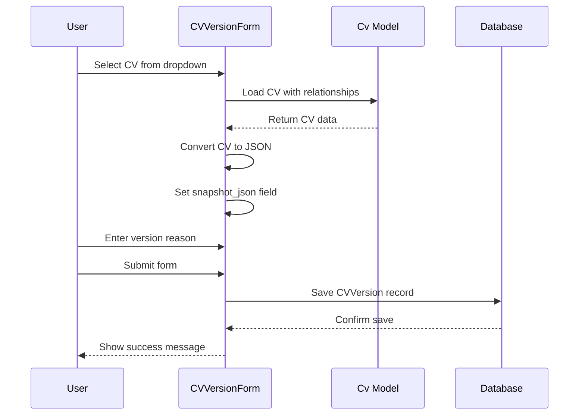
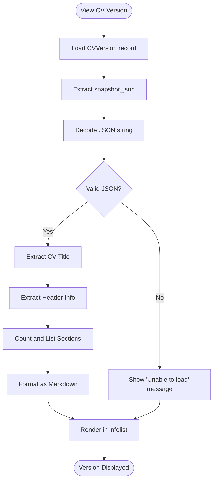
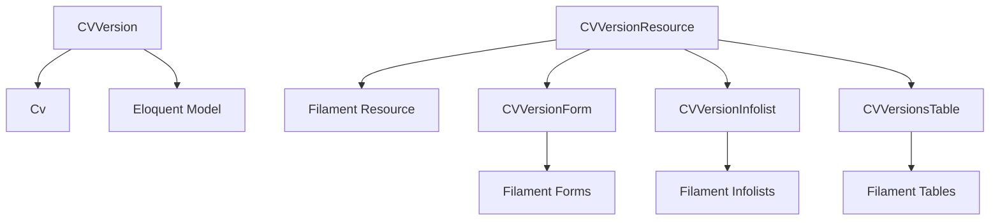

# CV Versioning

<cite>
**Referenced Files in This Document**   
- [CVVersion.php](file://app/Models/CVVersion.php)
- [Cv.php](file://app/Models/Cv.php)
- [CVVersionResource.php](file://app/Filament/Resources/CVVersions/CVVersionResource.php)
- [CVVersionForm.php](file://app/Filament/Resources/CVVersions/Schemas/CVVersionForm.php)
- [CVVersionInfolist.php](file://app/Filament/Resources/CVVersions/Schemas/CVVersionInfolist.php)
- [CVVersionsTable.php](file://app/Filament/Resources/CVVersions/Tables/CVVersionsTable.php)
- [data-model.md](file://specs/002-roadmap-md/data-model.md)
- [quickstart.md](file://specs/002-roadmap-md/quickstart.md)
- [contracts/filament-resources.md](file://specs/002-roadmap-md/contracts/filament-resources.md)
</cite>

## Table of Contents
1. [Introduction](#introduction)
2. [Project Structure](#project-structure)
3. [Core Components](#core-components)
4. [Architecture Overview](#architecture-overview)
5. [Detailed Component Analysis](#detailed-component-analysis)
6. [Dependency Analysis](#dependency-analysis)
7. [Performance Considerations](#performance-considerations)
8. [Troubleshooting Guide](#troubleshooting-guide)
9. [Conclusion](#conclusion)

## Introduction
The CV Versioning system provides immutable snapshots of CV states at specific points in time. It enables tracking historical versions, supports cloning workflows, and preserves data integrity during CV modifications. This documentation details the implementation, API interfaces, integration patterns, practical examples, and troubleshooting guidance for the CV Versioning system.

## Project Structure
The CV Versioning system is organized within the Laravel application structure under the `app/Filament/Resources/CVVersions` directory. It includes dedicated components for forms, tables, infolists, pages, and models that collectively manage version creation, display, and lifecycle.

**Diagram sources**
- [CVVersionResource.php](file://app/Filament/Resources/CVVersions/CVVersionResource.php#L18-L61)
- [CVVersion.php](file://app/Models/CVVersion.php#L7-L38)
- [Cv.php](file://app/Models/Cv.php#L250-L342)

**Section sources**
- [CVVersionResource.php](file://app/Filament/Resources/CVVersions/CVVersionResource.php#L1-L62)
- [database/migrations/2025_10_04_002612_create_cv_versions_table.php](file://database/migrations/2025_10_04_002612_create_cv_versions_table.php#L1-L32)

## Core Components
The core components of the CV Versioning system include the `CVVersion` model, its associated Filament resource, form schema, infolist display, and table configuration. These components work together to provide a complete versioning solution that integrates seamlessly with the existing CV management system.

**Section sources**
- [CVVersion.php](file://app/Models/CVVersion.php#L7-L38)
- [CVVersionResource.php](file://app/Filament/Resources/CVVersions/CVVersionResource.php#L18-L61)
- [CVVersionForm.php](file://app/Filament/Resources/CVVersions/Schemas/CVVersionForm.php#L10-L62)

## Architecture Overview
The CV Versioning architecture follows a model-view-controller pattern enhanced with Laravel's Eloquent ORM and Filament's admin panel framework. The system creates immutable snapshots of CV data in JSON format, storing them with metadata about the creation reason and timestamp.

**Diagram sources**
- [CVVersion.php](file://app/Models/CVVersion.php#L7-L38)
- [Cv.php](file://app/Models/Cv.php#L250-L342)

## Detailed Component Analysis

### CVVersion Model Analysis
The `CVVersion` model represents an immutable snapshot of a CV at a specific point in time. It stores the complete CV state as JSON and maintains a relationship with the parent CV.

#### For Object-Oriented Components:

**Diagram sources**
- [CVVersion.php](file://app/Models/CVVersion.php#L7-L38)
- [Cv.php](file://app/Models/Cv.php#L250-L342)

**Section sources**
- [CVVersion.php](file://app/Models/CVVersion.php#L1-L39)

### CVVersionResource Analysis
The `CVVersionResource` class configures the Filament admin interface for CV versions, defining the form, infolist, table, and page routing configurations.

#### For Object-Oriented Components:

**Diagram sources**
- [CVVersionResource.php](file://app/Filament/Resources/CVVersions/CVVersionResource.php#L18-L61)
- [CVVersionForm.php](file://app/Filament/Resources/CVVersions/Schemas/CVVersionForm.php#L10-L62)
- [CVVersionInfolist.php](file://app/Filament/Resources/CVVersions/Schemas/CVVersionInfolist.php#L7-L86)
- [CVVersionsTable.php](file://app/Filament/Resources/CVVersions/Tables/CVVersionsTable.php#L11-L39)

**Section sources**
- [CVVersionResource.php](file://app/Filament/Resources/CVVersions/CVVersionResource.php#L1-L62)

### CV Version Creation Workflow
The process of creating a CV version involves selecting a CV, automatically generating its JSON snapshot, and providing a reason for the version creation.

#### For API/Service Components:

**Diagram sources**
- [CVVersionForm.php](file://app/Filament/Resources/CVVersions/Schemas/CVVersionForm.php#L10-L62)
- [Cv.php](file://app/Models/Cv.php#L250-L342)

**Section sources**
- [CVVersionForm.php](file://app/Filament/Resources/CVVersions/Schemas/CVVersionForm.php#L1-L63)

### CV Version Display Analysis
The system provides a formatted preview of the CV snapshot data, making it readable and accessible through the admin interface.

#### For Complex Logic Components:

**Diagram sources**
- [CVVersionInfolist.php](file://app/Filament/Resources/CVVersions/Schemas/CVVersionInfolist.php#L7-L86)

**Section sources**
- [CVVersionInfolist.php](file://app/Filament/Resources/CVVersions/Schemas/CVVersionInfolist.php#L1-L87)

## Dependency Analysis
The CV Versioning system depends on the core CV model and leverages Laravel's Eloquent ORM for database interactions. It also integrates with Filament's admin panel components for UI rendering.

**Diagram sources**
- [CVVersion.php](file://app/Models/CVVersion.php#L7-L38)
- [Cv.php](file://app/Models/Cv.php#L250-L342)
- [CVVersionResource.php](file://app/Filament/Resources/CVVersions/CVVersionResource.php#L18-L61)

**Section sources**
- [CVVersion.php](file://app/Models/CVVersion.php#L1-L39)
- [Cv.php](file://app/Models/Cv.php#L1-L342)

## Performance Considerations
The CV Versioning system is designed to handle JSON serialization of complete CV states efficiently. The snapshot_json field is indexed for query performance, and the system leverages Laravel's model relationships with proper eager loading to prevent N+1 query issues.

## Troubleshooting Guide
Common issues with the CV Versioning system typically relate to JSON serialization, relationship loading, or form submission. The system includes validation rules to ensure data integrity and provides clear error messages for troubleshooting.

**Section sources**
- [CVVersion.php](file://app/Models/CVVersion.php#L7-L38)
- [CVVersionForm.php](file://app/Filament/Resources/CVVersions/Schemas/CVVersionForm.php#L10-L62)
- [data-model.md](file://specs/002-roadmap-md/data-model.md#L126-L171)

## Conclusion
The CV Versioning system provides a robust solution for tracking CV state changes over time. By creating immutable snapshots with descriptive metadata, it enables users to maintain historical records, support cloning workflows, and preserve data integrity throughout the CV lifecycle. The integration with Filament's admin panel provides an intuitive interface for managing versions, while the underlying Laravel model ensures data consistency and reliability.