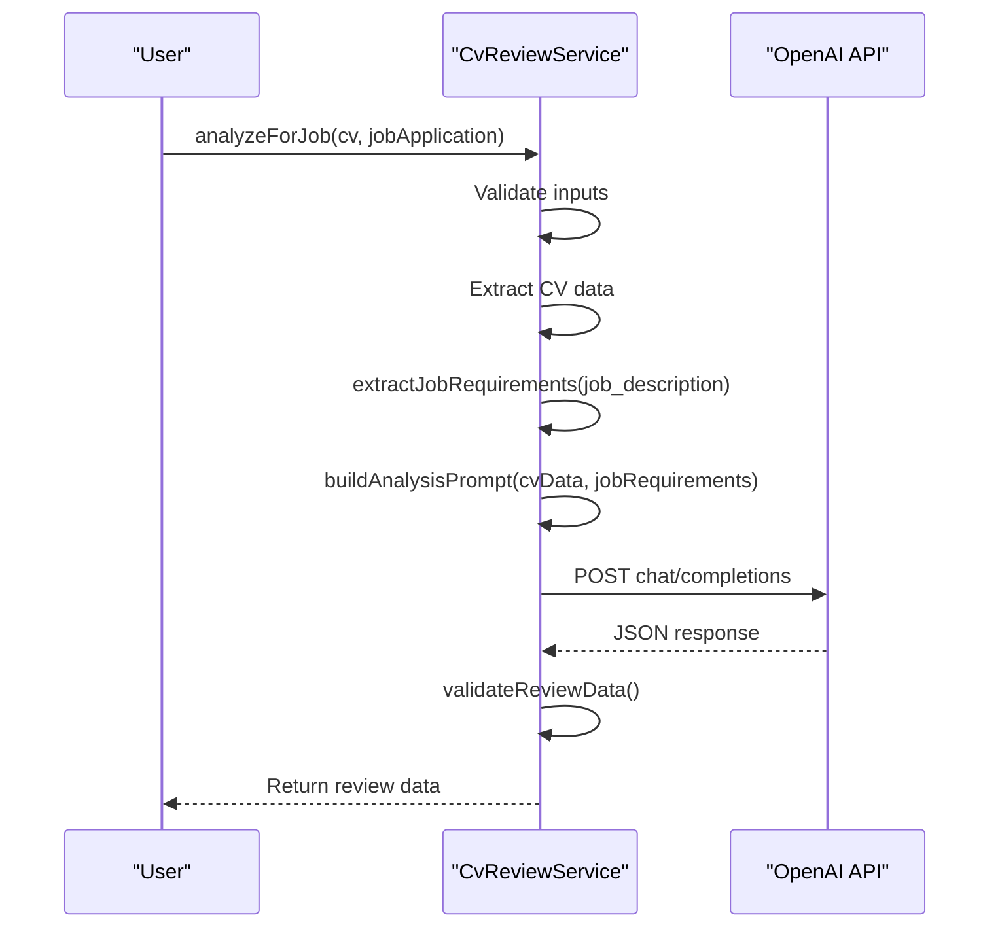
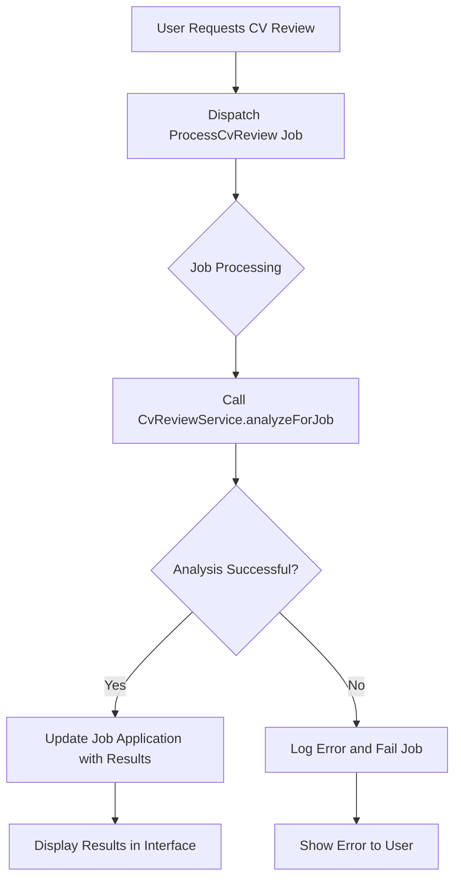
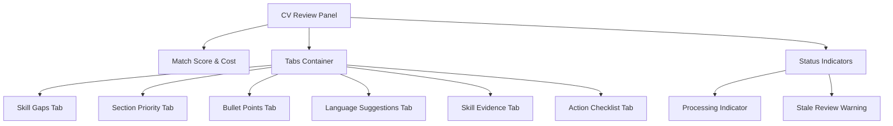
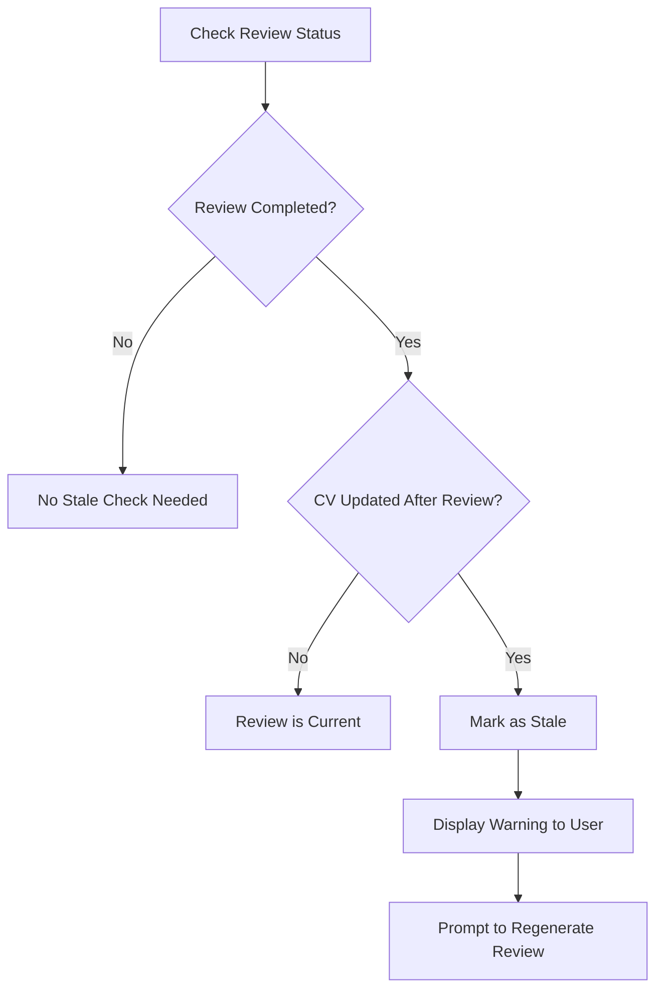

# AI-Powered CV Review

<cite>
**Referenced Files in This Document**   
- [CvReviewService.php](file://app/Services/CvReviewService.php)
- [ProcessCvReview.php](file://app/Jobs/ProcessCvReview.php)
- [JobApplication.php](file://app/Models/JobApplication.php)
- [JobApplicationResource.php](file://app/Filament/Resources/JobApplications/Pages/EditJobApplication.php)
- [ai-review-results.blade.php](file://resources/views/filament/forms/ai-review-results.blade.php)
- [ai-review-summary.blade.php](file://resources/views/filament/forms/ai-review-summary.blade.php)
- [stale-review-alert.blade.php](file://resources/views/filament/infolists/stale-review-alert.blade.php)
- [add_ai_review_fields_to_job_applications.php](file://database/migrations/2025_10_04_152747_add_ai_review_fields_to_job_applications.php)
- [JobApplicationReviewTest.php](file://tests/Feature/Filament/JobApplicationReviewTest.php)
- [JobApplicationReviewMethodsTest.php](file://tests/Unit/JobApplicationReviewMethodsTest.php)
</cite>

## Table of Contents
1. [Introduction](#introduction)
2. [CV Review Process](#cv-review-process)
3. [CvReviewService Implementation](#cvreviewservice-implementation)
4. [Asynchronous Processing with ProcessCvReview](#asynchronous-processing-with-processcvreview)
5. [Review Results Data Structure](#review-results-data-structure)
6. [Filament Interface for Review Results](#filament-interface-for-review-results)
7. [Stale Review Detection](#stale-review-detection)
8. [Configuration and Rate Limiting](#configuration-and-rate-limiting)
9. [Error Handling and Validation](#error-handling-and-validation)
10. [Example Review Outputs](#example-review-outputs)

## Introduction
The AI-powered CV review system analyzes a candidate's CV against a specific job description using the OpenAI API to generate actionable recommendations for improvement. This comprehensive analysis helps users optimize their CVs before submission by identifying skill gaps, suggesting section reordering, improving bullet points, and aligning language with the job requirements. The system is designed to provide data-driven insights that increase the likelihood of a successful job application.

## CV Review Process
The CV review process begins when a user initiates a review from the Job Application interface. The system extracts the job description and CV content, then processes them through the CvReviewService to generate a comprehensive analysis. The review includes extracting job requirements, analyzing skill gaps, suggesting section reordering, and improving bullet points. The process is asynchronous, allowing the system to handle the potentially time-consuming OpenAI API calls without blocking the user interface. Once completed, the review results are stored and displayed in the Filament interface with organized tabs for different analysis areas.

**Section sources**
- [CvReviewService.php](file://app/Services/CvReviewService.php#L15-L225)
- [ProcessCvReview.php](file://app/Jobs/ProcessCvReview.php#L15-L61)

## CvReviewService Implementation
The CvReviewService is the core analysis engine responsible for reviewing a CV against a job description. It provides several key methods including `analyzeForJob()` as the entry point, `extractJobRequirements()` for parsing job postings, `analyzeSkillGaps()` for identifying missing skills, `suggestSectionPriority()` for recommending section ordering, and `reviewBulletPoints()` for analyzing achievement bullets. The service validates inputs, extracts CV data, builds an analysis prompt, calls the OpenAI API with retry logic, and returns structured review data. The service also implements validation to ensure the job description is present and the CV is complete before proceeding with analysis.

**Diagram sources**
- [CvReviewService.php](file://app/Services/CvReviewService.php#L15-L225)

**Section sources**
- [CvReviewService.php](file://app/Services/CvReviewService.php#L15-L225)

## Asynchronous Processing with ProcessCvReview
The ProcessCvReview job handles the asynchronous processing of CV reviews, ensuring the user interface remains responsive during the analysis. The job implements Laravel's ShouldQueue interface with a timeout of 120 seconds and up to 3 retry attempts. When executed, the job calls the CvReviewService.analyzeForJob() method to perform the analysis. Upon successful completion, it updates the job application with the review data, completion timestamp, and cost information. If the analysis fails, the job logs the error and rethrows the exception for proper error handling. This asynchronous approach allows users to continue working while their CV is being analyzed.

**Diagram sources**
- [ProcessCvReview.php](file://app/Jobs/ProcessCvReview.php#L15-L61)

**Section sources**
- [ProcessCvReview.php](file://app/Jobs/ProcessCvReview.php#L15-L61)

## Review Results Data Structure
The review results are stored as JSON in the job_applications table within the ai_review_data column. The data structure includes a schema_version, match_score (0-100), skill_gaps, section_recommendations, bullet_improvements, language_suggestions, skill_evidence, and action_checklist. The analysis_metadata field contains additional information such as the generated_at timestamp, model_used, tokens_used, and prompt_version. This comprehensive structure allows for detailed analysis across multiple dimensions of CV optimization. The match_score is calculated based on skills (40%), experience (30%), keywords (20%), and evidence quality (10%).

| Field | Type | Description |
|-------|------|-------------|
| `schema_version` | string | Version of the review schema |
| `match_score` | integer | Overall alignment score (0-100) |
| `skill_gaps` | array | Missing or weak skills from job requirements |
| `section_recommendations` | array | Suggested section ordering and priorities |
| `bullet_improvements` | array | Recommendations for improving achievement bullets |
| `language_suggestions` | array | Specific text replacements for better alignment |
| `skill_evidence` | array | Assessment of skill demonstration quality |
| `action_checklist` | array | Actionable items to improve the CV |
| `analysis_metadata` | object | Technical details of the analysis process |

**Section sources**
- [CvReviewService.php](file://app/Services/CvReviewService.php#L15-L225)
- [add_ai_review_fields_to_job_applications.php](file://database/migrations/2025_10_04_152747_add_ai_review_fields_to_job_applications.php#L10-L25)

## Filament Interface for Review Results
The Filament interface displays review results in a user-friendly format with tabs for different analysis areas. The interface shows the match score with visual indicators (green for 70+, yellow for 50-69, red for below 50) and the analysis cost in USD. The results are organized into tabs including Skill Gaps, Section Priority, Bullet Points, Language Suggestions, and Skill Evidence, each with a badge showing the number of recommendations. An Action Checklist tab provides a consolidated list of recommended improvements. The interface also includes indicators for review status, showing "Review in progress..." when processing and displaying a stale review warning when the CV has been modified since the last review.

**Diagram sources**
- [EditJobApplication.php](file://app/Filament/Resources/JobApplications/Pages/EditJobApplication.php#L105-L204)
- [ai-review-results.blade.php](file://resources/views/filament/forms/ai-review-results.blade.php#L0-L50)

**Section sources**
- [EditJobApplication.php](file://app/Filament/Resources/JobApplications/Pages/EditJobApplication.php#L105-L204)
- [ai-review-results.blade.php](file://resources/views/filament/forms/ai-review-results.blade.php#L0-L50)
- [ai-review-summary.blade.php](file://resources/views/filament/forms/ai-review-summary.blade.php#L0-L95)

## Stale Review Detection
The system detects stale reviews by comparing the CV's updated_at timestamp with the ai_review_completed_at timestamp on the job application. If the CV has been modified after the review was completed, the review is considered stale and a warning is displayed to the user. This ensures users are aware when their CV changes make the previous analysis outdated and prompts them to regenerate the review. The detection logic is implemented in the JobApplication model's isReviewStale() method, which returns true if the CV's updated_at timestamp is later than the review completion timestamp.

**Diagram sources**
- [JobApplicationReviewMethodsTest.php](file://tests/Unit/JobApplicationReviewMethodsTest.php#L0-L49)
- [stale-review-alert.blade.php](file://resources/views/filament/infolists/stale-review-alert.blade.php#L0-L10)

**Section sources**
- [JobApplicationReviewMethodsTest.php](file://tests/Unit/JobApplicationReviewMethodsTest.php#L0-L49)
- [stale-review-alert.blade.php](file://resources/views/filament/infolists/stale-review-alert.blade.php#L0-L10)

## Configuration and Rate Limiting
The CV review system requires configuration of the OpenAI API key in the services configuration file. The system implements rate limiting considerations through retry logic with exponential backoff, with up to 3 retry attempts for failed API calls. The service uses a timeout of 60 seconds for the initial analysis and 30 seconds for job requirement extraction. Cost estimation is implemented based on token usage, with separate calculations for input and output tokens at different rates. The system also includes token count estimation to provide cost predictions before processing. These configuration and rate limiting measures ensure reliable operation while managing API costs and handling transient failures.

**Section sources**
- [CvReviewService.php](file://app/Services/CvReviewService.php#L15-L225)
- [config/services.php](file://config/services.php#L1-L20)

## Error Handling and Validation
The system implements comprehensive error handling and validation to ensure robust operation. Validation requirements include ensuring the job description is present and sufficiently detailed (at least 50 characters) and that the CV contains at least one experience or skill. The system throws specific exceptions: MissingJobDescriptionException when the job description is missing or too short, and IncompleteCvException when the CV lacks sufficient content. The CvReviewService catches OpenAI API exceptions and wraps other exceptions in OpenAiApiException for consistent error handling. The ProcessCvReview job logs errors and propagates them for proper notification. These validation and error handling mechanisms prevent processing invalid data and provide clear feedback to users.

**Section sources**
- [CvReviewService.php](file://app/Services/CvReviewService.php#L15-L225)
- [ProcessCvReview.php](file://app/Jobs/ProcessCvReview.php#L15-L61)
- [MissingJobDescriptionException.php](file://app/Exceptions/MissingJobDescriptionException.php#L1-L10)
- [IncompleteCvException.php](file://app/Exceptions/IncompleteCvException.php#L1-L10)

## Example Review Outputs
Typical review outputs include a match score between 0-100, with scores of 70+ indicating strong alignment, 50-69 indicating moderate alignment, and below 50 indicating significant gaps. The skill gaps section identifies missing critical skills from the job description, such as "Kubernetes" with a high priority and reason "Required in job". Section reordering recommendations suggest prioritizing relevant experiences or projects based on the job focus. Bullet point improvements provide specific rewording suggestions using stronger action verbs and quantifiable outcomes. Language suggestions offer exact text replacements to align with industry terminology. Users should interpret the match score as a relative measure of alignment and prioritize high-priority recommendations in the action checklist for maximum impact.

**Section sources**
- [JobApplicationReviewTest.php](file://tests/Feature/Filament/JobApplicationReviewTest.php#L47-L79)
- [CvReviewService.php](file://app/Services/CvReviewService.php#L15-L225)