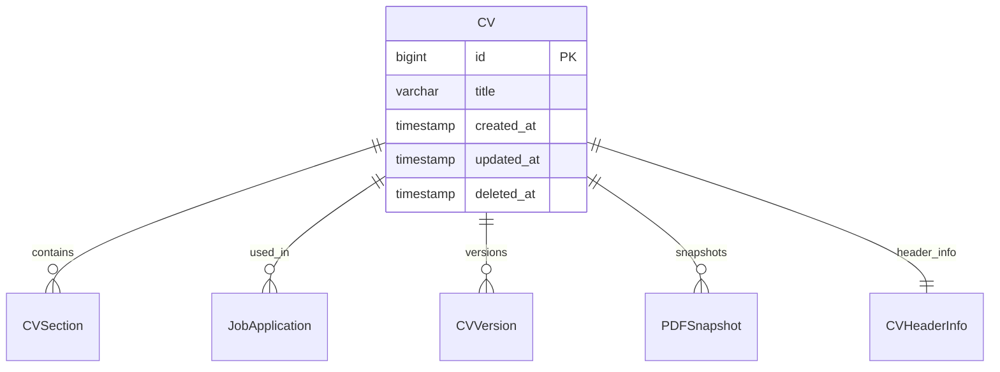
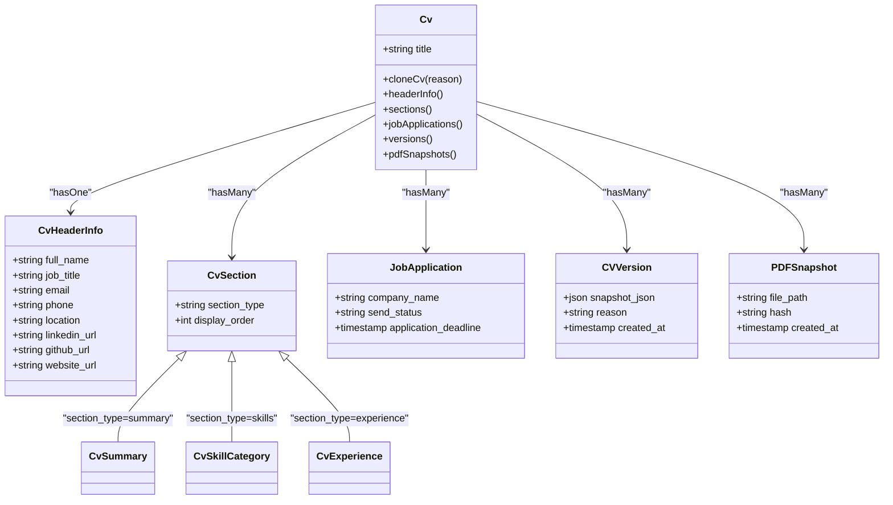
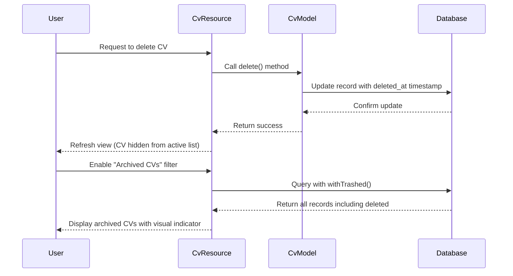
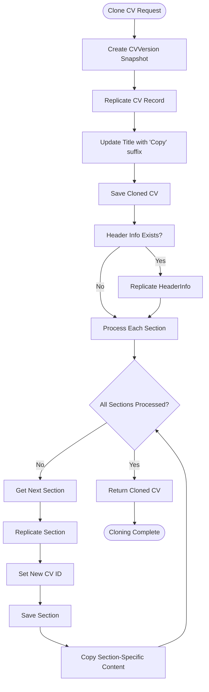
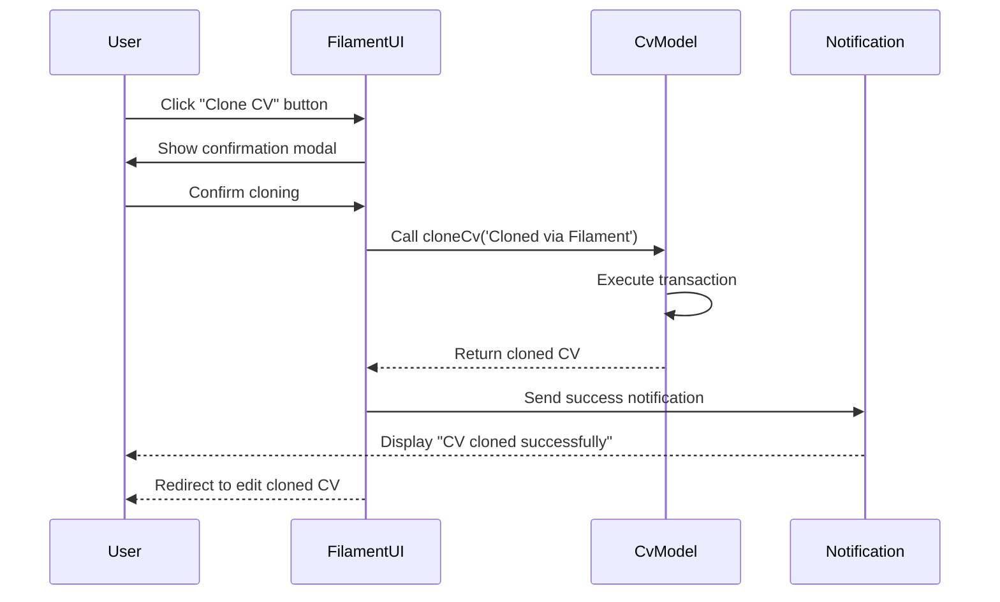

# CV Entity

<cite>
**Referenced Files in This Document**   
- [Cv.php](file://app/Models/Cv.php)
- [CvForm.php](file://app/Filament/Resources/Cvs/Schemas/CvForm.php)
- [create_cvs_table.php](file://database/migrations/2025_10_03_201646_create_cvs_table.php)
- [add_soft_deletes_to_cvs.php](file://database/migrations/2025_10_04_002505_add_soft_deletes_to_cvs.php)
- [CvsTable.php](file://app/Filament/Resources/Cvs/Tables/CvsTable.php)
</cite>

## Table of Contents
1. [Introduction](#introduction)
2. [Database Schema](#database-schema)
3. [Eloquent Relationships](#eloquent-relationships)
4. [Soft Delete Functionality](#soft-delete-functionality)
5. [Cloning Mechanism](#cloning-mechanism)
6. [Flexible Data Storage](#flexible-data-storage)
7. [Filament Integration](#filament-integration)
8. [Conclusion](#conclusion)

## Introduction
The CV entity serves as the central container for professional information in the CV Builder system. It acts as the root model that organizes and maintains all components of a curriculum vitae, including personal information, work experience, skills, education, and other sections. The CV model provides essential functionality for managing professional profiles through features like soft deletion, cloning, and version tracking. This documentation details the structure, relationships, and key behaviors of the CV entity, explaining how it supports the creation, modification, and preservation of professional information throughout the job application process.

## Database Schema
The CV entity's database schema is defined across two migration files that establish the core structure and enhance it with soft delete capabilities. The initial migration creates the fundamental table structure with essential fields, while a subsequent migration adds soft delete functionality to preserve historical data.

The primary fields in the CV schema include:
- **id**: Primary key identifier
- **title**: Descriptive name for the CV (e.g., "Senior Developer - StickyPiston")
- **created_at**: Timestamp of creation
- **updated_at**: Timestamp of last modification
- **deleted_at**: Timestamp indicating soft deletion (added by second migration)

The schema supports the CV's role as a container by providing a stable identifier that maintains relationships with all associated sections and content, even when the CV is archived through soft deletion.

**Diagram sources**
- [create_cvs_table.php](file://database/migrations/2025_10_03_201646_create_cvs_table.php)
- [add_soft_deletes_to_cvs.php](file://database/migrations/2025_10_04_002505_add_soft_deletes_to_cvs.php)

**Section sources**
- [create_cvs_table.php](file://database/migrations/2025_10_03_201646_create_cvs_table.php#L10-L20)
- [add_soft_deletes_to_cvs.php](file://database/migrations/2025_10_04_002505_add_soft_deletes_to_cvs.php#L10-L15)

## Eloquent Relationships
The CV entity establishes several critical relationships that define its role as the central container for professional information. These relationships enable the organization and retrieval of all CV components through a single parent model.

### Direct Relationships
- **hasOne to HeaderInfo**: Each CV has exactly one header information record containing personal details like full name, job title, contact information, and social links
- **hasMany to Sections**: A CV contains multiple sections (summary, skills, experience, etc.) ordered by display priority
- **hasMany to JobApplications**: Multiple job applications can reference the same CV, establishing the connection between professional profiles and specific job pursuits
- **hasMany to versions**: Tracks historical versions of the CV through CVVersion records
- **hasMany to pdfSnapshots**: Maintains references to PDF exports generated from the CV

### Indirect Relationships
Through the sections relationship, the CV provides access to specialized content:
- **summary**: One-to-one access to the professional summary section
- **skillCategories**: Access to categorized skills with JSON storage
- **experiences**: Collection of work experience entries with achievement highlights
- **projects**: Professional projects with descriptions and technologies
- **education**: Academic background information
- **reference**: Professional references text

These relationships create a comprehensive hierarchy where the CV serves as the root node, enabling efficient data retrieval and manipulation across the entire professional profile.

**Diagram sources**
- [Cv.php](file://app/Models/Cv.php#L25-L90)
- [CvSection.php](file://app/Models/CvSection.php)

**Section sources**
- [Cv.php](file://app/Models/Cv.php#L25-L90)

## Soft Delete Functionality
The CV entity implements soft delete functionality to preserve historical data while removing records from active views. This approach ensures that related job applications and PDF snapshots maintain their integrity even when a CV is archived.

The soft delete mechanism was added through a dedicated migration that introduced the `deleted_at` timestamp field and an index for efficient querying. When a CV is deleted, the `deleted_at` field is populated with the current timestamp instead of removing the record from the database.

This functionality enables several important behaviors:
- **Data Preservation**: All associated sections, job applications, and PDF snapshots remain intact and accessible
- **Historical Integrity**: Previous applications retain references to the exact CV version that was submitted
- **Recovery Capability**: Archived CVs can be restored if needed
- **Clean Interface**: Deleted CVs are hidden from default queries, providing a clean user experience

The implementation includes a filter in the Filament interface that allows users to toggle between viewing active and archived CVs, making the soft delete status visible and manageable through the UI.

**Diagram sources**
- [add_soft_deletes_to_cvs.php](file://database/migrations/2025_10_04_002505_add_soft_deletes_to_cvs.php#L10-L15)
- [CvsTable.php](file://app/Filament/Resources/Cvs/Tables/CvsTable.php#L35-L40)

**Section sources**
- [add_soft_deletes_to_cvs.php](file://database/migrations/2025_10_04_002505_add_soft_deletes_to_cvs.php#L10-L15)
- [CvsTable.php](file://app/Filament/Resources/Cvs/Tables/CvsTable.php#L35-L40)

## Cloning Mechanism
The CV entity provides a robust cloning mechanism that enables deep copying of all sections, skills, and formatting. This functionality is implemented through the `cloneCv()` method, which creates a complete duplicate of the CV and its entire content hierarchy.

The cloning process follows these steps within a database transaction:
1. Create a version snapshot of the original CV stored as JSON in the CVVersion model
2. Replicate the CV record with an updated title (appending "Copy")
3. Deep copy the header information to the new CV
4. Iterate through all sections and replicate each one
5. For each section type, copy the associated content (summary, skills, experiences, etc.)

This comprehensive approach ensures that all formatting, content, and structural elements are preserved in the clone. The process is atomic, meaning either all operations succeed or none do, maintaining data integrity.

The cloning feature is accessible through the Filament interface via a "Clone CV" action, which provides user confirmation and displays a success notification upon completion. This functionality supports use cases like creating variations of a CV for different job applications while preserving the original as a reference point.

**Diagram sources**
- [Cv.php](file://app/Models/Cv.php#L134-L167)
- [CvsTable.php](file://app/Filament/Resources/Cvs/Tables/CvsTable.php#L46-L75)

**Section sources**
- [Cv.php](file://app/Models/Cv.php#L134-L167)

## Flexible Data Storage
The CV entity supports flexible data storage through strategic use of JSON fields and the display_order attribute, enabling dynamic content organization and storage.

### JSON Field Usage
The system leverages JSON fields to store flexible content arrays without requiring complex database schemas:
- **Skills**: Stored as JSON arrays within CvSkillCategory records, allowing dynamic addition of skills without schema changes
- **Highlights**: Achievement bullet points in experiences are stored as JSON arrays, supporting variable-length content
- **Version Snapshots**: Complete CV state is serialized to JSON in CVVersion records for historical tracking

This approach provides schema simplicity while maintaining the ability to store structured, hierarchical data that can be easily queried and manipulated.

### Section Ordering
The display_order field in the CVSection model enables user-controlled reordering of sections. This integer field determines the sequence in which sections appear in the final CV output. The Filament interface provides drag-and-drop reordering functionality that updates these values, allowing users to customize the presentation flow of their professional information.

The combination of JSON storage and ordered sections creates a flexible system that can accommodate various CV formats and content structures while maintaining data integrity and query performance.

**Section sources**
- [cv_skill_categories_table.php](file://database/migrations/2025_10_03_201706_create_cv_skill_categories_table.php#L15)
- [Cv.php](file://app/Models/Cv.php#L134-L167)
- [CvSection.php](file://app/Models/CvSection.php#L10)

## Filament Integration
The CV entity is fully integrated with the Filament admin interface, providing a user-friendly experience for managing professional profiles. The integration includes form configuration, table displays, and custom actions that expose the CV's functionality through the UI.

### Form Configuration
The CV form is configured in CvForm.php to collect both the CV title and header information in a single interface. The form uses nested field naming (e.g., 'headerInfo.full_name') to handle the one-to-one relationship with header information. This configuration creates a cohesive editing experience where users can update their personal details and CV metadata simultaneously.

### Table Features
The CvsTable configuration provides several key features:
- Display of CV title and associated personal information
- Filtering capability to show active or archived CVs
- Custom actions including "Clone CV" and "Download PDF"
- Proper handling of soft-deleted records through the TrashedFilter

### Custom Actions
The "Clone CV" action is implemented as a custom Filament action that calls the cloneCv() method on the model. This action includes confirmation dialogs, success notifications, and automatic redirection to the newly created CV for immediate editing. The integration ensures that complex backend functionality is accessible through an intuitive interface.

**Diagram sources**
- [CvForm.php](file://app/Filament/Resources/Cvs/Schemas/CvForm.php#L10-L43)
- [CvsTable.php](file://app/Filament/Resources/Cvs/Tables/CvsTable.php#L46-L75)

**Section sources**
- [CvForm.php](file://app/Filament/Resources/Cvs/Schemas/CvForm.php#L10-L43)
- [CvsTable.php](file://app/Filament/Resources/Cvs/Tables/CvsTable.php#L46-L75)

## Conclusion
The CV entity serves as the foundational component of the CV Builder system, functioning as the central container for all professional information. Through its well-designed database schema, comprehensive relationships, and specialized functionality, the CV model supports the complete lifecycle of professional profile management. Key features like soft deletion preserve historical data integrity, while the cloning mechanism enables efficient creation of CV variations. The integration of JSON fields and ordering capabilities provides flexibility in content storage and presentation. The Filament interface makes these powerful features accessible through an intuitive user experience. Together, these elements create a robust system for managing professional profiles throughout the job application process, balancing data integrity with user flexibility.