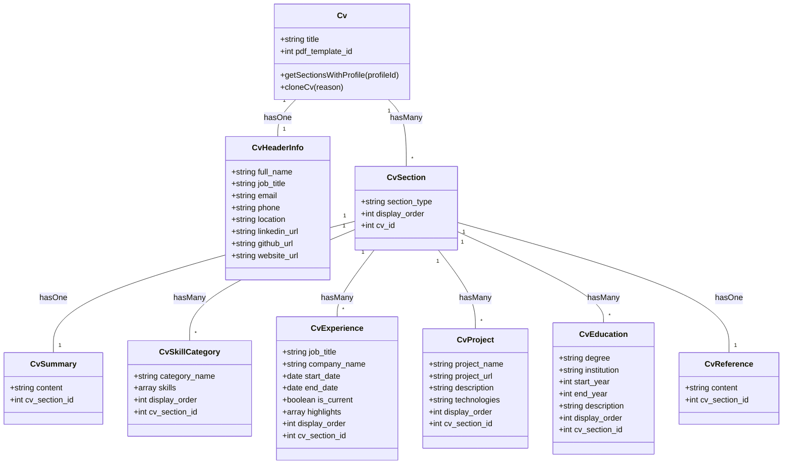
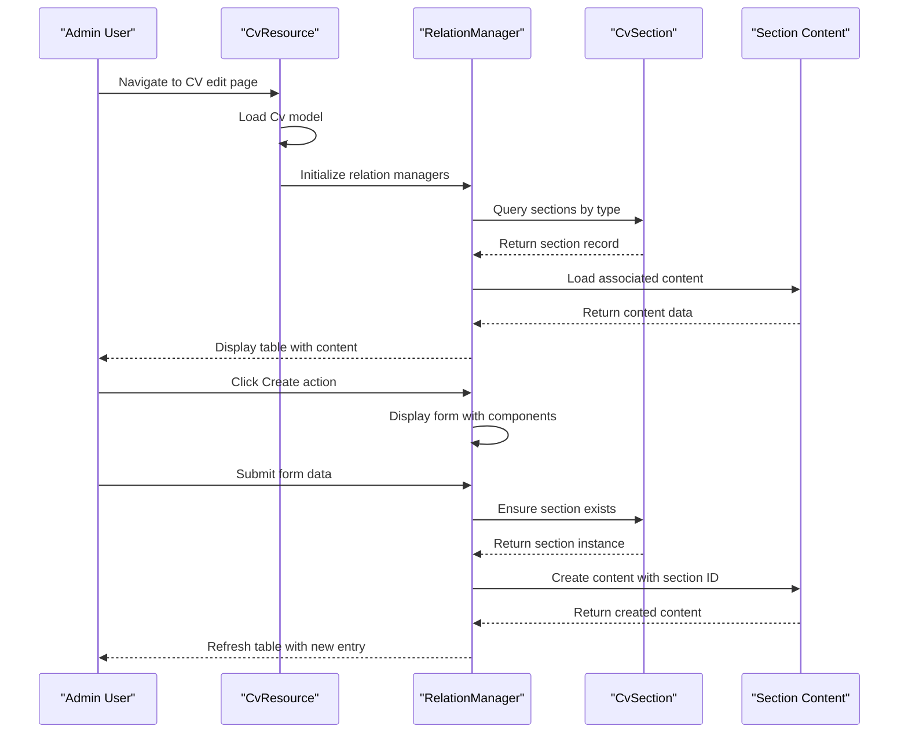
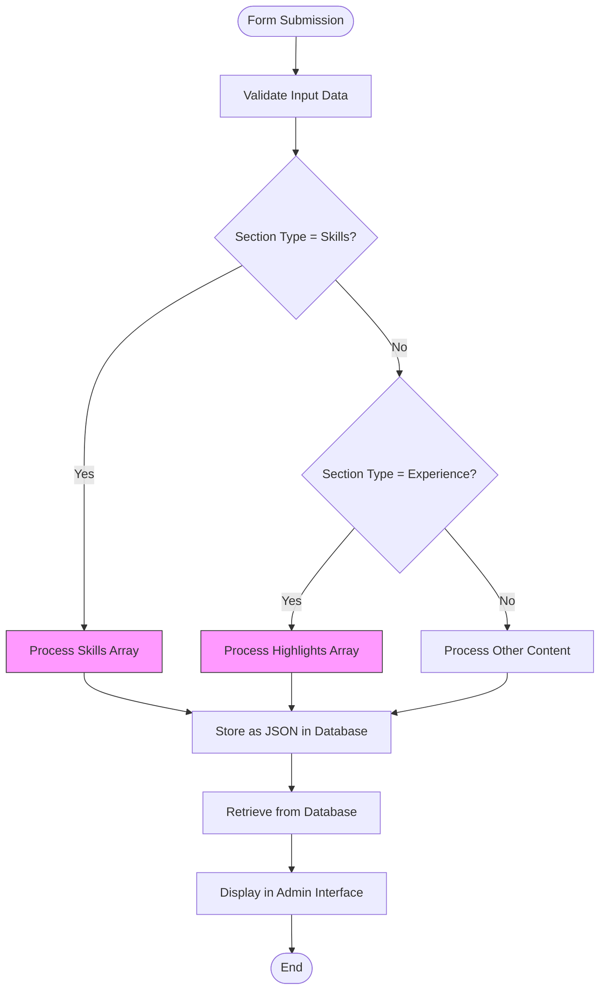

# CV Management

<cite>
**Referenced Files in This Document**   
- [CvResource.php](file://app/Filament/Resources/Cvs/CvResource.php)
- [Cv.php](file://app/Models/Cv.php)
- [CVVersion.php](file://app/Models/CVVersion.php)
- [CvForm.php](file://app/Filament/Resources/Cvs/Schemas/CvForm.php)
- [SummaryRelationManager.php](file://app/Filament/Resources/Cvs/RelationManagers/SummaryRelationManager.php)
- [SkillsRelationManager.php](file://app/Filament/Resources/Cvs/RelationManagers/SkillsRelationManager.php)
- [ExperienceRelationManager.php](file://app/Filament/Resources/Cvs/RelationManagers/ExperienceRelationManager.php)
- [ProjectsRelationManager.php](file://app/Filament/Resources/Cvs/RelationManagers/ProjectsRelationManager.php)
- [EducationRelationManager.php](file://app/Filament/Resources/Cvs/RelationManagers/EducationRelationManager.php)
- [ReferencesRelationManager.php](file://app/Filament/Resources/Cvs/RelationManagers/ReferencesRelationManager.php)
- [CustomSectionsRelationManager.php](file://app/Filament/Resources/Cvs/RelationManagers/CustomSectionsRelationManager.php)
- [HeaderInfoRelationManager.php](file://app/Filament/Resources/Cvs/RelationManagers/HeaderInfoRelationManager.php)
</cite>

## Table of Contents
1. [CV Structure Overview](#cv-structure-overview)
2. [Admin Interface for CV Management](#admin-interface-for-cv-management)
3. [Data Storage and JSON Fields](#data-storage-and-json-fields)
4. [CV Versioning with CVVersion Model](#cv-versioning-with-cvversion-model)
5. [Data Integrity and Best Practices](#data-integrity-and-best-practices)
6. [Extending CV Structure](#extending-cv-structure)

## CV Structure Overview

The CV structure in the cv-builder application is composed of multiple sections including header, summary, skills, experience, projects, education, and references. Each section is managed through dedicated Filament relation managers that provide structured interfaces for content creation and editing. The core Cv model serves as the parent entity that organizes these sections through relationships defined in the model. The header information is stored in a separate CvHeaderInfo model linked via a one-to-one relationship, while other sections use a polymorphic approach through the CvSection model which acts as a container for different section types.



**Diagram sources**
- [Cv.php](file://app/Models/Cv.php#L1-L355)
- [CvHeaderInfo.php](file://app/Models/CvHeaderInfo.php#L1-L50)
- [CvSection.php](file://app/Models/CvSection.php#L1-L40)

**Section sources**
- [Cv.php](file://app/Models/Cv.php#L1-L355)

## Admin Interface for CV Management

The admin interface for CV management is built using Filament PHP, providing a comprehensive set of tools for creating and editing CVs through the CvResource and associated relation managers. The interface allows users to add, edit, and order content within each section through an intuitive table-based layout with reorderable rows. Each relation manager corresponds to a specific section type and provides tailored form components for data entry. The Create and Edit actions within each relation manager handle the underlying model creation and association with the parent CV through the CvSection intermediary. The interface supports rich text input for content fields, date pickers for temporal data, and repeater components for managing lists of items such as experience highlights.



**Diagram sources**
- [CvResource.php](file://app/Filament/Resources/Cvs/CvResource.php#L1-L63)
- [ExperienceRelationManager.php](file://app/Filament/Resources/Cvs/RelationManagers/ExperienceRelationManager.php#L1-L251)

**Section sources**
- [CvResource.php](file://app/Filament/Resources/Cvs/CvResource.php#L1-L63)
- [CvForm.php](file://app/Filament/Resources/Cvs/Schemas/CvForm.php#L1-L113)

## Data Storage and JSON Fields

The application utilizes JSON fields for storing dynamic content such as skills and highlights, allowing for flexible schema design that can accommodate varying amounts of data without requiring database schema changes. The skills are stored as arrays within the CvSkillCategory model, where each category contains a JSON array of skill names. Similarly, experience highlights are stored as JSON arrays in the CvExperience model, enabling multiple achievement statements per position. This approach provides efficient storage and retrieval of variable-length content while maintaining data integrity through application-level validation. The use of JSON fields also facilitates the aggregation of skills and highlights for analysis purposes, as demonstrated in the Cv model's accessor methods that flatten and combine data from multiple sections.



**Diagram sources**
- [SkillsRelationManager.php](file://app/Filament/Resources/Cvs/RelationManagers/SkillsRelationManager.php#L1-L110)
- [ExperienceRelationManager.php](file://app/Filament/Resources/Cvs/RelationManagers/ExperienceRelationManager.php#L1-L251)

**Section sources**
- [Cv.php](file://app/Models/Cv.php#L1-L355)

## CV Versioning with CVVersion Model

The CV versioning system is implemented through the CVVersion model, which creates snapshots of CV content at specific points in time. Each version record contains a JSON representation of the entire CV state, including all sections and their content, along with metadata such as the creation timestamp and reason for versioning. The versioning process is triggered automatically when a CV is cloned, creating a historical record before modifications are made. The CVVersion model uses a database transaction to ensure data consistency during the snapshot creation process, preventing partial or corrupted versions. This approach enables users to track changes over time, revert to previous versions if needed, and maintain an audit trail of CV modifications.

```mermaid
classDiagram
class CVVersion {
+int cv_id
+array snapshot_json
+string reason
+datetime created_at
}
class Cv {
+hasMany versions()
+cloneCv()
}
CVVersion --> Cv : belongsTo
Cv --> CVVersion : hasMany
note right of CVVersion
Stores complete CV state
as JSON snapshot
Created during cloning
Immutable after creation
end note
```

**Diagram sources**
- [CVVersion.php](file://app/Models/CVVersion.php#L1-L40)
- [Cv.php](file://app/Models/Cv.php#L1-L355)

**Section sources**
- [CVVersion.php](file://app/Models/CVVersion.php#L1-L40)
- [Cv.php](file://app/Models/Cv.php#L250-L350)

## Data Integrity and Best Practices

Maintaining data integrity during CV edits is ensured through several mechanisms including database transactions, model events, and relationship constraints. The cloneCv method in the Cv model uses a database transaction to wrap the version creation and cloning process, ensuring that either both operations succeed or both fail. Soft deletes are implemented on the Cv model to prevent accidental data loss, allowing for recovery of deleted records. When editing CV content, the application maintains referential integrity by ensuring that section records exist before associating content with them. Best practices for organizing CV content include maintaining consistent ordering through the display_order field, using descriptive titles for CV versions, and regularly creating version snapshots before making significant changes. The application also enforces data validation through Filament form components, preventing invalid data from being saved to the database.

**Section sources**
- [Cv.php](file://app/Models/Cv.php#L250-L350)
- [CvResource.php](file://app/Filament/Resources/Cvs/CvResource.php#L1-L63)

## Extending CV Structure

Extending the CV structure with new section types can be achieved by creating additional relation managers and corresponding database tables. The existing architecture supports custom sections through the CustomSectionsRelationManager, which follows the same pattern as other section types. To add a new section type, developers should create a new migration for the content table, define a model class, and implement a relation manager that extends the base RelationManager class. The relation manager should override the getTableQuery method to ensure the proper CvSection record exists for the new section type. Form components within the relation manager should be configured to match the data requirements of the new section, and the display order should be set appropriately to control the section's position in the CV. The modular design of the system allows new section types to be added without modifying existing code, following the open/closed principle.

**Section sources**
- [CustomSectionsRelationManager.php](file://app/Filament/Resources/Cvs/RelationManagers/CustomSectionsRelationManager.php#L1-L60)
- [Cv.php](file://app/Models/Cv.php#L1-L355)