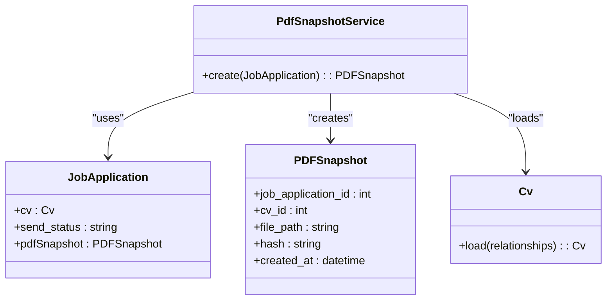
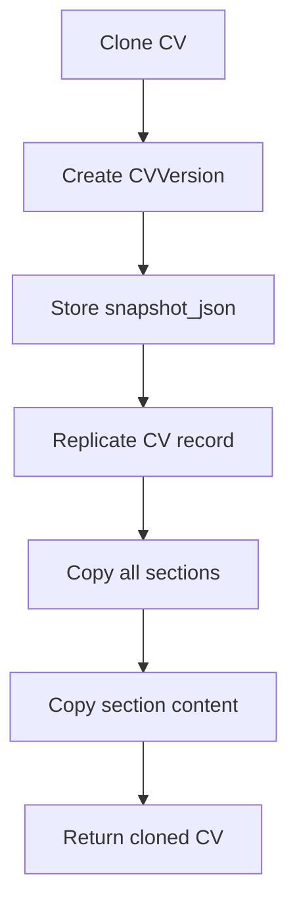
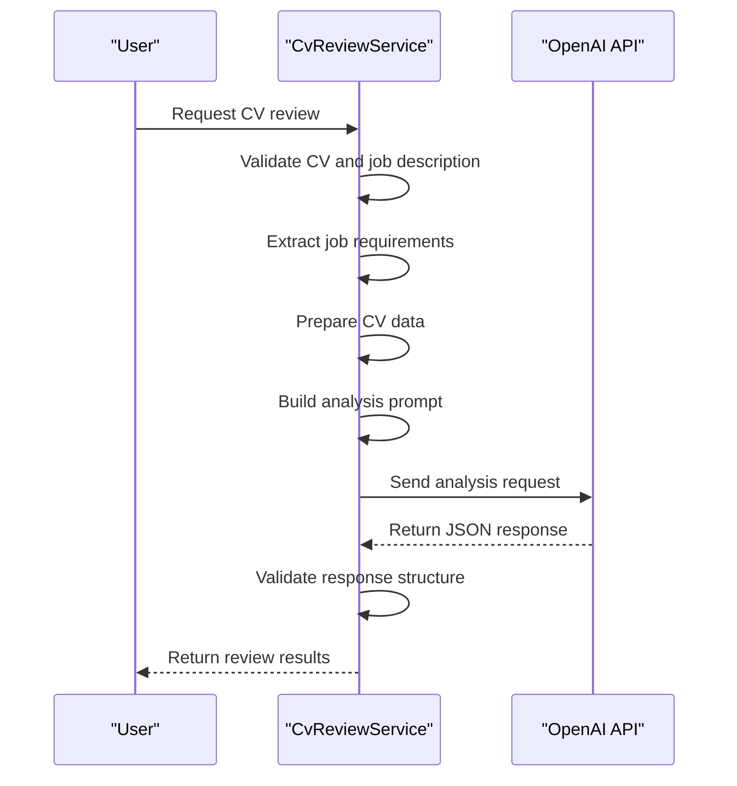
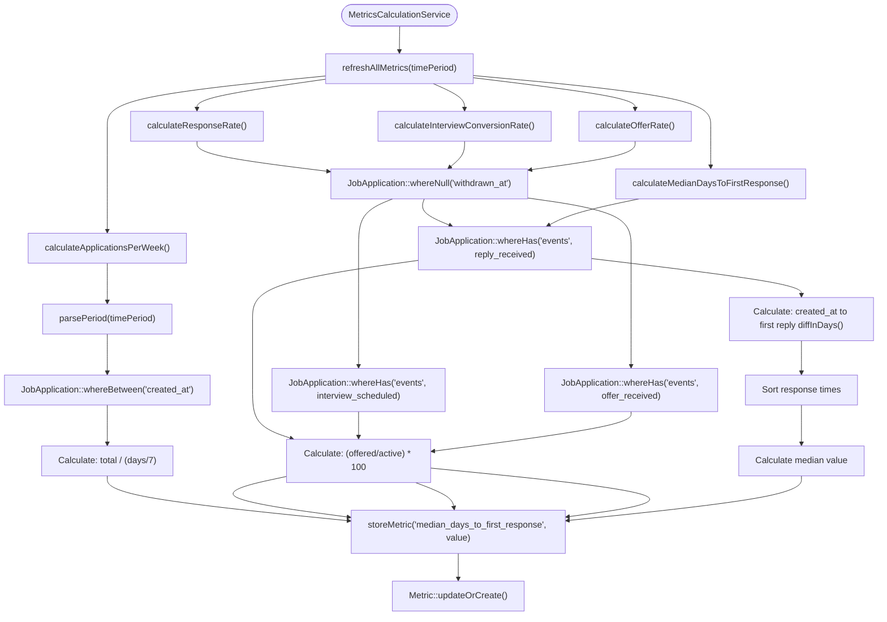
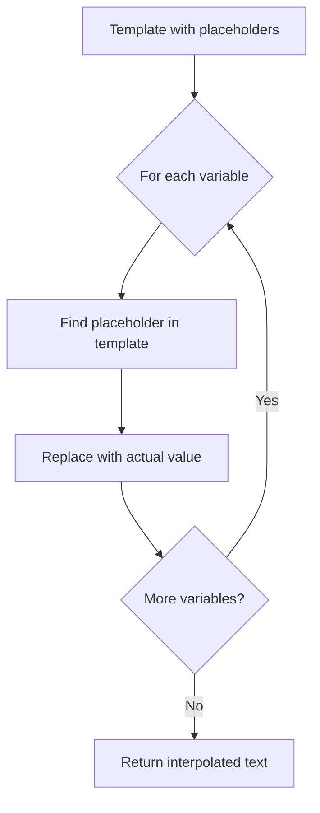

# Core Concepts

<cite>
**Referenced Files in This Document**   
- [Cv.php](file://app/Models/Cv.php)
- [JobApplication.php](file://app/Models/JobApplication.php)
- [PDFSnapshot.php](file://app/Models/PDFSnapshot.php)
- [SectionFocusProfile.php](file://app/Models/SectionFocusProfile.php)
- [CVVersion.php](file://app/Models/CVVersion.php)
- [CvReviewService.php](file://app/Services/CvReviewService.php)
- [MetricsCalculationService.php](file://app/Services/MetricsCalculationService.php)
- [CoverLetterService.php](file://app/Services/CoverLetterService.php)
- [PdfSnapshotService.php](file://app/Services/PdfSnapshotService.php)
- [create_cv_versions_table.php](file://database/migrations/2025_10_04_002612_create_cv_versions_table.php)
</cite>

## Table of Contents
1. [Introduction](#introduction)
2. [Key Entities](#key-entities)
3. [CV Versioning System](#cv-versioning-system)
4. [Non-Destructive Tailoring with Section Focus Profiles](#non-destructive-tailoring-with-section-focus-profiles)
5. [AI-Powered CV Review Process](#ai-powered-cv-review-process)
6. [Metrics Calculation and Performance Tracking](#metrics-calculation-and-performance-tracking)
7. [Cover Letter Generation](#cover-letter-generation)
8. [Practical Integration Example](#practical-integration-example)

## Introduction
The cv-builder application is designed to streamline the job application process through structured data management, intelligent analysis, and performance tracking. This document explains the core concepts that form the foundation of the system, focusing on key entities, versioning mechanisms, AI-powered review processes, and performance metrics. The system enables users to create multiple CVs, track job applications, generate tailored documents, and optimize their job search through data-driven insights. By understanding these fundamental concepts, both beginners and developers can effectively utilize and extend the application's capabilities.

## Key Entities
The cv-builder application revolves around several key entities that represent the core components of the job application process. These entities work together to create a comprehensive system for managing CVs, job applications, and related artifacts.

### CV
The CV entity represents a curriculum vitae or resume within the system. It serves as the primary container for all professional information, including work experience, education, skills, and other relevant sections. The CV model provides methods for cloning, versioning, and retrieving content in formats suitable for analysis. It also supports relationships with job applications, PDF snapshots, and section focus profiles, enabling tailored presentations for different roles.

**Section sources**
- [Cv.php](file://app/Models/Cv.php#L10-L354)

### JobApplication
The JobApplication entity tracks the lifecycle of a job application from creation to final outcome. It contains fields for company information, job details, application status, and next actions. The model includes a scope method for identifying applications that need attention, helping users prioritize their follow-up activities. It also stores AI review data and maintains relationships with CVs, PDF snapshots, and cover letters.

**Section sources**
- [JobApplication.php](file://app/Models/JobApplication.php#L10-L122)

### PDFSnapshot
The PDFSnapshot entity captures a permanent record of a CV at the time of application submission. It stores the file path, cryptographic hash, and metadata about the generated PDF. This ensures that the exact version of the CV sent to an employer can be retrieved and verified at any time. The snapshot is created automatically when an application is marked as sent, providing a verifiable audit trail.

**Diagram sources**
- [PdfSnapshotService.php](file://app/Services/PdfSnapshotService.php)
- [JobApplication.php](file://app/Models/JobApplication.php)
- [PDFSnapshot.php](file://app/Models/PDFSnapshot.php)
- [Cv.php](file://app/Models/Cv.php)

**Section sources**
- [PDFSnapshot.php](file://app/Models/PDFSnapshot.php#L10-L44)

### SectionFocusProfile
The SectionFocusProfile entity enables non-destructive tailoring of CVs for specific job applications. It defines which sections to include and their display order without modifying the original CV content. This allows users to create multiple tailored versions of their CV for different roles while maintaining a single source of truth for their professional information.

**Section sources**
- [SectionFocusProfile.php](file://app/Models/SectionFocusProfile.php#L10-L29)

## CV Versioning System
The CV versioning system provides a mechanism for tracking changes to CVs over time and creating snapshots before significant modifications. This ensures that previous versions can be recovered and provides a historical record of CV evolution.

### Version Creation Process
The versioning system creates snapshots through the `cloneCv()` method in the Cv model. When a user clones a CV, the system automatically creates a version record containing a JSON representation of the current CV state. This snapshot includes all sections, content, and relationships, providing a complete backup before any modifications are made.

**Diagram sources**
- [Cv.php](file://app/Models/Cv.php#L287-L354)
- [create_cv_versions_table.php](file://database/migrations/2025_10_04_002612_create_cv_versions_table.php#L1-L32)

**Section sources**
- [CVVersion.php](file://app/Models/CVVersion.php#L10-L39)

### Version Data Structure
The CVVersion model stores a complete snapshot of the CV in the `snapshot_json` field, preserving the state at the time of cloning. The model includes a reason field to document why the version was created and a created_at timestamp for chronological tracking. The relationship with the parent CV allows for easy retrieval of version history.

## Non-Destructive Tailoring with Section Focus Profiles
Section Focus Profiles enable users to create tailored CV presentations without modifying the original content. This approach allows for role-specific optimization while maintaining data integrity.

### Profile Configuration
A SectionFocusProfile contains two key arrays: `included_section_ids` and `section_order`. The first determines which sections appear in the tailored CV, while the second controls their display sequence. This configuration is applied at render time, leaving the original CV data unchanged.

### Application Process
When generating a tailored CV, the system retrieves the appropriate profile and applies its configuration to the base CV. The `getSectionsWithProfile()` method filters sections based on the included IDs and reorders them according to the specified sequence. This dynamic assembly ensures that each job application can have a uniquely optimized presentation.

**Section sources**
- [SectionFocusProfile.php](file://app/Models/SectionFocusProfile.php#L10-L29)
- [Cv.php](file://app/Models/Cv.php#L255-L285)

## AI-Powered CV Review Process
The AI-powered review process analyzes CVs against specific job descriptions to provide actionable optimization suggestions. This system leverages OpenAI to deliver insights that help users improve their application materials.

### Review Workflow
The CvReviewService orchestrates the review process through several key methods:
- `analyzeForJob()`: Main entry point that validates inputs and coordinates the analysis
- `extractJobRequirements()`: Uses OpenAI to parse job descriptions and identify key requirements
- `buildAnalysisPrompt()`: Constructs the prompt with system instructions and context
- `calculateMatchScore()`: Computes an overall alignment score based on skills, experience, and keywords

**Diagram sources**
- [CvReviewService.php](file://app/Services/CvReviewService.php#L10-L225)

**Section sources**
- [CvReviewService.php](file://app/Services/CvReviewService.php#L10-L225)
- [JobApplication.php](file://app/Models/JobApplication.php#L100-L115)

### Review Outputs
The review process generates several types of actionable insights:
- **Match Score**: Quantified alignment (0-100) with job requirements
- **Skill Gaps**: Missing or underrepresented competencies from the job description
- **Section Recommendations**: Suggested reordering of CV sections based on job focus
- **Bullet Improvements**: Specific suggestions for enhancing achievement statements
- **Language Suggestions**: Text replacements to improve alignment with job terminology
- **Action Checklist**: Prioritized tasks to improve the CV before submission

## Metrics Calculation and Performance Tracking
The metrics system provides quantitative insights into job search performance, helping users track their progress and identify areas for improvement.

### Metrics Calculation Service
The MetricsCalculationService computes five key performance indicators:
- Applications per week
- Response rate
- Interview conversion rate
- Offer rate
- Median days to first response

**Diagram sources**
- [MetricsCalculationService.php](file://app/Services/MetricsCalculationService.php#L7-L169)
- [MetricsCalculationTest.php](file://tests/Feature/MetricsCalculationTest.php#L10-L204)

**Section sources**
- [MetricsCalculationService.php](file://app/Services/MetricsCalculationService.php#L7-L169)

### Calculation Logic
Each metric follows a consistent pattern:
1. Parse the time period parameter (e.g., '30d' for 30 days)
2. Query relevant job application data within the time period
3. Apply business rules (e.g., excluding withdrawn applications)
4. Perform the specific calculation using appropriate formulas
5. Store the result in the metrics table

The system handles edge cases gracefully, returning 0 for metrics when no data is available rather than throwing exceptions.

## Cover Letter Generation
The cover letter system enables users to create personalized letters using templates with variable interpolation, ensuring consistency while allowing for role-specific customization.

### Template Interpolation
The CoverLetterService handles variable replacement in templates through the `interpolate()` method. Templates contain placeholders in the format `{{variable_name}}` which are replaced with actual values from the job application context.

**Diagram sources**
- [CoverLetterService.php](file://app/Services/CoverLetterService.php#L10-L25)

**Section sources**
- [CoverLetterService.php](file://app/Services/CoverLetterService.php#L10-L25)

### Variable Context
Common variables used in templates include:
- `company_name`: Target company name
- `role_title`: Job title being applied for
- `value_prop`: Key value proposition or relevant experience
- `recent_win`: Recent achievement relevant to the role

The interpolation process preserves placeholders that don't have corresponding values, allowing users to identify missing information.

## Practical Integration Example
The following example demonstrates how these concepts work together in a typical user workflow:

1. A user creates a base CV with their complete professional history
2. When applying for a frontend developer role, they create a SectionFocusProfile that prioritizes projects and skills sections
3. They add the job description to the JobApplication record
4. Before submission, they request an AI review which analyzes their CV against the job requirements
5. The CvReviewService returns suggestions for improving alignment, including reordering sections and enhancing bullet points
6. The user implements the recommendations and generates a PDF snapshot when marking the application as sent
7. The PdfSnapshotService creates a permanent record of the submitted CV
8. Over time, the MetricsCalculationService tracks the application's performance, contributing to overall job search metrics

This integrated approach ensures that each application is optimized, documented, and contributes to continuous improvement through data-driven insights.