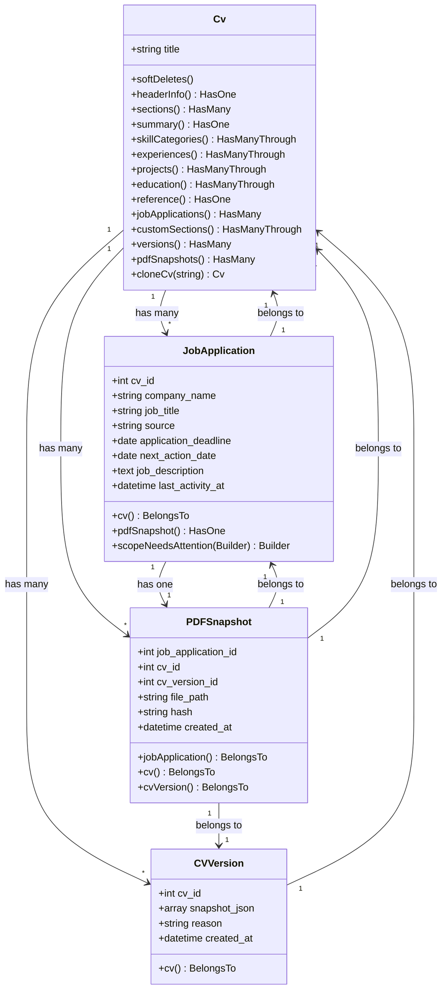
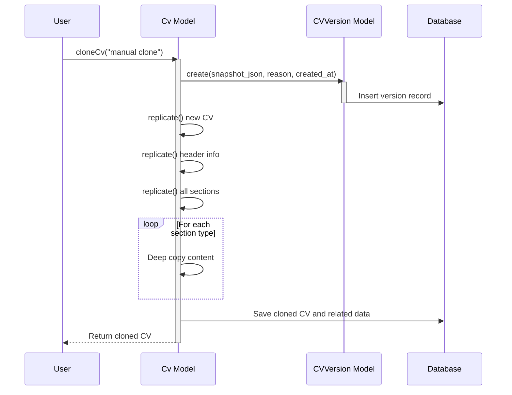
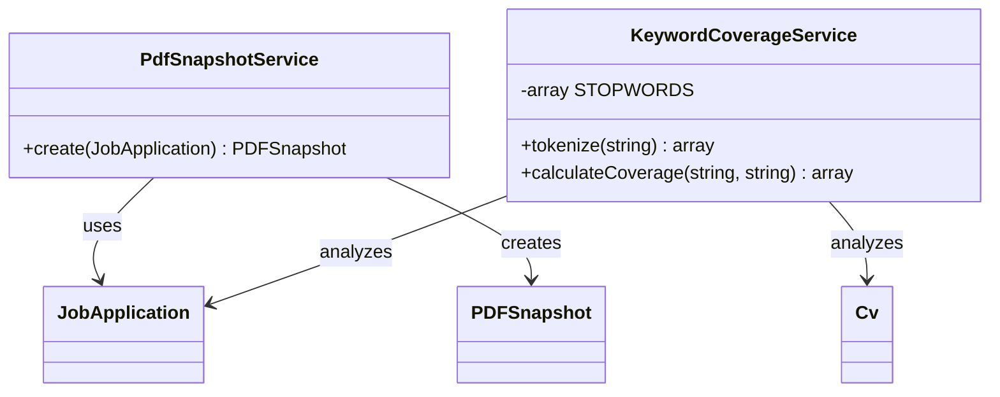
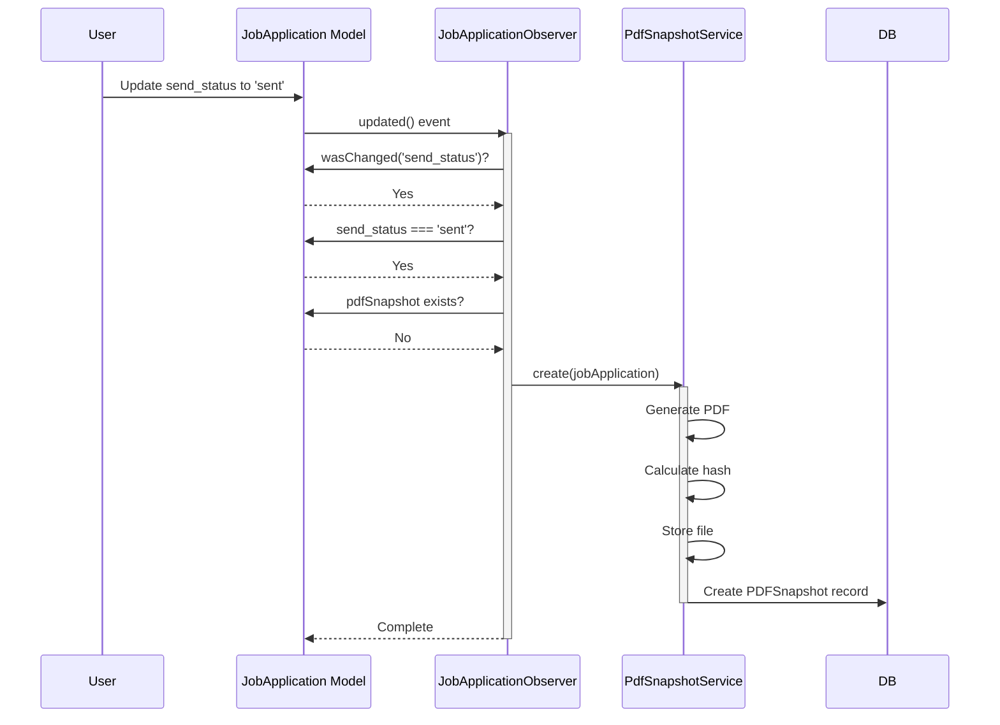

# Core Concepts

<cite>
**Referenced Files in This Document**   
- [Cv.php](file://app/Models/Cv.php)
- [CVVersion.php](file://app/Models/CVVersion.php)
- [JobApplication.php](file://app/Models/JobApplication.php)
- [PDFSnapshot.php](file://app/Models/PDFSnapshot.php)
- [PdfSnapshotService.php](file://app/Services/PdfSnapshotService.php)
- [KeywordCoverageService.php](file://app/Services/KeywordCoverageService.php)
- [JobApplicationObserver.php](file://app/Observers/JobApplicationObserver.php)
- [add_soft_deletes_to_cvs.php](file://database/migrations/2025_10_04_002505_add_soft_deletes_to_cvs.php)
- [create_cv_versions_table.php](file://database/migrations/2025_10_04_002612_create_cv_versions_table.php)
- [create_pdf_snapshots_table.php](file://database/migrations/2025_10_04_002642_create_pdf_snapshots_table.php)
- [extend_job_applications_table.php](file://database/migrations/2025_10_04_002540_extend_job_applications_table.php)
</cite>

## Table of Contents
1. [Key Entities](#key-entities)
2. [Model Relationships](#model-relationships)
3. [CV Lifecycle and Versioning](#cv-lifecycle-and-versioning)
4. [Service Classes](#service-classes)
5. [Soft Deletes and Data Integrity](#soft-deletes-and-data-integrity)
6. [Model Observers](#model-observers)

## Key Entities

The CV Builder application is built around four core entities that represent the fundamental data structures used to manage job applications and professional profiles.

**CV** represents a complete curriculum vitae document containing professional information organized into sections such as experience, education, skills, and summary. Each CV has a title and contains multiple sections that can be reordered and customized. The CV serves as the primary container for all professional information that can be tailored for specific job applications.

**CVVersion** represents a historical snapshot of a CV at a specific point in time. It captures the complete state of a CV as JSON data along with metadata including the creation timestamp and reason for versioning. This entity enables users to track the evolution of their CV over time and maintain historical records of previous versions.

**JobApplication** represents a tracked job application with comprehensive metadata including company information, application status, deadlines, follow-up dates, and the full job description. It establishes the connection between a CV and a specific job opportunity, allowing users to manage their application pipeline with detailed tracking capabilities.

**PDFSnapshot** represents a generated PDF version of a CV that was submitted for a specific job application. It stores the file path, SHA-256 hash for integrity verification, and creation timestamp, providing an immutable record of exactly what was sent to an employer.

**Section sources**
- [Cv.php](file://app/Models/Cv.php#L7-L221)
- [CVVersion.php](file://app/Models/CVVersion.php#L7-L30)
- [JobApplication.php](file://app/Models/JobApplication.php#L7-L66)
- [PDFSnapshot.php](file://app/Models/PDFSnapshot.php#L7-L44)

## Model Relationships

The core models in the CV Builder application are interconnected through well-defined Eloquent relationships that establish the data structure and enable efficient querying.

**Diagram sources**
- [Cv.php](file://app/Models/Cv.php#L7-L221)
- [CVVersion.php](file://app/Models/CVVersion.php#L7-L30)
- [JobApplication.php](file://app/Models/JobApplication.php#L7-L66)
- [PDFSnapshot.php](file://app/Models/PDFSnapshot.php#L7-L44)

**Section sources**
- [Cv.php](file://app/Models/Cv.php#L7-L221)
- [CVVersion.php](file://app/Models/CVVersion.php#L7-L30)
- [JobApplication.php](file://app/Models/JobApplication.php#L7-L66)
- [PDFSnapshot.php](file://app/Models/PDFSnapshot.php#L7-L44)

## CV Lifecycle and Versioning

The CV lifecycle in the application follows a comprehensive flow from creation through modification, cloning, and versioning. When a user creates a new CV, it becomes a container for professional information that can be continuously refined.

The `cloneCv` method in the Cv model implements a deep cloning mechanism that creates a complete copy of a CV including all sections and their content. This process occurs within a database transaction to ensure data integrity. Before creating the clone, the system automatically creates a CVVersion record that captures the current state of the original CV as a JSON snapshot. This versioning approach allows users to maintain historical records of their CV at different points in time, which is particularly valuable when experimenting with different formats or content for various job applications.

**Diagram sources**
- [Cv.php](file://app/Models/Cv.php#L150-L221)
- [CVVersion.php](file://app/Models/CVVersion.php#L7-L30)

**Section sources**
- [Cv.php](file://app/Models/Cv.php#L150-L221)
- [CVVersion.php](file://app/Models/CVVersion.php#L7-L30)

## Service Classes

The application utilizes specialized service classes to encapsulate business logic and complex operations related to CV management and analysis.

**PdfSnapshotService** handles the generation and storage of PDF versions of CVs for job applications. The service generates a PDF using the Spatie Laravel-PDF package, calculates a SHA-256 hash of the content for integrity verification, stores the file on the local filesystem, and creates a corresponding PDFSnapshot record in the database. This ensures that each submitted application has an immutable record of exactly what was sent to the employer.

**KeywordCoverageService** analyzes the alignment between a job description and CV content by tokenizing both texts, removing stopwords, and comparing keyword coverage. The service calculates a percentage score representing how well the CV content matches the keywords in the job description and identifies the top 20 missing keywords that could improve alignment. This helps users tailor their CVs to specific job requirements.

**Diagram sources**
- [PdfSnapshotService.php](file://app/Services/PdfSnapshotService.php#L9-L64)
- [KeywordCoverageService.php](file://app/Services/KeywordCoverageService.php#L4-L56)

**Section sources**
- [PdfSnapshotService.php](file://app/Services/PdfSnapshotService.php#L9-L64)
- [KeywordCoverageService.php](file://app/Services/KeywordCoverageService.php#L4-L56)

## Soft Deletes and Data Integrity

The application implements soft deletes on CVs to preserve data integrity and maintain historical records. The `add_soft_deletes_to_cvs.php` migration adds a `deleted_at` timestamp column to the cvs table and creates an index for efficient querying. When a CV is deleted, the `SoftDeletes` trait in the Cv model sets the `deleted_at` timestamp instead of removing the record from the database.

This approach ensures that all related data, including job applications, PDF snapshots, and version history, remains intact even after a CV is "deleted" from the user interface. Users can restore soft-deleted CVs if needed, and the system maintains a complete audit trail of all CV-related activities. This is particularly important for preserving the historical context of job applications, as deleting a CV would otherwise break the connection between applications and the CV versions that were submitted.

**Section sources**
- [Cv.php](file://app/Models/Cv.php#L7-L221)
- [add_soft_deletes_to_cvs.php](file://database/migrations/2025_10_04_002505_add_soft_deletes_to_cvs.php#L7-L30)

## Model Observers

The application uses Eloquent model observers to automatically trigger actions in response to model events, implementing event-driven behavior without cluttering the model classes.

**JobApplicationObserver** listens for events on the JobApplication model and performs automated actions. The `updating` method automatically updates the `last_activity_at` timestamp whenever a job application is modified, providing an accurate record of the most recent activity. The `updated` method checks if the `send_status` has changed to 'sent' and, if so, triggers the creation of a PDF snapshot through the PdfSnapshotService. This ensures that an immutable record is automatically created when a CV is officially submitted for a job application.

**Diagram sources**
- [JobApplicationObserver.php](file://app/Observers/JobApplicationObserver.php#L7-L41)
- [PdfSnapshotService.php](file://app/Services/PdfSnapshotService.php#L9-L64)

**Section sources**
- [JobApplicationObserver.php](file://app/Observers/JobApplicationObserver.php#L7-L41)