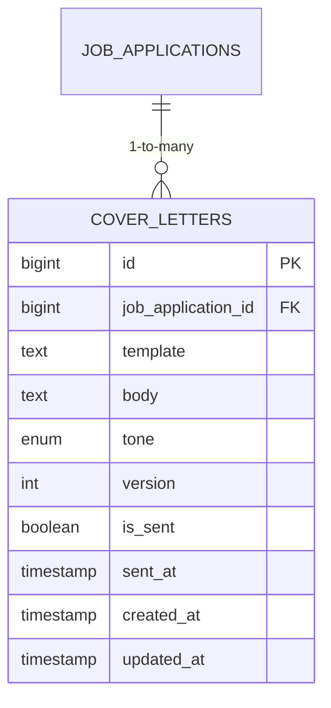
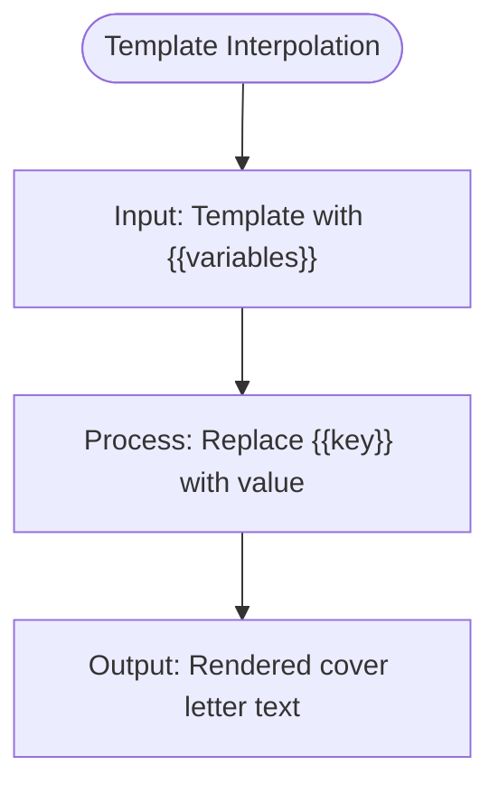
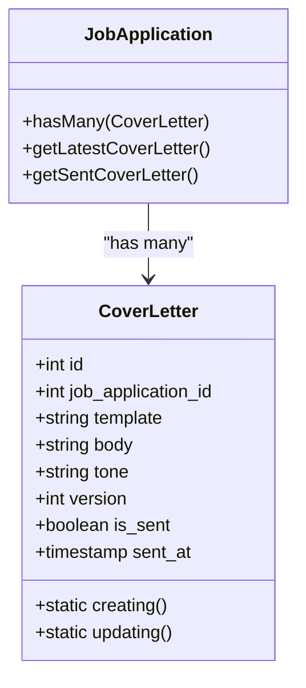
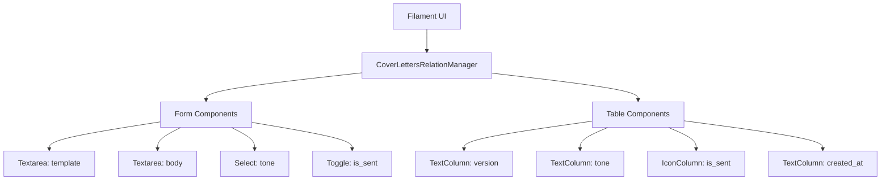
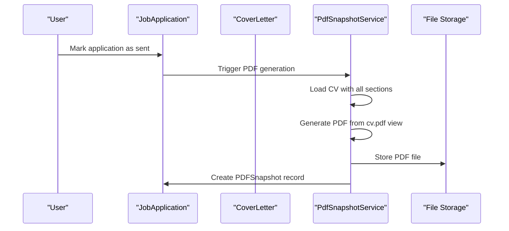

# Cover Letter Management

<cite>
**Referenced Files in This Document**   
- [CoverLetterService.php](file://app/Services/CoverLetterService.php)
- [CoverLetter.php](file://app/Models/CoverLetter.php)
- [JobApplication.php](file://app/Models/JobApplication.php)
- [CoverLettersRelationManager.php](file://app/Filament/Resources/JobApplications/RelationManagers/CoverLettersRelationManager.php)
- [create_cover_letters_table.php](file://database/migrations/2025_10_04_101841_create_cover_letters_table.php)
- [PdfSnapshotService.php](file://app/Services/PdfSnapshotService.php)
</cite>

## Table of Contents
1. [Introduction](#introduction)
2. [CoverLetter Model and Database Structure](#coverletter-model-and-database-structure)
3. [CoverLetterService and Template Interpolation](#coverletterservice-and-template-interpolation)
4. [Template System and Variable Substitution](#template-system-and-variable-substitution)
5. [Versioning System for Cover Letters](#versioning-system-for-cover-letters)
6. [Filament Interface and CoverLettersRelationManager](#filament-interface-and-coverlettersrelationmanager)
7. [PDF Snapshot Integration](#pdf-snapshot-integration)
8. [Best Practices and Troubleshooting](#best-practices-and-troubleshooting)

## Introduction
The cover letter management system in the cv-builder application enables users to create, manage, and track cover letters for job applications through a template-based system with dynamic variable interpolation. This system supports A/B testing of different letter versions, tone tracking, and immutable records of sent applications. The implementation centers around the CoverLetter model, CoverLetterService for template processing, and integration with the Filament admin interface through the CoverLettersRelationManager. Cover letters are linked to PDF snapshots when applications are submitted, creating a permanent record of what was sent to employers.

## CoverLetter Model and Database Structure

The CoverLetter model represents individual cover letters associated with job applications. Each cover letter stores both the original template with variables and the final rendered body after interpolation.



**Diagram sources**
- [CoverLetter.php](file://app/Models/CoverLetter.php)
- [create_cover_letters_table.php](file://database/migrations/2025_10_04_101841_create_cover_letters_table.php)

**Section sources**
- [CoverLetter.php](file://app/Models/CoverLetter.php)
- [create_cover_letters_table.php](file://database/migrations/2025_10_04_101841_create_cover_letters_table.php)

### Field Definitions
| Field | Type | Description |
|-------|------|-------------|
| `id` | bigint | Primary key |
| `job_application_id` | bigint | Foreign key to job_applications table |
| `template` | text | Original template with {{variables}} placeholders |
| `body` | text | Rendered final text after variable interpolation |
| `tone` | enum | One of: formal, casual, enthusiastic, technical, leadership |
| `version` | int | Auto-incrementing version number per application |
| `is_sent` | boolean | Whether this version was sent to employer |
| `sent_at` | timestamp | Timestamp when letter was marked as sent |

The model includes business logic in its boot method to auto-increment the version number based on existing letters for the same job application and prevent updates to sent cover letters.

## CoverLetterService and Template Interpolation

The CoverLetterService provides the core functionality for processing cover letter templates through variable interpolation.



**Diagram sources**
- [CoverLetterService.php](file://app/Services/CoverLetterService.php)

**Section sources**
- [CoverLetterService.php](file://app/Services/CoverLetterService.php)
- [CoverLetterServiceTest.php](file://tests/Unit/CoverLetterServiceTest.php)

### interpolate Method
The service provides a single public method for template processing:

```php
public function interpolate(string $template, array $variables): string
```

This method takes a template string containing `{{variable}}` placeholders and an array of key-value pairs, replacing each placeholder with its corresponding value. The implementation uses simple string replacement rather than regex for performance and security reasons.

### Interpolation Logic
The interpolation process follows these rules:
- Variables are formatted as `{{variable_name}}` using double curly braces
- The method iterates through each key-value pair in the variables array
- Each placeholder is replaced with its corresponding value
- Missing variables are preserved as placeholders for debugging purposes
- The process is case-sensitive for variable names

Performance testing confirms that interpolation completes in under 200ms even for complex templates with multiple variables.

## Template System and Variable Substitution

The template system enables users to create reusable cover letter templates with dynamic fields that auto-populate from application data and user inputs.

### Template Syntax
Templates use a simple mustache-style syntax with double curly braces:

```
Dear Hiring Manager at {{company_name}},

I am excited to apply for the {{role_title}} position. {{value_prop}}.

Recently, {{recent_win}}. I believe this experience makes me an ideal candidate.

Best regards,
```

### Common Variables
The system supports several common variables that can be used in templates:

| Variable | Source | Description |
|----------|--------|-------------|
| `{{company_name}}` | JobApplication | Name of the company |
| `{{role_title}}` | JobApplication | Position being applied for |
| `{{value_prop}}` | User input | User's value proposition |
| `{{recent_win}}` | User input | Recent professional achievement |
| `{{key_requirement}}` | User input | Specific job requirement |
| `{{relevant_experience}}` | User input | Experience matching requirements |

### Advanced Template Example
```text
Dear {{hiring_manager_name}},

{{opening_hook}}

I am writing to express my interest in the {{role_title}} position at {{company_name}}.
{{value_prop}}.

Why {{company_name}}?
{{why_company}}

Recent Achievement:
{{recent_win}}

Relevant Experience:
{{relevant_experience}}

I noticed your job posting emphasizes:
1. {{requirement_1}} - {{how_i_match_1}}
2. {{requirement_2}} - {{how_i_match_2}}
3. {{requirement_3}} - {{how_i_match_3}}

{{closing_statement}}

{{signature}}
```

## Versioning System for Cover Letters

The system implements a comprehensive versioning system that tracks different iterations of cover letters for the same job application, enabling A/B testing and historical tracking.



**Diagram sources**
- [CoverLetter.php](file://app/Models/CoverLetter.php)
- [JobApplication.php](file://app/Models/JobApplication.php)

**Section sources**
- [CoverLetter.php](file://app/Models/CoverLetter.php)
- [JobApplication.php](file://app/Models/JobApplication.php)

### Version Auto-Increment
When a new cover letter is created for a job application, the version number is automatically incremented:

```php
static::creating(function ($coverLetter) {
    $maxVersion = static::where('job_application_id', $coverLetter->job_application_id)
        ->max('version');
    $coverLetter->version = ($maxVersion ?? 0) + 1;
});
```

This ensures sequential versioning (1, 2, 3, etc.) for all letters associated with the same job application.

### A/B Testing Workflow
The versioning system supports A/B testing of different cover letter approaches:

1. Create Version 1 with formal tone
2. Create Version 2 with enthusiastic tone
3. Compare both versions
4. Select the preferred version and mark it as sent

Integration tests verify that multiple versions can coexist with different states (draft vs. sent).

### Sent Letter Immutability
Once a cover letter is marked as sent, it becomes immutable to prevent accidental changes:

```php
static::updating(function ($coverLetter) {
    if ($coverLetter->getOriginal('is_sent') === true) {
        throw new \Exception('Cannot update a sent cover letter');
    }
});
```

This business rule ensures the integrity of the historical record of what was actually sent to employers.

## Filament Interface and CoverLettersRelationManager

The CoverLettersRelationManager integrates cover letter management into the Filament admin interface, providing a user-friendly experience for creating and managing cover letters.



**Diagram sources**
- [CoverLettersRelationManager.php](file://app/Filament/Resources/JobApplications/RelationManagers/CoverLettersRelationManager.php)

**Section sources**
- [CoverLettersRelationManager.php](file://app/Filament/Resources/JobApplications/RelationManagers/CoverLettersRelationManager.php)

### Form Configuration
The relation manager configures a form with the following components:
- **Template**: Textarea for entering the template with variables
- **Body**: Readonly textarea showing the rendered output
- **Tone**: Select field with predefined options (formal, casual, enthusiastic, technical, leadership)
- **Mark as sent**: Toggle to indicate the letter has been sent

### Table Configuration
The cover letters are displayed in a table with these columns:
- **Version**: Sortable text column showing the version number
- **Tone**: Badge column with colored indicators for each tone
- **Sent**: Icon column showing checkmark for sent letters
- **Created at**: DateTime column showing creation timestamp

### Actions
The interface provides several actions:
- **Create**: Add a new cover letter version
- **Edit**: Modify a draft cover letter (disabled for sent letters)
- **Delete**: Remove a draft cover letter (disabled for sent letters)
- **Mark as sent**: Transition a letter to sent status

The edit and delete actions are conditionally disabled when `is_sent` is true, enforcing the immutability of sent letters.

## PDF Snapshot Integration

Cover letters are linked to PDF snapshots when job applications are sent, creating a permanent record of the application materials.



**Diagram sources**
- [PdfSnapshotService.php](file://app/Services/PdfSnapshotService.php)
- [JobApplication.php](file://app/Models/JobApplication.php)

**Section sources**
- [PdfSnapshotService.php](file://app/Services/PdfSnapshotService.php)
- [PdfSnapshotCreationTest.php](file://tests/Feature/PdfSnapshotCreationTest.php)

### Snapshot Creation Process
When a job application's send status changes to "sent":
1. The system verifies the application has an associated CV
2. The CV is loaded with all related sections and data
3. A PDF is generated using the cv.pdf Blade view
4. The PDF content is validated for size (max 10MB)
5. A SHA-256 hash is calculated from the PDF content
6. The PDF is stored with a filename containing the job application ID and hash
7. A PDFSnapshot record is created linking to the job application and CV

### Immutable Snapshots
PDF snapshots are immutable records that cannot be modified once created:
- The hash ensures content integrity
- Changing the send status back to draft does not create a new snapshot
- Multiple transitions to "sent" status do not generate duplicate snapshots
- The original file path and hash are preserved permanently

This creates a reliable audit trail of exactly what was sent for each job application.

## Best Practices and Troubleshooting

### Template Creation Best Practices
- Use consistent variable naming conventions
- Include helper text in templates to guide users on what to include
- Create templates for different tones to enable easy A/B testing
- Use a modular structure with sections for opening, body, and closing
- Test templates with realistic data before reuse

### Troubleshooting Variable Substitution
**Issue**: Variables aren't being replaced in the output

**Solutions**:
1. Verify variables use double curly braces: `{{variable}}` not `{variable}`
2. Check that variable names match exactly (case-sensitive)
3. Ensure all required variables are provided in the variables array
4. Confirm the template text doesn't have hidden characters or encoding issues

```php
// Correct usage
$variables = ['company_name' => 'Acme Corp'];
$template = 'Dear {{company_name}}'; // Results in "Dear Acme Corp"
```

### Handling Sent Letters
**Issue**: Cannot edit a sent cover letter

**This is intentional** - sent letters are immutable to maintain an accurate record of what was submitted. Solutions include:
1. Create a new version with the desired changes
2. Copy the template from the sent letter and update variables
3. Only mark letters as sent when you have actually submitted them

### Performance Considerations
The interpolation system is optimized for performance:
- Simple string replacement rather than regex processing
- Average processing time under 200ms
- Caching not required due to fast execution
- No external dependencies for template processing

The system handles complex templates with multiple variable occurrences efficiently, making it suitable for high-volume use.