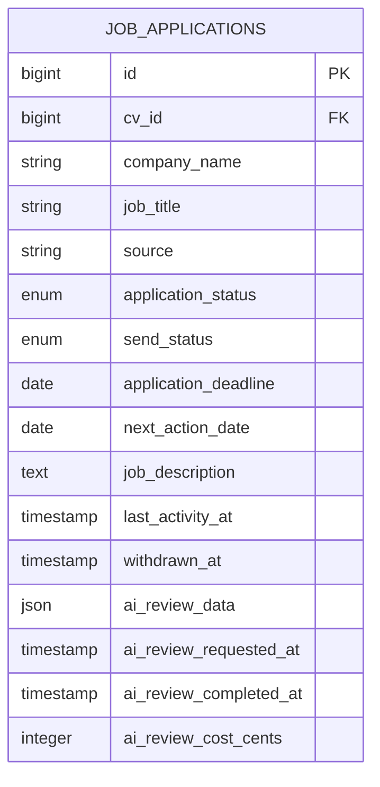
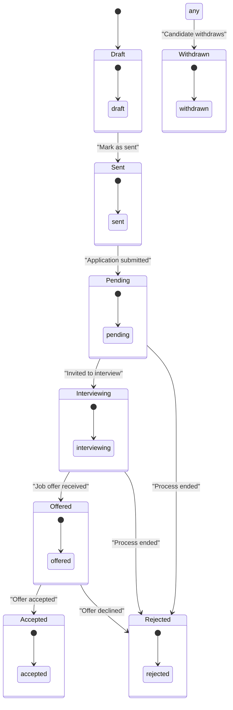
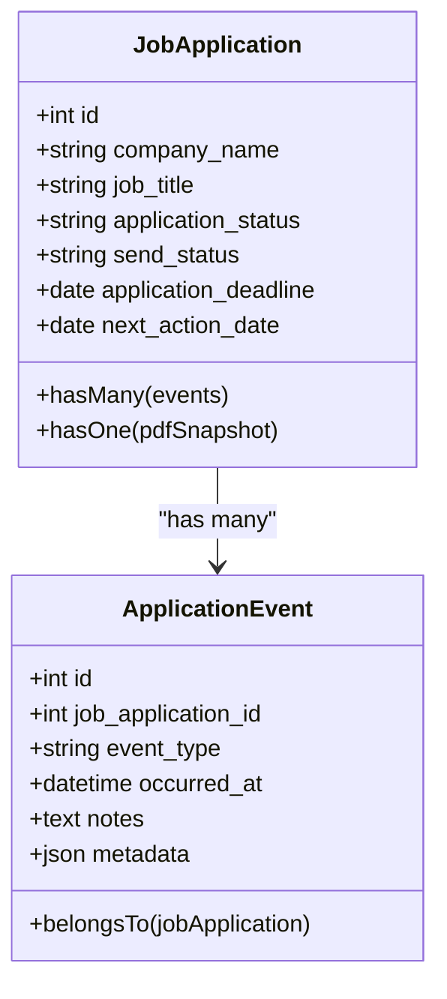
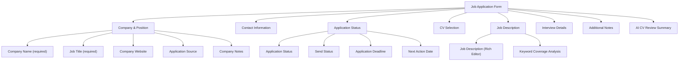
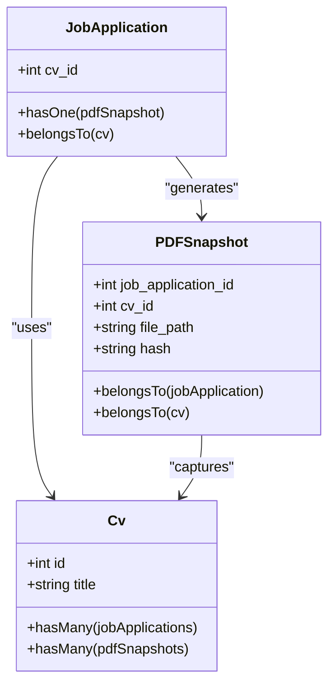
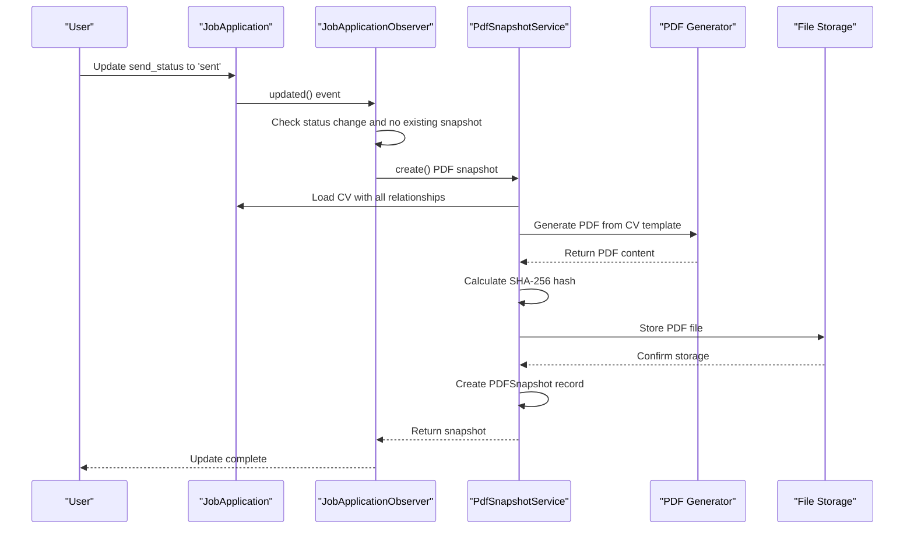

# Job Application Tracking

<cite>
**Referenced Files in This Document**   
- [JobApplication.php](file://app/Models/JobApplication.php)
- [ApplicationEvent.php](file://app/Models/ApplicationEvent.php)
- [JobApplicationForm.php](file://app/Filament/Resources/JobApplications/Schemas/JobApplicationForm.php)
- [ApplicationsNeedingAction.php](file://app/Filament/Widgets/ApplicationsNeedingAction.php)
- [PdfSnapshotService.php](file://app/Services/PdfSnapshotService.php)
- [PDFSnapshot.php](file://app/Models/PDFSnapshot.php)
- [Cv.php](file://app/Models/Cv.php)
- [create_job_applications_table.php](file://database/migrations/2025_10_03_224900_create_job_applications_table.php)
- [extend_job_applications_table.php](file://database/migrations/2025_10_04_002540_extend_job_applications_table.php)
- [create_application_events_table.php](file://database/migrations/2025_10_04_100002_create_application_events_table.php)
- [create_pdf_snapshots_table.php](file://database/migrations/2025_10_04_002642_create_pdf_snapshots_table.php)
</cite>

## Table of Contents
1. [Introduction](#introduction)
2. [JobApplication Model and Key Fields](#jobapplication-model-and-key-fields)
3. [Application Lifecycle and Status Workflow](#application-lifecycle-and-status-workflow)
4. [Application Event Tracking and Timeline](#application-event-tracking-and-timeline)
5. [Needs Attention Filtering Logic](#needs-attention-filtering-logic)
6. [Filament Resource and Widget Implementations](#filament-resource-and-widget-implementations)
7. [CV and PDF Snapshot Integration](#cv-and-pdf-snapshot-integration)
8. [Common Workflows](#common-workflows)
9. [Troubleshooting Common Issues](#troubleshooting-common-issues)

## Introduction
The job application tracking system in the cv-builder application provides a comprehensive solution for managing job search activities. This system enables users to track applications from initial creation through to final outcomes, with features for deadline management, status tracking, event logging, and document versioning. The core of this system is the `JobApplication` model, which serves as the central entity for storing application details and driving key workflows such as PDF snapshot generation and keyword analysis. This documentation provides a detailed overview of the system's architecture, functionality, and usage patterns.

## JobApplication Model and Key Fields

The `JobApplication` model is the central entity for tracking job applications, containing essential fields that capture the complete context of each job pursuit. The model is defined in the database through two migrations: `create_job_applications_table.php` which establishes the base structure, and `extend_job_applications_table.php` which adds enhanced tracking fields.



**Diagram sources**
- [JobApplication.php](file://app/Models/JobApplication.php)
- [create_job_applications_table.php](file://database/migrations/2025_10_03_224900_create_job_applications_table.php)
- [extend_job_applications_table.php](file://database/migrations/2025_10_04_002540_extend_job_applications_table.php)

**Section sources**
- [JobApplication.php](file://app/Models/JobApplication.php#L15-L35)

### Core Field Definitions
| Field | Type | Description |
|-------|------|-------------|
| `cv_id` | bigint | Foreign key linking to the CV used for this application |
| `company_name` | string | Name of the company where the job is applied |
| `job_title` | string | Position being applied for |
| `source` | string | Origin of the job posting (e.g., LinkedIn, referral) |
| `application_status` | enum | Current stage in the hiring pipeline |
| `send_status` | enum | Submission state (draft or sent) |
| `application_deadline` | date | Final date by which the application must be submitted |
| `next_action_date` | date | Date for follow-up or next required action |
| `job_description` | text | Full job description for keyword analysis and AI review |
| `last_activity_at` | timestamp | Timestamp of the most recent modification or event |

The model includes appropriate type casting for dates and timestamps, ensuring consistent data handling throughout the application. The `job_description` field is particularly important as it serves as input for keyword coverage analysis and AI-powered CV review features.

## Application Lifecycle and Status Workflow

The job application system implements a structured lifecycle with two distinct status fields that track different aspects of the application process: `application_status` for the hiring pipeline progression and `send_status` for submission state.

### Status State Machine


**Diagram sources**
- [JobApplication.php](file://app/Models/JobApplication.php#L25-L28)
- [JobApplicationForm.php](file://app/Filament/Resources/JobApplications/Schemas/JobApplicationForm.php#L45-L55)

### Status Field Semantics
The system uses two separate status fields to provide clear separation of concerns:

**Application Status Values:**
- **pending**: Application has been submitted, awaiting response
- **reviewed**: Employer has reviewed the application
- **interviewing**: Candidate is in the interview process
- **offered**: Job offer has been extended
- **accepted**: Candidate has accepted the offer
- **rejected**: Application was not successful
- **withdrawn**: Candidate withdrew from the process

**Send Status Values:**
- **draft**: Application is being prepared but not yet sent
- **sent**: Application has been submitted to the employer

This dual-status approach allows users to prepare applications in draft form, then officially mark them as "sent" when submission is complete, which triggers important downstream actions like PDF snapshot generation.

**Section sources**
- [JobApplication.php](file://app/Models/JobApplication.php#L25-L28)
- [JobApplicationForm.php](file://app/Filament/Resources/JobApplications/Schemas/JobApplicationForm.php#L45-L55)

## Application Event Tracking and Timeline

The system tracks application events through the `ApplicationEvent` model, which provides a chronological timeline of activities related to each job application.



**Diagram sources**
- [JobApplication.php](file://app/Models/JobApplication.php#L57-L65)
- [ApplicationEvent.php](file://app/Models/ApplicationEvent.php#L15-L25)

### Event Model Structure
The `ApplicationEvent` model captures key information about each event in the application process:

| Field | Type | Description |
|-------|------|-------------|
| `job_application_id` | bigint | Foreign key linking to the parent job application |
| `event_type` | string | Type of event (e.g., "interview_scheduled", "offer_received") |
| `occurred_at` | datetime | Timestamp when the event occurred |
| `notes` | text | Additional details about the event |
| `metadata` | json | Structured data associated with the event |

Events are automatically ordered by `occurred_at` in descending order, ensuring the most recent events appear first when displaying the timeline. The relationship is defined in the `JobApplication` model with the `events()` method, which includes the ordering specification.

The system is designed to support various event types that can be logged throughout the application process, creating a comprehensive audit trail of all interactions with employers. This timeline functionality helps users maintain context about their job search activities and provides valuable historical information for future reference.

**Section sources**
- [JobApplication.php](file://app/Models/JobApplication.php#L57-L65)
- [ApplicationEvent.php](file://app/Models/ApplicationEvent.php#L10-L30)

## Needs Attention Filtering Logic

The system implements intelligent filtering logic to help users prioritize their job applications through the "Needs Attention" feature, which surfaces applications requiring immediate action based on deadlines, status, and follow-up requirements.

```mermaid
flowchart TD
Start([Applications Needing Attention]) --> Condition1{next_action_date <= today?}
Start --> Condition2{send_status = 'draft'?}
Start --> Condition3{status IN [pending, interviewing]?}
Condition1 --> |Yes| Include[Include Application]
Condition2 --> |Yes| Include
Condition3 --> |Yes| Include
Include --> Exclusion{status IN [rejected, withdrawn]?}
Exclusion --> |Yes| Exclude[Exclude Application]
Exclusion --> |No| Include
Include --> Output[Display in Widget]
Exclude --> Output
```

**Diagram sources**
- [ApplicationsNeedingAction.php](file://app/Filament/Widgets/ApplicationsNeedingAction.php)
- [JobApplication.php](file://app/Models/JobApplication.php)

**Section sources**
- [JobApplication.php](file://app/Models/JobApplication.php#L115-L135)
- [ApplicationsNeedingAction.php](file://app/Filament/Widgets/ApplicationsNeedingAction.php#L15-L25)

### Filter Criteria Implementation
The `scopeNeedsAttention` method in the `JobApplication` model defines the business logic for identifying applications that require user attention:

```php
public function scopeNeedsAttention(Builder $query): Builder
{
    return $query->where(function ($q) {
        $q->where(function ($q2) {
            $q2->where('next_action_date', '<=', now())
                ->orWhere('send_status', 'draft')
                ->orWhere(function ($q3) {
                    $q3->whereIn('application_status', ['pending', 'interviewing'])
                        ->whereNull('next_action_date');
                });
        })->whereNotIn('application_status', ['rejected', 'withdrawn']);
    });
}
```

An application is considered to need attention if any of the following conditions are met:
- The `next_action_date` is today or in the past (deadline or follow-up is due)
- The `send_status` is 'draft' (application hasn't been sent)
- The `application_status` is 'pending' or 'interviewing' and no `next_action_date` is set

Applications with `application_status` of 'rejected' or 'withdrawn' are excluded from this filter, as they no longer require active management. This filtering logic is used in both the "Applications Needing Action" widget and as a table filter in the job applications list view.

## Filament Resource and Widget Implementations

The job application system leverages Filament, a Laravel admin panel package, to provide a rich user interface for managing job applications with consistent patterns across forms and tables.

### Form Structure and Layout
The `JobApplicationForm.php` organizes fields into logical sections that guide users through the application creation and editing process:



**Diagram sources**
- [JobApplicationForm.php](file://app/Filament/Resources/JobApplications/Schemas/JobApplicationForm.php#L10-L257)

The form uses appropriate field types including text inputs, selects, date pickers, and a rich editor, with proper validation rules applied. Notably, the form includes a dynamic placeholder that displays keyword coverage analysis when both a job description and CV are selected, providing real-time feedback on how well the CV matches the job requirements.

### Widget Implementation
The "Applications Needing Action" widget displays the top 10 applications that need attention:

```php
public function table(Table $table): Table
{
    return $table
        ->query(
            JobApplication::query()
                ->needsAttention()
                ->limit(10)
        )
        ->columns([
            TextColumn::make('company_name')
                ->searchable()
                ->sortable(),
            TextColumn::make('job_title')
                ->searchable(),
            TextColumn::make('application_status')
                ->badge()
                ->colors([
                    'gray' => 'pending',
                    'warning' => 'interviewing',
                ]),
            TextColumn::make('next_action_date')
                ->date()
                ->sortable()
                ->color(fn ($record) => $record->next_action_date && $record->next_action_date->isPast() ? 'danger' : 'warning')
                ->weight('bold')
                ->description(fn ($record) => $record->next_action_date && $record->next_action_date->isPast() ? 'OVERDUE' : null),
        ])
        ->recordUrl(fn ($record) => JobApplicationResource::getUrl('edit', ['record' => $record]))
        ->emptyStateHeading('No applications need attention right now')
        ->emptyStateDescription('Great job! All your applications are up to date.')
        ->emptyStateIcon('heroicon-o-check-circle');
}
```

The widget uses color coding to indicate urgency, with overdue next action dates highlighted in red and upcoming actions in yellow, helping users quickly identify priorities. It also provides direct links to edit the applications, streamlining the workflow for addressing pending items.

**Section sources**
- [JobApplicationForm.php](file://app/Filament/Resources/JobApplications/Schemas/JobApplicationForm.php#L10-L257)
- [ApplicationsNeedingAction.php](file://app/Filament/Widgets/ApplicationsNeedingAction.php#L10-L50)

## CV and PDF Snapshot Integration

The job application system implements a robust integration between job applications and CVs, with automated PDF snapshot generation to preserve exactly what was submitted.

### Relationship Architecture


**Diagram sources**
- [JobApplication.php](file://app/Models/JobApplication.php#L40-L55)
- [PDFSnapshot.php](file://app/Models/PDFSnapshot.php#L25-L39)
- [Cv.php](file://app/Models/Cv.php#L100-L110)

### PDF Snapshot Creation Process
When a job application's `send_status` changes from 'draft' to 'sent', the system automatically generates a PDF snapshot of the CV through the `PdfSnapshotService`:



**Diagram sources**
- [JobApplicationObserver.php](file://app/Observers/JobApplicationObserver.php)
- [PdfSnapshotService.php](file://app/Services/PdfSnapshotService.php)

The `PdfSnapshotService` ensures data integrity by calculating a SHA-256 hash of the PDF content and storing it alongside the file path. This allows verification that the stored document has not been altered. The service also validates PDF size (maximum 10MB) to prevent storage exhaustion issues.

**Section sources**
- [JobApplication.php](file://app/Models/JobApplication.php#L67-L75)
- [PdfSnapshotService.php](file://app/Services/PdfSnapshotService.php#L10-L72)
- [PDFSnapshot.php](file://app/Models/PDFSnapshot.php#L10-L45)

## Common Workflows

The job application system supports several key workflows that users perform regularly when managing their job search activities.

### Creating a New Application
1. Navigate to the Job Applications resource in the admin panel
2. Click "Create" to open the application form
3. Fill in company and position details (company name, job title, source)
4. Select a CV from existing templates or create a new one
5. Paste the full job description for keyword analysis
6. Set initial status values (typically "draft" for send status and "pending" for application status)
7. Save the application

### Updating Application Status
1. Open an existing job application for editing
2. Change the `application_status` field to reflect current progress (e.g., from "pending" to "interviewing")
3. Update the `next_action_date` to schedule follow-up activities
4. Add notes about recent communications or interview preparations
5. Save changes, which automatically updates the `last_activity_at` timestamp

### Recording Application Events
1. Navigate to the specific job application
2. Access the events relationship manager
3. Click "Create" to add a new application event
4. Select the event type (e.g., "interview_scheduled", "offer_received")
5. Set the `occurred_at` timestamp to the actual date and time of the event
6. Add detailed notes about the event
7. Save the event, which will appear in the application's timeline

These workflows are supported by the Filament resource implementation, which provides an intuitive interface for managing all aspects of job applications.

**Section sources**
- [JobApplicationForm.php](file://app/Filament/Resources/JobApplications/Schemas/JobApplicationForm.php)
- [JobApplication.php](file://app/Models/JobApplication.php)
- [ApplicationEvent.php](file://app/Models/ApplicationEvent.php)

## Troubleshooting Common Issues

### Missed Deadlines
If applications are not appearing in the "Needs Attention" widget despite having past due dates:

1. Verify that the `next_action_date` field contains a valid date value
2. Check that the application status is not "rejected" or "withdrawn", as these are excluded from the filter
3. Ensure the system clock and timezone settings are correct
4. Confirm that the `scopeNeedsAttention` query is being applied in the widget configuration

### Incorrect Status Transitions
When status changes don't trigger expected behaviors:

1. Verify that the `JobApplicationObserver` is properly registered in the service provider
2. Check that the `updated()` method is being called when status changes occur
3. For PDF snapshot issues, ensure the CV relationship is set before changing `send_status` to "sent"
4. Review error logs for any exceptions during status transitions

### PDF Snapshot Generation Failures
If PDF snapshots are not being created when applications are marked as sent:

1. Verify that the `cv_id` is set on the job application
2. Check storage permissions and available disk space
3. Review the maximum file size limit (10MB) - large CVs may exceed this
4. Ensure the PDF generation service (e.g., Browsershot) is properly configured
5. Check for any HTML/CSS issues in the CV template that might prevent rendering

These troubleshooting steps address the most common issues users may encounter when working with the job application tracking system.

**Section sources**
- [JobApplication.php](file://app/Models/JobApplication.php)
- [JobApplicationObserver.php](file://app/Observers/JobApplicationObserver.php)
- [PdfSnapshotService.php](file://app/Services/PdfSnapshotService.php)
- [ApplicationsNeedingAction.php](file://app/Filament/Widgets/ApplicationsNeedingAction.php)