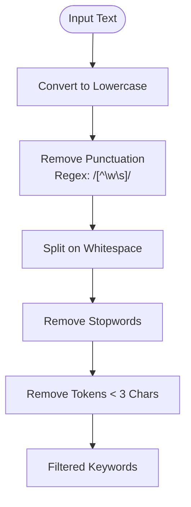
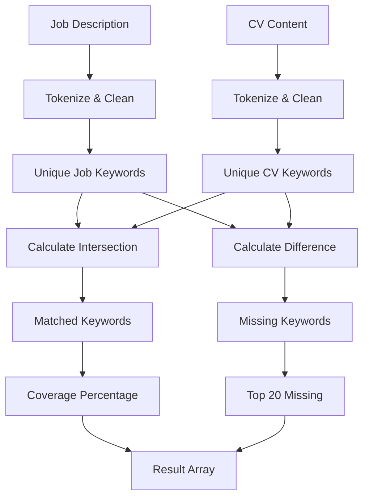
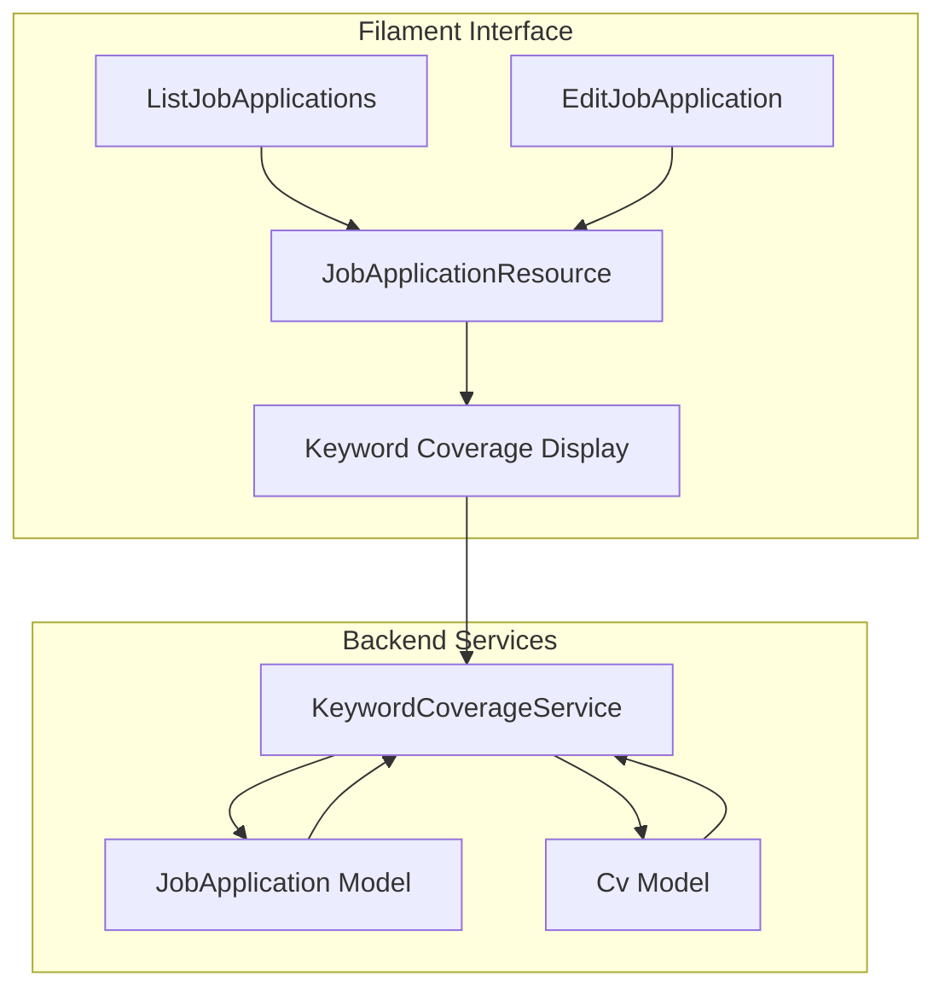
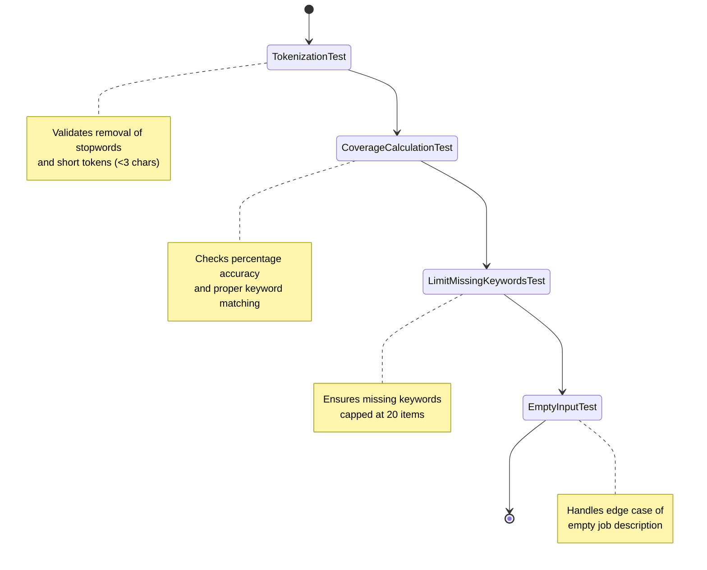

# Keyword Coverage Analysis

<cite>
**Referenced Files in This Document**   
- [KeywordCoverageService.php](file://app/Services/KeywordCoverageService.php)
- [KeywordCoverageServiceTest.php](file://tests/Unit/KeywordCoverageServiceTest.php)
- [JobApplication.php](file://app/Models/JobApplication.php)
- [Cv.php](file://app/Models/Cv.php)
- [JobApplicationResource.php](file://app/Filament/Resources/JobApplications/JobApplicationResource.php)
- [ListJobApplications.php](file://app/Filament/Resources/JobApplications/Pages/ListJobApplications.php)
- [EditJobApplication.php](file://app/Filament/Resources/JobApplications/Pages/EditJobApplication.php)
</cite>

## Table of Contents
1. [Introduction](#introduction)
2. [Core Components](#core-components)
3. [Keyword Tokenization Process](#keyword-tokenization-process)
4. [Coverage Calculation Algorithm](#coverage-calculation-algorithm)
5. [Integration with Filament Interface](#integration-with-filament-interface)
6. [Test Suite and Expected Behavior](#test-suite-and-expected-behavior)
7. [Design Philosophy and Performance](#design-philosophy-and-performance)
8. [Conclusion](#conclusion)

## Introduction
The Keyword Coverage Analysis feature is designed to help users align their CV content with job description requirements by identifying missing keywords and measuring content alignment. This tool enables job seekers to optimize their resumes by highlighting gaps between their skills and experience and the language used in job postings. The implementation is centered around the `KeywordCoverageService` class, which provides a deterministic, rule-based approach to keyword extraction and comparison without relying on external NLP libraries. This ensures fast, reliable processing while maintaining full control over the analysis logic.

## Core Components

The keyword coverage system consists of several interconnected components that work together to analyze and display keyword alignment. The core functionality resides in the `KeywordCoverageService`, which processes text inputs and returns structured coverage metrics. This service is consumed by the application logic and integrated into the Filament admin interface for display on job application records. The system leverages existing data models such as `JobApplication` and `Cv` to access job descriptions and CV content, respectively.

**Section sources**
- [KeywordCoverageService.php](file://app/Services/KeywordCoverageService.php#L4-L56)
- [JobApplication.php](file://app/Models/JobApplication.php#L1-L66)
- [Cv.php](file://app/Models/Cv.php#L1-L221)

## Keyword Tokenization Process

The tokenization process in `KeywordCoverageService` extracts meaningful terms from job descriptions through a two-step cleaning and filtering approach. First, the input text is converted to lowercase and stripped of punctuation using regex pattern `/[^\w\s]/`. Then, the cleaned text is split into tokens using whitespace as delimiters. The service applies two filtering criteria: removal of common stopwords (e.g., "the", "and", "in") and elimination of short tokens (fewer than 3 characters). This ensures that only substantive keywords relevant to professional skills and qualifications are retained for analysis.

**Diagram sources**
- [KeywordCoverageService.php](file://app/Services/KeywordCoverageService.php#L10-L25)

**Section sources**
- [KeywordCoverageService.php](file://app/Services/KeywordCoverageService.php#L10-L25)

## Coverage Calculation Algorithm

The coverage calculation algorithm compares keywords extracted from job descriptions against those found in combined CV content. The `calculateCoverage` method first tokenizes both inputs and removes duplicates to create unique keyword sets. It then computes the intersection (matched keywords) and difference (missing keywords) between job description keywords and CV keywords. The coverage percentage is calculated as the ratio of matched keywords to total job keywords, expressed as a percentage. To maintain usability, the service limits the returned missing keywords to the top 20 most relevant terms.

**Diagram sources**
- [KeywordCoverageService.php](file://app/Services/KeywordCoverageService.php#L27-L56)

**Section sources**
- [KeywordCoverageService.php](file://app/Services/KeywordCoverageService.php#L27-L56)

## Integration with Filament Interface

The keyword coverage service is integrated into the Filament admin interface through the JobApplication resource. While the exact rendering component is not visible in the provided code, the architecture suggests that coverage metrics are displayed on job application views, likely within the `EditJobApplication` page. The system uses the `JobApplicationResource` to organize CRUD operations and likely extends this with custom infolist components or widgets to display the coverage percentage and missing keywords. This integration allows users to immediately see how well their CV matches a job description and identify areas for improvement.

**Diagram sources**
- [JobApplicationResource.php](file://app/Filament/Resources/JobApplications/JobApplicationResource.php#L1-L48)
- [ListJobApplications.php](file://app/Filament/Resources/JobApplications/Pages/ListJobApplications.php#L1-L19)
- [EditJobApplication.php](file://app/Filament/Resources/JobApplications/Pages/EditJobApplication.php#L1-L19)

**Section sources**
- [JobApplicationResource.php](file://app/Filament/Resources/JobApplications/JobApplicationResource.php#L1-L48)
- [ListJobApplications.php](file://app/Filament/Resources/JobApplications/Pages/ListJobApplications.php#L1-L19)
- [EditJobApplication.php](file://app/Filament/Resources/JobApplications/Pages/EditJobApplication.php#L1-L19)

## Test Suite and Expected Behavior

The test suite validates the expected behavior of the keyword coverage service through multiple test cases. Unit tests confirm that the `tokenize` method correctly removes stopwords and short tokens while preserving meaningful keywords. Coverage calculation tests verify that the percentage is accurately computed and that edge cases like empty job descriptions return appropriate zero values. A specific test ensures that the missing keywords list is capped at 20 items, preventing overwhelming output. These tests use realistic sample data to simulate actual usage scenarios, such as comparing a job description for a "PHP Laravel developer" against a CV with relevant but incomplete keyword coverage.

**Diagram sources**
- [KeywordCoverageServiceTest.php](file://tests/Unit/KeywordCoverageServiceTest.php#L1-L59)

**Section sources**
- [KeywordCoverageServiceTest.php](file://tests/Unit/KeywordCoverageServiceTest.php#L1-L59)

## Design Philosophy and Performance

The keyword coverage system follows a deterministic, rule-based design that avoids external NLP dependencies, ensuring consistent performance and predictable behavior. This approach prioritizes speed and reliability over complex semantic analysis, making it suitable for real-time feedback during CV editing. The implementation uses efficient PHP array operations (`array_intersect`, `array_diff`) and built-in string functions, minimizing computational overhead. By limiting the output to 20 missing keywords, the service maintains usability even with large job descriptions. The stateless design of `KeywordCoverageService` allows for easy integration and testing, while the pure function approach ensures consistent results for identical inputs.

**Section sources**
- [KeywordCoverageService.php](file://app/Services/KeywordCoverageService.php#L4-L56)

## Conclusion

The Keyword Coverage Analysis feature provides a practical solution for aligning CV content with job requirements through systematic keyword comparison. By leveraging a clean, rule-based approach to text analysis, the system delivers immediate feedback on content gaps without requiring complex machine learning infrastructure. The integration with the Filament interface makes these insights accessible directly within the job application workflow, empowering users to optimize their resumes effectively. Future enhancements could include weighting for technical terms or domain-specific keywords, but the current implementation provides a solid foundation for content alignment analysis.