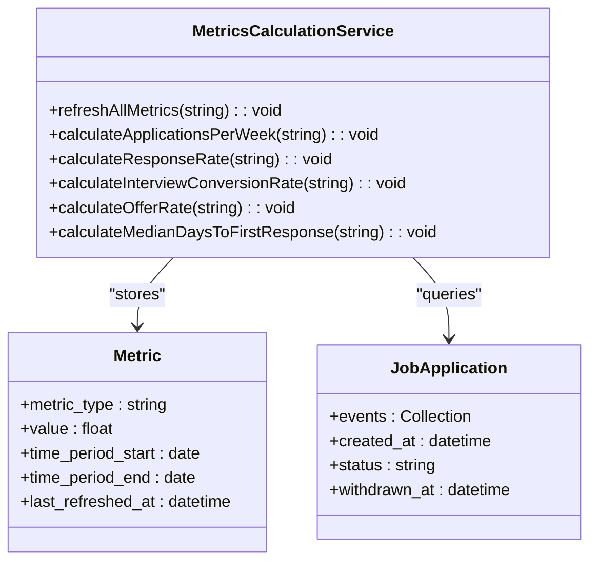
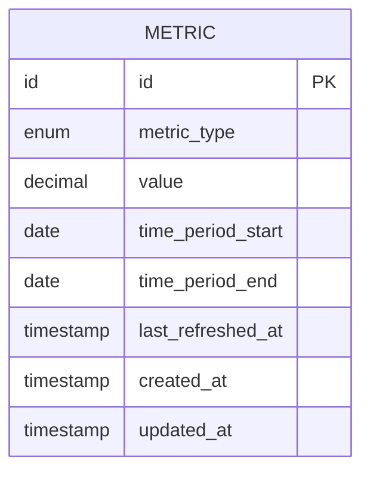
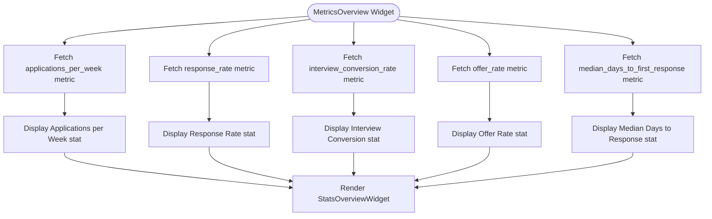
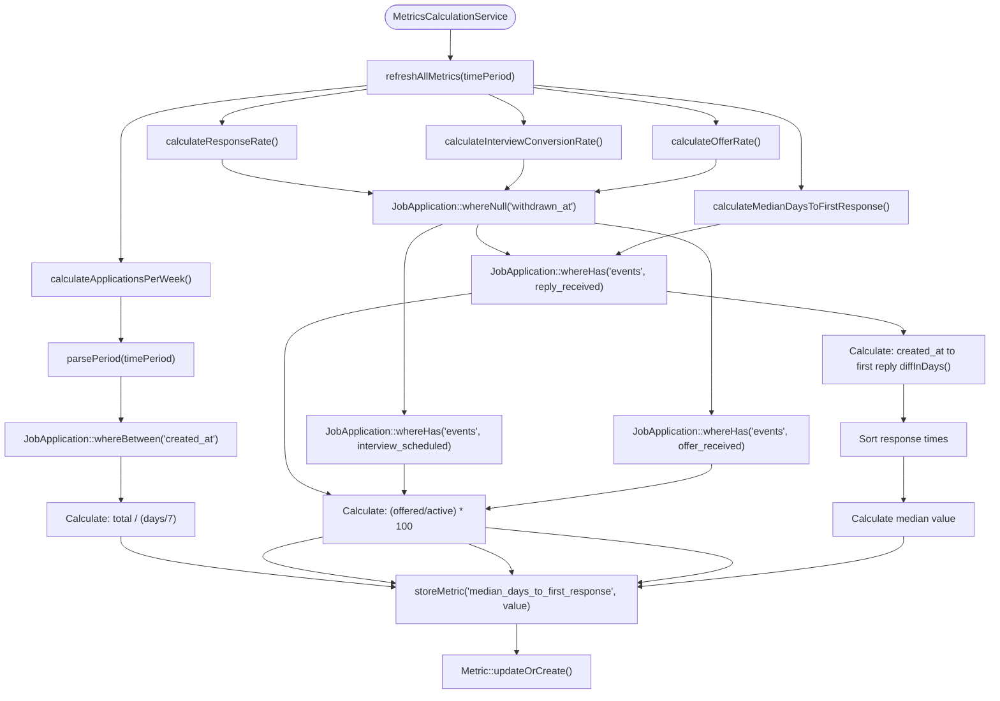

# Metrics & Analytics

<cite>
**Referenced Files in This Document**   
- [MetricsCalculationService.php](file://app/Services/MetricsCalculationService.php)
- [Metric.php](file://app/Models/Metric.php)
- [MetricsOverview.php](file://app/Filament/Widgets/MetricsOverview.php)
- [create_metrics_table.php](file://database/migrations/2025_10_04_100003_create_metrics_table.php)
- [JobApplication.php](file://app/Models/JobApplication.php)
- [ApplicationEvent.php](file://app/Models/ApplicationEvent.php)
- [routes/console.php](file://routes/console.php)
</cite>

## Table of Contents
1. [Introduction](#introduction)
2. [Metrics Calculation Service](#metrics-calculation-service)
3. [Metric Data Model](#metric-data-model)
4. [Dashboard Visualization](#dashboard-visualization)
5. [Data Aggregation and Calculation Logic](#data-aggregation-and-calculation-logic)
6. [Update Schedule and Triggers](#update-schedule-and-triggers)
7. [Interpreting Metrics for Job Search Strategy](#interpreting-metrics-for-job-search-strategy)
8. [Data Accuracy and Limitations](#data-accuracy-and-limitations)

## Introduction
The Metrics & Analytics system in the cv-builder application provides users with actionable insights into their job application performance. This system tracks key performance indicators (KPIs) such as applications per week, response rate, interview conversion rate, offer rate, and median days to first response. These metrics are calculated from application data and presented through dashboard widgets, enabling users to evaluate and optimize their job search strategy. The system is designed to handle data accuracy considerations and edge cases, ensuring reliable and meaningful analytics.

## Metrics Calculation Service
The MetricsCalculationService is responsible for computing and persisting key performance metrics for job applications. This service processes application data to generate insights about job search effectiveness. It follows a consistent pattern across all calculation methods: parsing the time period, querying relevant application data, performing the calculation, and storing the result. The service excludes withdrawn applications from denominators to provide accurate success rates for active applications only. It handles edge cases gracefully, returning 0 for metrics when no data is available rather than throwing exceptions, making the service robust and easy to integrate.

**Diagram sources**
- [MetricsCalculationService.php](file://app/Services/MetricsCalculationService.php)
- [Metric.php](file://app/Models/Metric.php)
- [JobApplication.php](file://app/Models/JobApplication.php)

**Section sources**
- [MetricsCalculationService.php](file://app/Services/MetricsCalculationService.php#L7-L169)

## Metric Data Model
The Metric model stores calculated values with timestamps for trend analysis. It includes fields for the metric type, value, time period start and end dates, and the last refreshed timestamp. The model uses appropriate casts to ensure data integrity, with the value stored as a float and timestamps properly typed. The metrics table has a unique constraint on the combination of metric type and time period start, preventing duplicate records for the same metric and period. This design enables historical tracking and ensures data freshness.

**Diagram sources**
- [Metric.php](file://app/Models/Metric.php)
- [create_metrics_table.php](file://database/migrations/2025_10_04_100003_create_metrics_table.php)

**Section sources**
- [Metric.php](file://app/Models/Metric.php#L1-L27)
- [create_metrics_table.php](file://database/migrations/2025_10_04_100003_create_metrics_table.php#L1-L42)

## Dashboard Visualization
The MetricsOverview widget visualizes the calculated metrics using Filament's StatsOverviewWidget. It displays five key statistics: Applications per Week, Response Rate, Interview Conversion, Offer Rate, and Median Days to Response. Each stat includes a descriptive label, formatted value, and contextual description showing the time period and last refresh time. The widget uses color coding to indicate performance levels and includes descriptive icons for visual clarity. The widget retrieves the latest metric values from the database, ensuring users see the most up-to-date information.

**Diagram sources**
- [MetricsOverview.php](file://app/Filament/Widgets/MetricsOverview.php)

**Section sources**
- [MetricsOverview.php](file://app/Filament/Widgets/MetricsOverview.php#L1-L72)

## Data Aggregation and Calculation Logic
The system uses specific formulas to calculate each KPI based on application data. The calculations exclude withdrawn applications to provide accurate performance metrics for active applications. The response rate is calculated as the percentage of active applications that received a reply. The interview conversion rate measures the percentage of applications that progressed to the interview stage. The offer rate tracks the percentage of applications that resulted in job offers. The median days to first response calculates the median number of days between application submission and receiving the first reply. The applications per week metric measures submission activity, including both active and withdrawn applications.

**Diagram sources**
- [MetricsCalculationService.php](file://app/Services/MetricsCalculationService.php#L7-L169)

**Section sources**
- [MetricsCalculationService.php](file://app/Services/MetricsCalculationService.php#L7-L169)

## Update Schedule and Triggers
Metrics are updated automatically through Laravel's task scheduler, which runs daily at 2:00 AM to refresh all metrics for the default 30-day period. This scheduled job ensures that users have access to up-to-date analytics without manual intervention. Additionally, users can manually refresh metrics through a dedicated endpoint, which is useful after bulk data imports or when immediate updates are needed. The refresh process recalculates all five metric types for the specified period and updates the database records, with the last_refreshed_at timestamp providing transparency about data freshness.

**Section sources**
- [routes/console.php](file://routes/console.php#L15-L18)

## Interpreting Metrics for Job Search Strategy
Users can interpret the metrics to improve their job search strategy by analyzing trends and identifying areas for improvement. A low response rate may indicate the need for better application materials or targeting different roles. A high interview conversion rate suggests effective interview preparation. The median days to first response helps users understand typical employer response times and plan follow-ups accordingly. By monitoring applications per week, users can maintain consistent application volume. The dashboard provides a comprehensive view of job search performance, enabling data-driven decisions to optimize the application process.

## Data Accuracy and Limitations
The metrics system handles data accuracy considerations by excluding withdrawn applications from success rate calculations and using robust error handling for edge cases. However, the accuracy of metrics depends on complete application records, particularly the presence of application events like replies, interviews, and offers. Incomplete records may lead to underestimation of response and conversion rates. The system addresses division-by-zero scenarios by returning 0 for metrics when no data is available. The rolling 30-day period provides a balanced view of recent performance while maintaining historical context through timestamped records.