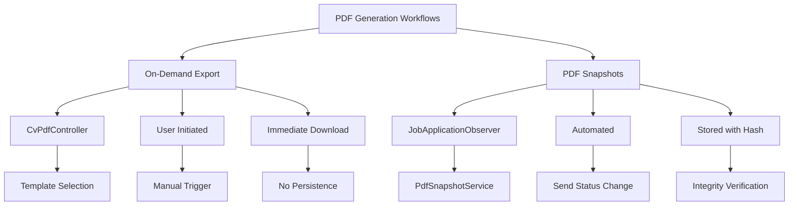
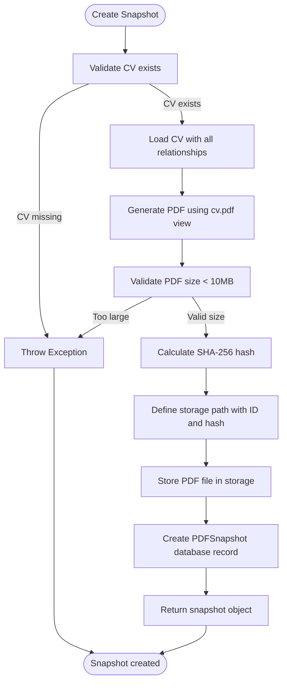
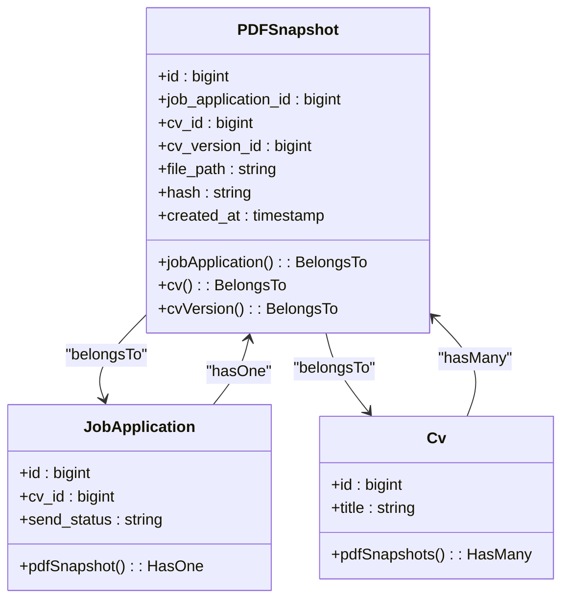
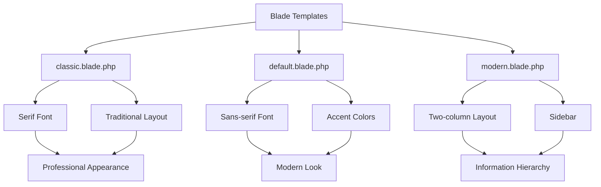
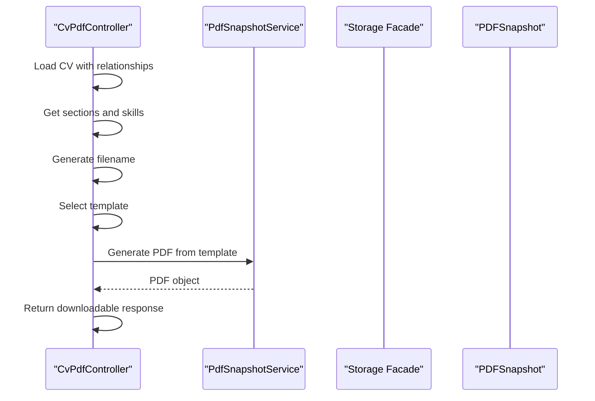

# PDF Generation

<cite>
**Referenced Files in This Document**   
- [PDFSnapshot.php](file://app/Models/PDFSnapshot.php)
- [PdfSnapshotService.php](file://app/Services/PdfSnapshotService.php)
- [CvPdfController.php](file://app/Http/Controllers/CvPdfController.php)
- [PdfTemplate.php](file://app/Models/PdfTemplate.php)
- [pdf.blade.php](file://resources/views/cv/pdf.blade.php)
- [classic.blade.php](file://resources/views/cv/templates/classic.blade.php)
- [default.blade.php](file://resources/views/cv/templates/default.blade.php)
- [modern.blade.php](file://resources/views/cv/templates/modern.blade.php)
- [JobApplicationObserver.php](file://app/Observers/JobApplicationObserver.php)
- [create_pdf_snapshots_table.php](file://database/migrations/2025_10_04_002642_create_pdf_snapshots_table.php)
- [filesystems.php](file://config/filesystems.php)
</cite>

## Table of Contents
1. [Introduction](#introduction)
2. [PDF Generation Workflows](#pdf-generation-workflows)
3. [PDF Snapshot Service](#pdf-snapshot-service)
4. [PDF Snapshot Model](#pdf-snapshot-model)
5. [Blade Template System](#blade-template-system)
6. [Configuration Options](#configuration-options)
7. [Controller Implementation](#controller-implementation)
8. [File Storage and Cleanup](#file-storage-and-cleanup)
9. [Security Considerations](#security-considerations)
10. [Troubleshooting](#troubleshooting)

## Introduction
The cv-builder application provides two distinct PDF generation workflows: on-demand export and automated PDF snapshots. These workflows serve different purposes in the job application process, ensuring users can export their CVs for immediate use while maintaining verifiable records of submissions. The system leverages Spatie Laravel-PDF for PDF generation, Laravel's Storage facade for file management, and Blade templates for rendering. PDF snapshots are automatically created when job applications are sent, preserving the exact CV state at submission with cryptographic integrity verification.

## PDF Generation Workflows
The application implements two complementary PDF generation workflows to address different user needs.

### On-Demand Export
The on-demand export workflow allows users to manually generate PDFs of their CVs at any time. This is implemented through the `CvPdfController` which handles PDF generation requests and returns downloadable files. Users can export their CVs with optional profile filtering, and the system generates filenames with timestamps for version tracking. This workflow is ideal for sharing CVs during networking or when preparing for interviews.

### PDF Snapshots
The PDF snapshot workflow automatically generates and stores PDFs when job applications are marked as "sent." Triggered by the `JobApplicationObserver`, this process creates immutable records of the CV state at the time of submission. Each snapshot includes a SHA-256 hash for integrity verification, ensuring the document cannot be altered after creation. This workflow provides verifiable proof of what was submitted to employers and maintains a historical record of application materials.



**Diagram sources**
- [CvPdfController.php](file://app/Http/Controllers/CvPdfController.php)
- [JobApplicationObserver.php](file://app/Observers/JobApplicationObserver.php)
- [PdfSnapshotService.php](file://app/Services/PdfSnapshotService.php)

**Section sources**
- [CvPdfController.php](file://app/Http/Controllers/CvPdfController.php)
- [JobApplicationObserver.php](file://app/Observers/JobApplicationObserver.php)

## PDF Snapshot Service
The `PdfSnapshotService` orchestrates the complete workflow for creating PDF snapshots when job applications are sent.

### Service Implementation
The service's `create()` method follows a structured sequence:
1. Validates that the job application has an associated CV
2. Eager loads the CV with all related sections and content
3. Generates a PDF using the Spatie Laravel-PDF package
4. Calculates a SHA-256 hash for content integrity verification
5. Stores the PDF file with a predictable naming convention
6. Creates a database record in the PDFSnapshots table

The service ensures data consistency by storing both the file path and cryptographic hash, enabling verification of file integrity. It integrates with Laravel's Storage facade for file persistence and uses the Spatie Laravel-PDF package as the underlying PDF generation engine.



**Diagram sources**
- [PdfSnapshotService.php](file://app/Services/PdfSnapshotService.php#L9-L71)

**Section sources**
- [PdfSnapshotService.php](file://app/Services/PdfSnapshotService.php#L9-L71)

## PDF Snapshot Model
The `PDFSnapshot` model represents an immutable record of a CV exported as a PDF for a job application.

### Data Structure
The model corresponds to the `pdf_snapshots` database table with the following fields:
- **id**: Primary key, auto-incrementing identifier
- **job_application_id**: Foreign key to job_applications table with unique constraint
- **cv_id**: Nullable foreign key to cvs table, allowing snapshots to persist if CV is deleted
- **cv_version_id**: Optional foreign key to cv_versions table for exact reproducibility
- **file_path**: Relative storage path with a maximum length of 500 characters
- **hash**: SHA-256 hash of the PDF content (64 characters)
- **created_at**: Timestamp of snapshot creation

### Relationships
The model defines three `belongsTo` relationships:
- `jobApplication()`: Required relationship to the `JobApplication` model
- `cv()`: Optional relationship to the `CV` model
- `cvVersion()`: Optional relationship to the `CVVersion` model

These relationships enable navigation between snapshots and their associated entities while maintaining referential integrity.



**Diagram sources**
- [PDFSnapshot.php](file://app/Models/PDFSnapshot.php#L1-L44)
- [JobApplication.php](file://app/Models/JobApplication.php#L1-L122)
- [Cv.php](file://app/Models/Cv.php#L1-L342)

**Section sources**
- [PDFSnapshot.php](file://app/Models/PDFSnapshot.php#L1-L44)
- [create_pdf_snapshots_table.php](file://database/migrations/2025_10_04_002642_create_pdf_snapshots_table.php#L1-L35)

## Blade Template System
The application uses Blade templates to render CV content for PDF generation, supporting multiple visual styles.

### Template Structure
The system includes three predefined templates:
- **Classic**: Traditional layout with serif fonts and minimal styling
- **Default**: Modern design with Poppins font and accent colors
- **Modern**: Two-column layout with sidebar for contact information and skills

Each template extends a base structure with consistent head elements, including font imports, Tailwind CSS, and print-specific styles. The templates are located in `resources/views/cv/templates/` and are referenced by their view paths in the database.

### Template Variables
Templates receive the following variables:
- **$cv**: The CV model with all related data
- **$sections**: Collection of CV sections, optionally filtered by profile
- **$skillsWithEvidence**: Skills with associated evidence counts
- **$profileName**: Optional profile name for filename and display

The templates use conditional rendering to display only sections with content, ensuring clean output without empty sections.



**Diagram sources**
- [classic.blade.php](file://resources/views/cv/templates/classic.blade.php)
- [default.blade.php](file://resources/views/cv/templates/default.blade.php)
- [modern.blade.php](file://resources/views/cv/templates/modern.blade.php)

**Section sources**
- [classic.blade.php](file://resources/views/cv/templates/classic.blade.php)
- [default.blade.php](file://resources/views/cv/templates/default.blade.php)
- [modern.blade.php](file://resources/views/cv/templates/modern.blade.php)

## Configuration Options
The PDF generation system supports various configuration options for customization.

### PDF Generation Settings
The system uses Spatie Laravel-PDF with the following configuration:
- **Format**: A4 paper size
- **Orientation**: Portrait (default)
- **Margins**: Controlled by CSS in templates
- **Font**: Specified in template CSS (Crimson Text, Poppins)

These settings are hardcoded in the service and controller implementations, ensuring consistency across generated documents.

### File Storage Configuration
Files are stored using Laravel's filesystem configuration in `filesystems.php`:
```php
'local' => [
    'driver' => 'local',
    'root' => storage_path('app/private'),
    'serve' => true,
    'throw' => false,
    'report' => false,
]
```
The private storage location prevents direct URL access, requiring application authentication for downloads.

### Template Configuration
PDF templates are managed through the `PdfTemplate` model with fields for:
- **name**: Display name
- **slug**: URL-friendly identifier
- **description**: Template description
- **view_path**: Blade template path
- **preview_image_path**: Path to template preview image
- **is_default**: Boolean flag for default template

**Section sources**
- [filesystems.php](file://config/filesystems.php#L1-L81)
- [PdfTemplate.php](file://app/Models/PdfTemplate.php#L1-L43)

## Controller Implementation
The `CvPdfController` handles on-demand PDF generation requests.

### Download Method
The `download()` method implements the following workflow:
1. Eager loads the CV with all relationships, including the selected template
2. Retrieves sections, optionally filtered by profile
3. Gets skills with evidence counts
4. Generates a filename with slug, profile (if applicable), and date
5. Selects the appropriate template (selected or default)
6. Generates and returns the PDF

The controller uses the Spatie Laravel-PDF facade to generate PDFs from the selected template view, passing the necessary data variables.



**Diagram sources**
- [CvPdfController.php](file://app/Http/Controllers/CvPdfController.php#L1-L70)

**Section sources**
- [CvPdfController.php](file://app/Http/Controllers/CvPdfController.php#L1-L70)

## File Storage and Cleanup
The system implements a structured approach to file storage and management.

### Storage Strategy
PDF files are stored in the `storage/app/private` directory with a deterministic naming pattern:
```
pdf-snapshots/{job_application_id}_{hash}.pdf
```
This pattern includes the job application ID and SHA-256 hash, ensuring predictable file locations and built-in integrity verification.

### Cleanup Policies
The application does not implement automatic cleanup of PDF snapshots. Snapshots are retained as long as the associated job application exists. Users can manually delete snapshots through the administrative interface. When a CV is soft-deleted, associated snapshots remain intact to preserve application history.

### Storage Validation
The system includes validation to prevent storage exhaustion:
- Maximum PDF size of 10MB
- Unique constraint on file_path to prevent duplicates
- Index on hash field for fast duplicate detection

**Section sources**
- [PdfSnapshotService.php](file://app/Services/PdfSnapshotService.php#L9-L71)
- [filesystems.php](file://config/filesystems.php#L1-L81)
- [create_pdf_snapshots_table.php](file://database/migrations/2025_10_04_002642_create_pdf_snapshots_table.php#L1-L35)

## Security Considerations
The PDF generation system incorporates several security measures.

### File Access Security
- Files are stored in `storage/app/private` directory
- Direct file access requires application authentication
- No public URLs are generated by default
- All access is logged through Laravel's logging system

### Data Integrity
- SHA-256 hashing ensures content integrity
- Hash verification protects against file corruption or tampering
- Immutable snapshots prevent post-submission modifications

### Input Validation
- CV existence is validated before PDF generation
- PDF size is validated (<10MB)
- Job application ID is sanitized to prevent path traversal
- Binary content is properly decoded from base64 output

**Section sources**
- [PdfSnapshotService.php](file://app/Services/PdfSnapshotService.php#L9-L71)
- [filesystems.php](file://config/filesystems.php#L1-L81)
- [JobApplicationObserver.php](file://app/Observers/JobApplicationObserver.php#L7-L43)

## Troubleshooting
This section addresses common issues with PDF generation and provides solutions.

### Styling Problems in PDF Output
**Symptoms**: Missing styles, incorrect layout, or formatting issues in generated PDFs.

**Solutions**:
1. Verify Tailwind CSS is properly loaded in the template
2. Check for CSS conflicts between templates
3. Ensure print-specific styles are correctly defined
4. Test with different PDF generation settings

### Missing Files
**Symptoms**: "PDF file not found at path" errors when downloading.

**Causes and Solutions**:
- **Manual file deletion**: Restore from backup or regenerate
- **Storage path configuration**: Verify `filesystems.php` configuration
- **File system permissions**: Ensure proper write permissions
- **Disk synchronization**: Check for synchronization issues in distributed environments

### Hash Verification Failure
**Symptoms**: Hash verification shows failure despite file existence.

**Causes and Solutions**:
- **File modification**: Recreate the snapshot as the file has been altered
- **Storage corruption**: Check storage system integrity
- **Incomplete writes**: Verify the PDF generation process completed successfully
- **Encoding issues**: Ensure proper binary content handling

### PDF Generation Failures
**Symptoms**: PDF generation fails with various error messages.

**Common Issues**:
- **Memory exhaustion**: Increase PHP memory limit
- **Timeout errors**: Increase execution time limit
- **Template rendering errors**: Check for Blade syntax errors
- **Missing relationships**: Verify eager loading of all required data

**Section sources**
- [PdfSnapshotService.php](file://app/Services/PdfSnapshotService.php#L9-L71)
- [CvPdfController.php](file://app/Http/Controllers/CvPdfController.php#L1-L70)
- [pdf.blade.php](file://resources/views/cv/pdf.blade.php)
- [JobApplicationObserver.php](file://app/Observers/JobApplicationObserver.php#L7-L43)