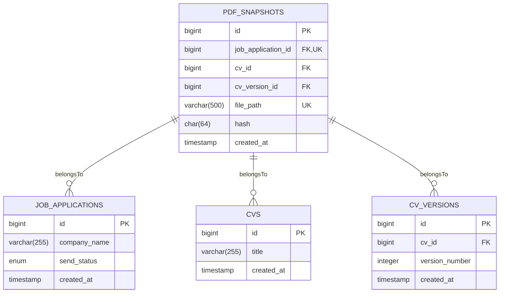
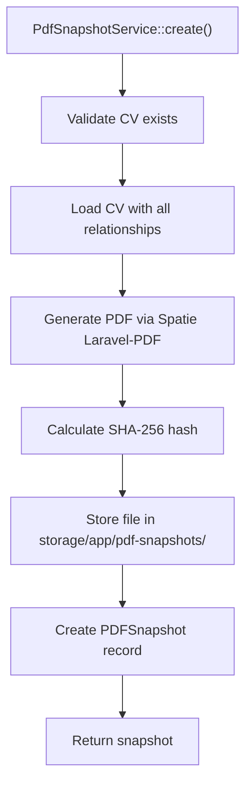
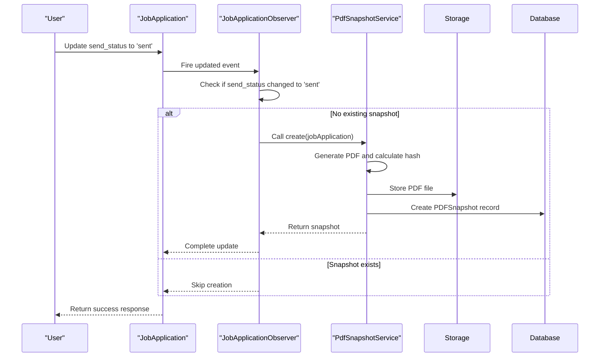

# PDF Snapshot Mechanism

<cite>
**Referenced Files in This Document**   
- [PDFSnapshot.php](file://app/Models/PDFSnapshot.php)
- [PdfSnapshotService.php](file://app/Services/PdfSnapshotService.php)
- [JobApplicationObserver.php](file://app/Observers/JobApplicationObserver.php)
- [CvPdfController.php](file://app/Http/Controllers/CvPdfController.php)
- [pdf.blade.php](file://resources/views/cv/pdf.blade.php)
- [create_pdf_snapshots_table.php](file://database/migrations/2025_10_04_002642_create_pdf_snapshots_table.php)
- [PDFSnapshotResource.php](file://app/Filament/Resources/PDFSnapshots/PDFSnapshotResource.php)
- [filesystems.php](file://config/filesystems.php)
</cite>

## Table of Contents
1. [Introduction](#introduction)
2. [Database Schema](#database-schema)
3. [Eloquent Relationships](#eloquent-relationships)
4. [Service Layer Implementation](#service-layer-implementation)
5. [Automatic Snapshot Creation Workflow](#automatic-snapshot-creation-workflow)
6. [Integrity Verification with Hashing](#integrity-verification-with-hashing)
7. [Manual PDF Generation Endpoint](#manual-pdf-generation-endpoint)
8. [Blade Template for PDF Output](#blade-template-for-pdf-output)
9. [Security Considerations](#security-considerations)
10. [Filament Admin Interface](#filament-admin-interface)

## Introduction
The PDF Snapshot mechanism serves two critical purposes: enabling one-click PDF export of CVs and creating immutable records of exactly which CV version was sent to employers. This system ensures verifiable proof of submission while maintaining a clean, professional presentation of the user's CV. The implementation leverages Laravel's ecosystem with Spatie Laravel-PDF for PDF generation, Eloquent ORM for database interactions, and Filament for administrative interface management.

**Section sources**
- [PDFSnapshot.php](file://app/Models/PDFSnapshot.php)
- [PdfSnapshotService.php](file://app/Services/PdfSnapshotService.php)

## Database Schema
The `pdf_snapshots` table stores all PDF snapshot records with the following fields:

| Column | Type | Constraints | Purpose |
|--------|------|-------------|---------|
| id | bigint | Primary Key, auto-increment | Unique identifier |
| job_application_id | bigint | Foreign Key → job_applications.id, unique constraint | Links to the job application |
| cv_id | bigint | Foreign Key → cvs.id, nullable, null on delete | References the CV used |
| cv_version_id | bigint | Foreign Key → cv_versions.id, nullable, null on delete | Optional link to CV version |
| file_path | string(500) | Required, unique | Storage path for the PDF file |
| hash | string(64) | Required, size:64, indexed | SHA-256 hash for integrity verification |
| created_at | timestamp | Required | Timestamp of snapshot creation |

The schema ensures data integrity through foreign key constraints and unique indexes. The `job_application_id` has a unique constraint to prevent multiple snapshots for the same application. The `hash` field is indexed for efficient duplicate detection and verification operations.

**Diagram sources**
- [create_pdf_snapshots_table.php](file://database/migrations/2025_10_04_002642_create_pdf_snapshots_table.php)
- [PDFSnapshot.php](file://app/Models/PDFSnapshot.php)

**Section sources**
- [create_pdf_snapshots_table.php](file://database/migrations/2025_10_04_002642_create_pdf_snapshots_table.php)

## Eloquent Relationships
The `PDFSnapshot` model defines three `belongsTo` relationships that establish connections to related entities:

- `jobApplication()`: Required relationship to the `JobApplication` model, enforced by the foreign key constraint and unique index on `job_application_id`
- `cv()`: Optional relationship to the `CV` model, allowing nullable references and nullifying on CV deletion
- `cvVersion()`: Optional relationship to the `CVVersion` model, providing version lineage tracking when available

These relationships enable eager loading of related data and facilitate navigation between entities in the application logic. The model explicitly sets `UPDATED_AT = null` to enforce immutability after creation, ensuring the snapshot remains a true historical record.

**Section sources**
- [PDFSnapshot.php](file://app/Models/PDFSnapshot.php)

## Service Layer Implementation
The `PdfSnapshotService` class handles the complete PDF generation and storage workflow. The `create()` method orchestrates the entire process:

1. Validates that the job application has an associated CV
2. Eager loads all CV relationships to ensure complete rendering
3. Generates the PDF using Spatie Laravel-PDF by rendering the `cv.pdf` Blade template
4. Calculates the SHA-256 hash of the PDF content
5. Stores the file in the local storage disk with a deterministic filename
6. Creates the database record with all metadata

The service uses the `local` disk configured in `filesystems.php` for file storage, with files stored at `storage/app/pdf-snapshots/{job_application_id}_{hash}.pdf`. This naming convention incorporates the job application ID and hash to ensure uniqueness and facilitate verification.

**Diagram sources**
- [PdfSnapshotService.php](file://app/Services/PdfSnapshotService.php)

**Section sources**
- [PdfSnapshotService.php](file://app/Services/PdfSnapshotService.php)

## Automatic Snapshot Creation Workflow
The PDF snapshot creation is automatically triggered when a job application's status changes to 'sent'. This workflow is implemented through the `JobApplicationObserver` which listens for the `updated` event:

The observer checks three conditions before creating a snapshot:
1. The `send_status` field was changed (`wasChanged('send_status')`)
2. The new status is 'sent' (`send_status === 'sent'`)
3. No snapshot already exists for this application (`!pdfSnapshot`)

This prevents duplicate snapshots when resending applications and ensures the operation is idempotent.

**Diagram sources**
- [JobApplicationObserver.php](file://app/Observers/JobApplicationObserver.php)

**Section sources**
- [JobApplicationObserver.php](file://app/Observers/JobApplicationObserver.php)

## Integrity Verification with Hashing
The integrity of PDF snapshots is ensured through SHA-256 hashing. When a snapshot is created, the hash is calculated from the binary PDF content using PHP's `hash()` function. This cryptographic hash serves as a digital fingerprint that can verify the file's integrity at any time.

The hash is stored in the database and incorporated into the filename, creating a self-verifying storage system. The Filament admin interface includes a "Verify Hash" action that recalculates the hash from the stored file and compares it to the database value, displaying a success or failure notification accordingly.

This mechanism prevents tampering and ensures that the PDF file exactly matches the record in the database. Any modification to the file content would result in a different hash value, immediately revealing the alteration.

**Section sources**
- [PdfSnapshotService.php](file://app/Services/PdfSnapshotService.php)
- [PDFSnapshotResource.php](file://app/Filament/Resources/PDFSnapshots/PDFSnapshotResource.php)

## Manual PDF Generation Endpoint
The `CvPdfController` provides a web endpoint for manual PDF generation through the `download()` method. This allows users to generate PDF versions of their CVs on demand for purposes other than job applications.

The controller:
1. Eager loads all CV relationships for complete rendering
2. Generates a filename using the CV title slug and current date
3. Uses Spatie Laravel-PDF to generate and stream the PDF directly to the browser

Unlike the automated snapshot process, this endpoint does not create a database record or calculate a hash, as it's intended for temporary, user-initiated exports rather than permanent records.

**Section sources**
- [CvPdfController.php](file://app/Http/Controllers/CvPdfController.php)

## Blade Template for PDF Output
The `pdf.blade.php` template defines the visual presentation of the CV in PDF format. The template uses inline CSS to preserve styling when rendered to PDF, as external stylesheets and Tailwind CSS are not processed by the PDF generation engine.

The template structure includes:
- Header section with applicant name and contact information
- Dynamic sections rendered in display order
- Specialized rendering for different section types (summary, skills, experience, projects, education)
- Skill categories displayed as chips with background styling
- Experience and project entries with job titles, companies, date ranges, and highlights

The inline CSS ensures consistent typography, spacing, and layout that translates well to the PDF format, providing a professional appearance suitable for job applications.

**Section sources**
- [pdf.blade.php](file://resources/views/cv/pdf.blade.php)

## Security Considerations
The PDF snapshot system implements several security measures:

1. **File Storage**: PDFs are stored in `storage/app/private` (configured in `filesystems.php`), which is outside the public web root and not directly accessible via URL
2. **Access Control**: The Filament admin interface enforces authentication and authorization before allowing access to PDF snapshots
3. **Immutable Records**: The `PDFSnapshot` model disables the `updated_at` timestamp and has business logic preventing modification after creation
4. **Integrity Verification**: SHA-256 hashing allows detection of file tampering or corruption
5. **Error Handling**: The observer wraps snapshot creation in a try-catch block to prevent failures from blocking job application updates

The system balances accessibility with security by allowing authorized users to download PDFs through the admin interface while preventing direct file access that could expose sensitive applicant information.

**Section sources**
- [filesystems.php](file://config/filesystems.php)
- [PdfSnapshotService.php](file://app/Services/PdfSnapshotService.php)
- [JobApplicationObserver.php](file://app/Observers/JobApplicationObserver.php)

## Filament Admin Interface
The Filament admin panel provides a comprehensive interface for managing PDF snapshots through the `PDFSnapshotResource`. The interface includes:

- **List View**: Displays all snapshots with columns for job application, CV title, file path, hash (truncated), and creation date
- **View Page**: Shows detailed snapshot information with "Download PDF" and "Verify Hash" actions
- **Read-Only Design**: No create or edit buttons, reflecting the automated, immutable nature of snapshots

The resource configuration ensures that snapshots can only be viewed and downloaded through the admin interface, maintaining the integrity of the automated workflow while providing administrators with full visibility into the snapshot records.

**Section sources**
- [PDFSnapshotResource.php](file://app/Filament/Resources/PDFSnapshots/PDFSnapshotResource.php)