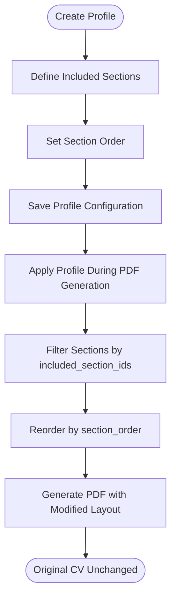
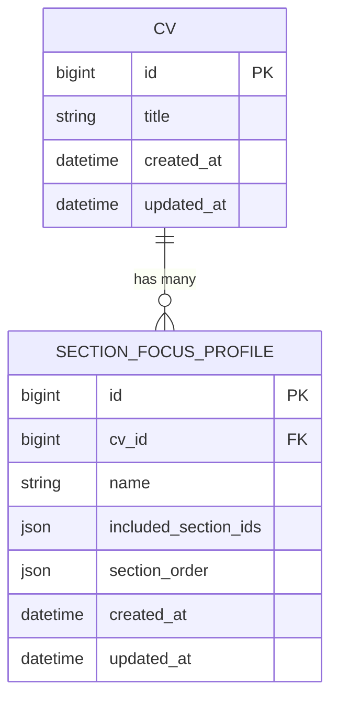
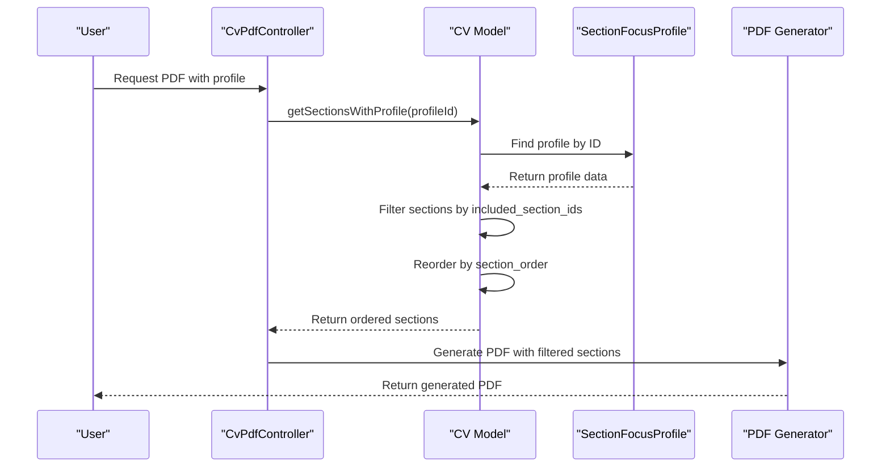

# Section Focus Profiles

<cite>
**Referenced Files in This Document**   
- [SectionFocusProfile.php](file://app/Models/SectionFocusProfile.php)
- [SectionFocusProfilesRelationManager.php](file://app/Filament/Resources/Cvs/RelationManagers/SectionFocusProfilesRelationManager.php)
- [Cv.php](file://app/Models/Cv.php)
- [CvPdfController.php](file://app/Http/Controllers/CvPdfController.php)
- [create_section_focus_profiles_table.php](file://database/migrations/2025_10_04_101831_create_section_focus_profiles_table.php)
</cite>

## Table of Contents
1. [Introduction](#introduction)
2. [Core Functionality](#core-functionality)
3. [Model Structure](#model-structure)
4. [Profile Management Interface](#profile-management-interface)
5. [Profile Application Process](#profile-application-process)
6. [Common Profile Types](#common-profile-types)
7. [Relationships and Data Integrity](#relationships-and-data-integrity)
8. [Best Practices](#best-practices)
9. [Troubleshooting](#troubleshooting)
10. [YAGNI Principle Alignment](#yagni-principle-alignment)

## Introduction

Section Focus Profiles provide a non-destructive method for tailoring CVs to specific job applications by reordering and filtering sections without altering the original CV content. This feature enables users to create multiple presentation variants of their CV optimized for different roles while maintaining a single source of truth for their professional information. The system supports dynamic profile creation, management, and application through the Filament admin interface, with temporary modifications applied only during PDF generation.

**Section sources**
- [SectionFocusProfile.php](file://app/Models/SectionFocusProfile.php#L1-L29)
- [Cv.php](file://app/Models/Cv.php#L147-L194)

## Core Functionality

Section Focus Profiles enable users to create customized views of their CV by specifying which sections to include and their display order. When generating a PDF, users can select a profile that temporarily modifies the section visibility and sequence without permanently changing the CV's structure. This non-destructive approach ensures the original CV remains unchanged, allowing seamless switching between different profile configurations for various job applications.

The feature supports both filtering (hiding unwanted sections) and reordering (arranging sections by relevance) through JSON arrays stored in the database. Profiles are applied at render time, meaning the modifications exist only during PDF generation and do not affect the stored CV data.

**Diagram sources**
- [Cv.php](file://app/Models/Cv.php#L147-L194)
- [CvPdfController.php](file://app/Http/Controllers/CvPdfController.php#L20-L30)

**Section sources**
- [Cv.php](file://app/Models/Cv.php#L147-L194)
- [CvPdfController.php](file://app/Http/Controllers/CvPdfController.php#L20-L30)

## Model Structure

The SectionFocusProfile model contains four key fields that define its behavior:

- **cv_id**: Foreign key linking to the parent CV
- **name**: Unique identifier for the profile (enforced at database level)
- **included_section_ids**: JSON array of section IDs to include in the profile
- **section_order**: JSON array specifying the display order of included sections

Both JSON fields are cast to PHP arrays, enabling easy manipulation in application code. The model establishes a belongs-to relationship with the CV model, ensuring profiles are always associated with a specific CV.

Database constraints ensure profile name uniqueness per CV and maintain referential integrity through cascading deletes.

**Diagram sources**
- [SectionFocusProfile.php](file://app/Models/SectionFocusProfile.php#L1-L29)
- [create_section_focus_profiles_table.php](file://database/migrations/2025_10_04_101831_create_section_focus_profiles_table.php#L1-L33)

**Section sources**
- [SectionFocusProfile.php](file://app/Models/SectionFocusProfile.php#L1-L29)
- [create_section_focus_profiles_table.php](file://database/migrations/2025_10_04_101831_create_section_focus_profiles_table.php#L1-L33)

## Profile Management Interface

Profiles are managed through the Filament admin interface using the SectionFocusProfilesRelationManager. This relation manager provides a clean interface within the CV resource for creating, editing, and deleting profiles. The interface includes:

- Name input field with helper text suggesting common profile types
- Table view showing all profiles with name and creation date
- Create, edit, and delete actions
- Search and sorting capabilities

The relation manager is configured to use the profile name as the record title attribute, making it easy to identify profiles in the interface. All operations are performed through standard Filament actions, ensuring a consistent user experience.

**Section sources**
- [SectionFocusProfilesRelationManager.php](file://app/Filament/Resources/Cvs/RelationManagers/SectionFocusProfilesRelationManager.php#L1-L49)

## Profile Application Process

When generating a PDF, the system applies the selected profile through the `getSectionsWithProfile` method in the CV model. This process involves two key steps:

1. **Filtering**: The method first retrieves only sections whose IDs are present in the profile's `included_section_ids` array
2. **Reordering**: It then reorders the filtered sections according to the sequence specified in the `section_order` array

The application process is temporary and occurs only during PDF generation. The original CV structure remains completely unchanged, allowing users to switch between profiles instantly without data loss or side effects.

The CvPdfController handles profile application by accepting an optional profile ID parameter and using it to determine which sections to include in the PDF generation process.

**Diagram sources**
- [Cv.php](file://app/Models/Cv.php#L147-L194)
- [CvPdfController.php](file://app/Http/Controllers/CvPdfController.php#L20-L30)

**Section sources**
- [Cv.php](file://app/Models/Cv.php#L147-L194)
- [CvPdfController.php](file://app/Http/Controllers/CvPdfController.php#L20-L30)

## Common Profile Types

The system supports various profile types tailored to different job applications. Common examples include:

- **Frontend Focus**: Prioritizes frontend skills, projects, and experience sections while de-emphasizing backend or management content
- **Backend Focus**: Highlights backend technologies, database experience, and server-side development sections
- **Management Emphasis**: Brings leadership experience, team management, and strategic initiatives to the forefront
- **Full Stack Focus**: Balances frontend and backend sections with comprehensive project showcases
- **Technical Lead Focus**: Emphasizes architecture decisions, code reviews, and mentoring experience

These profiles allow users to quickly adapt their CV presentation to match the requirements of specific job postings without maintaining multiple CV versions.

**Section sources**
- [SectionFocusProfileFactory.php](file://database/factories/SectionFocusProfileFactory.php#L1-L37)
- [Phase3DemoSeeder.php](file://database/seeders/Phase3DemoSeeder.php#L257-L308)

## Relationships and Data Integrity

The SectionFocusProfile model maintains a strict relationship with the CV model through a foreign key constraint with cascading deletes. This ensures that when a CV is deleted, all associated profiles are automatically removed, preventing orphaned records.

Each profile must have a unique name within its parent CV, enforced by a database-level unique constraint on the combination of `cv_id` and `name`. This prevents naming conflicts and makes profiles easily identifiable in the interface.

The non-destructive nature of profile application ensures data integrity by never modifying the original CV sections or their display order. Even when profiles are deleted, the underlying CV data remains completely intact.

**Section sources**
- [SectionFocusProfile.php](file://app/Models/SectionFocusProfile.php#L1-L29)
- [create_section_focus_profiles_table.php](file://database/migrations/2025_10_04_101831_create_section_focus_profiles_table.php#L1-L33)
- [Cv.php](file://app/Models/Cv.php#L147-L194)

## Best Practices

To create effective Section Focus Profiles:

1. **Use descriptive names** that clearly indicate the profile's purpose (e.g., "Frontend Developer - React Focus")
2. **Include only relevant sections** for the target role, removing less important content to improve focus
3. **Order sections by relevance**, placing the most compelling content first
4. **Maintain consistency** in profile structure across similar job types
5. **Test profiles** by generating PDFs to ensure the layout meets expectations
6. **Create profiles only when needed**, following the YAGNI principle

Regularly review and update profiles as your CV content evolves or when applying to new types of positions.

**Section sources**
- [SectionFocusProfilesRelationManager.php](file://app/Filament/Resources/Cvs/RelationManagers/SectionFocusProfilesRelationManager.php#L1-L49)
- [SectionFocusProfileFactory.php](file://database/factories/SectionFocusProfileFactory.php#L1-L37)

## Troubleshooting

Common issues and solutions:

- **Profile not applying**: Verify the profile ID is correctly passed to the PDF generation endpoint and that the profile exists and belongs to the CV
- **Sections missing**: Check that section IDs in the profile match existing sections and that the user has permission to view them
- **Order not respected**: Ensure all section IDs in `section_order` are also present in `included_section_ids`
- **Name uniqueness errors**: Use unique profile names within each CV or modify the existing profile instead of creating duplicates
- **Empty profiles**: Profiles with empty `included_section_ids` will show no sections - ensure at least one section is included

All profile operations are non-destructive, so any issues can be resolved by selecting a different profile or regenerating the PDF without a profile.

**Section sources**
- [SectionFocusProfileTest.php](file://tests/Feature/SectionFocusProfileTest.php#L1-L74)
- [ProfileSwitchingIntegrationTest.php](file://tests/Feature/ProfileSwitchingIntegrationTest.php#L1-L106)

## YAGNI Principle Alignment

Section Focus Profiles exemplify the YAGNI (You Aren't Gonna Need It) principle by enabling CV tailoring only when actually needed for specific job applications. Instead of maintaining multiple CV versions with redundant content, users maintain a single comprehensive CV and create lightweight profiles only when applying to roles with specific requirements.

This approach reduces maintenance overhead, eliminates content duplication, and ensures all versions derive from a single authoritative source. Profiles are created on-demand rather than speculatively, aligning with agile development principles and reducing unnecessary complexity in the system.

The non-destructive nature of profiles means users can experiment with different configurations without commitment, creating profiles only when they provide tangible value in the job application process.

**Section sources**
- [Cv.php](file://app/Models/Cv.php#L147-L194)
- [SectionFocusProfile.php](file://app/Models/SectionFocusProfile.php#L1-L29)