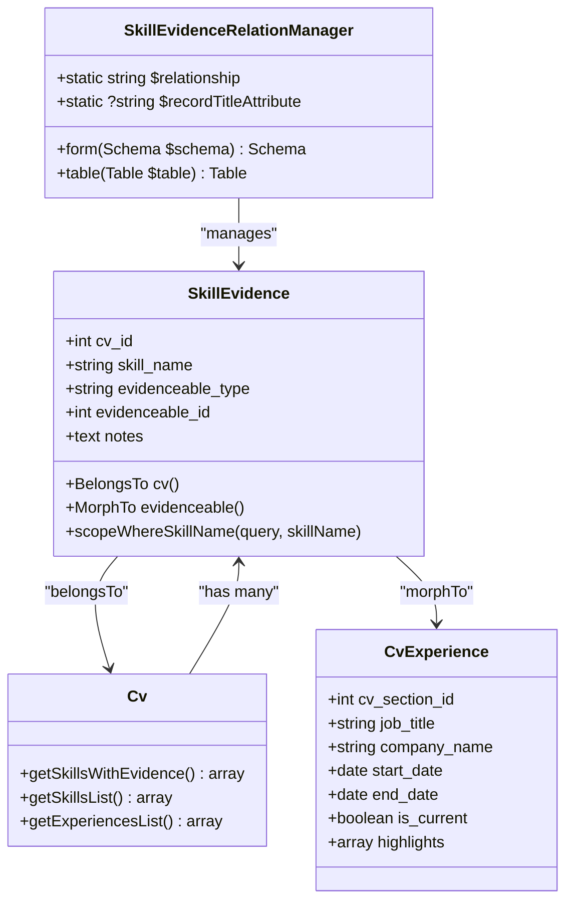
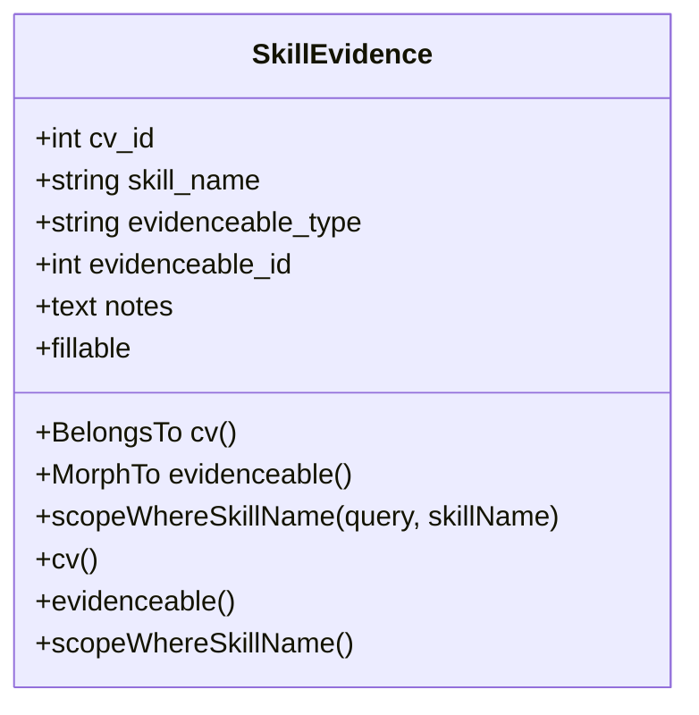
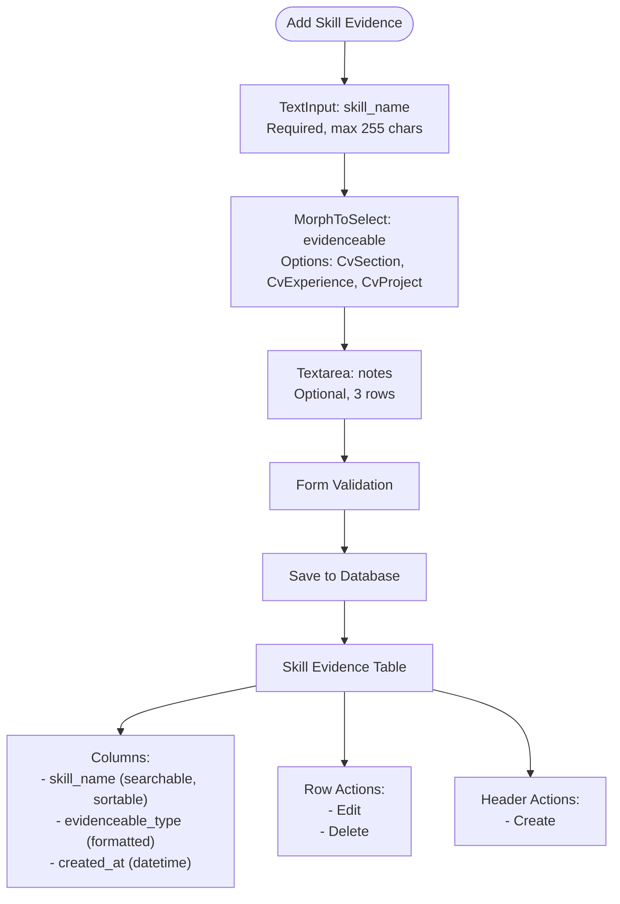
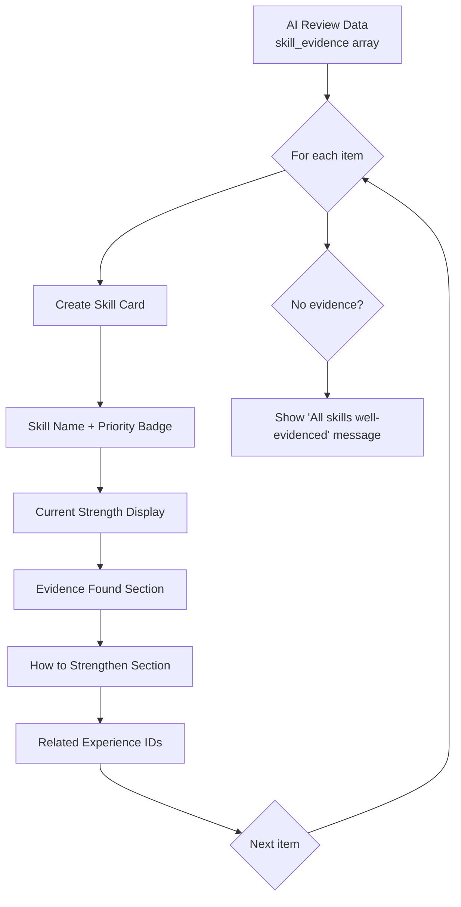

# Skill Evidence Linking

<cite>
**Referenced Files in This Document**   
- [SkillEvidence.php](file://app/Models/SkillEvidence.php)
- [CvExperience.php](file://app/Models/CvExperience.php)
- [SkillEvidenceRelationManager.php](file://app/Filament/Resources/Cvs/RelationManagers/SkillEvidenceRelationManager.php)
- [skill-evidence.blade.php](file://resources/views/filament/infolists/skill-evidence.blade.php)
- [Cv.php](file://app/Models/Cv.php)
</cite>

## Table of Contents
1. [Introduction](#introduction)
2. [Core Components](#core-components)
3. [Architecture Overview](#architecture-overview)
4. [Detailed Component Analysis](#detailed-component-analysis)
5. [Dependency Analysis](#dependency-analysis)
6. [Performance Considerations](#performance-considerations)
7. [Troubleshooting Guide](#troubleshooting-guide)
8. [Conclusion](#conclusion)

## Introduction
The Skill Evidence feature in the cv-builder application enables users to explicitly link skills to specific experiences, projects, or sections within their CV. This strengthens CV alignment by providing verifiable proof of skill application in real-world contexts. The system supports detailed documentation of how a particular skill was demonstrated in a job role or project, enhancing both the credibility and depth of the CV. This documentation explains the implementation of the SkillEvidence model, its integration with the Filament admin interface, and how this data is used during CV review and job application processes.

## Core Components

The Skill Evidence functionality is built around several core components that work together to enable skill-to-experience linking. The `SkillEvidence` model serves as the central data structure, storing references between skills and the CV content where they were applied. The `SkillEvidenceRelationManager` provides the user interface for managing these links within the Filament admin panel. The display of skill evidence is handled through the `skill-evidence.blade.php` view, which renders AI-generated review data about skill demonstration quality. These components work in concert to create a comprehensive system for tracking and presenting skill proficiency.

**Section sources**
- [SkillEvidence.php](file://app/Models/SkillEvidence.php#L1-L37)
- [SkillEvidenceRelationManager.php](file://app/Filament/Resources/Cvs/RelationManagers/SkillEvidenceRelationManager.php#L1-L70)
- [skill-evidence.blade.php](file://resources/views/filament/infolists/skill-evidence.blade.php#L1-L62)

## Architecture Overview

The Skill Evidence system follows a polymorphic relationship pattern, allowing skills to be linked to various types of CV content. The architecture centers around the `SkillEvidence` model, which maintains a relationship with the CV while using a morph-to relationship to connect to different evidenceable content types such as experiences, projects, or custom sections.



**Diagram sources**
- [SkillEvidence.php](file://app/Models/SkillEvidence.php#L1-L37)
- [Cv.php](file://app/Models/Cv.php#L167-L188)
- [CvExperience.php](file://app/Models/CvExperience.php#L1-L35)
- [SkillEvidenceRelationManager.php](file://app/Filament/Resources/Cvs/RelationManagers/SkillEvidenceRelationManager.php#L1-L70)

## Detailed Component Analysis

### SkillEvidence Model Analysis
The `SkillEvidence` model implements a polymorphic relationship that allows skills to be associated with various types of CV content. This design provides flexibility in documenting skill application across different contexts such as job experiences, projects, or education. The model includes a case-insensitive scope for skill name searching, ensuring consistent retrieval regardless of capitalization differences. The fillable attributes include the skill name, references to the CV and evidenceable content, and optional notes describing how the skill was demonstrated.



**Diagram sources**
- [SkillEvidence.php](file://app/Models/SkillEvidence.php#L1-L37)

### SkillEvidenceRelationManager Analysis
The `SkillEvidenceRelationManager` class provides the administrative interface for managing skill evidence within the Filament panel. It defines a form with three key components: a text input for the skill name, a morph-to select field for choosing the evidence source (experience, project, or section), and a textarea for optional notes. The table view displays skill evidence records with columns for skill name, evidence type, and creation date, supporting search and sorting functionality.



**Diagram sources**
- [SkillEvidenceRelationManager.php](file://app/Filament/Resources/Cvs/RelationManagers/SkillEvidenceRelationManager.php#L1-L70)

### Skill Evidence Display Analysis
The skill evidence display system renders AI-generated review data about skill demonstration quality in the CV review interface. The `skill-evidence.blade.php` template processes structured data containing skill names, improvement priorities, evidence quality assessments, and specific evidence examples. It presents this information in a card-based layout with visual indicators for priority levels and clear sections for evidence and improvement suggestions.



**Diagram sources**
- [skill-evidence.blade.php](file://resources/views/filament/infolists/skill-evidence.blade.php#L1-L62)

## Dependency Analysis

The Skill Evidence system has several key dependencies that define its behavior and integration points. The most important relationship is the polymorphic association between `SkillEvidence` and various CV content types, which allows flexible linking to different kinds of experiences. The system also depends on the CV model's `getSkillsWithEvidence` method for aggregating skill data, which is used in both the PDF export functionality and AI review processes.

```mermaid
graph TD
A[SkillEvidence Model] --> B[Cv Model]
A --> C[CvExperience Model]
A --> D[CvProject Model]
A --> E[CvSection Model]
F[SkillEvidenceRelationManager] --> A
G[skill-evidence.blade.php] --> H[Cv Model]
H --> I[getSkillsWithEvidence()]
I --> A
J[CvPdfController] --> H
K[AI Review System] --> H
style A fill:#f9f,stroke:#333
style F fill:#ff9,stroke:#333
style G fill:#9ff,stroke:#333
```

**Diagram sources**
- [SkillEvidence.php](file://app/Models/SkillEvidence.php#L1-L37)
- [Cv.php](file://app/Models/Cv.php#L167-L188)
- [SkillEvidenceRelationManager.php](file://app/Filament/Resources/Cvs/RelationManagers/SkillEvidenceRelationManager.php#L1-L70)
- [skill-evidence.blade.php](file://resources/views/filament/infolists/skill-evidence.blade.php#L1-L62)

## Performance Considerations
The Skill Evidence system is designed with performance in mind, particularly in how it aggregates data for display. The `getSkillsWithEvidence` method on the CV model efficiently collects all skill evidence records and summarizes them by skill name, counting evidence instances and tracking evidence types. This aggregation occurs in memory after a single database query, minimizing database load. However, for CVs with extensive evidence records, this could become a memory consideration. The system uses eager loading patterns where appropriate, as noted in the PHPDoc comments, to prevent N+1 query problems when processing multiple CVs.

**Section sources**
- [Cv.php](file://app/Models/Cv.php#L167-L188)

## Troubleshooting Guide
Common issues with the Skill Evidence system typically relate to data consistency and display. If skill evidence records are not appearing in the interface, verify that the relationship name in `SkillEvidenceRelationManager` matches the method name on the CV model. Ensure that the morph-to relationship is properly configured with the correct model classes. For case sensitivity issues in skill name aggregation, confirm that the `scopeWhereSkillName` method is being used appropriately. When evidence records fail to delete with the CV, check that the database migration includes the proper foreign key constraints with cascade deletion.

**Section sources**
- [SkillEvidence.php](file://app/Models/SkillEvidence.php#L30-L36)
- [Cv.php](file://app/Models/Cv.php#L167-L188)
- [SkillEvidenceRelationManager.php](file://app/Filament/Resources/Cvs/RelationManagers/SkillEvidenceRelationManager.php#L4-L10)

## Conclusion
The Skill Evidence linking system in the cv-builder application provides a robust framework for connecting skills to specific experiences and projects within a CV. By implementing a polymorphic relationship model, the system offers flexibility in documenting skill application across various contexts. The integration with the Filament admin interface makes it easy for users to add and manage evidence records, while the display components effectively communicate the strength and quality of skill demonstration to reviewers. This feature significantly enhances the value of the CV by providing concrete examples of skill application, supporting both the achievement bullet refinement process and job application success.