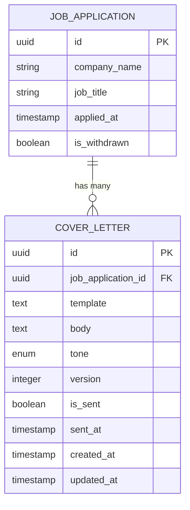
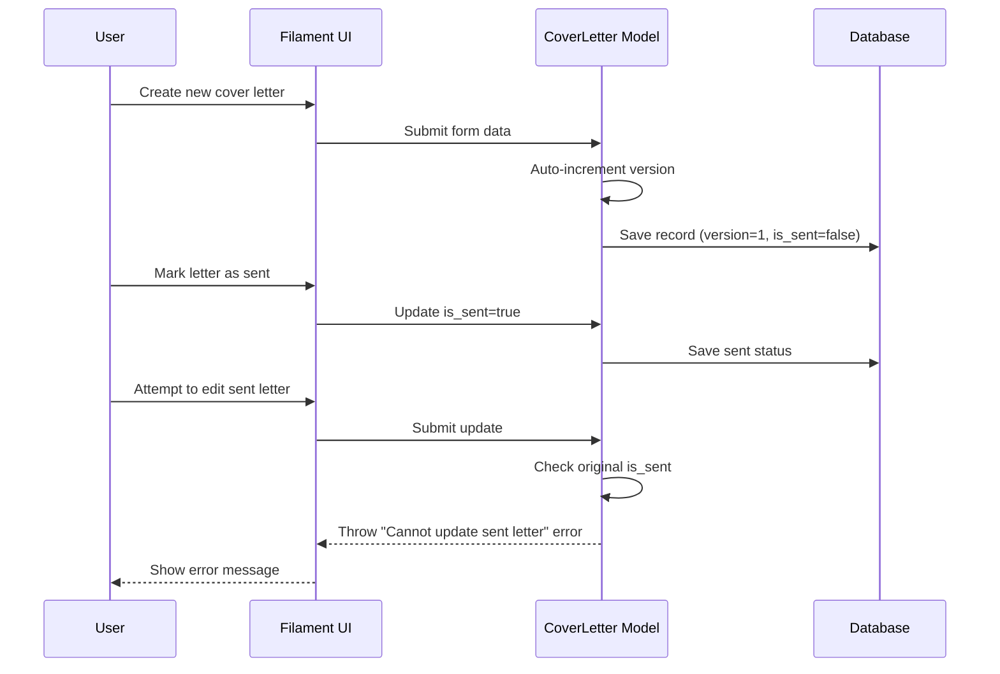

# Cover Letter Management

<cite>
**Referenced Files in This Document**   
- [CoverLetterService.php](file://app/Services/CoverLetterService.php)
- [CoverLetter.php](file://app/Models/CoverLetter.php)
- [CoverLettersRelationManager.php](file://app/Filament/Resources/JobApplications/RelationManagers/CoverLettersRelationManager.php)
- [2025_10_04_101841_create_cover_letters_table.php](file://database/migrations/2025_10_04_101841_create_cover_letters_table.php)
</cite>

## Table of Contents
1. [Cover Letter Service and Template Interpolation](#cover-letter-service-and-template-interpolation)
2. [Cover Letter Data Model and Database Schema](#cover-letter-data-model-and-database-schema)
3. [UI Management via Filament Admin Panel](#ui-management-via-filament-admin-panel)
4. [Versioning and Immutability of Sent Letters](#versioning-and-immutability-of-sent-letters)
5. [Template Syntax and Variable Substitution System](#template-syntax-and-variable-substitution-system)
6. [Validation and Business Rules](#validation-and-business-rules)

## Cover Letter Service and Template Interpolation

The `CoverLetterService` is responsible for processing dynamic cover letter templates by replacing placeholders with actual values from job applications. The core method `interpolate()` takes a template string containing `{{variable}}` syntax and an associative array of variables, then performs a direct string replacement. This enables personalized cover letters to be generated programmatically using data such as company name, role title, and other applicant-specific details.

The interpolation process iterates through each key-value pair in the provided variables array, constructs the corresponding placeholder (e.g., `{{company_name}}`), and replaces all occurrences in the template. If a placeholder does not have a corresponding variable, it remains unchanged in the output, allowing for safe partial rendering.

**Section sources**
- [CoverLetterService.php](file://app/Services/CoverLetterService.php#L9-L24)

## Cover Letter Data Model and Database Schema

The `CoverLetter` model represents a cover letter associated with a specific job application. It includes fields for storing both the original template and the final interpolated body. The model defines a `BelongsTo` relationship with `JobApplication`, ensuring each cover letter is linked to a single application.

Key attributes include:
- `template`: Stores the original template with `{{placeholders}}`
- `body`: Contains the fully interpolated text ready for sending
- `tone`: Enum field indicating the writing style (formal, casual, enthusiastic, technical, leadership)
- `version`: Auto-incremented integer for version control
- `is_sent`: Boolean flag indicating whether the letter has been sent
- `sent_at`: Timestamp when the letter was marked as sent

The database schema is defined in the migration `2025_10_04_101841_create_cover_letters_table.php`, which creates the `cover_letters` table with appropriate constraints, indexes, and foreign key relationships. The `job_application_id` field is indexed both individually and in combination with `version` to optimize queries for retrieving application-specific versions.



**Diagram sources**
- [CoverLetter.php](file://app/Models/CoverLetter.php#L10-L50)
- [2025_10_04_101841_create_cover_letters_table.php](file://database/migrations/2025_10_04_101841_create_cover_letters_table.php#L10-L30)

**Section sources**
- [CoverLetter.php](file://app/Models/CoverLetter.php#L10-L50)
- [2025_10_04_101841_create_cover_letters_table.php](file://database/migrations/2025_10_04_101841_create_cover_letters_table.php#L10-L30)

## UI Management via Filament Admin Panel

Cover letters are managed through the `CoverLettersRelationManager` in the Filament admin panel, which provides a dedicated interface within the job application context. This relation manager allows users to create, view, and edit cover letters directly from a job application's detail page.

The form interface includes:
- **Template field**: A textarea for entering the template with `{{variables}}` syntax, accompanied by helper text suggesting common placeholders like `{{company_name}}` and `{{role_title}}`
- **Body field**: A required textarea for the final interpolated content
- **Tone selector**: A dropdown with predefined tone options (formal, casual, enthusiastic, technical, leadership)
- **Sent status toggle**: A switch to mark the letter as sent, with a warning that sent letters cannot be edited

The table view displays all cover letters for an application, sorted by version in descending order. It shows version number, tone (as a badge), sent status (as an icon), and creation timestamp. Edit and delete actions are disabled for sent letters to prevent accidental modifications.

**Section sources**
- [CoverLettersRelationManager.php](file://app/Filament/Resources/JobApplications/RelationManagers/CoverLettersRelationManager.php#L15-L75)

## Versioning and Immutability of Sent Letters

The system implements robust versioning and immutability controls for cover letters. When a new cover letter is created, the model's `creating` event listener automatically assigns a version number by incrementing the highest existing version for that job application. This enables A/B testing of different letter versions and maintains a clear history of revisions.

Once a cover letter is marked as sent (`is_sent = true`), it becomes immutable. The model's `updating` event listener enforces this by throwing an exception if any attempt is made to modify a sent letter. This ensures the integrity of communication records and prevents accidental changes after submission.

Multiple versions of cover letters can coexist for the same job application, with only the sent version being locked. Draft versions can continue to be edited, allowing users to refine their approach while preserving the sent version as a permanent record.



**Diagram sources**
- [CoverLetter.php](file://app/Models/CoverLetter.php#L25-L45)
- [CoverLettersRelationManager.php](file://app/Filament/Resources/JobApplications/RelationManagers/CoverLettersRelationManager.php#L55-L70)

**Section sources**
- [CoverLetter.php](file://app/Models/CoverLetter.php#L25-L45)

## Template Syntax and Variable Substitution System

The template system uses double curly braces `{{variable}}` as delimiters for dynamic content insertion. Common placeholder variables include `{{company_name}}`, `{{role_title}}`, `{{hiring_manager_name}}`, `{{value_prop}}`, `{{recent_win}}`, and `{{key_requirement}}`. These variables are populated from the associated job application and user profile data during interpolation.

Examples of template syntax:
```
Dear {{hiring_manager_name}},

I am writing to apply for the {{role_title}} position at {{company_name}}. {{value_prop}}.

Key qualifications:
- {{qualification_1}}
- {{qualification_2}}
- {{qualification_3}}

I am particularly drawn to {{company_name}} because {{why_company}}.

Sincerely,
{{applicant_name}}
```

The substitution system performs exact string matching and replacement. Variables that are not provided in the input array remain in the output as `{{variable}}`, allowing templates to be saved with placeholders intact. This design supports both immediate rendering and template reuse across multiple applications.

**Section sources**
- [CoverLetterService.php](file://app/Services/CoverLetterService.php#L9-L24)
- [CoverLettersRelationManager.php](file://app/Filament/Resources/JobApplications/RelationManagers/CoverLettersRelationManager.php#L28-L30)

## Validation and Business Rules

The system enforces several validation rules and business logic constraints:
- The `body` field is required and must be filled before saving
- The `tone` field must be one of the predefined enum values
- Sent cover letters (`is_sent = true`) cannot be modified or deleted
- Version numbers are auto-incremented per job application to prevent conflicts
- Foreign key constraints ensure every cover letter is associated with a valid job application

These rules are implemented both at the database level (via schema constraints) and application level (via model events and form validation). The combination ensures data integrity while providing a clear user experience in the admin interface.

**Section sources**
- [CoverLetter.php](file://app/Models/CoverLetter.php#L25-L45)
- [CoverLettersRelationManager.php](file://app/Filament/Resources/JobApplications/RelationManagers/CoverLettersRelationManager.php#L40-L50)
- [2025_10_04_101841_create_cover_letters_table.php](file://database/migrations/2025_10_04_101841_create_cover_letters_table.php#L15-L20)