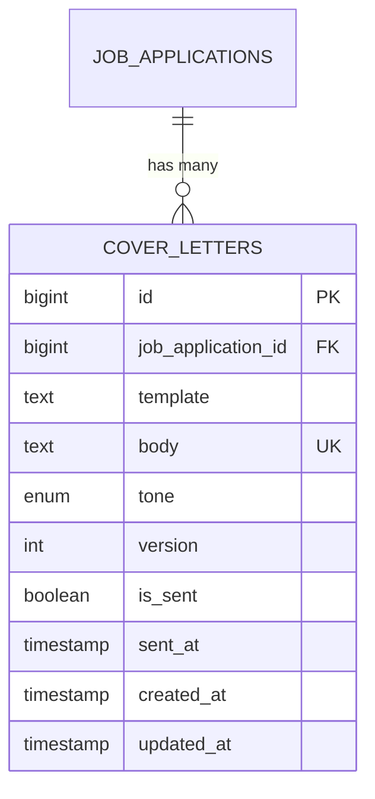
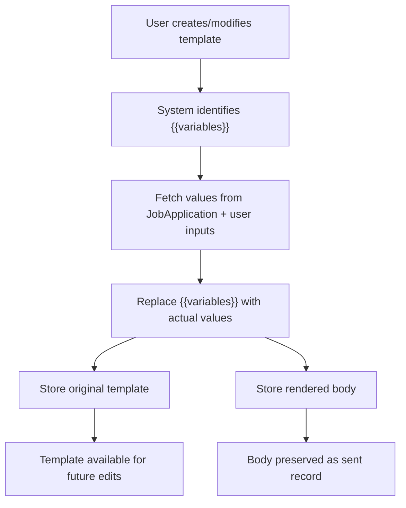
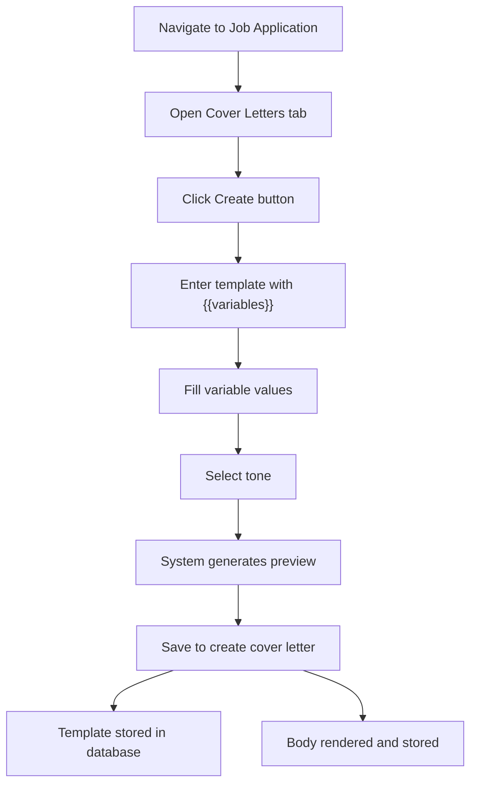
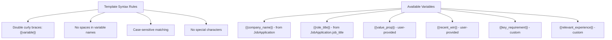
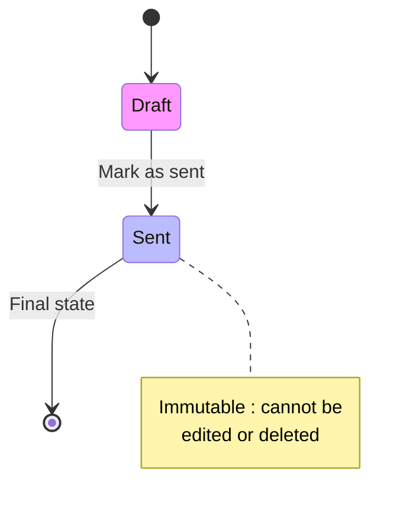
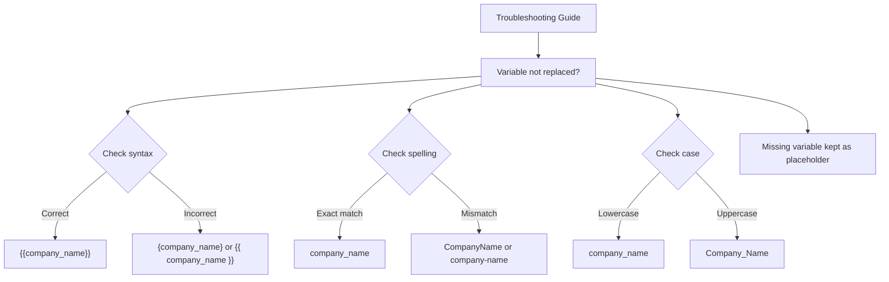
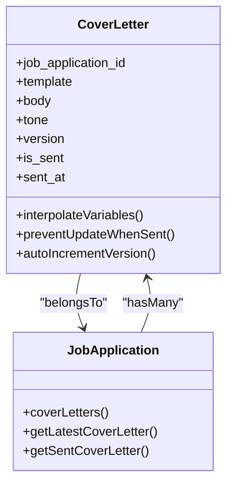

# Template System

<cite>
**Referenced Files in This Document**   
- [CoverLetter.php](file://app/Models/CoverLetter.php)
- [CoverLettersRelationManager.php](file://app/Filament/Resources/JobApplications/RelationManagers/CoverLettersRelationManager.php)
- [create_cover_letters_table.php](file://database/migrations/2025_10_04_101841_create_cover_letters_table.php)
- [CoverLetterService.php](file://app/Services/CoverLetterService.php)
- [cover-letters.md](file://specs/002-roadmap-md/contracts-phase3/cover-letters.md)
- [USER-GUIDE-PHASE3.md](file://specs/002-roadmap-md/USER-GUIDE-PHASE3.md)
</cite>

## Table of Contents
1. [Introduction](#introduction)
2. [Database Schema](#database-schema)
3. [Template Field Purpose](#template-field-purpose)
4. [Template and Body Field Relationship](#template-and-body-field-relationship)
5. [Template Creation and Management](#template-creation-and-management)
6. [Template Syntax and Variables](#template-syntax-and-variables)
7. [Business Rules](#business-rules)
8. [Common Issues and Troubleshooting](#common-issues-and-troubleshooting)
9. [Migration and Data Model](#migration-and-data-model)

## Introduction
The Template System in the CV Builder application enables users to create reusable cover letter templates with dynamic variable interpolation. This system supports efficient customization of cover letters across multiple job applications by using mustache-style `{{variables}}` that automatically populate with relevant data. The design allows both templated and freeform letter creation, supporting A/B testing through versioning and tone selection. This document details the implementation, usage, and technical specifications of the template system.

## Database Schema
The cover_letters table stores both the source template and rendered body for each cover letter. The schema is designed to support versioning, tone tracking, and immutable sent records.

**Diagram sources**
- [create_cover_letters_table.php](file://database/migrations/2025_10_04_101841_create_cover_letters_table.php#L10-L30)

**Section sources**
- [create_cover_letters_table.php](file://database/migrations/2025_10_04_101841_create_cover_letters_table.php#L10-L30)

## Template Field Purpose
The template field in the CoverLetter model stores the original source template containing mustache-style `{{variables}}` placeholders. This field is nullable to accommodate users who prefer writing cover letters from scratch without templates. When present, the template serves as the blueprint for generating personalized cover letters by replacing variables with actual values from the job application context and user inputs. The template is preserved to enable future editing and reuse across different applications.

**Section sources**
- [CoverLetter.php](file://app/Models/CoverLetter.php#L15-L20)
- [data-model-phase3.md](file://specs/002-roadmap-md/data-model-phase3.md#L74-L122)

## Template and Body Field Relationship
The template and body fields work together to provide both flexibility and permanence in cover letter management. The template field (nullable text) contains the editable source with `{{variables}}`, while the body field (not null text) stores the final rendered content after variable interpolation. When a cover letter is created or updated, the system processes the template through the CoverLetterService::interpolate() method, replacing all valid variables with their corresponding values to generate the body. This separation ensures that the original template remains available for future modifications while preserving an immutable record of what was actually sent.

**Diagram sources**
- [CoverLetterService.php](file://app/Services/CoverLetterService.php#L10-L20)
- [CoverLetter.php](file://app/Models/CoverLetter.php#L15-L20)

**Section sources**
- [CoverLetter.php](file://app/Models/CoverLetter.php#L15-L20)
- [CoverLetterService.php](file://app/Services/CoverLetterService.php#L10-L20)

## Template Creation and Management
Templates are created and managed through the Filament CoverLettersRelationManager form, which provides a user-friendly interface for template development. The form includes a textarea field specifically designed for template creation, supporting variable placeholders with helpful guidance. Users can access this form when editing a job application, navigating to the Cover Letters tab, and clicking Create. The form includes real-time validation and helper text that lists available variables like `{{company_name}}` and `{{role_title}}`. After saving, the system automatically generates the rendered body while preserving the original template for future reference or modification.

**Diagram sources**
- [CoverLettersRelationManager.php](file://app/Filament/Resources/JobApplications/RelationManagers/CoverLettersRelationManager.php#L25-L50)

**Section sources**
- [CoverLettersRelationManager.php](file://app/Filament/Resources/JobApplications/RelationManagers/CoverLettersRelationManager.php#L25-L50)

## Template Syntax and Variables
The template system uses simple mustache-style `{{variable}}` syntax for variable interpolation, making it intuitive and user-friendly. The system supports several predefined variables that automatically populate from job application data or user inputs. Common variables include `{{company_name}}` and `{{role_title}}` which are pulled from the associated job application, while `{{value_prop}}` and `{{recent_win}}` are user-provided per letter. Custom variables like `{{key_requirement}}` and `{{relevant_experience}}` can also be defined to address specific job requirements. The syntax requires exact matching of variable names (case-sensitive) and proper double curly brace delimiters.

**Diagram sources**
- [USER-GUIDE-PHASE3.md](file://specs/002-roadmap-md/USER-GUIDE-PHASE3.md#L198-L366)
- [research-phase3.md](file://specs/002-roadmap-md/research-phase3.md#L58-L88)

**Section sources**
- [USER-GUIDE-PHASE3.md](file://specs/002-roadmap-md/USER-GUIDE-PHASE3.md#L198-L366)

## Business Rules
The template system enforces several business rules to maintain data integrity and support effective cover letter management. The most important rule is that templates can be null, allowing users to write letters from scratch without using templates. When templates are used, the system preserves them for future editing while storing the rendered body as a permanent record. Sent cover letters become immutable - they cannot be edited or deleted once marked as sent. Version numbers automatically increment for each new cover letter within a job application, enabling A/B testing of different approaches. Only one cover letter per application can be marked as sent at any time.

**Diagram sources**
- [CoverLetter.php](file://app/Models/CoverLetter.php#L30-L45)
- [data-model-phase3.md](file://specs/002-roadmap-md/data-model-phase3.md#L74-L122)

**Section sources**
- [CoverLetter.php](file://app/Models/CoverLetter.php#L30-L45)

## Common Issues and Troubleshooting
Common issues with the template system typically involve variable syntax errors or missing values. The most frequent problem occurs when variables are not properly formatted with double curly braces (`{{variable}}`), or when there are typos in variable names. Since variable matching is case-sensitive, `{{Company_Name}}` will not match `{{company_name}}`. When variables are missing from the input array, the system preserves the placeholder in the rendered output rather than failing, which helps identify missing data. Users should verify that all variables in their template are accounted for in the variables array and that names match exactly.

**Diagram sources**
- [USER-GUIDE-PHASE3.md](file://specs/002-roadmap-md/USER-GUIDE-PHASE3.md#L617-L635)
- [CoverLetterService.php](file://app/Services/CoverLetterService.php#L10-L20)

**Section sources**
- [USER-GUIDE-PHASE3.md](file://specs/002-roadmap-md/USER-GUIDE-PHASE3.md#L617-L635)

## Migration and Data Model
The cover_letters table was created through the 2025_10_04_101841_create_cover_letters_table.php migration, which defines the complete schema for the template system. The data model specification includes foreign key constraints to ensure referential integrity with job applications, cascading deletion, and appropriate indexing for performance. The model implements Eloquent relationships and lifecycle hooks to enforce business rules, such as auto-incrementing version numbers and preventing modifications to sent cover letters. The CoverLetter model's boot method contains creating and updating observers that handle versioning and immutability rules automatically.

**Diagram sources**
- [create_cover_letters_table.php](file://database/migrations/2025_10_04_101841_create_cover_letters_table.php#L10-L30)
- [CoverLetter.php](file://app/Models/CoverLetter.php#L10-L50)

**Section sources**
- [create_cover_letters_table.php](file://database/migrations/2025_10_04_101841_create_cover_letters_table.php#L10-L30)
- [CoverLetter.php](file://app/Models/CoverLetter.php#L10-L50)