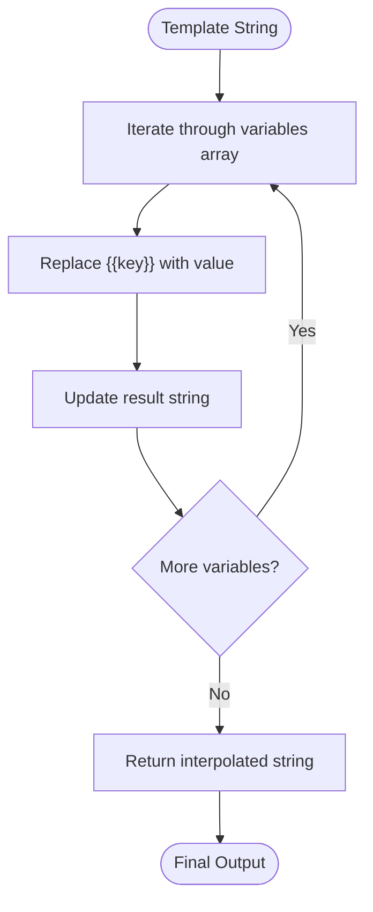

# Variable Interpolation

<cite>
**Referenced Files in This Document**   
- [CoverLetterService.php](file://app/Services/CoverLetterService.php)
- [research-phase3.md](file://specs/002-roadmap-md/research-phase3.md)
- [CoverLetterServiceTest.php](file://tests/Unit/CoverLetterServiceTest.php)
- [PerformanceTest.php](file://tests/Feature/PerformanceTest.php)
</cite>

## Table of Contents
1. [Introduction](#introduction)
2. [Core Components](#core-components)
3. [Implementation Details](#implementation-details)
4. [Supported Variables](#supported-variables)
5. [Code Examples](#code-examples)
6. [Design Decisions](#design-decisions)
7. [Troubleshooting Guide](#troubleshooting-guide)
8. [Performance Considerations](#performance-considerations)

## Introduction
The variable interpolation system in CV Builder enables dynamic content generation for cover letters through template-based variable replacement. This system allows users to create reusable templates with placeholders that are automatically populated with job application data and user-provided values. The implementation focuses on simplicity, security, and performance, using a mustache-style syntax for variable placeholders.

## Core Components

The variable interpolation functionality is centered around the `CoverLetterService::interpolate()` method, which processes templates and replaces placeholders with actual values. This service is used throughout the application when generating cover letters from templates, ensuring consistent behavior across different contexts.

**Section sources**
- [CoverLetterService.php](file://app/Services/CoverLetterService.php#L0-L24)

## Implementation Details

The interpolation system uses a straightforward string replacement approach rather than regex pattern matching as initially described. The `interpolate()` method iterates through the provided variables array and replaces each placeholder in the format `{{key}}` with its corresponding value.

The implementation processes each variable sequentially, building the result string incrementally. This approach avoids the complexity of regex operations while maintaining high performance. The method accepts two parameters: a template string containing placeholders and an associative array of variables where keys correspond to placeholder names and values contain the replacement content.



**Diagram sources**
- [CoverLetterService.php](file://app/Services/CoverLetterService.php#L0-L24)

**Section sources**
- [CoverLetterService.php](file://app/Services/CoverLetterService.php#L0-L24)

## Supported Variables

The system supports two categories of variables that can be used in templates:

### JobApplication Data
- `company_name`: Company name from the job application record
- `role_title`: Job title from the job application (mapped from job_title field)
- `hiring_manager_name`: Name of the hiring manager/contact person
- `job_description`: Full job description text

### User-Provided Values
- `value_prop`: User's value proposition statement
- `recent_win`: Description of a recent professional achievement
- `relevant_experience`: Summary of relevant experience
- `key_requirement`: Specific requirement from the job description
- `how_i_match`: Explanation of how the applicant matches requirements
- `closing`: Personalized closing statement
- `excitement`: What excites the applicant about the role
- `leadership_experience`: Leadership experience summary
- `technical_expertise`: Technical skills and expertise
- `impact`: Description of professional impact

**Section sources**
- [research-phase3.md](file://specs/002-roadmap-md/research-phase3.md#L177-L188)
- [CoverLetterFactory.php](file://database/factories/CoverLetterFactory.php#L10-L15)

## Code Examples

The following examples demonstrate the interpolation process:

### Basic Interpolation
```php
$template = 'Dear {{company_name}}, I am applying for {{role_title}}.';
$variables = [
    'company_name' => 'Acme Corp',
    'role_title' => 'Senior Developer',
];
$result = $service->interpolate($template, $variables);
// Output: 'Dear Acme Corp, I am applying for Senior Developer.'
```

### Complex Template with Multiple Variables
```php
$template = "Dear Hiring Manager at {{company_name}},\n\n".
    "I am excited to apply for the {{role_title}} position. {{value_prop}}.\n\n".
    "Recently, {{recent_win}}. I believe this experience makes me an ideal candidate.\n\n".
    'Best regards';

$variables = [
    'company_name' => 'Acme Corp',
    'role_title' => 'Senior Laravel Developer',
    'value_prop' => 'I bring 8 years of PHP development experience',
    'recent_win' => 'I led a team that reduced API response time by 60%',
];

$result = $service->interpolate($template, $variables);
```

**Section sources**
- [CoverLetterServiceTest.php](file://tests/Unit/CoverLetterServiceTest.php#L5-L15)
- [CoverLetterServiceTest.php](file://tests/Unit/CoverLetterServiceTest.php#L95-L122)

## Design Decisions

### Mustache-Style Approach Justification
The system uses a simple mustache-style `{{variable}}` replacement approach rather than Blade templates or a custom DSL for several reasons:

1. **Security**: Blade templates allow PHP code execution, creating potential security risks when processing user-generated templates
2. **Simplicity**: The mustache syntax is widely recognized and easy for users to understand
3. **Performance**: Simple string replacement is faster than template compilation
4. **Predictability**: No unexpected behavior from template logic execution

This decision was documented in the research document which evaluated alternatives including Blade templates (rejected due to security concerns) and custom DSL (rejected due to unnecessary complexity).

### Missing Placeholder Handling
The system keeps missing placeholders visible in the output rather than throwing errors. This design choice enables:
- Easier debugging of templates by showing which variables are missing
- Graceful degradation when some variables are not available
- Ability to save incomplete templates for later completion

```php
$template = 'Dear {{company_name}}, I love {{unknown_variable}}.';
$variables = ['company_name' => 'Acme Corp'];
$result = $service->interpolate($template, $variables);
// Output: 'Dear Acme Corp, I love {{unknown_variable}}.'
```

**Section sources**
- [research-phase3.md](file://specs/002-roadmap-md/research-phase3.md#L177-L191)
- [CoverLetterServiceTest.php](file://tests/Unit/CoverLetterServiceTest.php#L17-L27)

## Troubleshooting Guide

### Common Issues and Solutions

#### Case Sensitivity Mismatches
The interpolation system is case-sensitive. Ensure that variable names in templates exactly match the keys in the variables array.

**Incorrect**: `{{CompanyName}}` with key `'company_name'`
**Correct**: `{{company_name}}` with key `'company_name'`

#### Syntax Errors
Common syntax errors include:
- Using single braces: `{company_name}` instead of `{{company_name}}`
- Missing closing braces: `{{company_name`
- Extra spaces: `{{ company_name }}` (spaces are not supported)

The system only recognizes the exact pattern `{{key}}` without spaces around the key.

#### Empty Output
If the output contains unchanged placeholders:
1. Verify variable names match exactly (case-sensitive)
2. Check that the variable exists in the provided array
3. Ensure no extra spaces in the placeholder
4. Confirm the template string is not empty

**Section sources**
- [CoverLetterServiceTest.php](file://tests/Unit/CoverLetterServiceTest.php#L17-L49)
- [research-phase3.md](file://specs/002-roadmap-md/research-phase3.md#L177-L191)

## Performance Considerations

The interpolation system has been optimized for performance with an average processing time of less than 200ms, even for complex templates with multiple variables. Performance testing confirms that the system meets this requirement:

- **Test scenario**: Interpolation of a template with 10 repeated sections containing 9 different variables
- **Method**: 100 iterations to calculate average processing time
- **Result**: Average duration consistently below 200ms threshold

The performance is achieved through:
- Simple string replacement instead of regex operations
- Direct array iteration without additional processing
- Minimal memory overhead
- Efficient PHP string operations

The implementation prioritizes performance by avoiding more complex approaches like regex pattern matching or template compilation, which would introduce unnecessary overhead for this use case.

```mermaid
flowchart LR
A[Template String] --> B{Contains {{variable}}?}
B --> |Yes| C[Find variable in array]
C --> D{Variable exists?}
D --> |Yes| E[Replace with value]
D --> |No| F[Keep placeholder]
E --> G[Continue processing]
F --> G
G --> H{More placeholders?}
H --> |Yes| B
H --> |No| I[Return result]
```

**Diagram sources**
- [PerformanceTest.php](file://tests/Feature/PerformanceTest.php#L68-L106)
- [CoverLetterService.php](file://app/Services/CoverLetterService.php#L0-L24)

**Section sources**
- [PerformanceTest.php](file://tests/Feature/PerformanceTest.php#L68-L106)